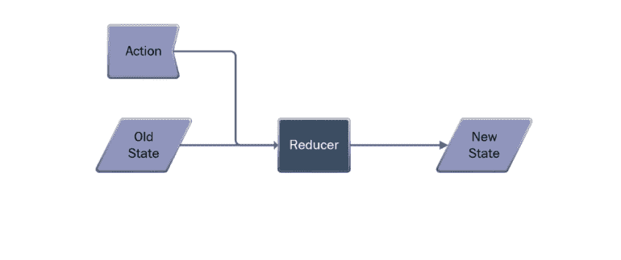

# 减速器的上升

> 原文：<https://javascript.plainenglish.io/rise-of-the-reducer-pattern-cb38e9f32ce8?source=collection_archive---------5----------------------->

近年来，我观察到在软件架构中使用*缩减器*的强烈趋势。虽然这不是一个新的模式，但是它最近在 [React / Redux](https://react-redux.js.org/) 和其他平台上的突出表现为软件质量提供了值得讨论的好处。

在本文中，我将介绍 reducer 函数在状态管理中的作用，并讨论它提供的一些主要好处。最后，我将讨论我在以 Reducer 为中心的架构中看到的一些权衡。

我将把对模型视图更新(MVU)的讨论留到以后的文章中，以便将这篇文章限制在使用 reducer 函数进行状态管理的思想上。

# 减速器 101

让我们来看一个来自 [Angular NgRx](https://ngrx.io/) 应用的减速器示例:

另一个来自 F# [埃尔米什。WPF](https://github.com/elmish/Elmish.WPF) 应用:

这两个例子都展示了各种风格的 reducers，但是都接受一个起始状态和一个动作，并返回该状态的一个新版本。

本质上，这就是减速器的作用。

在这篇文章中，我们将探索它的强大之处以及它有助于解决的问题。

# 第一次与减肥者见面

几年前，我在 [Angular](https://angular.io/) 做一些非常繁重的单页面应用程序(SPA)开发。我构建了一个有角度的单页应用程序。然后又是一个。另一个。

我喜欢这个框架(现在仍然如此)，但是很快我开始注意到在同时处理多个异步操作时很难管理复杂性。

这是 Angular 社区中的许多人以前都遇到过的问题，在这种情况下，很少会出现状态管理错误，操作顺序和网络延迟会带来很大程度的复杂性。

Angular 社区用一些基于 reducer 的状态管理库来应对挑战，比如 [NgRx](https://ngrx.io/) 。这个库基于通常与 React 相关的流行的 Redux 状态管理库。

注意，Redux 通常与 React 相关联，因为两者都由脸书管理，但是 Redux 实际上并不是 React 的*部分。简而言之，Redux 是一个强大的基于 *reducer 的*JavaScript 应用程序状态管理库。它通常通过 React-Redux 库集成到 React 中，但是 Redux 本身并没有 React 特有的特性。*

根据我现在对 reducer 的了解，一旦状态管理达到一定的复杂性阈值，Angular 社区转向使用基于 reducer 的状态管理系统*是正确的。*

# 减速器的电源

让我们来看看*为什么*减速器对软件质量这么好。

## 纯状态转换

还原器不是依赖于保存不断变化的状态值的存储库类，而是*纯函数*，接受一个动作和先前的状态，并基于这些输入输出一个新的状态。

术语“纯函数”意味着该函数可以用相同的输入被永远调用，并且总是返回相同的输出，而不会对其他任何东西产生副作用。

这一概念对于理解减压器功能的质量优势极其重要。

因为对于给定的特定输入，reducer 完全是关于可重复的状态转换，所以测试起来非常容易。

## 中央集权的国家管理

reducers 的一个有趣的方面是，它把所有的应用程序状态放在一个集中的地方。

这使得查看应用程序的整个状态更加容易，但更重要的是，它将对应用程序状态的任何操作都移到了一个中心位置。这消除了关于应用程序的哪些部分正在修改您的状态的疑问。

这种改进非常重要，因为状态管理中不一致的行为会导致数量惊人的错误。

## 调试功能

最重要的是，如果出现了 bug，您需要知道的只是 reducer 函数的输入，以便能够重新创建和解决问题。

通过记录 reducer 函数之前和之后的状态，在不确定哪个操作导致无效状态的情况下，调试速度会大大加快。

请注意，我并不提倡特定的基于 reducer 的库或技术，而是更一般的模式。

# 减速器缺点

如果你已经在技术世界呆了一段时间，你就会知道任何决定都有利弊。我不能在不讨论与减速器相关的常见陷阱和缺点的情况下提倡减速器。

现在让我们来看看这些潜在的缺点:

*   **学习曲线**——reducer 有一点不同，有一个温和的学习曲线——特别是当开始一个新项目而没有模式可供模仿的时候。
*   **锅炉板代码**——我看过的许多基于 reducer 的框架至少有一点我称之为*锅炉板代码*。除了框架需要之外，这些代码几乎没有存在的理由。如果不查看具体的实现，很难深入了解这一点，所以只需知道您可能需要编写一些重复的代码来将 reducers 集成到现有的框架中。
*   **复杂性** —考虑到 reducers 的复杂性和开销，它们对于小型应用程序或不太依赖状态操作的应用程序来说不一定有意义。就像你不需要一辆移动的卡车去杂货店一样，减速器在小型应用中并不总是有意义的。
*   **大型 reducer**—如果你的 reducer 发展到有很多潜在状态操作的程度，它会变成一个相当大的方法。对此有答案，比如为复杂的转换提取方法(这是我推荐的)。
*   此外，根据您使用的 reducer 框架的风格，您可以拥有多个 reducer 或嵌套 reducer。这使事情变得有点复杂，但也保持了方法的小型和可管理性。

# 结束语

总的来说，我对近几年向减肥药的转变感到高兴。它们的构造和设计使得虫子很难隐藏。

我看到的主要缺点是最初的温和学习曲线，与基于 reducer 的框架相关的锅炉板代码的增加，以及复杂性的增加。

作为一个编程社区，我们将继续创新——尤其是围绕 JavaScript 框架。我很有信心，在接下来的 5 年里，我们将会看到框架围绕更多这些常见问题创新解决方案，进一步减少 reducers 的缺点。

在以后的文章中，我会谈到 reducer 在模型视图更新(MVU)框架中的作用，敬请关注。

同时，如果你想更多地使用 reducers，JavaScript 开发人员可以从查看 [Redux](https://redux.js.org/) 开始。

*原载于 2019 年 12 月 28 日*[*https://killalldefects.com*](https://killalldefects.com/2019/12/28/rise-of-the-reducer-pattern/)*。*