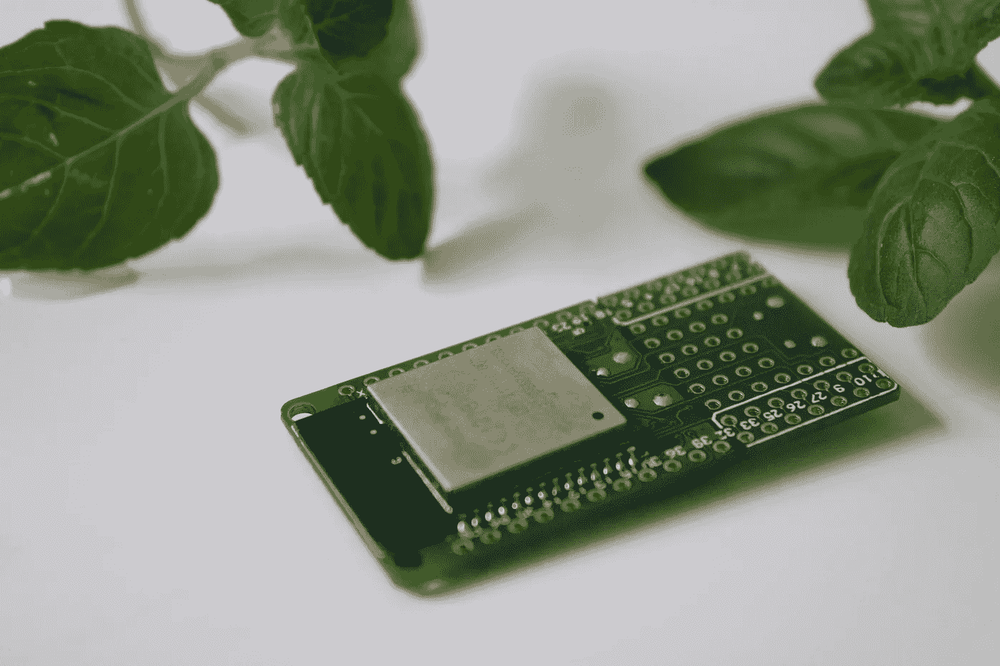
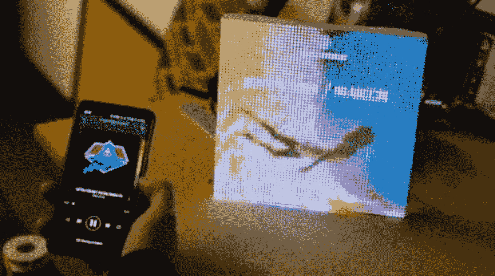
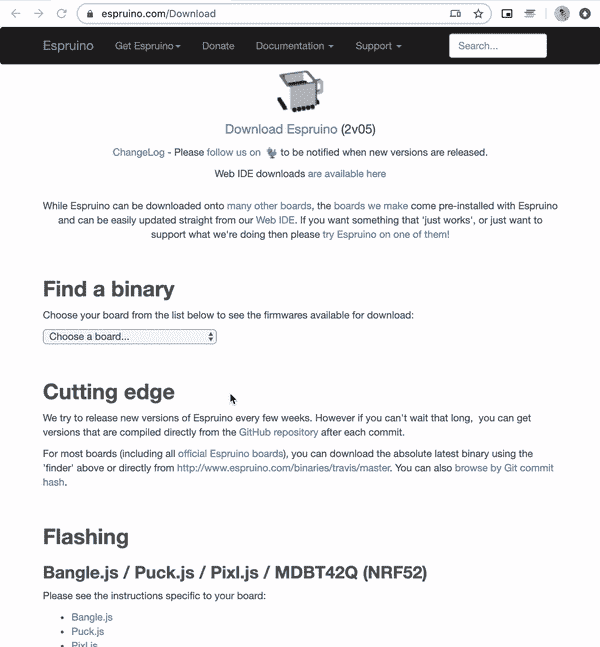
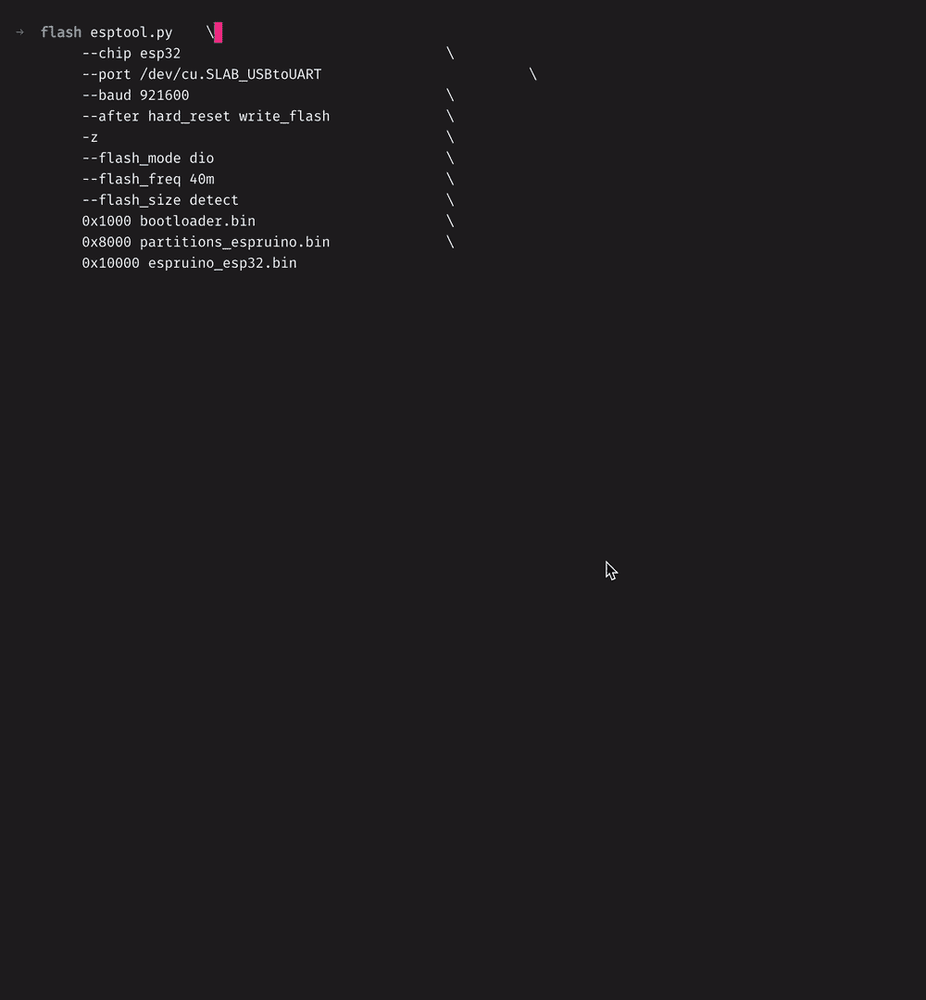
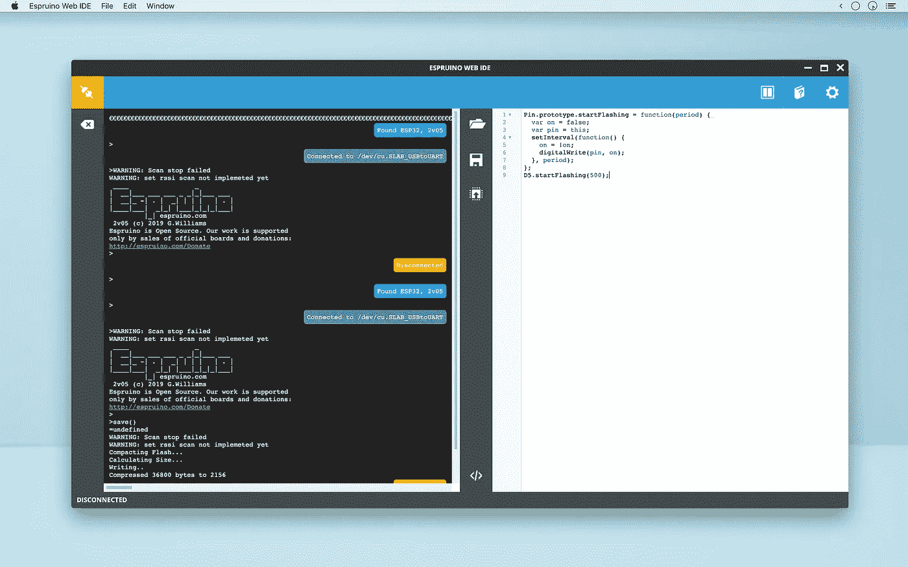
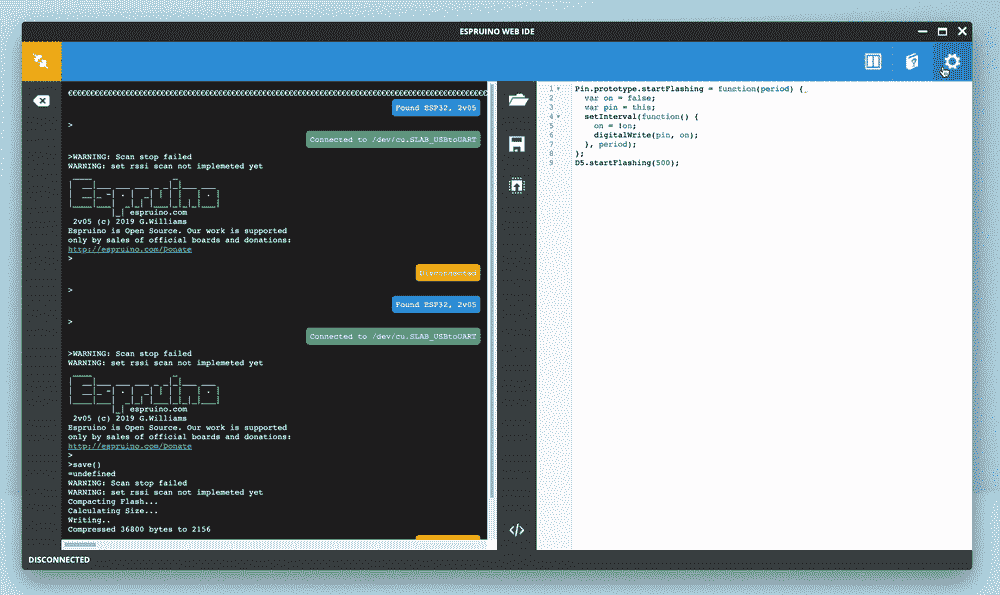
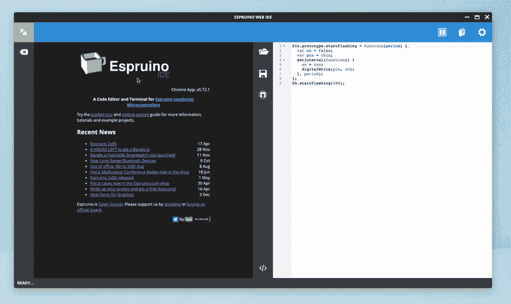
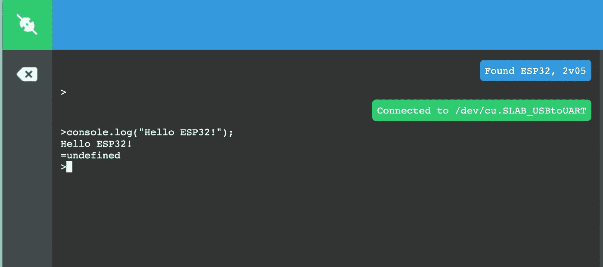
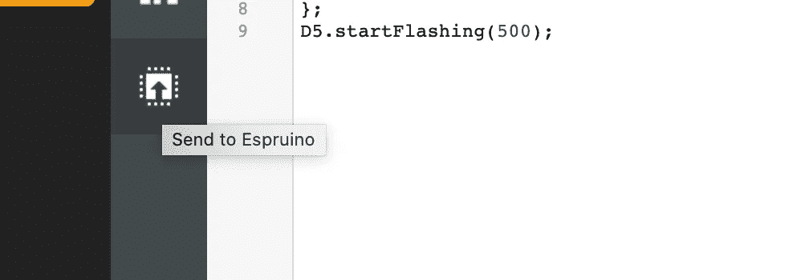

# 用 JavaScript 和 Espruino 震撼物联网世界

> 原文：<https://javascript.plainenglish.io/rock-the-iot-world-with-javascript-and-espruino-a955a9b2ddd?source=collection_archive---------9----------------------->

## 如何在 ESP32 上安装 Espruino，只用 JavaScript 统治物联网世界的详细教程。



几天前，在一次春季大扫除期间，我发现了我为一个旧项目买的一个 **ESP32** (但从未用过)，埋在一个壁橱里。我说的是一种微控制器设备，它非常便宜，但具有许多出色的功能，如内置 Wi-Fi 模块。

由于这些天我几乎只使用 JavaScript，我决定在上面安装 Espruino，以便能够用我已经知道并且熟悉的语言来控制它。所以我立即吹走灰尘，并试图将其连接到我的 Macbook 上，但我在第一次设置时发现了一些问题。

所以我花了几个小时在论坛和 Stack Overflow 上寻找修复它的方法，所以现在你有了如何在 ESP32 上安装 Espruino 和 JavaScript 的最终指南，以及所有可能问题的所有可能解决方案。

首先，让我们从一个 noob 问题开始:

# 什么是 ESP32？

ESP32 是一款集成 Wi-FI 和蓝牙低能耗的微控制器。**它基本上是一个拇指大小的芯片，你可以用它来访问互联网、调用 API 或与手机通信。**很酷，对吧？

以下是我使用/推荐 ESP32 微控制器的一些优势:

*   创建一个自己动手的家庭住宅；
*   每分钟读取你家的[温度(用外置传感器)和湿度，并发送给服务器](https://www.hackster.io/jaume_miralles/monitoring-temperature-and-humidity-with-esp32-f53465)；
*   建造一个空气质量传感器。
*   创建[一个与 Spotify 连接的专辑封面可视化程序(这真的很酷)](https://medium.com/hacksters-blog/display-your-spotify-album-art-on-a-led-matrix-with-a-sparkfun-esp32-thing-cdf0a805e350)



Spotify cover visualiser with ESP32

还有…极其便宜！你可以在全球速卖通上找到一些 3-4 美元的单个 ESP32 或每个 2 美元的捆绑包。如果你想明天就拿到手，你也可以在亚马逊 Prime 上找到它们，每个 10 美元左右；与其他产品相比并不便宜，但仍比其他物联网板便宜！

ESP32 是 **ESP8266** (我[几年前写了一篇关于它的文章](https://medium.com/@marassi/control-your-home-using-only-javascript-72a3b071c894))的直接继任者，它携带一个更强大的双核处理器和更多的 RAM。此外，它还具有一些额外的引脚和一些有用的内置传感器。


Comparison between ESP8266 and ESP32

有了这些额外的功能，你可以做一些非常酷的事情，最棒的是… **你还可以用 Espruino 在上面安装 JavaScript！**

# Espruino 是什么？

Espruino 是用于微控制器的开源 JavaScript 解释器。它允许在低成本芯片中使用 JavaScript，这意味着即使您不熟悉 Arduino、Lua 等编程语言，也可以立即开始使用它..

是的，在征服了前端世界(JavaScript、React、Angular……)和后端世界(使用 Node.js)之后，你也可以通过物联网设备在物理世界上使用 JavaScript，最终能够在任何地方使用 JavaScript**。**

# **如何在 ESP32 上显示 Espruino**

**让我们从第一个设置开始:当你第一次使用 ESP32 时，它通常内部没有代码，或者有一些 Lua 代码来闪烁内部 led。因此，我们需要安装 Espruino，以便开始做我们伟大的 JS 东西。这样的过程被称为**闪烁**，但是不用担心，在公共场所暴露你的生殖器是没有必要的！请穿上你的内裤，**谢谢**。**

****首先:让我们下载 Espruino 吧！****

**进入 espruino.com 的[下载页面，选择 ESP32 的二进制文件，然后点击第一个链接，查看最新的 Espruino 版本(2020 年 5 月为 v2.05)](http://www.espruino.com/Download)**

****

**How to download Espruino binaries**

**下载所有 3 个文件:**

*   **[bootloader.bin](https://www.espruino.com/binaries/espruino_2v05_esp32/bootloader.bin)**
*   **[espruino_esp32.bin](https://www.espruino.com/binaries/espruino_2v05_esp32/espruino_esp32.bin)**
*   **[partitions _ espruin no . bin](https://www.espruino.com/binaries/espruino_2v05_esp32/partitions_espruino.bin)**

**我们一会儿会用到它们。首先，我们需要确保我们的 ESP32 对我们的计算机可见。**

# **找到我们的 ESP32**

**让我们将 ESP32 连接到 USB 电缆和计算机上。如果它是全新的，它应该开始闪烁它的 LED，因为这是它的默认安装程序(这也是我们确保设备没有损坏的好方法)。**

**然后，我们需要 PC 分配给 ESP32 的位置，以便在闪存时对其进行寻址。为此，我们需要在 PC 上安装一些驱动程序，让它能够成功查看 ESP32。**

**安装这些驱动程序，以便能够从您的 PC/Mac 上查看设备(只需找到适合您的操作系统的驱动程序，下载可执行文件并运行即可)。**

**根据您的 ESP32 硬件，您可能只需要安装其中一个驱动程序(例如，我只安装了第一个)。为了确保万无一失，请同时安装它们:)**

**[](https://www.silabs.com/products/development-tools/software/usb-to-uart-bridge-vcp-drivers) [## USB 转 UART 桥 VCP 驱动器-硅实验室

### CP210x USB 转 UART 桥虚拟 COM 端口(VCP)驱动程序是设备操作所必需的，作为虚拟 COM 端口以…

www.silabs.com](https://www.silabs.com/products/development-tools/software/usb-to-uart-bridge-vcp-drivers) [](https://www.ftdichip.com/Drivers/VCP.htm) [## 虚拟 COM 端口驱动程序

### 虚拟 COM 端口驱动程序本页包含当前可用于 FTDI 设备的 VCP 驱动程序。对于 D2XX Direct…

www.ftdichip.com](https://www.ftdichip.com/Drivers/VCP.htm) 

装的？很好。

现在打开你的终端并输入(如果你在 Linux 上)

```
ls /dev/tty*
```

或者如果你在苹果电脑上

```
ls /dev/cu*
```

> **对于 Windows 用户**:在本指南的末尾，你会找到一个关于如何找到你的 ESP32 的很好的指南！

如果你看到类似

```
/dev/tty.SLAB_USBtoUART
```

或者

```
/dev/cu.SLAB_USBtoUART
```

你已经准备好了！记住这个路径，因为它是我们的 ESP32 在 PC 上的位置(端口)。

> **如果你在 Mac 上**看不到任何设备，可能是因为 MacOS 阻止了驱动程序的加载。打开系统偏好设置- >安全&隐私- >常规，检查是否有关于“开发者提供的系统软件……”的信息，其中开发者的名字是 Silicon Labs 或 FTDI，在被询问时输入您的管理员密码后点击“允许”。

# 安装 Espruino

我们将使用 **esptool** 来安装 Espruino。它是用 Python 写的，所以一定要在你的电脑上安装 Python 2.7 或> 3.4。

然后，使用 **pip** ，运行以下命令:

```
pip install esptool
```

如果这抛出一个错误，尝试`python -m pip install esptool`或`pip2 install esptool`。这将在可执行文件目录中安装 esptool，我们将能够从任何地方运行它。

你还记得我们几个步骤前下载的那三个文件吗，我们把它们放在哪里了？很好，现在:使用您的终端进入该文件夹，稍微编辑该命令，以便添加我们的 ESP32 位置。

```
esptool.py                                          \
        --chip esp32                                \
        --port <INSERT HERE YOUR ESP32 LOCATION>    \
        --baud 921600                               \
        --after hard_reset write_flash              \
        -z                                          \
        --flash_mode dio                            \
        --flash_freq 40m                            \
        --flash_size detect                         \
        0x1000 bootloader.bin                       \
        0x8000 partitions_espruino.bin              \
        0x10000 espruino_esp32.bin
```

仅在之后替换—移植之前找到的位置。我用`---port /dev/cu.SLAB_USBtoUART`代替了它。



Flashing Espruino on ESP32

还有… **你的 ESP32 现在闪了 Espruino！**💪

# 安装 Espruino Web IDE



在 ESP32 上编写(和执行)代码的最简单方法是使用 Espruino Web IDE，这是一款 Chrome 应用程序，可以:

*   连接一台 ESP32(或任何其他 Espruino 设备)；
*   编写 JS 代码，然后在您的 ESP32 上执行它；
*   打开一个交互式控制台，在刷新代码之前，您可以在其中调试代码或测试一些方法。

可从以下网址获得:

[](https://chrome.google.com/webstore/detail/espruino-web-ide/bleoifhkdalbjfbobjackfdifdneehpo) [## Espruino Web IDE

### Espruino JavaScript 微控制器的终端和图形代码编辑器

chrome.google.com](https://chrome.google.com/webstore/detail/espruino-web-ide/bleoifhkdalbjfbobjackfdifdneehpo) 

首先，我们需要与我们的 Espruino 建立联系。为此，我们必须更改 Espruino Web IDE 的默认设置，否则我们将无法以正确的方式连接它。**相信我，我在这上面损失了 4 个小时**。

按右上角的设置按钮，打开“**通信**选项卡，将波特率从 9600 更改为 115200。它将被自动保存。



好了，现在关闭设置，开始使用您的 ESP32！

按下左上角的“ **Plug** ”黄色按钮，选择我们之前找到的端口(在我的例子中是:/dev/cu。SLAB_USBtoUART)。



如果它变成绿色，那么我们是连接的。

让我们尝试一些简单的东西:一个 Hello World(显然)。

如您所见，在 ide 的左侧，当我们连接到 Espruino 后，现在有一个提示。就是我之前公布的交互控制台。

让我们写下`console.log('Hello ESP32!');`并按回车键。



这段代码在我们的 ESP32 上执行，并正确返回。(console.log 总是返回 undefined)。

# (最后)我们来写点代码吧！

在接下来的部分中，我们将利用 Espruino 的全部潜力来……打开 LED 灯。(我们有一个良好而简单的开端，我们必须首先关注第一步。我保证，在接下来的文章中，我们会做一些更酷的东西！🤞)

正如我们在前面几段已经看到的，ESP32 有一个内部 LED，该 LED 连接到引脚 n 5。在 Espruino 中，管脚用 D1、D2、D3…D '表示为数字管脚，因此我们可以在变量 D5 中找到管脚 n 5。所有的 pin 码都已经被 Espruino 初始化了，所以我们在开始使用它之前不需要声明 D5。

我们可以使用 Espruino 方法`digitalWrite`在引脚 D5 上写入，并将其状态从 OFF 更改为 on。注意:**要设置一个 LED，你必须传递一个 0 值。默认情况下(LED 关闭)，该值为 1** 。我知道这不是世界上最直观的东西，但是请记住它，因为我们将来也会用到它。关于这个，这里有一个很好的解释。

我们试试吧！只要在控制台上写下`digitalWrite(D5, 0)`或者`digitalWrite(D5, false)`，回车即可。您将看到 ESP32 内部 LED 现在亮起！🥳

如果你想关掉它，只需执行`digitalWrite(D5, 1)`。

到目前为止，我们给出了 ESP32 简单的单行指令，这些指令会立即执行。一些可以无限执行的代码呢？

我们将编写一些代码来每 500 毫秒打开和关闭我们内部的 LED D5。最好的部分是…我们将使用所有基本的 JavaScript 指令来完成它，因为我们不需要学习任何新的命令或语言。

以下是代码，将其复制/粘贴到 Espruino Web IDE 的右边部分(白色部分):

看着眼熟？这是因为它几乎与您可以在浏览器中运行的 JavaScript 代码相同！这就是 Espruino 的美妙之处:它只是 JavaScript😉

我们将扩展 Pin 对象的`prototype` 来添加一个新方法， **blink** 。该方法有一个针对引脚当前状态(开/关)的内部变量，我们将使用 **setInterval** 来切换状态，并使用 **digitalWrite** 将其写入引脚。

要将这段代码加载到我们的 ESP32 中，我们需要按 IDE 中间的第三个按钮:“Send to Espruino”按钮。



几秒钟后，您会注意到 LED 在闪烁。不错！

现在我们的代码在 ESP32 的内存中，但是如果你拔掉它，然后再插上 USB 电缆，它将丢失所有指令并保持空闲。

要永久保存我们的指令，以便每次打开设备时它都会执行代码，您需要到控制台键入 **save()** 。就这样，过一会儿代码将被保存，现在你也可以把它插入 USB 电源适配器或 USB 外部电池，它将按预期工作。

# 下一步是什么

本文是对以下内容的介绍:

*   什么是 Espruino，什么是 ESP32 设备；
*   如何安装 Espruino 以及如何避免所有首次设置的麻烦；
*   如何使用 Espruino Web IDE 并连接到我们的 ESP32
*   在上面运行一些基本代码并保存代码。

但是我们可以用这个便宜的小设备和 Javascript 做很多很酷的事情。

我将在未来几周发布一篇新文章，介绍如何将我们的 ESP32 连接到 WI-FI 网络，如何创建接入点，以及如何将其用作物联网节点，以将一些数据发送到外部服务并在浏览器中查看这些数据。

如果你有任何问题，不要犹豫，在推特上联系我[！](https://twitter.com/urcoilbisurco)

# 更多资源

*   ESP32 的 Espruino 指南:【https://www.espruino.com/ESP32 
*   关于驱动程序和如何找到您的 ESP32 串行连接的额外信息( **Windows 用户**:这是您的指南):[https://docs . espressif . com/projects/esp-IDF/en/latest/ESP32/get-started/establish-serial-connection . html](https://docs.espressif.com/projects/esp-idf/en/latest/esp32/get-started/establish-serial-connection.html)
*   Espruino 方法文档:[https://www.espruino.com/Reference#software](https://www.espruino.com/Reference#software)

## **简明英语团队的说明**

你知道我们有四种出版物吗？给他们一个 follow 来表达爱意:[**JavaScript in Plain English**](https://medium.com/javascript-in-plain-english)[**AI in Plain English**](https://medium.com/ai-in-plain-english)[**UX in Plain English**](https://medium.com/ux-in-plain-english)[**Python in Plain English**](https://medium.com/python-in-plain-english)**—谢谢，继续学习！**

**此外，我们总是有兴趣帮助推广好的内容。如果您有一篇文章想要提交给我们的任何出版物，请发送电子邮件至[**submissions @ plain English . io**](mailto:submissions@plainenglish.io)**，附上您的媒体用户名和您感兴趣的内容，我们将会回复您！******