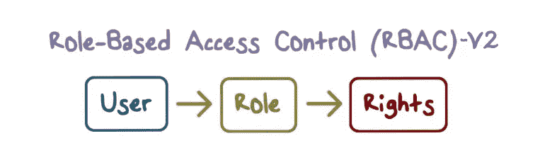

# React 中的公共、私有和基于角色的路由

> 原文：<https://javascript.plainenglish.io/role-based-authorization-role-based-access-control-v-2-in-react-js-cb958e338f4b?source=collection_archive---------0----------------------->



耶，我又想出了一个超级酷的故事，我称之为 RBAC-V2，因为这是我第二个关于同一主题的故事，下面列出了第二个版本背后的一些原因。

1.  版本 1 与我介绍这种技术的项目紧密结合。
2.  不支持子/嵌套路由。
3.  没有在一个地方定义角色的技术。
4.  更新路径访问很复杂。
5.  必须维护所有角色的公共路线。

**版本 2 中的更新:**

1.  我想出了一个更通用的方法，以便更好地服务于社区。
2.  添加了子/嵌套路线支持。
3.  在一个地方定义角色，以便于维护。
4.  只需添加或删除角色，即可轻松更新路由访问。
5.  如果您跳过该权限，所有人都可以自动访问它。

该解决方案与我在版本 1 中使用的完全相同，因此如果您没有检查版本 1，我强烈建议您仔细阅读，这样您可以更好地了解到底发生了什么…

[](https://medium.com/@umairkz52/role-based-authorization-role-based-access-control-in-react-js-65c05a372ca8) [## 基于角色的授权| | react . js 中基于角色的访问控制

### 在我最近的项目中，我的任务是实现基于角色的授权/访问控制

medium.com](https://medium.com/@umairkz52/role-based-authorization-role-based-access-control-in-react-js-65c05a372ca8) 

> **这个想法是简单地防止应用程序生成不必要的路线，** **而不是检查每个路线上的角色并显示回退用户界面，这将是一个伟大的想法，只生成用户有权访问的路线，所以如果用户手动导航到一个路线，即:(在地址栏中键入)他/她会得到 404 未找到屏幕，因为路线没有注册。**


🙋🏻‍♂️ Stop Stop Stop

# 你在说什么？
这真的可能吗？
如果是，那么如何？

是的，这是可能的，如果你听说过 [react-router 4 的理念](https://reactrouter.com/web/guides/philosophy)它支持动态路由，我们可以利用它。

> 当我们说动态路由时，我们指的是在您的应用程序呈现时发生的路由，而不是在运行的应用程序之外的配置或约定中。


Let’s start

**步骤#1** 因为我们正在寻找基于角色的解决方案，所以让我们先定义角色，角色只是一个普通的 javascript 对象，具有键值对，**下面是我的演示应用程序的占位符角色，您可以用自己的角色来替换它们**。


User Roles

```
File: src/config/Roles**export default** {
 **SUPER_ADMIN**: **'SUPER_ADMIN'**,
 **ADMIN**: **'ADMIN'**,
 **MANAGER**: **'MANAGER'**,
 **CUSTOMER**: **'CUSTOMER'**,
 **GUEST**: **'GUEST'** };
```

**步骤#2**
定义私有路由配置，r *oute config 对象支持 react-router 的所有路由组件属性以及一些附加属性，即:* ***【标题、权限、孩子】*** *您可以在 config 对象中添加或删除属性，这意味着它是超级可定制的，支持多达 N 个嵌套，子路由必须遵循相同的父形状，这意味着 config 对象对于子路由和父路由都是相同的，没有附加关键字。*

```
File: src/config/PrivateRoutesConfig**import** { Roles } **from 'config'** *// Components* **import** {
 Module1,
 Module2,
 Module3,
 ModuleN,
 ModuleNChild1,
 ModuleNChild2,
 ModuleNChild3,
 Dashboard,
 Profile,
} **from 'components'**;

*//* ***TODO:*** */*
* 1\. Make title optional
* 2\. Make title multi type support ie: (string, node, react element)
* */* **export default** [
 {
  **component**: Module1,
  **path**: **'/'**,
  **title**: **'Module - 1'**,
  **exact**: **true**,
 },
 {
  **component**: Module2,
  **path**: **'/module-2'**,
  **title**: **'Module - 2'**,
 },
 {
  **component**: Module3,
  **path**: **'/module-3'**,
  **title**: **'Module - 3'**,
 },
 {
  **component**: ModuleN,
  **path**: **'/module-n'**,
  **title**: **'Module - N'**,
  **permission**: [
   Roles.**SUPER_ADMIN**,
   Roles.**ADMIN**,
   Roles.**MANAGER** ],
  **children**: [
   {
    **component**: ModuleNChild1,
    **path**: **'/child-1'**,
    **title**: **'Child - 1'**,
   },
   {
    **component**: ModuleNChild2,
    **path**: **'/child-2'**,
    **title**: **'Child - 2'**,
   },
   {
    **component**: ModuleNChild3,
    **path**: **'/child-3'**,
    **title**: **'Child - 3'**,
    **permission**: [
     Roles.**SUPER_ADMIN**,
     Roles.**ADMIN** ]
   }
  ]
 },
 {
  **component**: Dashboard,
  **path**: **'/dashboard'**,
  **title**: **'Dashboard'**,
  **permission**: [
   Roles.**SUPER_ADMIN**,
   Roles.**ADMIN**,
  ],
 },
 {
  **component**: Profile,
  **path**: **'/profile'**,
  **title**: **'Profile'**,
  **permission**: [
   Roles.**SUPER_ADMIN**,
   Roles.**ADMIN**,
   Roles.**MANAGER**,
   Roles.**CUSTOMER** ],
 },
]
```

我们已经完成了配置。

到目前为止我们完成了什么？

一个是**角色**另一个是**私服阵，**对吧？🤔🤔🤔耶斯
🆗所以，是时候进入代码了…


**第三步**

如果您的应用程序像我们的演示应用程序一样支持多个角色，让我们用用户角色或多个角色来过滤私有路由

```
File: src/utils/index**import** { *intersection* } **from 'lodash'**;

**export function** *isArrayWithLength*(arr) {
 **return** (***Array***.isArray(arr) && arr.**length**)
}

**export function** *getAllowedRoutes*(routes) {
 **const** roles = ***JSON***.parse(***localStorage***.getItem(**'roles'**));
 **return** routes.filter(({ permission }) => {
  **if**(!permission) **return true**;
  **else if**(!*isArrayWithLength*(permission)) **return true**;
  **else return** *intersection*(permission, roles).**length**;
 });
}
```

现在我们有了一个实用方法***getAllowedRoutes****，我们可以在其中传递 Routes 数组，它将返回过滤后的 routes 数组，并将该数组传递给 routes 映射组件*

```
*File: src/routes/*PrivateRoutes***import** React, { ***Fragment*** } **from 'react'**;
**import** { *Redirect*, *useRouteMatch* } **from 'react-router-dom'**;
**import** { getAllowedRoutes, isLoggedIn } **from 'utils'**;
**import** { PrivateRoutesConfig } **from 'config'**;
**import** { TopNav } **from 'components/common'**;
**import** MapAllowedRoutes **from 'routes/MapAllowedRoutes'**;

**function** *PrivateRoutes*() {
 **const** match = *useRouteMatch*(**'/app'**);
 **let** allowedRoutes = [];

 **if** (isLoggedIn()) {
   allowedRoutes = getAllowedRoutes(PrivateRoutesConfig);
 } **else** {
   return <**Redirect** to="/" />;
 }

 **return** (
  <**Fragment**>
   <**TopNav 
     routes=**{allowedRoutes} 
     **path=**{match.**path**}
     **className="bg-white"** />
   <**MapAllowedRoutes 
     routes=**{allowedRoutes} 
     **basePath="/app" 
     isAddNotFound** />
  </**Fragment**>
 );
}

**export default** *PrivateRoutes*;*
```

**

***步骤#4** 现在，最后一步是渲染过滤后的路由，我已经为此创建了一个组件，因此相同的组件用于渲染父路由和子路由，该组件需要过滤后的路由数组和基本路径作为属性。*

```
*File: src/routes/MapAllowedRoutes**import** React, { *memo* } **from 'react'**;
**import** { ***Switch***, ***Route***, *useRouteMatch* } **from 'react-router-dom'**;
**import** { NotFound } **from 'components/common'**;

*/*
* This is the route utility component used for generating
* routes and child routes it only requires routes array and basePath
*/***function** MapAllowedRoutes({routes, basePath, isAddNotFound}) {
 **const** match = *useRouteMatch*(basePath);
 **return** (
  <**Switch**>
   {routes.map((route) => {
**const** { 
     path, 
     **component**: Component,
     children, 
     title,
     permission,
     ...rest 
    } = route; **return** (
     <**Route** {...rest}
      **key=**{path}
      **path=**{**`**${match.**path**}${path}**`**}
     >
      <**Component children=**{children} />
     </**Route**>
    )
   })}
    {isAddNotFound && <**Route**><**NotFound** /></**Route**>}
  </**Switch**>
 )
}

**export default** *memo*(MapAllowedRoutes);*
```

*如果你见过👀在 *PrivateRoutes* 中，我们刚刚使用在**步骤#3** 中创建的***getAllowedRoutes***实用程序方法过滤了私有路由，并将过滤后的路由数组传递到路由映射器组件中，路由映射器只是一个可重用组件，用于路由数组上的地图。*

*我们完成了路由。*

*如果我将您的主导航与路线同步，您觉得如何？🤔*

*那太棒了。
😍*

*这是代码*

```
*File: src/components/common/TopNav**import** React, { *memo* } **from 'react'**;
**import** { Button } **from 'react-bootstrap'**;
**import** PropTypes **from 'prop-types'**;
**import** { ***Link***, *useHistory* } **from "react-router-dom"**;
**import** { isLoggedIn } **from 'utils'**;

**function** TopNav(props) {
 **let** history = *useHistory*();

 **function** handleLogout() {
  ***localStorage***.removeItem(**'roles'**);
  history.push(**'/'**);
 }

 **return** (
  <**div className=**{**`w3-bar w3-padding w3-card** ${props.**className**}**`**} >
   <**div className="w3-display-topleft w3-padding-large w3-xlarge"**>
    RBAC-V2
   </**div**>
   <**div className="w3-right"**>
    {props.**routes**.map(({ path, title }) => (
     <**Link 
       key=**{path} 
       **className="w3-bar-item" 
       to=**{**`**${props.**prefix**}${path}**`**}
     >
       {title}
     </**Link**>
    ))}
    {isLoggedIn() && <**Button onClick=**{handleLogout}>Logout</**Button**> }
   </**div**>
  </**div**>
 );
}

TopNav.**propTypes** = {
 **routes**: PropTypes.**arrayOf**(
  PropTypes.shape({
   **path**: PropTypes.**string**.**isRequired**,
   **title**: PropTypes.**string**.**isRequired** })
 ).**isRequired**,
 **prefix**: PropTypes.**string**,
 **className**: PropTypes.**string** };

TopNav.**defaultProps** ={
 **prefix**: **''**,
 **className**: **''** };

**export default** *memo*(TopNav);*
```

****

## ***好处***

1.  *仅在父路由呈现时检查一次路由访问*
2.  *仅生成用户有权访问的路线*
3.  *中心角色和专用路由配置文件*
4.  *易于添加/删除角色*
5.  *易于添加/删除用户角色的路由访问权限*
6.  *路线和导航之间的同步*
7.  *单一+多重角色支持*

## *结论*

*这是一种易于维护且可扩展的方法，用于实现基于角色的路线访问，以及支持多角色和嵌套路线的导航*

## *链接*

*github:[https://github.com/umair-khanzada/role-based-access-control](https://github.com/umair-khanzada/role-based-access-control)
演示 App:[https://umair-khanzada.github.io/role-based-access-control](https://umair-khanzada.github.io/role-based-access-control/)*