# Webpack 在 Angular

> 原文：<https://javascript.plainenglish.io/role-of-webpack-in-angular-part-3-of-series-what-angular-is-5058d445e45c?source=collection_archive---------5----------------------->

## 什么是有角？(第三部分)

工作原理… |如何开始…

> 如果你还没看过这个系列的 [Part — 2](https://medium.com/@AnkitMaheshwariIn/what-angular-is-part-2-550954552d89) ，推荐你看看这个链接→ [什么是 Angular？| Part — 2](https://medium.com/@AnkitMaheshwariIn/what-angular-is-part-2-550954552d89)

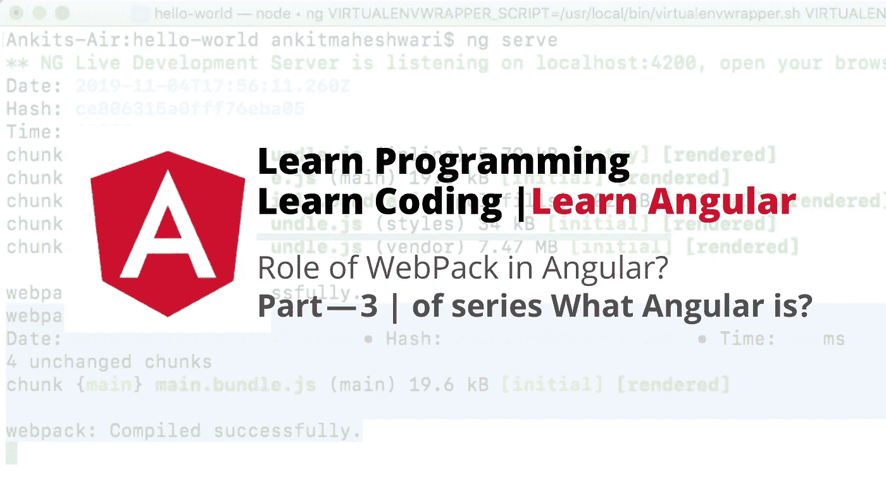

# 让我们开始建立一个有角度的项目？

打开文件👉通过将字符串从**‘App’**替换为**‘Angular App’**来更改标题。

看👇在 9 号线

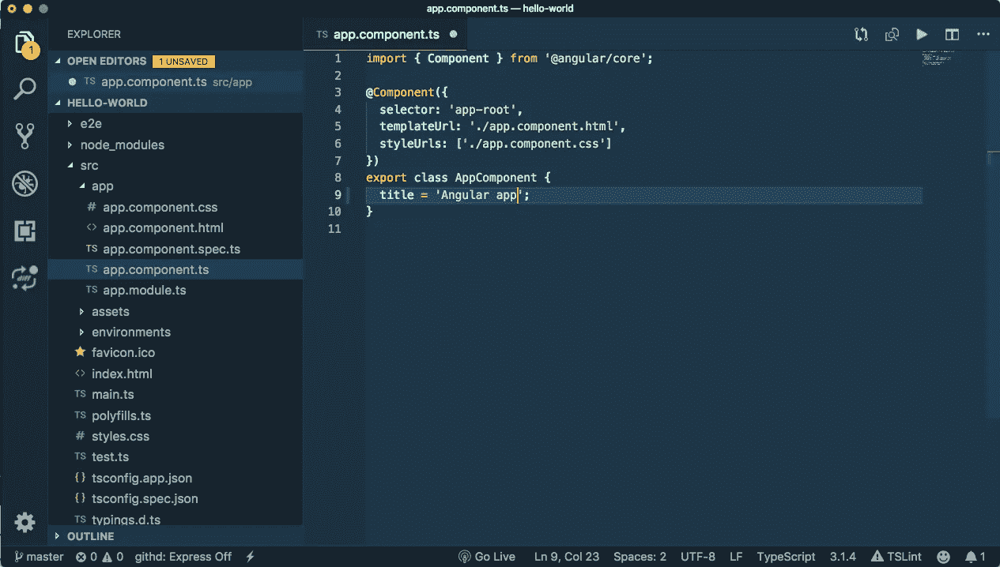

change title by replacing string from **‘app’** to **‘Angular App’**

返回命令提示符或终端并运行:

```
**ng serve**
```

然后看消息👇 **webpack** :正在编译…

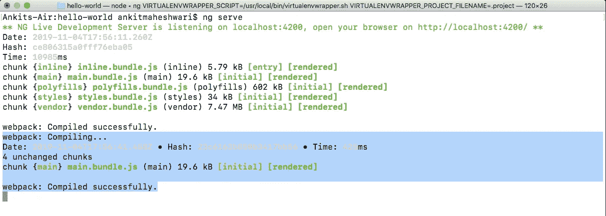

webpack: Compiling…

*因此，angular CLI 使用一个名为****web pack****的工具，这是一个构建自动化工具，它获取我们所有的脚本和样式表，将它们组合成一个包，并缩小该包，这是为了优化。*

这里我们可以看到👇很少有像 **polyfills.bundle.js** 这样的包，它包含了所有的脚本来填补 Angular 需要的 Javascript 版本和大多数浏览器支持的 Javascript 版本之间的空白。

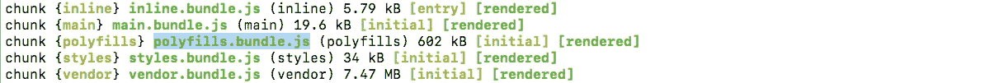

**polyfills.bundle.js**

这里我们可以看到👇另一个包是 **main.bundle.js** ，它包含了我们应用程序的所有源代码。

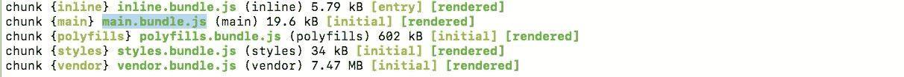

**main.bundle.js**

这里我们可以看到👇另一个包是一个 **styles.bundle.js** ，它包含了我们所有的样式表。这里，样式表存储在一个 Javascript 包中。

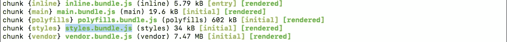

**styles.bundle.js**

这里我们可以看到👇另一个包是包含所有第三方库的 **vendor.bundle.js** 。

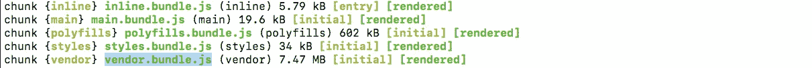

**vendor.bundle.js**

***注*** *:每当我们对我们的文件 html、类型脚本或样式进行任何更改时，****web pack****会自动重新编译我们的应用程序并刷新我们的包。现在在底部我们可以看到👇*

```
webpack: Compiled successfully.
```

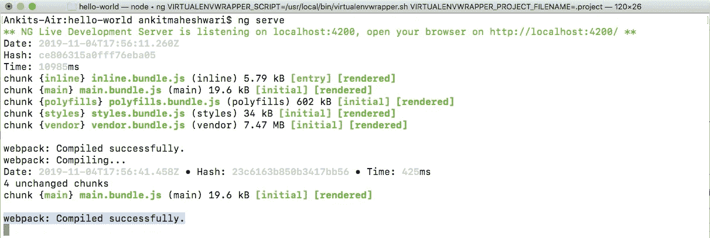

`webpack: Compiled successfully.`

回到浏览器，输入 [http://localhost:4200/](http://localhost:4200/) 。代码的变化会出现在浏览器中，甚至不需要刷新页面——这是 **webpack** 的功能，称为热模块替换或热模块重载，因此每当源文件被修改时 **webpack** 会自动刷新我们的浏览器。

输出👇现在我们有了新的标题**欢迎使用 Angular app！**👏👏

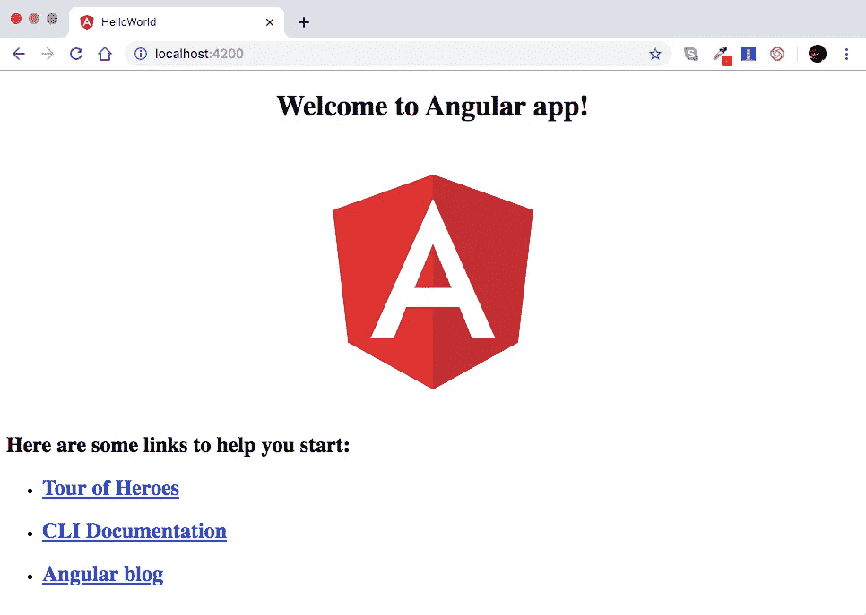

the new title **Welcome to Angular app!**

在此浏览器选项卡页面中👆右键单击并转到查看页面源代码。

看👇

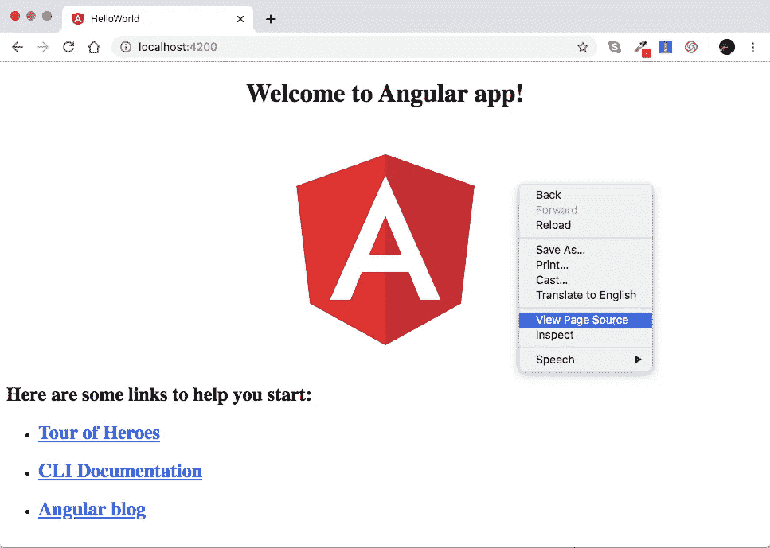

right click and go to View Page Source

单击查看页面源后，源页面看起来👇

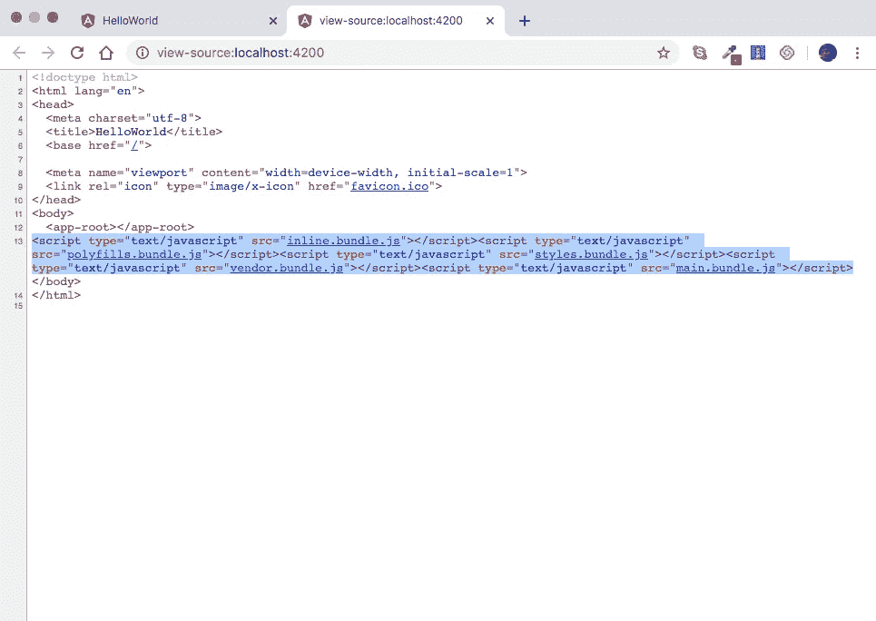

Source code of page index.html at runtime

**注意**:我们在 index.html 的代码中没有任何对我们的样式表或脚本文件的引用——**wepack**会自动生成样式表&脚本文件，并在运行时动态地将它们集成到 index.html(见上图👆)

看下面👇没有样式表和脚本文件的代码中的 index.html。

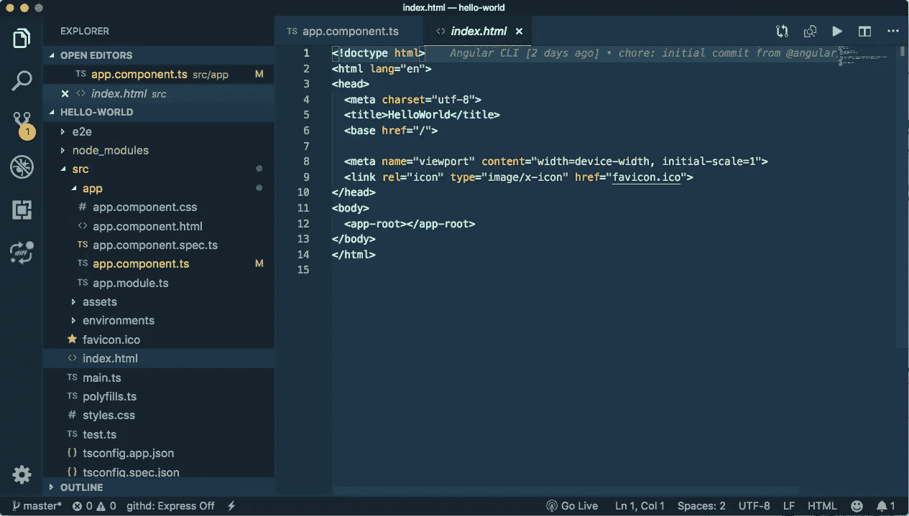

index.html in our code without stylesheets and script files

webpack 生成的所有包也在 index.html 注入它们——一切都在运行时动态发生。

**那么，这些捆绑包中有什么呢？**👇👇

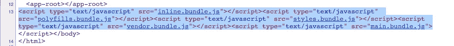

bundles generated by **webpack**

👨‍⚖️ **再次提醒……**

奔跑👉`ng serve`

用 URL 打开浏览器👉`[http://localhost:4200/](http://localhost:4200/)` —这将打开我们的 Angular 应用程序的主页。

然后👉右键单击此页面，然后单击“查看页面源代码”——在新标签中将打开一个链接(这是页面的源代码)👉`view-source:[http://localhost](http://localhost):4200/`

然后最后寻找`styles.bundle.js`并点击它，这将再次在一个新的标签中打开一个新的链接👉`[http://localhost:4200/styles.bundle.js](http://localhost:4200/styles.bundle.js)`——这包含了`[styles.bundle.js](http://localhost:4200/styles.bundle.js)`的实际源代码——这个文件实际上有 Javascript 代码，在这个 Javascript 代码的中间，我们可以找到我们的应用程序中使用的样式。看👇

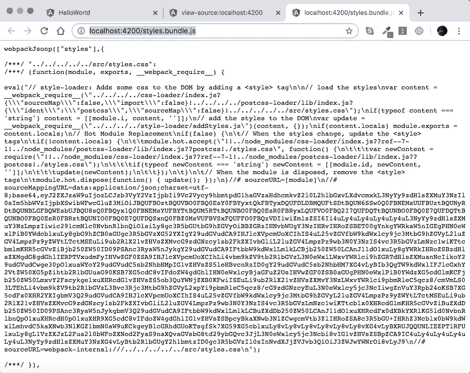

⭐️ *这里需要注意的重要一点是* ***我们所有的样式都被编译成一个 Javascript 包。*** *和* **webpack** 是在编译时自动生成这些包的。它还在运行时将它们注入 index.html。

这是这一部分的内容，下一部分再见👋👋

> 如果你还没有覆盖到本系列的 [Part — 2](https://medium.com/@AnkitMaheshwariIn/what-angular-is-part-2-550954552d89) ，推荐你查看这个链接→ [什么是 Angular？第二部分](https://medium.com/@AnkitMaheshwariIn/what-angular-is-part-2-550954552d89)
> 
> *下一步点击此处👇for Part—4* [https://medium . com/@ ankitmaheshwarin/angular-template-syntax-directive-interpolation-property-binding-event-binding-Part-4-547 e 2512 D8 Fe](https://medium.com/@AnkitMaheshwariIn/angular-template-syntax-directive-interpolation-property-binding-event-binding-part-4-547e2512d8fe)

如果你不介意给它一些掌声👏 👏既然有帮助，我会非常感谢:)帮助别人找到这篇文章，所以它可以帮助他们！

永远鼓掌…

