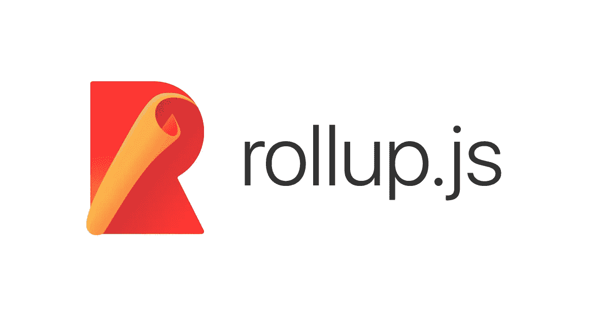

# 累计:UMD 的常见问题

> 原文：<https://javascript.plainenglish.io/rollup-commonjs-umd-c6d019cfead?source=collection_archive---------4----------------------->



[rollup.js](https://b.remarkabl.org/2I2FqPB)

鉴于 [Webpack](https://b.remarkabl.org/3mI3vKi) 非常适合构建**应用**，[汇总](https://b.remarkabl.org/2I2FqPB)非常适合构建**库**。

开箱后卷起支架 *ES 模块*。但是，为了支持 *CommonJS* ，需要以下插件:

*   [@ roll up/plugin-commonjs](https://github.com/rollup/plugins/tree/master/packages/commonjs)
*   [@汇总/插件-节点-解析](https://github.com/rollup/plugins/tree/master/packages/node-resolve)

# 先决条件

*   [Node.js](http://b.remarkabl.org/nodejs-site)
*   [国家预防机制](https://docs.npmjs.com/downloading-and-installing-node-js-and-npm/)

# 设置

安装[总成](https://www.npmjs.com/package/rollup):

```
$ npm install rollup
```

创建入口文件`index.js`:

```
$ echo "export default 'Hello, world!'" > index.js
```

初始化`package.json`:

```
$ npm init --yes
```

将构建脚本添加到`package.json`:

> 脚本将`index.js`编译成`dist/bundle.js`。

运行构建脚本:

```
$ npm run build
```

发现你得到了错误:

```
Error: You must specify "output.format", which can be one of "amd", "cjs", "system", "esm", "iife" or "umd".
```

# 输出格式

Rollup 需要一个[输出格式](https://rollupjs.org/guide/en#output-format)。以下是一般准则:

*   对于浏览器，使用`iife` ( [立即调用函数表达式](https://developer.mozilla.org/docs/Glossary/IIFE))
*   对于 Node.js，使用`cjs` ( [CommonJS](https://wikipedia.org/wiki/CommonJS) )
*   对于浏览器和 Node.js，使用`umd` ( [通用模块定义](https://github.com/umdjs/umd))

要生成将`MyModuleName`作为导出名称的 UMD 包:

```
$ npx rollup index.js --file dist/bundle.js --format umd --name 'MyModuleName'
```

## 用脚本加载

使用`<script>`标签在浏览器中加载模块:

## 加载 AMD

使用[和](https://github.com/amdjs/amdjs-api/blob/master/AMD.md#amd)(异步模块定义)在浏览器中加载模块:

## 用 CommonJS 加载

使用 CommonJS 在 Node.js 中加载模块:

```
$ node
> const MyModuleName = require('./dist/bundle');
> console.log(MyModuleName);
Hello, world!
```

# 配置

您可以在配置文件`rollup.config.js`中指定选项，而不是通过 CLI(命令行界面)传递选项。

创建文件`rollup.config.js`:

```
$ touch rollup.config.js
```

添加配置:

更新`package.json`中的构建脚本以使用配置文件:

要给配置文件一个不同于缺省值的名称，您需要指定自定义文件位置:

```
$ npx rollup --config my.config.js
```

# 插件

## CommonJS

要使用 CommonJS 语法，请安装 [@rollup/plugin-commonjs](https://www.npmjs.com/package/@rollup/plugin-commonjs) :

```
$ npm install @rollup/plugin-commonjs
```

将插件添加到汇总配置中:

现在重构`index.js`:

在重新构建包之后，用 script、AMD 或 CommonJS 加载它应该可以继续工作:

```
$ npm run build
$ open script.html
$ open amd.html
$ node -p "require('./dist/bundle')"
Hello, world!
```

## 节点解析

假设您想在`index.js`中使用 [lodash](https://www.npmjs.com/package/lodash) :

```
$ npm install lodash
```

为了让 rollup 在`node_modules`中定位第三方模块，你需要安装[@ roll up/plugin-node-resolve](https://github.com/rollup/plugins/tree/master/packages/node-resolve):

```
$ npm install @rollup/plugin-node-resolve
```

将插件添加到汇总配置中:

构建包以验证它仍然可以工作:

```
$ npm run build
$ node -p "require('./dist/bundle')"
Hello, world!
```

> 如果您希望模块分辨率符合`package.json`中的[“浏览器”字段](https://github.com/defunctzombie/package-browser-field-spec)，您可以设置选项`resolve({ browser: true })`。

## 简洁的

要使用 rollup v2 缩小您的包，请使用 [terser](https://github.com/terser/terser) 。

安装[汇总插件程序](https://github.com/TrySound/rollup-plugin-terser):

```
$ npm install rollup-plugin-terser
```

将插件添加到汇总配置中:

使用一个环境变量来确定是要构建一个缩小的还是未缩小的包:

在运行 build 命令之前设置环境变量:

```
$ NODE_ENV=production npm run build
```

或者，这可以在`package.json`构建脚本中完成:

## 把…弄成难看ˌ将…丑化ˌ糟蹋

要使用 rollup v1 缩小包，请使用 [UglifyJS](https://github.com/mishoo/UglifyJS2) 。

安装[汇总插件丑化](https://github.com/TrySound/rollup-plugin-uglify):

```
$ npm install rollup-plugin-uglify
```

将插件添加到汇总配置中:

现在，您可以构建一个丑陋的包:

```
$ npm run build
$ node -p "require('./dist/bundle')"
Hello, world!
```

## JSON

要导入 JSON 文件，安装 [@rollup/plugin-json](https://www.npmjs.com/package/@rollup/plugin-json) :

```
$ npm install @rollup/plugin-json
```

将插件添加到汇总配置中，类似于对其他插件的操作:

# 资源

要了解关于 Rollup 的更多信息，请查看官方的[文档](https://b.remarkabl.org/2I2FqPB)。

[*本文原载于 2019 年 7 月 12 日 remarkablemark.org。*](https://b.remarkabl.org/3kZepL2)