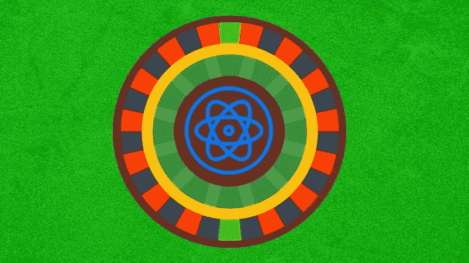
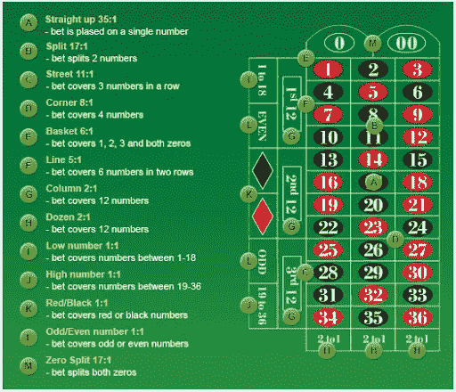
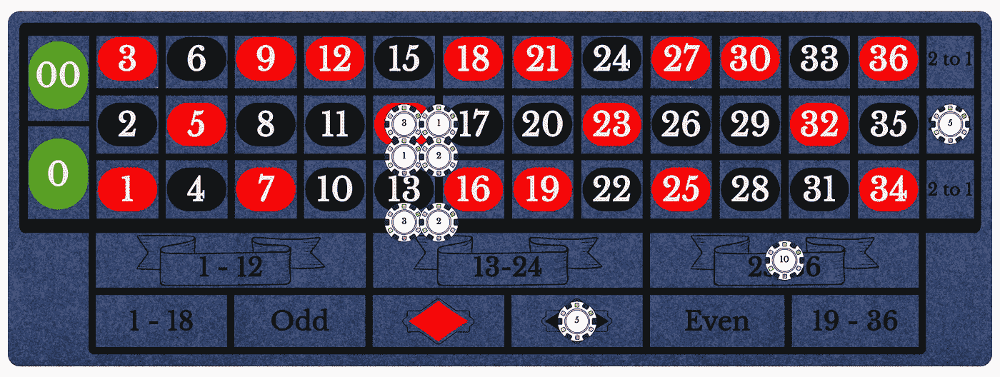

# 轮盘赌逻辑基础建立在反应钩上

> 原文：<https://javascript.plainenglish.io/roulette-logic-basics-built-with-react-hooks-c1433a025c36?source=collection_archive---------8----------------------->



上周，我做了一个双层 21 点应用程序，并写了相关内容，链接到[这里](https://medium.com/dev-genius/blackjack-game-logic-basics-built-with-react-hooks-8e7e41fbbb87)。作为一个曾经在赌场做了几年桌面游戏经销商的人，我非常喜欢制作 21 点应用程序，现在我正在创建一系列简单的赌场游戏 web 应用程序！

这个星期，我决定轮盘赌将是有趣和具有挑战性的，但在短时间内建立和写是合理的。我在以前的 21 点帖子中使用了很多相同的心态，所以我建议你在这篇帖子之前先看看那篇帖子。

对我个人来说，这个应用程序与 21 点应用程序的最大区别之一是下注面。我用 CSS 网格创建了轮盘布局，它对我来说工作得很漂亮，如果你想创建任何一种类似于*网格*的结构，我强烈推荐它胜过 Flexbox。

然而，类似于 21 点后，这个职位将不会超过任何造型。相反，我们将关注创建这样一个应用程序所需的一些要素。

1.  关于轮盘赌，我们需要事先了解什么？
2.  它将需要什么样的状态，它是用来做什么的？
3.  效果(生命周期方法)是如何流动的？

这些都是我将在这篇文章中回答的问题！如果你想看看我做的项目，我在底部放了一些游戏的 GIF，并链接到 Github 库[这里](https://github.com/tfunk2/tyleRoulette)。

# 简单来说就是轮盘赌

首先，我要打破一个普遍的误解…绿色数字(0 和 00)并不比其他数字支付更多！

除去这些，轮盘上总共有 38 个数字——1 到 36，都是零。球被旋转，当它落在一个编号的槽中时，在投注布局上有多个点根据赔率赢和支付。相当简单！

这是我发现的一个图表，我认为它很好地显示了每种类型的赌注是什么样子的，以及赔率是多少:



彻底分解支出的例子有助于我理解这个游戏，所以我会在这里这样做。下面我将讨论 3 种不同的旋转会发生什么，这将展示轮盘赌的大部分基础知识。这是一个在旋转前下了多注的布局:



以下是支付任何轮盘赌赌注的非官方公式:

***(初始赌注)x(赔率乘数)+(赢的初始赌注返还)=支出***

## 中奖号码:14

**下注即赢**
*直涨:*
3×35+3 = 108

*拆分:*
(1 + 1) x 17 + 2 = 36

*四角:*
2×8+2 = 18

*街道:*
3×11+3 = 36

*双街道:*
2×5+2 = 12

*列:*
5×2+5 = 15

***总奖金:225***

另外两个赌注(一个赌黑色，一个赌第三打)都输了，因为 14 是一个红色数字，不是 25 或更大。

## 中奖号码:26

**下注即赢**
*列:*
5×2+5 = 15

*打:*
10×2+10 = 30

*黑色:*
5×1+5 = 10

***总奖金:55***

在这种情况下，唯一能赢的赌注是所谓的“外围”(列、打、高或低、奇数或偶数、红色或黑色)。所有其他押在“内部”的赌注都输了。

## 中奖号码:00

**赌赢**
无一

***总奖金:0***

当绿色数字落地时，赢的唯一方法是在零上下注或触摸零！在这种情况下，所有外面的赌注都输了，并且没有对 00 的赌注，所以没有赌注赢，玩家可能不太喜欢这个旋转！

这就是全部了。下注、旋转球、根据中奖号码支付/接受赌注、冲洗、重复。现在我们可以开始写代码了！

# 状态管理

看一个轮盘布局，投注点很多，差不多 160 个。有些号码在牌桌上有多达 14 个不同的中奖点。那么，用 React 钩子跟踪所有这些赌注和更多赌注是什么样子的呢？

让我们来看看我在轮盘赌应用程序中使用的状态和它们的起始值:

```
const [chipCount, setChipCount] = useState(1000);const [pendingTotalBet, setPendingTotalBet] = useState(0);const [currentBetValue, setCurrentBetValue] = useState(0);const [totalAmountWon, setTotalAmountWon] = useState(0); const [winningNumber, setWinningNumber] = useState(null);const [previousTwenty, setPreviousTwenty] = useState([]);const [straightUps, setStraightUps] = useState([
0, 0, 0, 0, 0, 0, 0, 0, 0, 0, 0, 0, 0, 0, 0,
0, 0, 0, 0, 0, 0, 0, 0, 0, 0, 0, 0, 0, 0, 0,
0, 0, 0, 0, 0, 0, 0, 0
]); // 38 straight up numbersconst [splits, setSplits] = useState([
0, 0, 0, 0, 0, 0, 0, 0, 0, 0, 0, 0,
0, 0, 0, 0, 0, 0, 0, 0, 0, 0, 0, 0,
0, 0, 0, 0, 0, 0, 0, 0, 0, 0, 0, 0,
0, 0, 0, 0, 0, 0, 0, 0, 0, 0, 0, 0,
0, 0, 0, 0, 0, 0, 0, 0, 0, 0, 0, 0
]); // 60 streetsconst [streets, setStreets] = useState([
0, 0, 0, 0, 0, 0, 0, 0, 0, 0, 0, 0, 0, 0, 0
]); // 15 streetsconst [corners, setCorners] = useState([
0, 0, 0, 0, 0, 0, 0, 0, 0, 0, 0,
0, 0, 0, 0, 0, 0, 0, 0, 0, 0, 0
]); // 22 cornersconst [doubleStreets, setDoubleStreets] = useState([
0, 0, 0, 0, 0, 0, 0, 0, 0, 0, 0
]); // 11 double streetsconst [basket, setBasket] = useState(0);const [columns, setColumns] = useState([0, 0, 0]);const [dozens, setDozens] = useState([0, 0, 0]);const [redBlack, setRedBlack] = useState([0, 0]);const [oddEven, setOddEven] = useState([0, 0]);const [highLow, setHighLow] = useState([0, 0]);const [isSpinComplete, setIsSpinComplete] = useState(false);const [recentBet, setRecentBet] = useState([]);const [recentBetValue, setRecentBetValue] = useState(0);const [isWheelSpinning, setIsWheelSpinning] = useState(false)
```

这些状态中的每一个都有一个或多个目的，并跟踪某种相关信息。一些人跟踪下注和下注历史，而其他人跟踪游戏流程和统计数据。下面，我将把我通常使用的每个状态分解为:

`const [chipCount, setChipCount] = useState(1000);`
跟踪用户当前拥有的筹码总数，从 1000 开始，并在下注和领取奖金时更新。

`const [pendingTotalBet, setPendingTotalBet] = useState(0);`
跟踪当前布局上所有下注的总数，并用于将`chipCount`重置回下注前的状态。如果玩家的赌注都没有赢，也可以用来知道输了多少钱。

`const [currentBetValue, setCurrentBetValue] = useState(0);`
跟踪选择哪个筹码值在布局上下注。我的轮盘赌应用程序中的面额从 5 英镑到 100 万英镑不等。这用来知道每个单独的投注空间的投注增加多少。

`const [totalAmountWon, setTotalAmountWon] = useState(0);`
组合并跟踪任何一次特定旋转中每一次下注的总赢款。用于祝贺玩家旋转获胜，并告诉他们赢了多少钱。

`const [winningNumber, setWinningNumber] = useState(null);`
追踪任意一次旋转中被随机选中的当前中奖号码。用于准确确定每轮支付的赌注。

`const [previousTwenty, setPreviousTwenty] = useState([]);`
通过在每次旋转后添加中奖号码来跟踪最后二十次旋转。这是轮盘中常见的特征，为玩家提供了一个机会来查看球最近在轮盘中的位置。

对于`straightUps`、`splits`、`corners`、`streets`、`doubleStreets`、`basket`、`dozens`、`columns`、`redBlack`、`oddEven`、`highLow`、
跟踪赌桌上每个可能投注点的投注金额。这些数字乘以基于下注类型的赔率，并添加到原始下注中，以了解玩家在任何一次旋转中应获得的金额(如果有)。

`const [isSpinComplete, setIsSpinComplete] = useState(false);` 跟踪轮盘是否已经旋转，换句话说，游戏是否结束。开始为`false`，然后在旋转和支付完成/收集后，变为`true`。用作控制游戏流程的手段，并有条件地显示或隐藏元素以提供更好的用户体验。

`const [recentBet, setRecentBet] = useState([]);`
跟踪一个包含两个项目的数组，在一个字符串中输入下注类型(例如。:“split”)，以及在该特定状态的数组中可以找到下注点的索引。`recentBet`用于我制作的一个功能/按钮，允许用户收回他们在布局上的最后一次下注。

`const [recentBetValue, setRecentBetValue] = useState(0);`
跟踪所下的`recentBet`的值，以便当赌注被取消时，正确的金额被放回`chipCount`。

`const [isWheelSpinning, setIsWheelSpinning] = useState(false)` 点击“旋转”按钮后，跟踪轮子是否在运动，用来给人一种球在旋转的轮子上等待几秒钟的效果，就像你在现实生活中一样。当`winningNumber`被设置时，它启动支付序列，玩家领取他们的钱或什么也得不到，布局在下一轮下注/旋转之前被清除。

有了这样的状态设置，我就有了一个可以正常工作的轮盘赌应用程序。然而，为了让用户更喜欢这个应用程序，我创建了一个进程来帮助指导玩家完成每个旋转。我把这叫做游戏流，我接下来会讲到！

# 游戏流程

这一部分讨论了是什么让游戏运行，但它没有深入到完美的细节，为了继续下去，请随意看看代码，我将在这里再次链接。下面是一些游戏的 GIF 图，有助于形象化我在游戏流程中描述的内容:

Make sure to select HD! For some reason SD is default for me.

## 下注

首先，我确保旋转按钮的`onClick`功能不能被点击，直到在布局上有一个赌注。本质上，牌桌的最小赌注是 1。

我让赌博工作的方式是给每个芯片一个`onClick`功能，它将把`currentBetValue`状态改变为芯片上的数字。一旦`currentBetValue`大于 0，只要玩家的`chipCount`中有足够的筹码，下注点就会变成可点击的。

随着下注的进行，`pendingTotalBet`增加。一旦玩家结束下注，他们可以点击旋转按钮；这引发了下一系列事件。

## 旋转方向盘

一旦下注完毕，当点击旋转按钮时，一个我命名为`spinTheWheel`的功能激活，让我们来看看:

```
const spinTheWheel = () => {
  if(!isSpinComplete && pendingTotalBet > 0 && !isWheelSpinning) {
    setIsWheelSpinning(true) setTimeout(() => {
      let randomIndex = Math.floor(Math.random() * Math.floor(38));
      let randomWinner = wheelNumbers[randomIndex];
      setWinningNumber(randomWinner); let currentTwenty = [...previousTwenty]; if(currentTwenty.length < 20) {
        setPreviousTwenty([randomWinner, ...previousTwenty]);
      } else {
        currentTwenty.unshift(randomWinner);
        currentTwenty.pop();
        setPreviousTwenty(currentTwenty);
      }; setIsSpinComplete(true)
    }, 3000)
  }
};`
```

总结一下，如果旋转没有完成(下注阶段)，**和**到目前为止总下注金额大于 0，**和**轮盘当前没有旋转，将`isWheelSpinning`的状态改为`true`。这就是轮子动画的工作方式，当该状态为真时，轮子图像样式的`className`会改变，以使用 CSS 关键帧为其制作动画。

然后，我使用了一个`setTimeout`来延迟即将到来的代码，这样轮子将继续旋转，直到我最终将`isWheelSpinning`设置回 false。

一旦 3000 毫秒(3 秒)过去，我将一个常数`randomIndex`设置为 0 到 37 之间的一个随机数，你猜对了，这是为了索引。利用这个索引，我从一个名为`wheelNumbers`的变量数组中获取中奖号码，将所有 38 种中奖可能性设置为字符串(这样我就可以正确地使用双零)。然后，我获取检索到的中奖号码字符串，并用它设置`winningNumber`的状态。然后这开始了一连串的事件，我将在**旋转后/支出**部分讨论这些事件。

在将`isSpinComplete`设置为`true`以指示旋转结束并且获胜者已经被选择之前，我还改变了`previousTwenty`的状态以包括最近的旋转。if 语句检查到目前为止已经旋转了多少次，如果少于 20 次，它就添加这里找到的最新的`winningNumber`作为变量`randomWinner`。

如果数组中已经有 20 个数字，那么我们删除数组中的最后一个数字，并添加新的数字作为第一个索引。这被用于轮盘历史，并允许玩家看到之前发生了什么，以帮助他们做出决策。

## 旋转后/支付

一旦设置了`winningNumber`和`previousTwenty`，就会出现一条消息，通知玩家使用挂钩(`useEffect`)在`previousTwenty`改变时激活逻辑，我检查以确保当前有中奖号码。在确认之后，我使用了一个很长的 switch 语句来计算该号码的每个中奖投注点，并将一个名为`allPayouts`的变量更改为这些支出的总和。

在 switch 语句之后，我将`totalAmountWon`的状态设置为这个新的金额，这是点击“收集奖品”按钮时支付的金额，也是祝贺奖品消息中使用的数字。否则，如果玩家输了，消息中使用的数字来自于`pendingTotalBet`状态，以显示在那次旋转中输了多少。

根据一些条件，最终消息可能有 3 个不同的按钮可供按下，每个按钮都将游戏继续回到下注阶段。

如果玩家没有赢得任何赌注，并且他们的`chipCount`中有 0，出现的按钮将显示“+1000 重新开始”。该按钮将所有状态重置回初始值，包括`chipCount`，使玩家回到 1000 开始。

如果`chipCount` **或**`totalAmountWon`大于 0，那么我们会看到上面讨论的“收集奖金”按钮。该按钮将赢得的奖金添加到`chipCount`中，并将必要的适当状态重置回默认状态以继续循环。

最后，如果`totalWinningsAmount`为 0，但玩家的`chipCount`中仍有超过 0 的点数，将出现的按钮会显示“清除布局”。这个按钮和“收集奖金”按钮做的完全一样，除了当它加到筹码数量时，它加 0，有效地拿走玩家放在布局上的钱。

按下这三个按钮中的任何一个，我们就回到下注阶段，游戏继续进行！

# 结论

这总结了创建轮盘游戏逻辑的基础，希望它是有趣的，或者有助于开发你自己的赌场游戏！我在这个非官方系列中的下一个游戏是三张牌扑克！下期再见，和往常一样，黑客快乐！