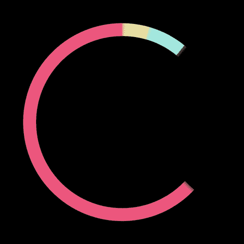
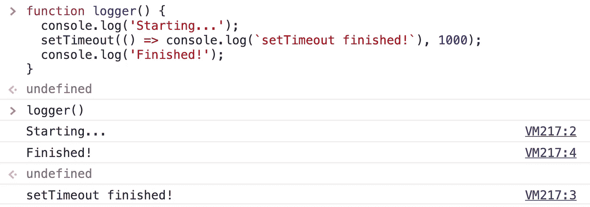
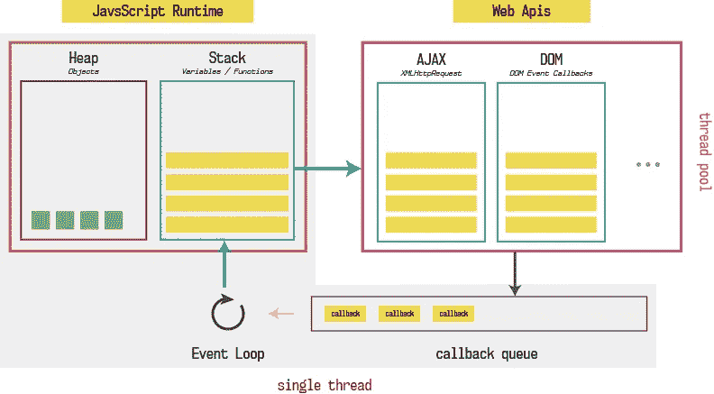

# 一圈又一圈的 JavaScript 循环

> 原文：<https://javascript.plainenglish.io/round-and-round-the-javascript-loop-7111e5cfa6ac?source=collection_archive---------4----------------------->



JavaScript 是单线程的，这意味着它一次只能做一件事。当你调用一个函数时，它被压入调用栈，当函数返回时，它被弹出栈。这个限制实际上是有帮助的，因为它允许您编写程序而不用担心并发问题。但是，由于它的单线程特性，您必须避免“阻塞”代码

```
function blocking () {
  while(true) {
    console.log('This goes on forever'
  }
}blocking()
```

当这个函数被同步调用时，它会阻塞主线程，因为函数永远不会解析。如果您在浏览器中运行这段代码，窗口将变得没有响应。这是因为主线程正忙于 while 循环，而且由于 JavaScript 只有一个线程，所以它不能一次处理多件事情。

现在让我们看一个更现实的例子，假设您正在对一个 API 进行 fetch 调用以检索一些数据。如果这个动作是同步发生的，那么在主 JS 线程等待从服务器返回数据的时候，我们的页面会有几秒钟没有响应，但是我们知道事实并非如此，那么 javascript 是如何处理异步任务的呢？

## Web APIS

浏览器由 JavaScript 引擎和许多其他应用程序组成，这些应用程序允许发送 HTTP 请求和监听 DOM 事件等多种功能。该功能通过 WebAPIs 向 JavaScript 公开

Web APIs 异步运行，这意味着它们可以在后台执行任务，并且保持主 JavaScript 线程畅通。完成任务后，web API 使用回调函数将数据返回到主 JavaScript 线程中。让我们看一个简单的例子

```
function logger() {
  console.log('Starting...');
  setTimeout(() => console.log(`setTimeout finished!`), 1000);
  console.log('Finished!');
}logger()
```

在浏览器中运行这段代码如下所示:



那么像 setTimeout 这样的函数是如何进入 Web API 领域，然后再回到 JavaScript 领域的呢？

## 事件循环

事件循环负责处理 JavaScript 线程上接下来运行什么代码。事件循环按顺序将函数调用逐个添加到调用堆栈中。看一下上面的例子，logger()函数将被推送到堆栈上。该函数首先调用 console.log，它将被推送到堆栈上，立即执行，然后弹出堆栈。接下来，setTimeout 函数被推到堆栈上，但是这次不是记录字符串“setTimeout finished！”setTimeout 函数通过 web API 异步发生，在返回主线程之前，它将等待 1000 毫秒。然后 JavaScript 将 setTimeout 弹出堆栈并调用最终的 console . log。logger()函数随后返回并弹出堆栈。该函数返回后，调用堆栈完全为空，事件循环将获取我们传递给 setTimeout 的回调函数，并将其推送到堆栈上。

## 消息(回调/任务)队列

当调用 setTimeout 时，浏览器将通过 web API 启动一个计时器，主线程上的代码执行将继续。当计时器到期时，传递给 setTimeout 的回调函数将被添加到消息队列中。一旦调用堆栈为空，事件循环就会查看消息队列，并检查是否有任何函数正在排队等待执行。如果它发现任何排队的回调函数，它将把它们推到堆栈上并执行它们。事件循环优先考虑调用堆栈，只在堆栈完全为空时查看消息队列。

这是浏览器整体外观的示意图:



## JavaScript 运行时可视化工具

为了进一步探索 JavaScript 在幕后做了什么，看看这个由菲利普·罗伯茨制作的叫做[放大镜](http://latentflip.com/loupe/)的工具。

如果你对这个话题感兴趣，想了解更多，请查看 JS CONF 的这些讲座:

[在回路中](https://www.youtube.com/watch?v=cCOL7MC4Pl0)

[到底什么是事件循环？](https://www.youtube.com/watch?v=8aGhZQkoFbQ)