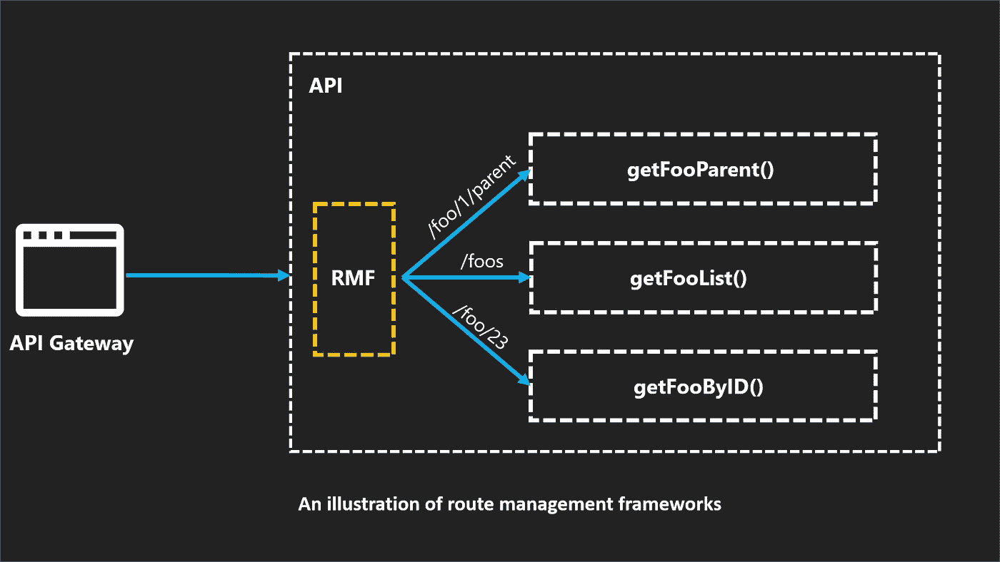

# AWS Lambda 和 Node JS 的路由管理框架

> 原文：<https://javascript.plainenglish.io/route-management-frameworks-for-aws-lambda-and-node-js-ab685aeec839?source=collection_archive---------4----------------------->

## NodeJS 开发人员在使用 AWS Lambda 构建无服务器 API 时可以利用的路由管理框架的完整列表。

A review of route management frameworks compatible with AWS Lambda & NodeJS

## 什么是路由管理框架？

大多数构建和交付生产软件的软件工程师都遇到了对路线管理框架的需求。这些框架的设计和构建是为了简化基于 NodeJS 的应用程序中的 REST APIs 的开发和管理。

Traditional route management framework inside an API application

路由管理框架最受欢迎的用途是，它们使我们能够**表达我们的**REST API**向消费方(web 应用程序、后端工作人员、客户应用程序)公开的路由**，并**为它们分配一个特定的执行逻辑**来处理我们的服务器收到的请求。

NodeJS 中一些最流行的路由管理框架有 Express JS、Restify、Fastify、Loopback、哈比神 JS、Koa、Loopback 等。

## 无服务器路由管理框架

为了减轻组织在采用基于无服务器开发时必须面对的学习曲线和迁移工作，不同的 RMF 框架提供了一种将现有应用移植到基于 lambda 的架构的方法，我们可以称之为无服务器路由管理框架。

Think of serverless route management frameworks as code-level routers running inside your lambda functions

现在我们对路由管理框架(RMF)有了更好的理解，我们可以开始探索哪些框架可用于基于无服务器的架构，以及它们的哪些特征使它们在选择过程中脱颖而出。

[https://www.npmjs.com/package/aws-serverless-express](https://www.npmjs.com/package/aws-serverless-express)

## [AWS 无服务器快递](https://github.com/awslabs/aws-serverless-express)

Express JS 多年来为 NodeJS 社区提供了很好的服务，并且在很长一段时间内一直是最受欢迎的 RMF。难怪 AWS 实验室为这个奇妙的框架搭建了路由框架。如果你有兴趣了解更多关于这个框架的知识，我最近写了一篇文章解释了使用它的利与弊。

**优势**

*   NodeJS 社区中的精英框架
*   它的流行使得雇佣开发人员变得更加容易
*   这个框架上的大量文章和示例项目
*   由 AWS 实验室构建，因此您可以确保其连续性
*   为具有 Express 背景的开发人员提供较低的学习曲线
*   适合现有工作负载的迁移
*   NPM 的强大使用指标(20 万以上)

**弱点**

*   异步/等待语法不流行
*   捕捉错误并不容易
*   建立在外部依赖之上，这会使框架膨胀
*   冷启动可能是一个挑战

[https://www.npmjs.com/package/lambda-api](https://www.npmjs.com/package/lambda-api)

## [Lambda API](https://github.com/jeremydaly/lambda-api)

在我们的无服务器 RMF 列表中，这是我个人最喜欢的，因为它在字节大小和功能集方面达到了完美的平衡。它也没有底层的依赖，这使得它没有依赖地狱的问题，比它的竞争对手更轻。

**趣闻:**是无服务器领域的勒布朗·詹姆斯([杰瑞米·戴利](https://medium.com/u/611b6bf539d2?source=post_page-----ab685aeec839--------------------------------))写的。如果你想为 AWS 构建令人敬畏的无服务器应用，我强烈推荐你去看看他的 Github 库和[播客](https://www.serverlesschats.com/)。

**强项**

*   独立&没有任何依赖性
*   适合绿地项目
*   圆滑而巧妙的 API 语法
*   本机异步/等待开箱即用
*   由[无服务器聊天](https://www.serverlesschats.com/)的[杰里米·戴利](https://medium.com/u/611b6bf539d2?source=post_page-----ab685aeec839--------------------------------)打造
*   在 NPM 有上升的使用趋势

**弱点**

*   Github 中的 14 个贡献者。如果你愿意做一些志愿者工作，这是你时间的一个很好的投资！
*   需要在迁移项目中利用学习曲线
*   与现有 rmf 的无服务器变体相比，迁移速度较慢

[https://www.npmjs.com/package/serverless-http](https://www.npmjs.com/package/serverless-http)

## [无服务器 HTTP](https://github.com/dougmoscrop/serverless-http)

无服务器 HTTP 是一个开源框架，它允许包装现有的 API 以供无服务器使用，而不需要任何重大的更改。

如果您正处于探索 API 迁移的可行性和影响的阶段，并且您的组织在不同的 rmf 上有现有的 API，那么该框架将通过减少研究和实现时间来积极地促进您的多样化 API 组合的迁移，这是由于不同 rmf 的标准化集成机制。

另一方面，我建议在决定成功与否之前，对你的 API 做一个负责任的、彻底的基准测试和行为检查。该框架以支持几个 RMF 框架而闻名，这意味着它可能包含一些与你不感兴趣的其他 rmf 相关的依赖。

**优势**

*   所有 rmf 中的 Jack(优秀的老式瑞士刀技术)
*   撰写本文时支持 3 个主要的老式 rmf(KOA、Connect、Express)
*   支持其他 7 个处于实验阶段的 rmf(Restana，Sails，哈比神，Fastify，Restify，波尔卡，Loopback)
*   NPM 的使用趋势正在稳步上升
*   有利于与其兼容的现有 API 的迁移
*   为熟悉所选 RMF 的开发人员提供了较低的学习曲线

**弱点**

*   对多个 rmf 的支持使它天生更重
*   搜索代码示例时的额外工作
*   由于代码库和依赖大小，冷启动可能是一个挑战
*   对于大多数绿地项目来说并不理想

[https://www.npmjs.com/package/lambda-serverless-api](https://www.npmjs.com/package/lambda-serverless-api)

## [Lambda 无服务器 API](https://github.com/blackflux/lambda-serverless-api)

这个 RMF 很有趣，因为它在 Github 中被记录为“AWS Lambda 和 API 网关的中间件”，我总是喜欢称它为 RMF，具有令人敬畏的 HTTP 动词支持、可爱的 API 和酷的集成。

**强项**

*   适合绿地项目
*   体面的 NPM 使用趋势
*   甜美光滑的 API
*   基于内存和 S3 的速率限制
*   大摇大摆整合

**弱点**

*   Github 的 9 名贡献者
*   比通常的 RMFs 更重，因为它依赖于 AWS SDK、Swagger
*   在迁移项目中使用时，预计学习曲线会更陡
*   与现有 rmf 的无服务器变体相比，迁移速度较慢
*   由于代码库和依赖大小，冷启动可能是一个挑战

[https://www.npmjs.com/package/hapi-lambda](https://www.npmjs.com/package/hapi-lambda)

## [哈比神拉姆达](https://github.com/carbonrobot/hapi-lambda)

就像 Express JS & KOA 一样，这是另一个无服务器实现，用于简化现有的基于 HAPI 的 API 工作负载到无服务器范例的迁移。与 Express JS 所能提供的相比，HAPI 拥有更多的内置 API(比如表单处理)。

**有趣的事实:** HAPI 最初是建立在 Express JS 之上的，由于 Express JS 的一些挑战，它被设计成独立的。它也是由沃尔玛为黑色星期五这样的特殊购物活动建造的。

**优势**

*   更容易迁移基于 HAPI 的 API
*   与 Lambda 函数入口点的简单集成
*   开发人员熟悉 HAPI 的组织适应/学习曲线较低

**弱点**

*   写作时不成熟
*   NPM 每周下载 87 次
*   Github 中的 18 颗星
*   由于 HAPI 的移植，冷启动可能是一个挑战
*   在绿地项目中使用稍微困难一些

[https://www.npmjs.com/package/aws-serverless-koa](https://www.npmjs.com/package/aws-serverless-koa)

## [AWS 无服务器 KOA](https://github.com/compwright/aws-serverless-koa#readme)

像 Express JS 一样，这是一个名为 KOA 的著名 RMF 框架的包装器，由 Express JS 框架作者构建，通过利用具有更好的错误处理的**async/await**语法**，设计得更具表现力、更小、更快。**

**强项**

*   与 KOA 的简单集成
*   更像是一个中间件，而不是 RMF
*   微小框架

**弱点**

*   写作时不成熟
*   ●Githubstar count(20 ATM！展示一些爱的家伙)
*   低 NPM 下载计数每周(330 atm！展示一些爱的家伙)
*   Github 中的 2 名贡献者

[https://www.npmjs.com/package/@midwayjs/faas](https://www.npmjs.com/package/@midwayjs/faas)

## midway js——一匹成长中的黑马

一个新生的基于打字稿的 RMF 来了。这个框架是由阿里巴巴&淘宝内部久经沙场的无服务器老手 Harry Chen 设计的！

让这个框架在竞争中大放异彩的是它的函数式语法，它刚刚在 Vue 3.0 语法中成为热门，并由 React hooks 进行了试点！

在其 mojo 之上，TypeScript 语法和函数式编程风格是很酷的特性，如 IOC & Decorators，这使它与基于新发布的 VueJS & React Hooks 构建的项目紧密结合！

**强项**

*   函数式编程语法
*   类型脚本支持
*   控制反转(IOC)
*   装饰语法
*   适合绿地项目
*   使用 VueJS 3 和 React 挂钩时，减少了所需的认知转换
*   极轻(65KB)
*   易于本地调用

**弱点**

*   这个月[刚刚发布了对 AWS 的支持](https://medium.com/@uplifted_latte_kangaroo_248/first-aws-lambda-function-with-midway-serverless-8d715e961b28)
*   在撰写本文时，需要赶上已发布的 rmf
*   与现有 rmf 的无服务器变体相比，迁移速度较慢

## 摘要

*   路由管理框架是 API 应用程序内部的代码级路由器
*   RMFs 在无服务器架构出现之前就已经存在了
*   rmf 有助于缓解组织在无服务器采用阶段的学习曲线
*   一些 rmf 通过提供开发人员熟悉的路由语法来简化迁移工作
*   一些 rmf 在绿地项目上的使用效果更好
*   我们认识了 7 个 rmf
*   我们已经看到了他们的优点和缺点
*   选择 rmf 应根据具体情况而定
*   一匹黑马以中途 JS 的形式到来！

## 下一步是什么？

本文中列出的优点和缺点纯粹是基于我对这些框架的观察和研究。为了更客观地比较这些 rmf，我们将对相关 KPI 进行数据驱动的分析，我将在我即将发表的文章中发布我收集的结果。