# Node.js/Express,的路由和中间件得到简化

> 原文：<https://javascript.plainenglish.io/routes-and-middleware-simplified-with-code-samples-node-js-express-a6c513f212e7?source=collection_archive---------5----------------------->

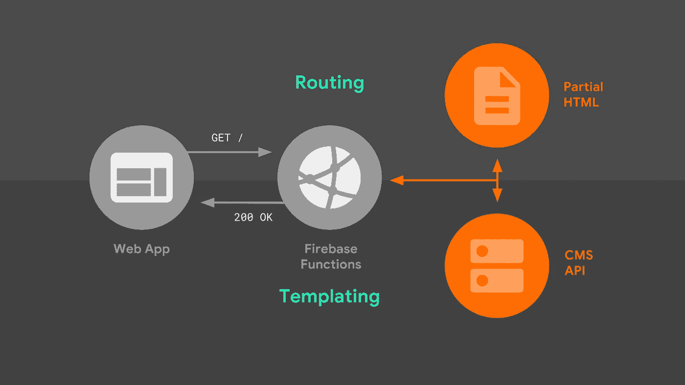

# 当你在应用中听到路由时，你会想到什么？

这是指应用程序如何使用特定的 http 请求方法(POST、PUT、DELETE 等)来响应客户端对特定端点的请求。)，你懂了吗？如果没有，不用担心…

简而言之，路由指的是应用程序如何通过特定的 HTTP 方法在特定的 url 或路径上运行

例如，假设您有一个 URL 为(http://mywebsite.com)的 3 页网站，它包括主页、联系我们页面和关于我们页面，

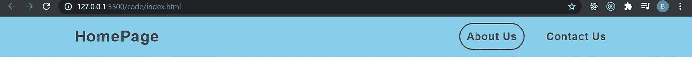

Just a simple header to display 3 links

这就是路由发挥作用的地方，对主页的 get 请求，即(http://mywebsite.com)，你打算用主页或登录页来响应，在那里你有这些花哨的旋转木马，所有这些都使它看起来很棒，不是吗？

Credit to @uiraygan on IG for the awesome UI design

但是对于 URL([https://ourwebsite.com/contact](https://ourwebsite.com/contact)美国)的 get 请求，显然我们打算用某种形式来响应，用户可以在其中输入详细信息，比如电子邮件、姓名和给我们留言

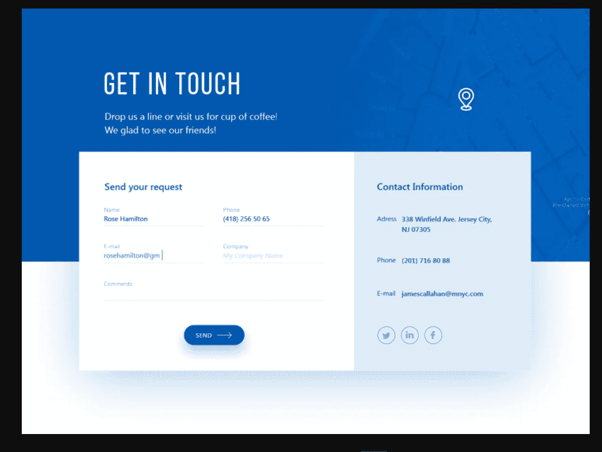

有了这个关于应用程序中路由的基本解释，我希望你明白我到底想表达什么…是的！

## 现在让我们看看如何通过代码示例(Node.js/express)使用不同的 HTTP 方法创建简单的路由

在我们继续之前，请确保您已经安装了 [node js](https://nodejs.org/en/) 和 [postman](https://www.postman.com/) ，您可以点击链接从他们的官方网站下载，我们将使用 postman 通过 HTTP POST 方法测试我们的路由

假设我们在端口 8080 上运行了一个非常简单的 express 应用程序

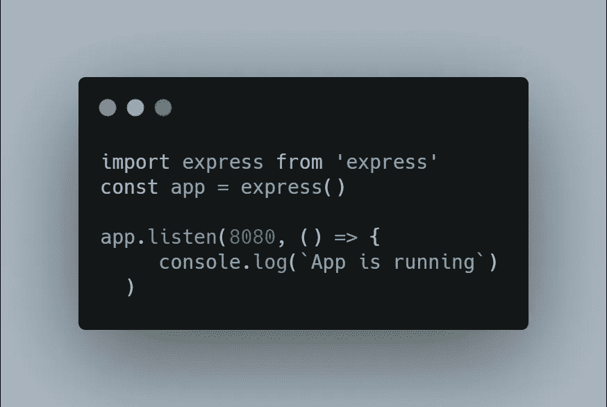

注意:我可以通过在我的 package.json 文件中添加“type”:“module”来使用 Es6 语法。

现在，在 express 应用程序中定义路线的语法包括

app.method(路径，回调)

其中方法是指 HTTP 方法/动词(get、post、put 等。)要应用，path 是指请求将应用的路由或 URL，callback 也是当 http 方法的请求命中 path 时将运行的函数或中间件(下面解释)。

考虑向路由"/"发出 get 请求，如下所示

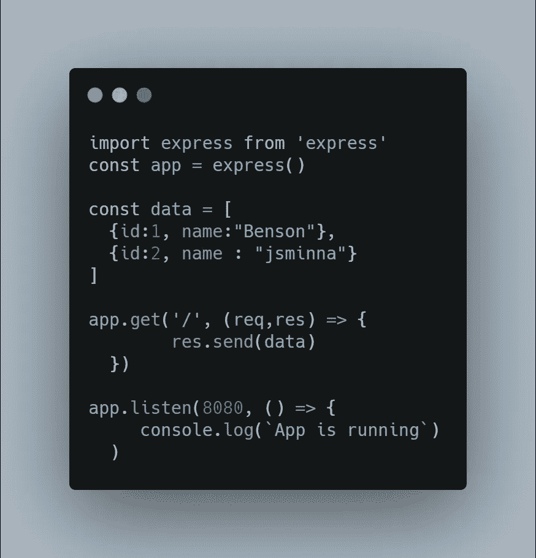

get request to the route (‘’/”)

注意，回调函数接受两个参数，即请求和响应，它还接受一个可选的第三个参数(函数),当有另一个中间件运行时调用该参数

不要担心，我们将很快研究中间件

启动服务器并导航到 [http://localhost:8080/](http://localhost:8080/)

万岁！！！您刚刚创建了您的第一条路线，您应该会得到如下回应

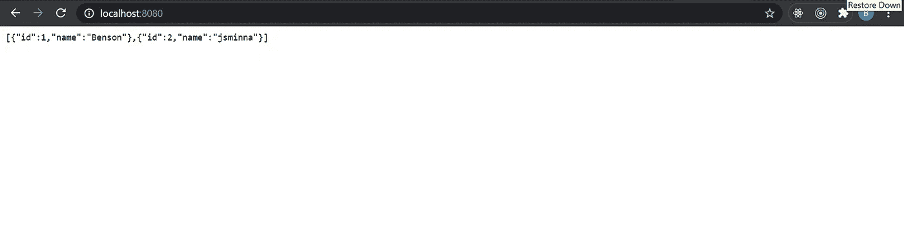

您应该会看到与上面相同的响应，也就是说，这意味着它已经成功地向“/”发出了 get 请求，同时，让我们尝试以“http://localhost:8080/contact us”的形式向联系人页面发出 get 请求

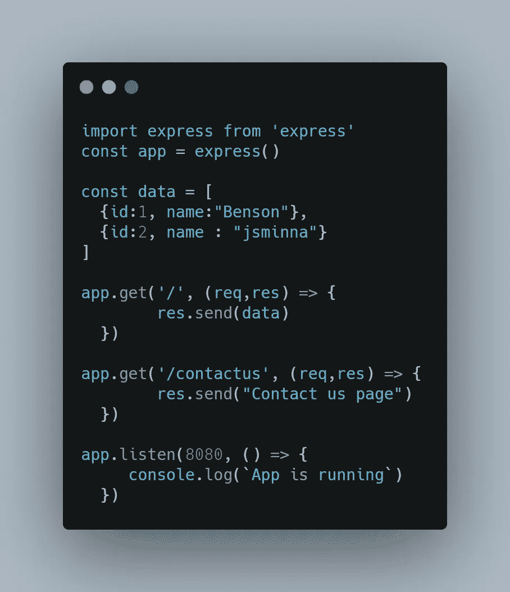

启动服务器并导航到[http://localhost:8080/](http://localhost:8080/)contact us，您应该得到如下响应

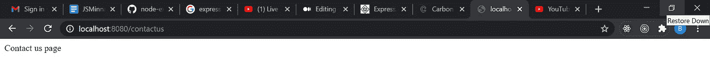

用这个简单的路由解释，希望你爱，留点爱…

# 什么是中间件？

中间件功能是可以访问请求和响应对象以及应用程序的请求-响应周期中的下一个中间件功能的功能…..你还是不明白吗？别担心…

简而言之，顾名思义，“中间”，这是一个在服务器收到请求和服务器向客户端发送响应之间运行的功能或程序。

有两种主要类型的中间件，即全局中间件(这是一种可以被应用中的所有路由访问的中间件，因此其名称为“全局”)和特定中间件(这是一种仅应用于特定路由的中间件)

在 express 应用程序中使用全局中间件利用了语法 app . use(middleware)；

需要注意的一点是中间件是按照它们被定义的顺序运行的(一个接一个)，不要担心我们很快就会看到代码样本。

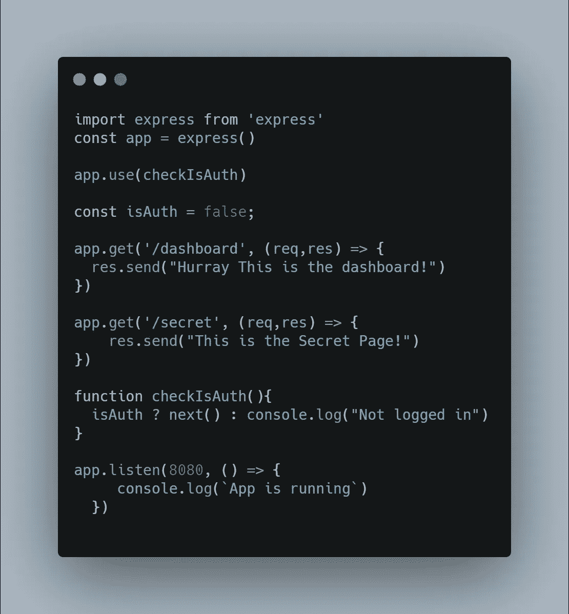

从上面的代码示例来看，checkIsAuth 是一个全局中间件(适用于所有路由),它在访问路由之前检查用户是否通过了身份验证，

当我启动服务器并导航到(http://localhost:8080/secret)…我将无法访问该页面，而是以“未登录”的状态登录到控制台，因为“中间件”会检查我是否通过了身份验证。

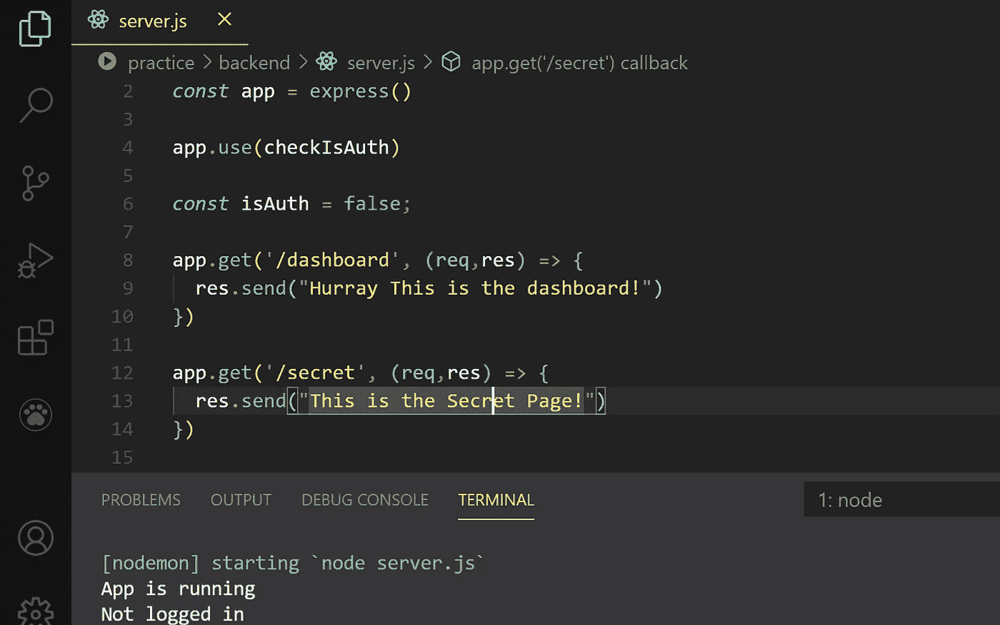

但是当 isAuth 标志设置为 true 时，我现在可以访问所有其他路由。

现在让我向您展示一个“中间件按照定义的顺序运行”的好例子

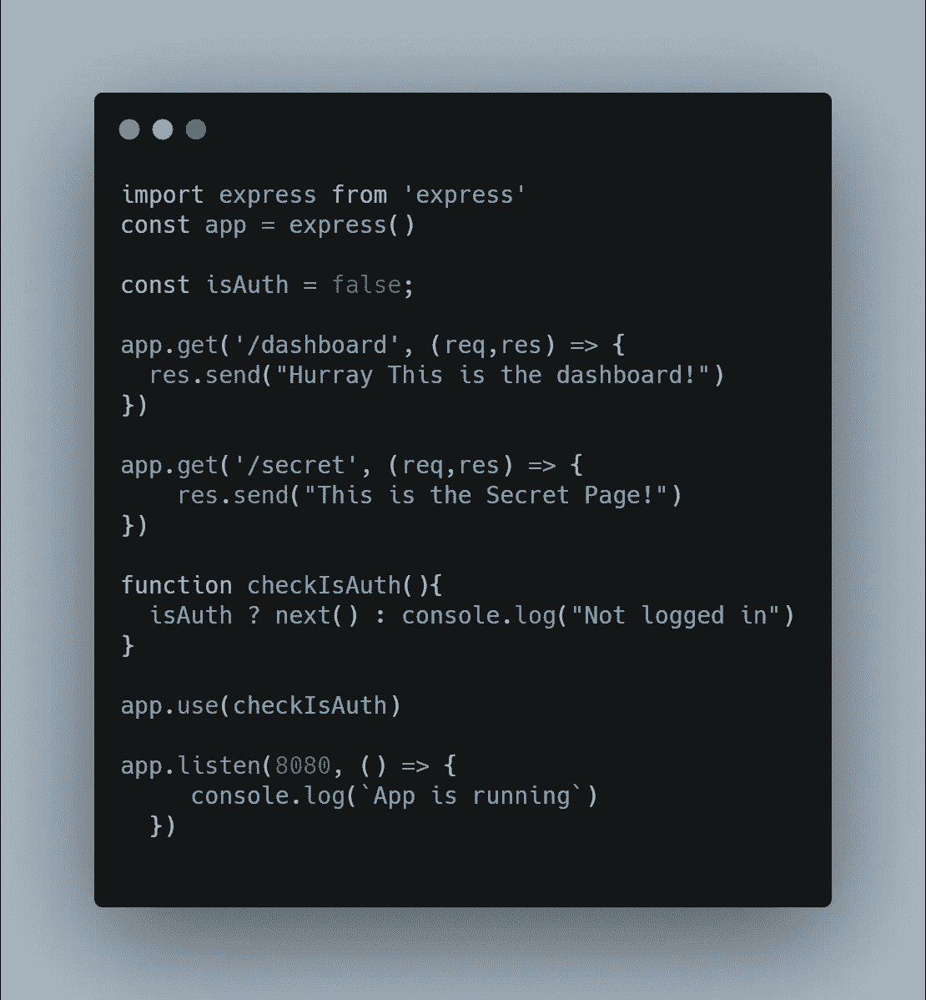

注意中间件应用在哪里(app.use(checkIsAuth))？它出现在所有其他路由之后，现在即使 isAuth 标志为假，我仍然可以在应用中间件之前访问所有秘密路由！！！。

例如，当我导航到(http://localhost:8080/secret)时，我可以访问该页面。

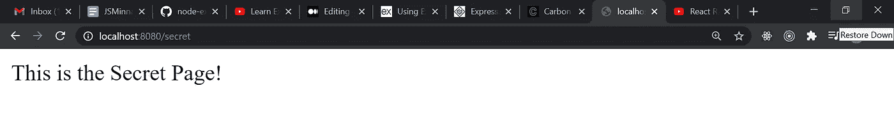

这就是为什么最好将所有全局中间件放在任何路由之前。