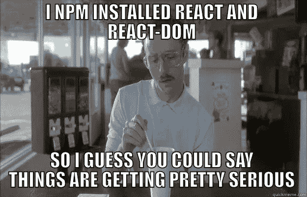
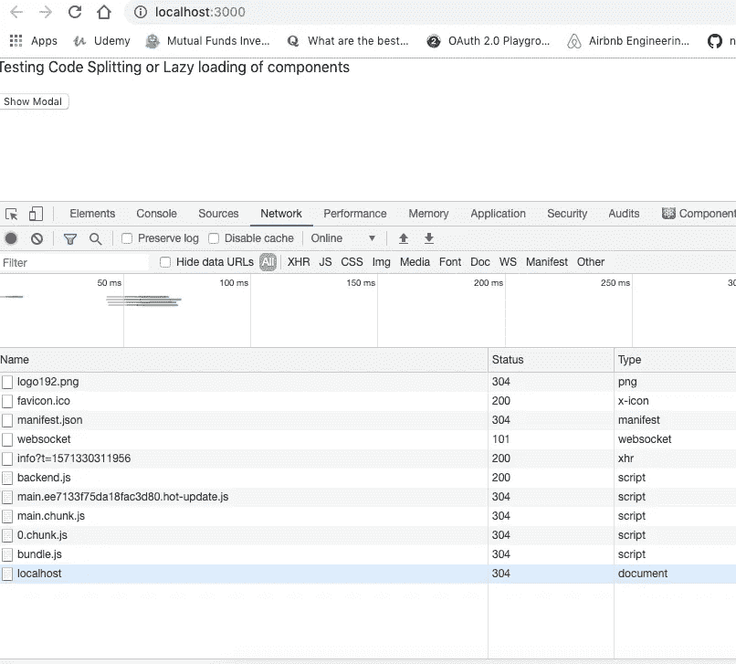
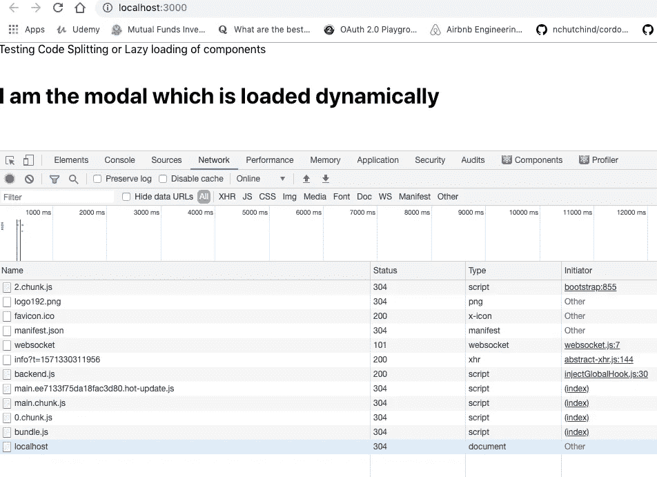

# 使用 React 进行路由和组件级代码拆分

> 原文：<https://javascript.plainenglish.io/routing-and-component-level-code-splitting-with-react-5f2e4fc86532?source=collection_archive---------1----------------------->



在进入 React 应用程序中对组件进行代码拆分的实际部分之前，让我们首先尝试理解什么是代码拆分，以及为什么我们应该在组件级别对应用程序进行代码拆分。

代码分割是一种基于事件延迟呈现组件的方法。例如，我们希望显示一个基于按钮点击的地图视图(这是一个组件)，并且每当我们点击按钮时，地图视图应该呈现。一般来说，如果我们不进行代码拆分，那么每当我们渲染父组件时，地图视图也会渲染，如果我们的应用程序增长，而我们没有对组件进行代码拆分，这会导致不必要的延迟。

为了解决这个问题并优化 React 应用的性能，我们从路由器级别和组件级别对组件进行了代码拆分。

# 1.路由器级代码拆分:

假设我们的应用程序中有一个路由级别:

Home About **Settings-** 其中 Settings 是最重的路线，我们不应该在每次单击 Home 或 About 时渲染设置。设置应该在我们单击该路线时渲染，并在第一次单击时缓存，以便它不会在再次单击时重新渲染。下面的代码将演示我们应该如何在路由器级别进行代码拆分。

Code splitting at the Route Level

但是我们应该记住，路由器级别的代码分割是防止应用程序变慢的第一道防线。我们肯定应该遵循这种方法，但最重要的部分是组件级的代码拆分，以便在特定的路由中，需要有条件呈现的组件在路由加载时不会被加载。它应该只在通过点击按钮或任何事件满足条件时加载。因此，让我们看看我们应该如何在组件级别进行代码拆分，以在 React 应用程序中获得最佳性能。

# 组件级代码拆分:

下面的代码演示了如何有条件地呈现一个模态视图，并在动态导入的帮助下，基于按钮点击来呈现它。

Component Level Code Splitting

当应用程序加载时，模态组件不会呈现。从下面的 network 选项卡中可以看到，只生成了一个 chunk.js 文件。



App Component loads without loading the Modal Component



Clicking on button 2.chunk.js i.e Modal component renders

> 现在让我们看看如何对模态分量进行代码拆分:

首先，我们在初始状态下将模态的状态保持为空。然后，在点击按钮时，我们将进行动态导入(【https://javascript.info/modules-dynamic-imports】T2)，只有当按钮被点击时，我们才会导入 Modal.js，而不是在组件渲染上，或者作为普通导入，我们在组件顶部导入所有元素。

```
showLocation = () => {    
import('./components/Modal')      
.then((mod) => this.setState(() => ({        
  modal: mod.default      
})))}
```

这里，我们导入 modal.js 文件，该文件返回一个承诺，在响应中，我们更新状态，该状态接受一个回调函数并将 Modal 值设置为 mod.default，因为 Modal 组件是默认导出。

在 JSX，我们将像这样渲染组件:

```
render() {     
const { modal: Modal } = this.state;     
return (      
<>      
<div>Testing Code Splitting or Lazy loading of components</div>      <br></br>        
{Modal !== null ?          
<Modal />          
:          
<button onClick={this.showLocation}>            
Show Modal          
</button>        
}      
</>    
)}
```

当模态为**不等于 null** (initialState)时，当我们单击按钮并更新其状态时，我们应该呈现模态。或者我们应该呈现按钮。

感谢阅读！如果你有任何问题，请随时联系 rajrock38@gmail.com，通过 [LinkedIn](https://www.linkedin.com/in/rajdeepcoder/) 联系我，或者通过 [Medium](https://medium.com/@rajrock38) 和 [Twitter](https://twitter.com/rajrock38) 关注我。

如果你觉得这篇文章很有帮助，给它一些掌声会很有意义👏并分享出来帮别人找！并欢迎在下方发表评论。