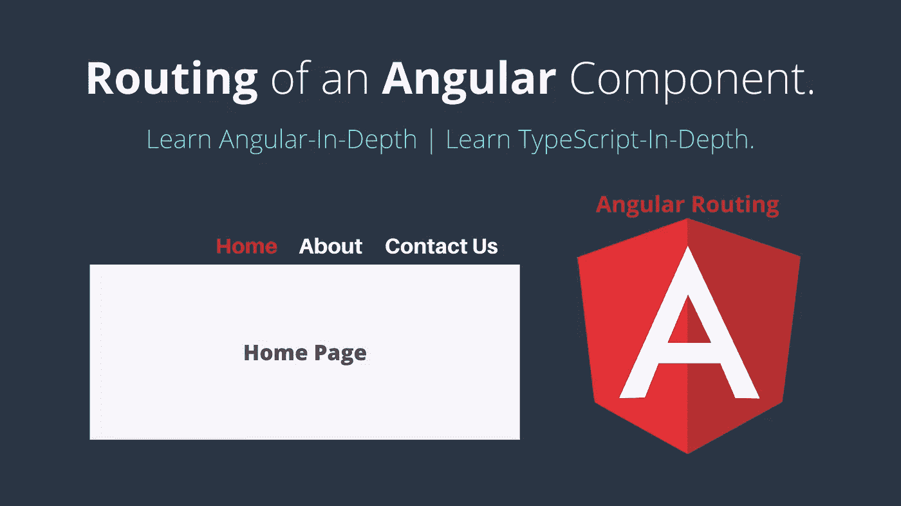

# 角度组件的布线|角度布线。

> 原文：<https://javascript.plainenglish.io/routing-of-an-angular-component-angular-routing-2b7e53046542?source=collection_archive---------1----------------------->

[](https://medium.com/codechintan/everything-you-need-to-know-about-angular-framework-typescript-10049b858ae0) [## 关于 Angular framework/TypeScript 你需要知道的一切。

### 完整的角度系列-什么是角度/类型脚本？|为什么我们需要有棱角？|使用 Angular 的好处？|…

medium.com](https://medium.com/codechintan/everything-you-need-to-know-about-angular-framework-typescript-10049b858ae0) 

**路由是指从一个页面移动到另一个页面。** ****当用户点击我们提供的导航链接时，可以从一个视图导航到下一个视图。****

**像`Home`、`About`、`Contact-Us`都是我们在任何网站上常见的链接例子。现在，假设用户在`Home`页面，当用户点击将我们导航到`About`页面的`About`按钮(链接)时，意味着它向我们显示了`About`页面的内容，同样如此。**

**只要用户点击浏览器的后退和前进按钮，浏览器就会在我们看过的历史页面中来回导航。**

# **角度路由器**

**`@angular/router`是由 Angular 核心团队构建和维护的 JavaScript 包。角路由器是角平台的核心部分。它使开发人员能够构建具有多个视图的单页面应用程序，并允许在这些视图之间导航。**

*   **它提供了具有多个**路由器出口**可能性。**
*   **不同的路径匹配策略。**
*   **轻松访问路线参数。**
*   **设置防护装置，防止未经授权的人员进入组件。**

# **#1 路由器出口**

**`[Router-Outlet](https://angular.io/api/router/RouterOutlet)`是路由器库`@angular/router`中的一个指令。基于当前浏览器的 URL 路径，组件被插入到`<router-outlet>`中。**

**假设我们有一个`about`的路由👇👇**

```
{ path: 'about', component: AboutComponent }
```

**现在，当用户打开`localhost:port/about` URL 时，`AboutComponent`将被插入到`<router-outlet>`中。这个`<router-outlet>`是一个 HTML 标签，我们可以像这样把它粘贴到`app.component.html`中👇👇**

```
<router-outlet></router-outlet>
```

**在我们的 Angular 应用中，我们可以有多个出口，这使我们能够实现高级路由场景。**

**(向下滚动阅读更多关于多个出口和辅助路线的信息)**

# **#2 路线匹配策略**

**`RouterModule.forRoot(routes)`方法用于将用户导航到特定视图。我们可以有多条这样的路线👇👇**

*   **我们也可以让**空路径**表示应用程序的默认路径。应用程序启动时打开，例如`localhost:port/`或`[http://www.codewithchintan.com](https://www.codewithchintan.com/)`**
*   **`:id`是一个**路由参数**的令牌。在像`/user/31`这样的 URL 中，“31”是`id`参数的值。相应的`UserDetailComponent`将使用该值来查找并显示`id`为 31 的用户详细信息。**

*   ****通配符**字符串(`**`)在这个路径中可以采用任何字符串，当请求的 URL 与定义的路由的任何路径都不匹配时，就会调用这个函数。这可用于显示“未找到页面”视图，或者在未找到匹配时重定向到特定视图。**

# **#3 路线守卫**

****Route-Guards 允许或拒绝用户访问路线页面。****

*   **这在有登录/注销场景的应用程序中非常重要。我们可以很容易地管理哪些页面允许登录用户，哪些页面允许未登录用户。**
*   ****“路线卫士”是一个重要且相当“实现的部分”**这就是我们在另一篇文章中讨论这个主题的原因。阅读此处了解[如何实现路线守卫](https://www.codewithchintan.com/angular-route-guards/) ( [点击此处👆](https://www.codewithchintan.com/angular-route-guards/))**

# **#4 导航指令**

**`routerLink`是一个创建导航链接的指令，这个指令采用相关的路径并导航到组件。例如:**

```
<a [routerLink]="'/about'">About Us</a>
```

**角度路由器匹配路由中的该路径，并把我们带到匹配的组件:(在本例中`/about`这将把我们带到`AboutComponent`👇👇)**

```
{ path: 'about', component: AboutComponent }
```

# **#5 多个出口和辅助路线**

**我们可以在同一个应用中有多个插座，如下所示:👇👇
(这个`<router-outlet>`是一个 HTML 标签，我们可以把它粘贴到`app.component.html`或者其他类似的组件中👇👇)**

```
<router-outlet></router-outlet>  
<router-outlet name="outlet2"></router-outlet>
```

**一个组件有一个主要路线，我们可以有辅助路线。
辅助路线使开发者能够同时导航到多条路线。**

**我们需要命名一个路由器出口来创建一个辅助路由**，然后**将显示与辅助路由相关的组件。**

*   **没有名称的插座是主插座。**
*   **除主插座外，所有其他插座都必须有名称。**

**接下来，在路由器导航中，我们需要指定插座属性，如下所示:**

```
{ path: 'about', component: AboutComponent, outlet: 'outlet2' }
```

# **#6 最终代码**

## **#6.1 创建路由模块**

**我们将创建路由模块。
打开您的`src/app/app-routing.module.ts`文件，并更新如下:**

## **#6.2 导入路由模块**

**接下来，我们需要将这个路由模块导入到主 app 模块中。
打开您的`src/app/app.module.ts`文件，并更新如下:**

## **#6.3 添加路由器出口**

**最后一步是添加路由器出口。
打开您的`src/app/app.component.html`文件(包含主应用程序模板)并添加`<router-outlet>`组件。更新如下:**

```
<router-outlet></router-outlet>
```

**角度布线器用在你的布线中匹配的组件替换这个`<router-outlet></router-outlet>`。**

```
{ path: 'about', component: AboutComponent }
```

**所以，在上面的例子中，当用户打开`/about`页面时，`<router-outlet></router-outlet>`标签被`AboutComponent`的模板替换。**

# **#7 路由重定向**

**我们也可以重定向到另一条路线，这就是我们可以做到的👇👇
(我们可以将`path`留空，也可以指定`path`值)**

```
{ path: '', pathMatch: 'full', redirectTo: 'contact-us' }
```

**这里我们想要匹配精确的空路径，这就是为什么我们指定了**满**匹配策略。**

# **结论**

*   **首先我们了解一下'**角路由器'。****
*   **然后讲述了**路由器出口的概念。****
*   **然后是**路线匹配策略。****
*   **然后是**路线守卫。****
*   **然后是**导航指令。****
*   **然后**多个网点和辅助路线。****
*   **最后，**最后的代码。****
*   **我们还可以做**路由重定向。****

> **搞定了。🤩“角度组件的路由”这个概念非常简单。**
> 
> **再见👋👋**
> 
> **请在评论框中随意评论…如果我错过了什么，或者什么是不正确的，或者什么对你不起作用:)**
> 
> **更多文章敬请关注:
> [https://medium.com/@AnkitMaheshwariIn](https://medium.com/@AnkitMaheshwariIn)**

**如果你不介意给它一些掌声👏 👏既然有帮助，我会非常感谢:)帮助别人找到这篇文章，所以它可以帮助他们！**

**永远鼓掌…**

****

***原载于 2019 年 12 月 27 日*[*【https://www.codewithchintan.com】*](https://www.codewithchintan.com/angular-routing/)*。***

# **了解更多信息**

**[](https://www.codewithchintan.com/crud-in-firebase-with-firestore/) [## 如何用 Firestore 在 Firebase 中进行 CRUD 与查询操作？(角形/离子形/网状)

### 额外收获:你将学会创建角度模型、服务和组件]。CRUD -创建、读取、更新、删除操作在…

www.codewithchintan.com](https://www.codewithchintan.com/crud-in-firebase-with-firestore/) [](https://www.codewithchintan.com/javascript-callbacks-promises-async-await/) [## 使用' Promises' | Async/Await |代替 JavaScript 回调。

### 我们应该使用允许我们访问异步方法并将值返回给同步方法的承诺。还有…

www.codewithchintan.com](https://www.codewithchintan.com/javascript-callbacks-promises-async-await/) [](https://www.codewithchintan.com/two-way-data-binding-in-angular/) [## Angular 中双向数据绑定的背后是什么？

### 数据绑定允许组件和 DOM (HTML 模板)之间的通信。数据绑定有四种形式…

www.codewithchintan.com](https://www.codewithchintan.com/two-way-data-binding-in-angular/) [](https://www.codewithchintan.com/angular-async-pipe/) [## Angular:使用异步管道来管理可观察的订阅并防止内存泄漏。

### Async-Pipe 是一个 Angular 内置工具，用于管理可观察订阅。我们可以轻松简化的功能…

www.codewithchintan.com](https://www.codewithchintan.com/angular-async-pipe/) [](https://www.codewithchintan.com/angular-route-guards/) [## 使用角形护线板保护角形页面。允许/拒绝/重定向。

### 路由保护是 Angular 路由器的一个重要功能，它允许或拒绝用户访问路由页面…

www.codewithchintan.com](https://www.codewithchintan.com/angular-route-guards/) [](https://www.codewithchintan.com/angular-routing/) [## 角度组件的布线|角度布线。

### 路由意味着从一个页面移动到另一个页面。角度使用户能够从一个视图导航到下一个视图…

www.codewithchintan.com](https://www.codewithchintan.com/angular-routing/)**