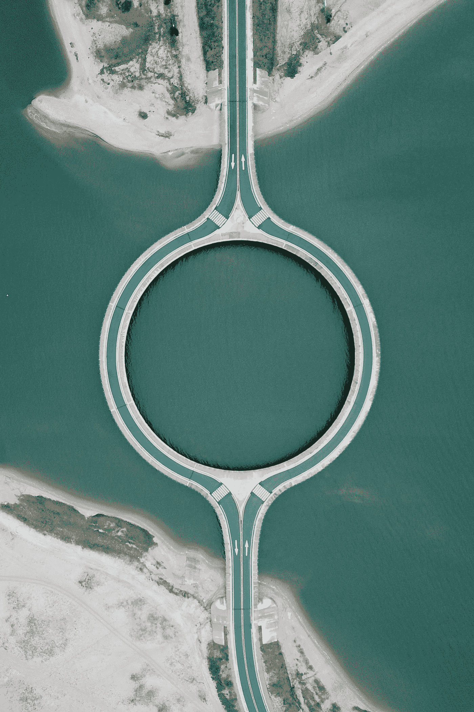

# Vue.js 中的布线—入门指南

> 原文：<https://javascript.plainenglish.io/routing-vue-js-starting-guide-81a8f39c5222?source=collection_archive---------2----------------------->

## java 描述语言

## 在 Vue.js 中设置路由所需的一切



Photo by [Tincho Fernandez](https://www.pexels.com/ru-ru/@tincho-fernandez-2641571?utm_content=attributionCopyText&utm_medium=referral&utm_source=pexels): [Pexels](https://www.pexels.com/ru-ru/photo/4220739/?utm_content=attributionCopyText&utm_medium=referral&utm_source=pexels)

随着 web 应用程序的出现，有必要使用 JavaScript 修改 URL。 [**浏览器的历史 API**](https://developer.mozilla.org/en-US/docs/Web/API/History_API) 来救场了。

因此，所有主要的现代框架都允许您以编程方式控制路由，从而使 URL 与应用程序视图同步。

对于 Vue 应用程序中的路由，您可以使用历史 API 创建自己的集成，但最好使用官方的 Vue 库— [**Vue-Router**](https://router.vuejs.org/)

# 基本的东西

您甚至可以通过 CDN 安装开始使用它:

`**<script src="https://unpkg.com/vue-router"></script>**`

但是我们将从*【正确】*选项开始— **Vue Cli** :

```
**yarn global add @vue/cli**# OR**npm i -g @vue/cli**
```

让我们使用 VUE CLI 和一个基本模板创建一个项目—默认([Vue 2] babel，eslint):

`**vue create vue-router-test-app**`

# 最低配置

添加路由器:

```
**yarn add vue-router**# OR**npm i --save vue-router**
```

让我们将最小路由器配置添加到 **/src/main.js** :

Routes 是一个数组，数组中的每个元素都是一个对象，你需要在这里指定`path`和`component`。

要查看更改，您需要显示路由器组件— `routerView`，它负责显示。为此，让我们更改 **/src/App.vue** :

现在，去***http://localhost:8080/***。我们将看到一个带有**"/**route 的页面，其中显示了 **HelloWorld.vue** 组件，而不是我们在 App.vue 中编写的标签`router-view`。

# 路径层次结构

让我们给 **main.js** (数组`routes`)添加一个路由:

我们去地址***http://localhost:8080/***板。我们将看到显示渲染功能的第二个页面。

# 路线道具

让我们为 **main.js** 中的***/****板卡*走线确定子走线。对于子组件，您需要指定在父组件中的什么地方显示子组件`router-view`。在我们的例子中，这是在渲染函数中:

让我提醒你，模板视图中的渲染函数看起来像这样:

```
<template>
  <div>
    Board Page
    <router-view />
  </div>
</template>
```

让我们创建一个***/src/components/board . vue****组件，内容为:*

*让我们转到地址**http://localhost:8080/board/21**，看看父组件和子组件`Board`传递的参数`id`等于 21。*

*通过组件`this.$route.params`可获得路线参数。*

*如果我们想更明确地显示组件对输入参数的依赖性，我们在配置路线时使用设置`props: true`:*

*并且在***/src/components/*board . vue**组件中，接受`id`作为组件的输入参数:*

# *路由元*

*我们现在可以从 **HelloWorld.vue** 组件访问路线元数据，如下所示:`this.$route.meta.dataInMeta`。*

# *更深的 Vue.js 路由(嵌套子节点)*

*您可以更深入地研究子组件(直到服务器限制)。*

*让我们为子路由创建一个子路由:*

*render 函数现在被写成一个常规函数，因为您需要一个组件上下文:*

*我们像普通组件一样通过路由器视图组件将参数传递给子组件的子组件。这听起来很复杂，但很直观。所以，我们降低了孩子的道具——孩子的孩子:`**<router-view :prop-to-child="parseInt(id)" />**`*

# *路径的解释*

*视图`path: "child"`意味着我们引用父路径并继续它的路径:`{parent-route}/child`*

*可以从子组件中引用路线的任何其他级别:*

*这个条目处理一个地址为:***http://localhost:8080/一级*** 的页面。*

# *更宽的 Vue.js 路由(多路由器视图)*

*可以在一个组件中使用多个`router-view`。为此，在 routes 配置中，我们编写了 component - components，它接受一个对象，其中键是属性`name``router-view`。如果您指定键“default ”,那么如果该组件未被`router-view`命名(没有属性`name`),则将显示该组件。*

***/src/main.js** :*

***/components/board . vue**T36:*

*我们去地址:***http://localhost:8080/board/23/child***看一个切换主动路由器的小互动——views。*

# *404 错误页面*

*要创建错误页面，只需将以下结构放在路由列表的末尾:*

*现在，当跟随一个不存在的路径(例如，***http://localhost:8080/mission***)时，会显示一个错误组件。*

*最好用这种形式写:*

*现在我们有了一个错误页面，我们可以问心无愧地重定向用户(如果有一天我们需要这么做怎么办)。*

# *路线保护*

*使用路由元数据和`beforeEach`路由器挂钩执行路由保护:*

*现在，当试图访问需要授权的页面时，我们将被重定向到***/需要授权的*** 页面。*

# *路线之间的导航*

# *软件导航*

*可以从应用程序中的任何地方调用编程导航，如下所示:*

*`**$router.push('/dash/23/child')**`*

*如果我们想要传递参数，我们需要使用基于路由名称的不同方法。*

*让我们指定路线的名称`/board/:id`:*

```
*...
   children: [
      {
        path: "/board/:id",
        name: 'board',
        component: Board,
        props: true,
        children: [
   ....*
```

*现在我们可以传递参数:*

*`**$router.push({ name: 'board', params: { id: 100500 }})**`*

*我们将得到一个错误无效属性:属性 id 的类型检查失败。应为值为 100500 的字符串，但得到值为 100500 的数字。*

*原因是`url`——它始终是一个数据类型`String`，我们用类型`Number`编程传递了它`id`。修复很简单:我们在组件中列出可能的数据类型。*

****组件/Board.vue*** *:**

# *路由器链接组件*

*组件`routerLink`允许您在站点内创建链接，这些链接被转换成“本地”浏览器链接(标签`<а>`):*

*`**<router-link to='/dash/23/child'> Link </router-link>**`*

*可以将类自动添加到这样的链接中:*

*   *`router-link-exact-active` **-** 完全匹配；*
*   *`router-link-active` -部分(在`to` route 属性中指定的子组件是活动的)。*

*为了不显示活动的父类，只需编写属性`exact`:*

*`**<router-link to='/dash/23/child' exact> Link </router-link>**`*

*我们可以覆盖我们创建的元素:*

*`**<router-link tag="button" to='/dash'> Button </router-link>**`*

*不幸的是，在这种情况下，类没有被分配。*

*我们也可以传递一个对象:*

*`**<router-link :to="{ path: '/dash/23' "> Link </router-link>**`*

*`**<router-link :to="{ name: 'board', params: { id: 123 } }"> Link </router-link>**`*

# *最佳实践*

*我们将在这一部分致力于重构我们上面写的内容。*

*为路由器创建一个文件夹结构:*

```
*src/router/router.js
src/router/routes.js*
```

*让我们把所有与路由器设置相关的东西转移到 **router.js** :*

*我们把 routes.js 和路线设置有关的一切都传过来。*

*并立即将导入替换为动态导入。*

*如果您已经分配了许多路线，手动更改可能会非常耗时。常规将有助于:*

*`**^import (\w+) from (".+")$**`*

*替换为*

*`**const $1 = () => import(/* webpackChunkName: "$1" */ $2)**`*

*现在，在 Chrome Dev Tools 的 Network 选项卡中，您将看到何时从网络中加载了哪个组件，而之前所有的路由都是立即加载到 1 兆包中的。*

****/src/router/routes . js****:**

# *Vue.s 路由中的高级技巧*

*“高级”意味着使用它们的“愉悦”。例如，这些技术包括以下主题:*

*   *按访问级别划分权限；*
*   *页面之间过渡的动画；*
*   *路由切换时的负载指示；*
*   *在路由之间切换时更改标题；*
*   *向后移动时在页面上平滑滚动；*
*   *等等。*

*一切正常。*

# *按访问级别划分权限*

*有一种情况是用户有两种以上的状态:不仅是授权，还有其他状态。例如，付费订阅。从现在开始，我们考虑无限级的权利分离。这只用了几十行代码就完成了，但是为了简洁、方便和避免重复劳动，我们将使用一个现成的库。让我们安装它:*

```
***yarn add vue-router-middleware-plugin***
```

*让我们创建特殊的中间件文件来检查用户权限:*

****路由器/中间件/认证中间件. js*** *:**

****路由器/中间件/guest middleware . js****:**

****路由器/中间件/订户中间件. js*** *:**

*最后一个清单展示了一个异步检查的例子，这意味着您可以访问存储的动作并向服务器发出请求。*

*现在，让我们对所有路由进行授权检查，然后我们将对一些路由进行例外处理:*

****/src/router/router . js***:*

*现在我们来处理一下具体的路线。*

*让我们致力于应用程序的架构，使其更可预测。让我们制作一个单独的 Auth.vue 模板并把它放在 pages 中，在那里使用的组件，即在 ***/auth*** 部分，把组件放在适当的部分。*

*因此获得了方便的结构:*

```
*pages
--Auth.vue
components
-- auth
---- Login.vue
---- Register.vue
---- Forgot.vue*
```

*让我们创建一个助手函数来生成这样的路线`genAuthRoutes`。*

****/src/路由器/routes.js*** *:**

*我们移除属性`ignore`中的全局授权检查，并在`attach`对象属性`meta.middleware`中添加另一个检查:*

```
*middleware: {
    ignore: [authMiddleware],
    attach: [guestMiddleware], 
 }*
```

*让我们创建组件:*

*   ***/src/components/auth/log in . vue**；*
*   ***/src/components/auth/register . vue**；*
*   ***/src/components/auth/forget . vue**，*

*对于典型的模板:*

```
*<template>
  <div>
    Forgot Page
  </div>
</template>*
```

*我们还将重构页面`Board`，姑且称之为`MainBoard`*

****/src/pages/main board . vue****:**

*相应地，我们将组件添加到组件中的适当类别:*

****/src/components/board/board component . vue****:**

*剩下的就是重构主要组件——***/src/app . vue***:*

*现在，取消选中“已登录”，尝试按照路线***http://localhost:8080/board***。我们将立即被重定向到**“需要授权”**页面。*

*勾选**“已登录”**，取消勾选**“已许可”**，导航至***http://localhost:8080/board/33/child***。我们将被带到许可证页面，但是，如果您取消选中**“已登录”**并刷新页面，我们将返回到**“需要授权”**页面。*

*现在让我们检查当用户已经被授权时是否有可能进入授权页面。勾选**“已登录”**框，转到**http://localhost:8080/auth/register**。我们将被重定向到主页。*

# *页面之间过渡的动画*

*很简单。我们包装主要的`RouterView`动画组件`transition`并添加样式:*

# *路径切换时的负载指示*

*这也很容易。安装**程序库:***

```
*yarn add nprogress*
```

*添加到***/src/router/router . js***:*

# *在路线之间切换时更改标题*

*这也很简单。*

*我们填写`meta.title`路线，并把`document.title`每页放在`beforeEach`钩里:*

# *向前/向后移动时在页面上平滑滚动*

*当您按下浏览器的“系统”按钮后退或前进时，浏览器会记住滚动位置并返回。我们可以重复这种行为:*

# *阅读更多*

**如果您觉得本文有帮助，请点击💚或者👏按钮或分享关于脸书的文章，这样你的朋友也可以从中受益。**