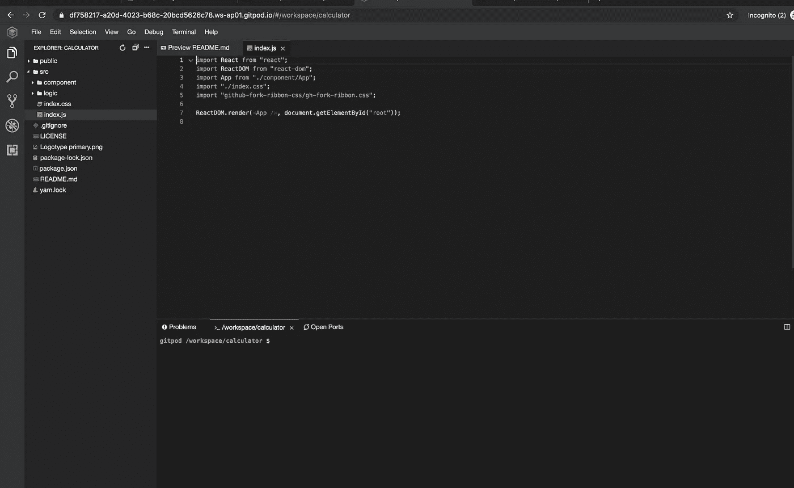
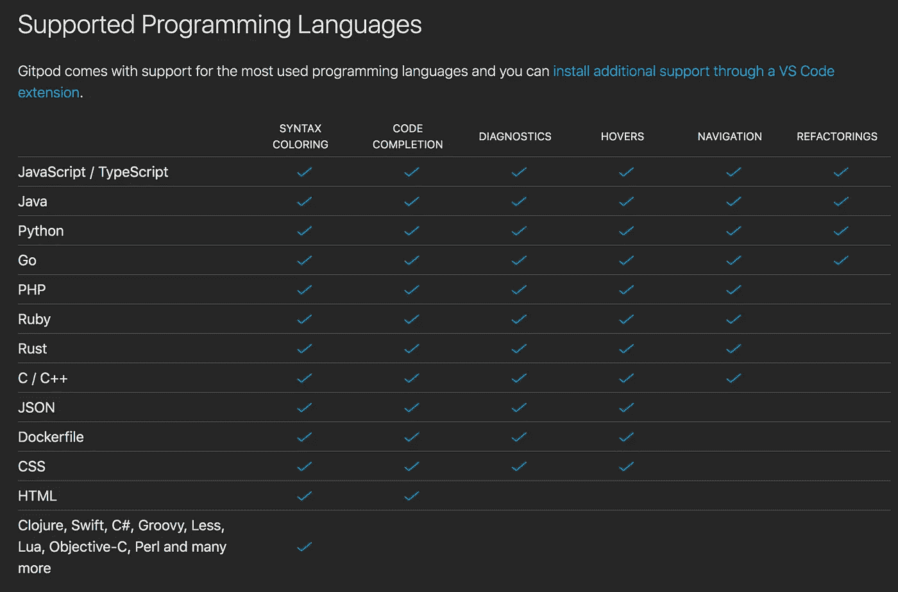

# 直接从 Github 运行任何 React/Angular/Vuejs 项目

> 原文：<https://javascript.plainenglish.io/run-any-react-angular-vuejs-project-directly-from-github-repository-48dbe3e07ca0?source=collection_archive---------2----------------------->

## 消除下载或克隆存储库代码的麻烦

Photo by [Yancy Min](https://unsplash.com/@yancymin?utm_source=medium&utm_medium=referral) on [Unsplash](https://unsplash.com?utm_source=medium&utm_medium=referral)

想要直接从 GitHub 存储库中运行任何 Javascript 或框架项目，而不用下载到您的机器上吗？
可能吗？
答案是大**“是”**

我刚刚遇到了一个由 Gitpod.io 提供的服务，这是一个在线 IDE，用于在云端运行 GitHub 项目。
在浏览器中运行 GitHub 的任何项目

1.  复制您想要运行的 GitHub 项目的 URL
2.  将其附加到[http://gitpod.io/#](http://gitpod.io/#)
3.  点击“使用 GitHub 登录并启动工作空间”按钮，登录您的 GitHub 帐户
4.  你完了。它将在云中加载您的 VS 代码环境

就拿[https://reactjs.org/community/examples.html](https://reactjs.org/community/examples.html)提到的第一个项目计算器项目来说吧

要在浏览器中运行项目，获取存储库 URL，即[https://github.com/ahfarmer/calculator](https://github.com/ahfarmer/calculator)并将其附加到[http://gitpod.io/#](http://gitpod.io/#)

所以完整的 URL 变成了

[https://gitpod.io/#https://github.com/ahfarmer/calculator](https://gitpod.io/#https://github.com/ahfarmer/calculator)

如果您加载上述 URL，它将在云中加载 Visual Studio 代码 IDE，您可以在那里运行该项目，方法是在 VS 代码终端中运行“npm install ”,然后按照该项目的`README.md`文件中的指示运行“npm start”。

以下是加载 URL 时的预览

GitPod Environment

使用这种技术，您可以运行项目，测试它，还可以在云中修改它。

> GitPod 允许运行 Visual Studio 代码支持的几乎所有语言的代码，包括 Javascript、Python、Java 和 Go

以下是 gitpod 网站支持的语言列表。

显然，Gitpod 不是完全免费的，下面的图表显示了定价计划

**免费 50 小时/月**

我认为这对你所需要的已经足够了。

今天到此为止。希望你喜欢这篇文章，今天学到了一些新东西。

**别忘了订阅我的每周简讯，里面有惊人的技巧、诀窍和文章，直接在你的收件箱** [**这里**](https://yogeshchavan.dev) **。**