# 使用剧作家从 Node.js 应用程序运行自动化的分步浏览器场景，以获得指导或演示

> 原文：<https://javascript.plainenglish.io/run-automated-step-by-step-browser-scenarios-for-instruction-or-demo-from-nodejs-applications-with-1092e457516e?source=collection_archive---------12----------------------->

## 允许用户在场景之前、之后和期间与浏览器进行交互。

本文中的演示展示了三个场景(荷兰、法国、英国)。每个国家都有介绍——使用维基百科上的特定页面和部分，以及通过支持网站。标注用于解释场景和每个动作。气球文本用于进一步引导用户，

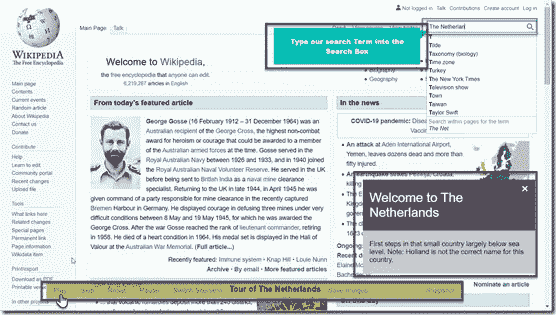

Using Playwright — the vanilla Wikipedia site has been extended with a toolbar for managing a scenario, a callout to provide context and balloon text for in situ support for the end user

这张截屏显示了场景*荷兰之旅*第一幕的开始。用户按 Play，显示标注，为查询字段显示气球文本，剧作家开始在搜索字段中键入字符“The Netherlands”。

下面的动画展示了荷兰的完整场景——从按下播放按钮开始第一幕。这个场景有四幕——开场、历史、体育和文化。每一幕都从播放按钮开始。可以跳过动作，可以重置场景(到开始)，并且可以选择其他场景。这里唯一的用户交互是按下播放按钮来触发每个动作。然而:用户可以在幕间浏览维基百科——浏览器会话对用户是免费的。

Brief demo of the Netherlands scenario created using Playwright and my custom scenario director. This type of scenario can be created for almost every website or web application.

注意:这个演示是用普通维基百科创建的。未更改的站点被加载到通过剧作家实例化的 Chromium 浏览器中。所有进一步的操作都是从 Node.js 应用程序中应用的。

act 可以使用 Node.js 中的剧作家来操作网站——它还可以完全访问浏览器 DOM 和 JavaScript 上下文。例如，动作可以:填充字段、突出显示文本、按下按钮、滚动页面、打开链接、进行选择、悬停在元素上、在选项卡之间切换。

这个例子的所有资料都可以在 GitHub 上找到:[https://GitHub . com/lucasjellema/剧作家-场景/tree/main/分步走](https://github.com/lucasjellema/playwright-scenarios/tree/main/step-by-step)。注意:这篇文章旨在给你一些启发，向你展示剧作家的潜力。这当然不是一个现成的解决方案，也不是专业干净编码的好例子。请正确解释它的意图。并请分享你的想法。你认为我所描述的怎么样？有意义吗？你能找到自己应用它的方法吗？你有什么建议给我吗？请让我知道！

# 介绍

在过去的几周里，我和剧作家做了许多有趣的事情。以编程方式与运行任何 web 应用程序或网站的浏览器进行交互的选项非常强大。它为自动化浏览器操作开辟了许多机会，既有无头的(用于测试、RPA、集成、屏幕抓取、健康检查、自动化报告)，也有头的(原型制作、说明、演示、deeplink 快捷方式、定制 SaaS)。

我已经在之前的几篇文章中描述了我使用剧作家所取得的一些成就。这些包括:将快捷键处理程序注入到在剧作家嵌入式浏览器中运行的任何 web 应用程序中(例如用于截图或下载所有图像)，将工具栏添加到任何网页中，在 WhatsApp Web UI 上创建用于与 WhatsApp 一起工作的 API，在 Google Translate 上创建 translation REST API，在 SaaS web 应用程序中创建导航到完全初始化的上下文的 Deepmark Booklinks，从 IMDb 检索电影的 JSON 报告。有关详细信息，请参见:

*   如果有一个免费的、不知疲倦的浏览器运营商，你能做些什么？！介绍剧作家。
*   [使用剧作家](https://medium.com/javascript-in-plain-english/inject-generic-floating-toolbar-into-any-web-application-or-site-using-playwright-d26eb116153a?source=your_stories_page-------------------------------------)将通用浮动工具栏注入任何网站
*   [使用剧作家将数据注入任何网页](https://medium.com/javascript-in-plain-english/use-playwright-to-inject-shortcut-keys-into-any-web-page-for-example-to-download-all-images-59195cf557a5?source=your_stories_page-------------------------------------)
*   [我构建了一个 API，用于发送&接收 WhatsApp 消息](https://medium.com/javascript-in-plain-english/how-to-apify-whatsapp-programmatic-interaction-with-whatsapp-from-node-using-playwright-227326796bf6?source=your_stories_page-------------------------------------)

我确定的下一个挑战——也是本文讨论的最后一个挑战——是使用剧作家，我想创建一个 web 应用程序或 web 站点的演示。剧作家命令用于执行网页中的动作。特别的是，这些动作被分步骤分组(又名*动作*)。这些步骤共同构成了一个场景。使用工具栏—用户可以播放一个动作、暂停执行、跳过(一个动作)、重置(将执行返回到第一个动作)。在自动化步骤的执行之间，用户可以自由地与网页交互。演示步骤(也称为 acts)不一定要执行，或者它们不一定是唯一要做的事情。每个步骤都可以有一个标题和描述，并显示在标注中。该图显示了描述当前行为和场景的标注。

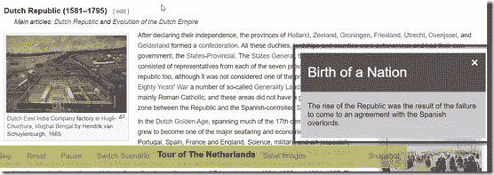

The user controls the scenario execution from the toolbar. The callout is used to provide information about the current scenario and act

此外，与动作中的步骤(也称为场景)相关联的可以是文本气球或带文本的箭头，它们可以放置在页面上靠近在步骤中操作的元素的位置。图中显示了一个示例。

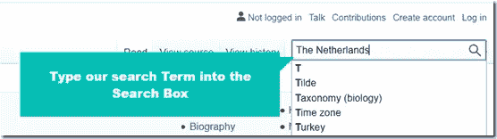

Balloon texts can be included in scenarios to provide inline guidance to the users

通过这种方式，可以创建演示脚本或教程，在真实的 web 环境中牵着用户的手。用户可以选择让准备好的场景进行下去，或者进行干预、贡献或事件接管(部分)。

我为维基百科创建了多个场景(荷兰，法国，英国)，用户可以选择一个场景来执行。在任何时候，用户都可以决定运行不同的场景。

实现的核心是一段非常简单的代码，它利用剧作家库来启动浏览器、创建浏览器上下文和打开网页。

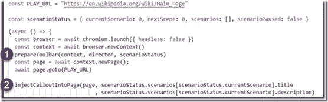

The core of running a web application in Playwright with added toolbar and callout components (CSS styling, HTML elements and JavaScript)

步骤 1 调用一个函数，将工具栏添加到浏览器上下文中的每个页面，每次都是在页面导航或重新加载以及 DOM 重新构建之后。此工具栏包含运行场景(以及在场景之间切换、暂停执行、重置场景)的控件。工具栏是通过*的*功能导演的；这个函数处理关于场景执行的工具栏事件。

第 2 步是将标注对象插入到当前页面。这是通过在函数 *injectCalloutIntoPage* 中直接操纵 DOM 来实现的。初始场景的标题和描述被传递以显示在标注中。

*场景状态*对象包含所有场景，并跟踪哪个场景是当前场景，以及用户在该场景中已经走了多远。暂停状态也记录在该对象中。

使用标题和描述以及嵌套的步骤或动作来定义场景。每一幕都有标题、描述和动作。动作是在执行动作时调用的函数。该函数操纵标注、气泡或气球帮助以及浏览器 UI 控件、DOM 元素和 JavaScript 上下文。以下是 NL 场景的一个小示例:

1.  定义场景的标题和描述
2.  用场景中的场景(又名行为)定义阵列；每个动作都有一个标题和描述，显示在标注中
3.  每一个行为都有一个行动。这个动作是服务器端 JavaScript 函数(Node.js context ),它接收当前(剧作家)页面对象作为输入；这个函数通常会在浏览器中的网页上下文中计算选择器表达式和 JavaScript 语句。本例中的第一个操作是编写一个气球帮助文本，在搜索字段中键入字符串“The Netherlands ”,然后按搜索按钮。当页面重新加载荷兰的详细信息后，会显示一个新的气球帮助文本。注意:调用 waitForUnpause()是为了验证用户是否暂停了执行；在这种情况下，这些呼叫将被阻塞，直到暂停结束
4.  第二个动作是调用 scrollToElement(一个自定义 Node.js 函数)的示例，将页面滚动到使用 function page 检索的元素句柄 *republic* 。$()和具有特定标题属性值的链接元素的选择器。这种滚动是在浏览器中以平滑的方式执行的，因此用户可以看到滚动的发生。

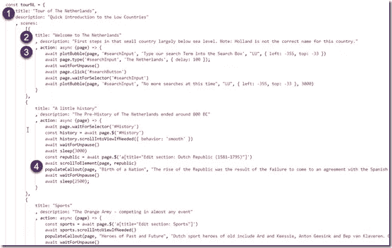

An example of how scenarios are composed from acts (or scenes) that contain actions with the code to invoke Playwright and the browser DOM

scrollToElement 函数非常简单:

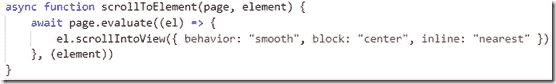

Node.js function that executes a JS snippet in the browser context to leverage the default scroll behavior in the browser

该函数使用剧作家函数 page.evaluate()将特定元素句柄的 DOM 元素传递给在浏览器上下文中执行的 JavaScript 函数。该函数利用 DOM 元素函数 scrollIntoView()来完成这项艰巨的工作。

场景可以做的另一个例子是突出显示文本。这也被证明是相当简单的。一个链接位于一个特定的文本内容中(关于马克斯·维斯塔潘，因此元素名为 maxText)。随后，执行一个浏览器端代码片段，它获取该链接的

父链接，将其整个 innerHTML 封装在标签中，并将这个

元素滚动到视图中。

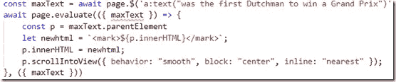

Node.js code that through Playwright locates a link element with specified title attribute value and then highlights all content inside the link’s parent element (a 
 element)

它有点粗糙。使用[范围和选择对象](https://javascript.info/selection-range)是更精确的方法。然而，在这个例子中，它为我实现了这个技巧:

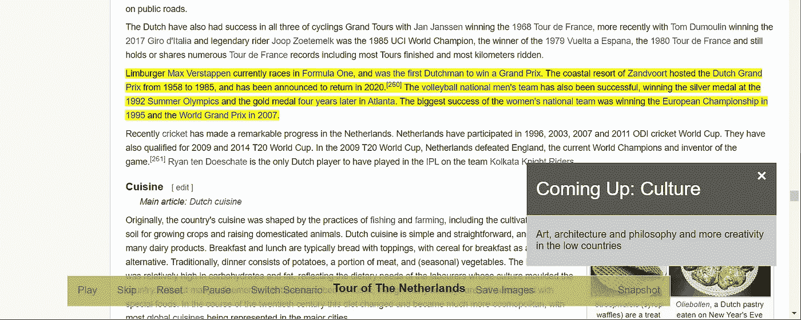

The effect of the function overhead: all text inside the 
 is highlighted by the browser (because of the <mark></mark> tags that were added

这段代码将鼠标悬停在一个链接上，显示一个关于伦勃朗的弹出窗口:

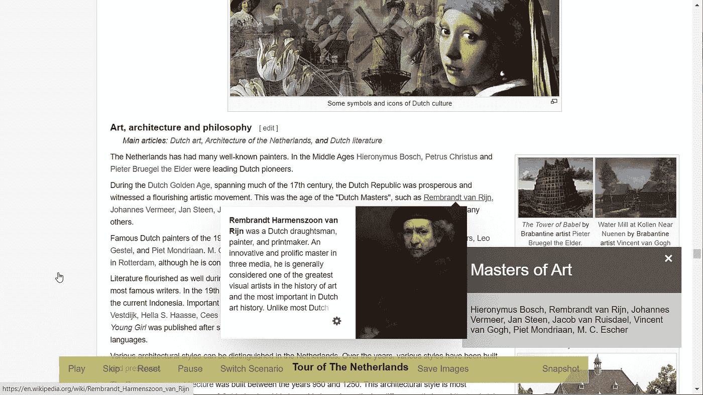

The action code makes the mouse hover over a link that causes a popup to appear

再举一个例子:一个动作可以打开一个新的浏览器标签，加载相关数据并激活该标签。并切换回原始选项卡。这是一个小片段:

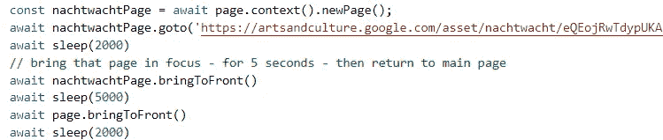

Playwright instructions in the Node.js application to create a new page (== browser tab), bring it to front, wait 5 seconds and bring the original tab back into focus

这是表演结束时用户将看到的结果:

The current act has opened a second tab, loaded a relevant context document; in 5 seconds, the main Wikipedia tab will get focus again

director() 函数是事情的核心:它处理关于场景的工具栏事件(播放、重置、跳过、暂停、切换)。这些事件在浏览器上下文中被捕获，并从工具栏链接上的 onclick 事件处理程序传递到 Node.js 上下文。该语句创建了从浏览器到 Node.js 的桥梁。

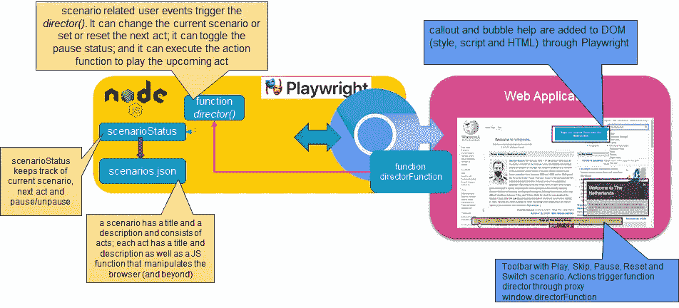

Overview of the Playwright scenario director. On the right the embedded Playwright browser that loads Wikipedia and gets the toolbar, callout and bubble help injected. User actions on the toolbar trigger the Node.js *director() function to manipulate the scenario status and execute its acts*

director() 函数是事情的核心:它处理关于场景的工具栏事件(播放、重置、跳过、暂停、切换)。这些事件在浏览器上下文中被捕获，并从工具栏链接上的 onclick 事件处理程序传递到 Node.js 上下文。该语句创建了从浏览器到 Node.js 的桥梁:

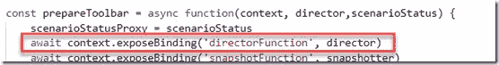

Make Node.js function *director available in the browser context — as window.directorFunction*

对 context.exposeBinding 的调用确保 Node.js 函数 director 将作为 *directorFunction* 在窗口对象上的浏览器中的任何地方可用。该函数从工具栏中的 onclick 处理程序调用。

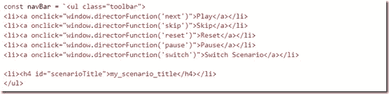

Notice how the onclick event handlers all invoke the window.directorFunction — which is in reality a proxy for a Node.js function

现在来看看 director()函数本身。它接收来自剧作家的源对象(包含页面和浏览器上下文)和来自 onclick 处理程序的指令输入参数，以指示触发了哪个动作(下一个也称为播放、跳过、重置、暂停、切换)。

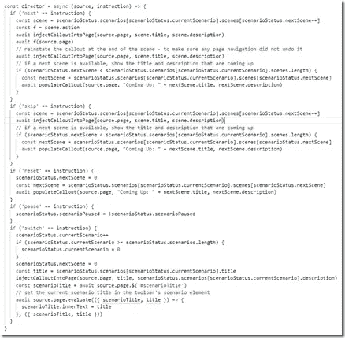

The Node.js director() function that handles all toolbar events regarding scenarios

根据*指令*的值，该函数将操作 *scenarioStatus* 对象，该对象跟踪当前场景及其状态(下一个动作，暂停与否)。例如，对于 skip，下一个动作简单地递增。暂停表示暂停或取消暂停(用作切换开关)，除了操作*场景状态*中的标志之外，什么也不做。也许我应该加上一个视觉指示。重置意味着将下一幕重置为 0 或场景的开始。开关被解释为*选择下一个场景*。调用 populateCallOut()是为了将标注与当前场景及其即将到来的下一个动作同步。

最后*下一个*又名 play 是执行动作的触发器，意味着调用其功能。一旦一个动作正在执行，导演就不能停止它。但是，操作本身可能会检查场景暂停状态，并通过等待暂停结束来执行它。

# 资源

本文的所有代码都在 GitHub 上:[https://GitHub . com/lucasjellema/剧作家-场景/tree/main/step-by-step](https://github.com/lucasjellema/playwright-scenarios/tree/main/step-by-step)

CodePen On Speech Bubbles 作者@ rajeshdn—[https://codepen.io/RajRajeshDn/pen/oZdRJw](https://codepen.io/RajRajeshDn/pen/oZdRJw)

关于 CSS 中高级定位的文章:[https://www . internetingishard . com/html-and-CSS/Advanced-positioning/](https://www.internetingishard.com/html-and-css/advanced-positioning/)

CSS —滚动行为—[https://developer . Mozilla . org/en-US/docs/Web/CSS/Scroll-Behavior](https://developer.mozilla.org/en-US/docs/Web/CSS/scroll-behavior)

StackOverflow —获取 DOM 元素的 X 和 Y 坐标—[https://stack overflow . com/questions/442404/retrieve-the-position-X-Y-of-an-html-element-relative-to-the-browser-window](https://stackoverflow.com/questions/442404/retrieve-the-position-x-y-of-an-html-element-relative-to-the-browser-window)

W3 Schools —如何创建标注元素—【https://www.w3schools.com/howto/howto_js_callout.asp 

由[kapeel kokane](https://dev.to/comscience)—[https://dev . to/com science/highlight-Searched-text-on-a-page-with-just-Javascript-17 B3](https://dev.to/comscience/highlight-searched-text-on-a-page-with-just-javascript-17b3)

剧作家 1.7.0 新选择器—针对 CSS 文本选择器—[https://github . com/Microsoft/剧作家/blob/v 1 . 7 . 0/docs/selectors . MD # CSS-extension-visible](https://github.com/microsoft/playwright/blob/v1.7.0/docs/selectors.md#css-extension-visible)

剧作家文档:

*   page-bringToFront()—[https://stronger . dev/docs/API/class-page/# pagebringtofront](https://playwright.dev/docs/api/class-page/#pagebringtofront)
*   page-type()—[https://剧作家. dev/docs/API/class-page/# pagetypeselector-text-options](https://playwright.dev/docs/api/class-page/#pagetypeselector-text-options)和[https://playwright.dev/docs/input#type-characters](https://playwright.dev/docs/input#type-characters)
*   page—addStyleTag()—[https://剧作家. dev/docs/API/class-page/# pageaddstyletagstyle](https://playwright.dev/docs/api/class-page/#pageaddstyletagstyle)
*   page—addScriptTag()—[https://剧作家. dev/docs/API/class-page/# pageaddscripttagscript](https://playwright.dev/docs/api/class-page/#pageaddscripttagscript)
*   page—hover()—[https://剧作家. dev/docs/API/class-page # pagehover selector-options](https://playwright.dev/docs/api/class-page#pagehoverselector-options)
*   CSS 和文本选择器—[https://playwright.dev/docs/selectors#text-and-textlight](https://playwright.dev/docs/selectors#text-and-textlight)
*   page—wait and wait for selector()—[https://playwright.dev/docs/navigations#custom-wait-1](https://playwright.dev/docs/navigations#custom-wait-1)

**TL；** *博士:运行浏览器动作的演示或说明。允许用户暂停和跳过动作，重置和切换场景。允许用户在场景之前、之后和期间与浏览器进行交互。开源的剧作家库来自一个自定义的 Node.js 应用程序，其中定义了场景——使用了大量的 CSS 选择器和 DOM 操作。*

*原载于 2020 年 12 月 31 日*[*https://technology . amis . nl*](https://technology.amis.nl/frontend-technology/run-automated-step-by-step-browser-scenarios-for-instruction-or-demo-from-nodejs-applications-with-playwright/)*。*