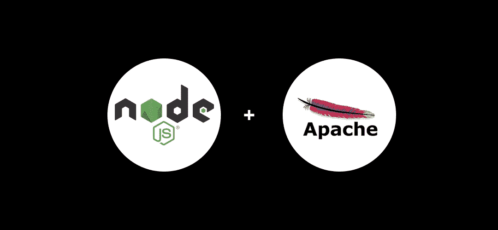

# 在 Apache 生产服务器上运行 Node.js 应用程序

> 原文：<https://javascript.plainenglish.io/running-a-nodejs-application-on-an-apache-production-server-4d3cca078f94?source=collection_archive---------3----------------------->



这是我希望在发布我的 NodeJS 应用程序时找到的文章。

我刚刚在生产服务器上部署了一个新的 NodeJS 应用程序，然后点击 go。它工作了，很好，但是它只能通过 *localhost:3000* 访问，而我没有访问权限。

"你如何通过一个域访问 localhost:3000？"我以为。

**注意:**本文是在您有一些 Linux 终端经验、有 ssh 访问您的 live 服务器环境并设置了 NodeJS 的基础上撰写的。

# 在 Apache 环境中使用虚拟主机将域指向 NodeJS 应用程序

当在谷歌上搜索时，我真的很难找到这个问题的帮助，主要是因为解决方案只会使用一个你可能不熟悉的短语，我知道我肯定不熟悉。

您将需要设置一个 **Apache 代理虚拟主机。**您还需要在您的服务器上安装 Apache 的 mod_proxy。

我还有一个问题，因为我希望是 HTTPS。

这包括在我的 NodeJS 应用程序中启用 HTTPS 模块，在我的生产服务器上生成 2 个证书文件，然后在我的应用程序和虚拟主机文件中引用它们。

这是我当前的虚拟主机文件，因为它在我的服务器上。

```
<VirtualHost *:443>ProxyPreserveHost On#Don't include the brackets when adding your domain
ServerAlias [domain alias so www.mydomain.com for example]
ServerName [domain so mydomain.com]<Proxy *>
 Order deny,allow
 Allow from all
</Proxy>SSLEngine on
SSLProxyEngine OnSSLCertificateFile    [path/to]/server.cert
SSLCertificateKeyFile [path/to]/server.keySSLProxyVerify noneSSLProxyCheckPeerCN off
SSLProxyCheckPeerName off
SSLProxyCheckPeerExpire offProxyPass / [https://127.0.0.1:[your port number]/](https://127.0.0.1:3000/)
ProxyPassReverse / [https://127.0.0.1:](https://127.0.0.1:3000/)[[your port number]](https://127.0.0.1:3000/)[/](https://127.0.0.1:3000/)</VirtualHost>
```

这将需要创建为。您的 apache2 站点可用文件夹中的 conf 文件。

为此，运行下面的命令，确保这确实是保存 apache2 站点配置的地方(不同的 Linux 风格在不同的地方存放它们的 apache 文件),并将上面的虚拟主机示例复制到其中。

更新与您的应用相关的部分。还有，我用的是 nano。请使用您选择的文本编辑器。

```
sudo nano /etc/apache2/sites-available/[my domain].conf
```

然后启用新的。conf 文件并使用以下命令重新启动 apache:

```
sudo a2ensite [my domain].conf
sudo service apache2 restart
```

如果您的应用程序已经启动并运行，那么您*现在应该*能够进入您在。conf 文件夹并查看您的新站点。如果你不能确保你的路径是正确的，你已经把整个网站复制到你的服务器上，并且你已经安装了所有必要的扩展等等。

**注意:**在基于 Linux 的系统上创建证书密钥非常简单，只需搜索“在 Linux 上创建证书”。

# 使用 PM2 管理生产中的应用程序

在生产环境中运行您的站点对于任何环境设置来说都是令人担忧的，但是，当然，开发人员会助您一臂之力。

PM2 是一个守护进程管理器，可以真正证明它在生产环境中的价值，如果你愿意，你可以在你所有的环境中使用它。

通过 npm 安装

```
npm install pm2 -g
```

我发现 PM2 做了这么多，我有点敬畏它。

让它如此强大的一个原因是您可以定制生态系统配置文件来满足您的需求。

```
module.exports = {
  apps: [{
    script: "app.js",
    watch: ["server", "client"],
    // Delay between restart
    watch_delay: 1000,
    ignore_watch : ["node_modules", "client/img"],
    watch_options: {
      "followSymlinks": false
    }
  }]
}
```

这使您能够真正深入了解您的设置，并让您的应用程序完全按照您想要的方式工作。

还有一些简单易用的功能。

用一个使用 PM2 的名称启动应用程序:

```
pm2 start app.js --name Production Server
```

查看您在 PM2 运行的应用程序:

```
pm2 list
```

查看与您的应用程序相关的日志:

```
pm2 log
```

***注意:*** *此外，您可以使用一个*[*Apache logs viewer*](https://www.loggly.com/solution/apache-log-analyzer/)*工具来获得有关 Apache 服务器的健康和性能的信息仪表板。*

重新启动应用程序:

```
pm2 restart [process number]
or
pm2 restart app.js
```

如果服务器因为某种原因重启，将 PM2 添加到服务器启动过程中，PM2 会告诉你如何完成剩下的工作:

```
pm2 startup
```

我可以整天谈论 PM2，但是他们的文档有你需要的一切，所以我建议你自己去看看它能做什么。前往[https://pm2.keymetrics.io/](https://pm2.keymetrics.io/)了解这个令人印象深刻的工具的更多信息。

## 就是这样！

我希望本指南对在生产环境中运行 Node.js 应用程序有所帮助。

如果您有任何问题或帮助，请联系我们。

请查看我的其他一些文章。

[](/5-lessons-i-learned-teaching-myself-nodejs-74b5f6967dcf) [## 我自学 NodeJS 时学到的 5 课

### 用了 10 年的灯堆，我觉得是时候尝试新的东西了。

javascript.plainenglish.io](/5-lessons-i-learned-teaching-myself-nodejs-74b5f6967dcf) [](https://medium.com/the-digital/how-to-get-over-90-on-google-pagespeed-insights-a85255ac9a05) [## 如何在 Google Pagespeed Insights 上获得 90 分

### 除了个人走私之外，为什么还要在 Chrome 的 Lighthouse 扩展中尝试 100 个呢…

medium.com](https://medium.com/the-digital/how-to-get-over-90-on-google-pagespeed-insights-a85255ac9a05) [](/using-sharp-in-nodejs-to-output-resize-and-crop-images-on-the-fly-f8b150989760) [## 在 Node.js 中使用 Sharp 来输出、调整大小和裁剪图像

### 这是开发人员梦寐以求的工具。

javascript.plainenglish.io](/using-sharp-in-nodejs-to-output-resize-and-crop-images-on-the-fly-f8b150989760) 

*更多内容看* [***说白了. io***](http://plainenglish.io)