# RxJs 用简单的英语解释

> 原文：<https://javascript.plainenglish.io/rxjs-explained-in-plain-english-9d2daa329f34?source=collection_archive---------6----------------------->

## 反应式编程

## 您应该知道的 7 个最常用的运算符


# 介绍

您是否想开始学习 RxJs，但却对围绕它的一些术语感到困惑？还是你已经在用了，想用更简单的方式去理解？

不管怎样，你来对地方了。在这篇文章中，你将学到

*   RxJs 中使用的术语
*   观察者、被观察者、订户和运营商的角色及其责任
*   如何使用各种方法创建一个可观察的。
*   七个最常用的运算符及其工作原理

RxJs 领域有很多内容要介绍，但这篇文章应该能让你了解图书馆里正在发生的事情。

**注:** *本帖中用到的所有例子都可以在* [*RxJs 用通俗英语解释的 Git 资源库*](https://github.com/Haseeb90/rxjs-explained-in-plain-english) *中找到。*

# 术语

RxJS 有几个你应该知道的关键人物

*   可观察的—产生一个数据序列(流)
*   观察者-消耗可观察值
*   订户—连接观察者和被观察对象
*   运算符-途中值转换
*   主体——包括可观察对象和观察者

**注意:** *我不打算在这篇文章中深究主题。有不同类型的主题，涵盖了相当多的内容，所以将在不同的职位。*

## 网飞类比

所有这些术语一开始可能很难理解，所以让我们通过类比来更好地理解每个玩家在大计划中的角色。

网飞是内容制作人。该公司有一个网站和一个移动应用程序，可以让人们看到他们的内容。我通过创建一个账户成为这项服务的*用户*，一旦我*订阅了*网飞，我的家人就可以*观看*他们制作的内容。

*可观察对象，*在本例中是应用程序，可以调用*观察对象，*我的家庭上的某些操作。这些行动是

*   next() —提供并播放流中的下一集
*   *error() —当出现*错误*时通知观察者*
*   *complete() —当季节或系列完成*时通知观察者**

*作为订阅者，我必须向可观察对象提供一个观察者，一个观看内容的人，以便可观察对象可以调用观察者的`next()`、`error()`和`complete()`方法。*

*记住网飞类比，一个可观察对象有以下责任*

*   *允许*订阅*和*取消订阅*其流*
*   *向观察者发出*下一个*值*
*   *如果出现问题，通知观察者*错误**
*   *并在流完成时通知观察者*

*另一方面，观察者可以决定如何*

*   *处理来自可观察值的下一个值*
*   **处理从可观察对象发出的任何*错误***
*   **当可观察对象表示数据流*完成*时进行处理**

**通过为每一个提供一个函数。**

**如果我们把它想象成一个图表，这就是它的样子**

**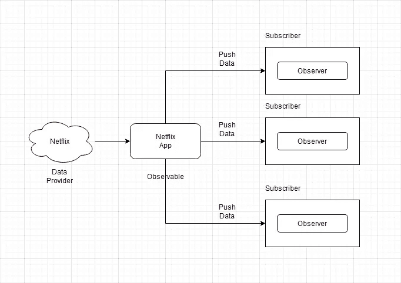**

**A diagram explaining the relation between Observable, Subscribers and Observers**

# **使用 RxJs 创建可观察值**

**在这一节中，我们将看看 RxJs 提供的一些创建可观察对象的方法。我将首先列出它们，然后我们将深入研究代码。**

*   **来自()**
*   **Observable.create()或(`new Observable(fn)`)**
*   **属于()**

**但是在我们开始观察之前，让我们先快速看一下*观察者*是什么样子的。**

**如上所述，观察者选择如何处理被观察对象调用的*方法`next()`、`error()`和`complete()`。***

**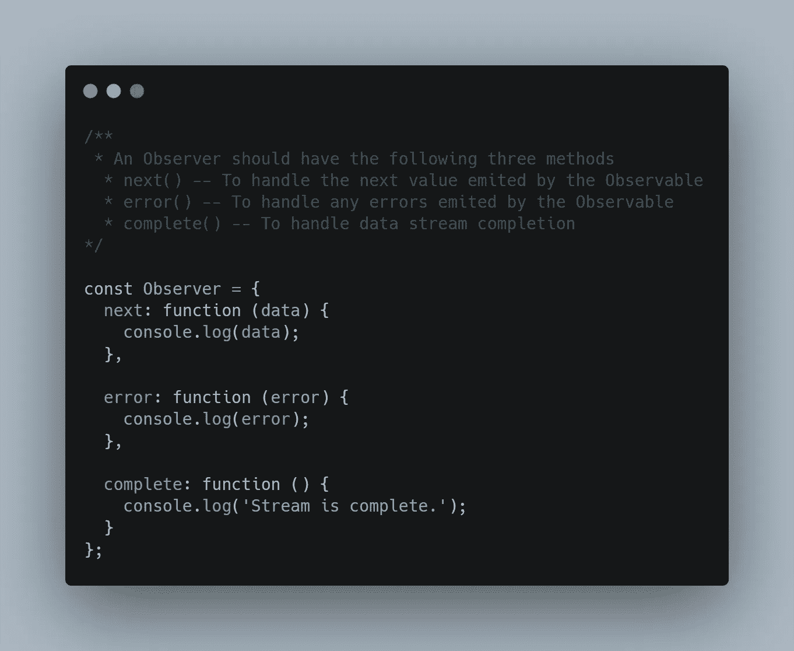**

**Example of a simple Observer that handles the next(), error() and complete() methods**

****注意:** *没有必要在观察者中实现所有三种方法。至少，一个观察者应该能够掌握* `*next*` *的方法。***

## **from()函数**

**这种方法能够将各种事物转化为可观察的事物。这包括但不限于数组、承诺和可重复项。**

**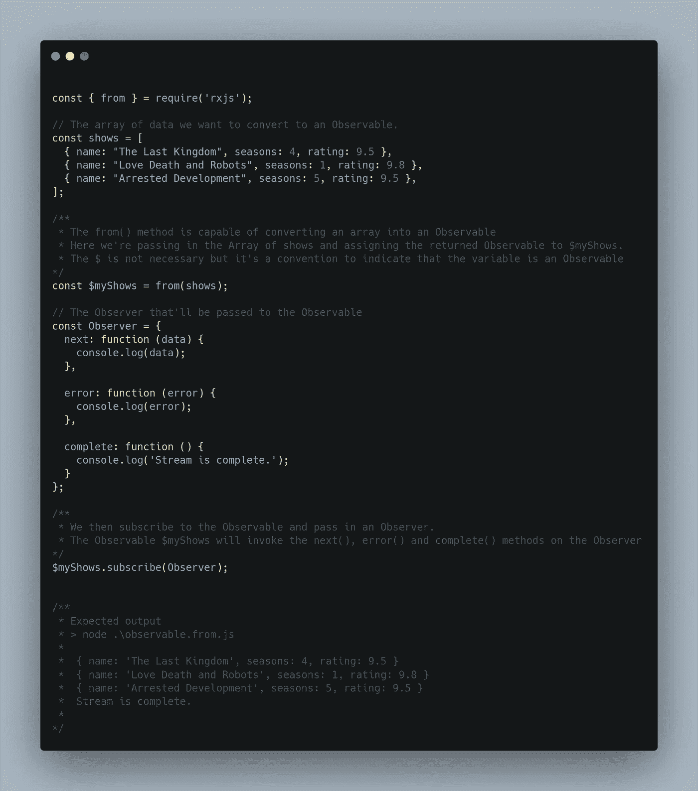**

**Example of how to use from() to convert an Array into an Observable.**

****注意:** *在上面的例子中，我已经显式地定义了一个实现了* `*next()*` *、* `*error()*` *和* `*complete()*` *方法的 Observer 对象，并将其传递给了 subscribe 方法。RxJs 还允许我们将这些作为函数直接传递给 subscribe 方法。***

**请考虑以下情况。**

**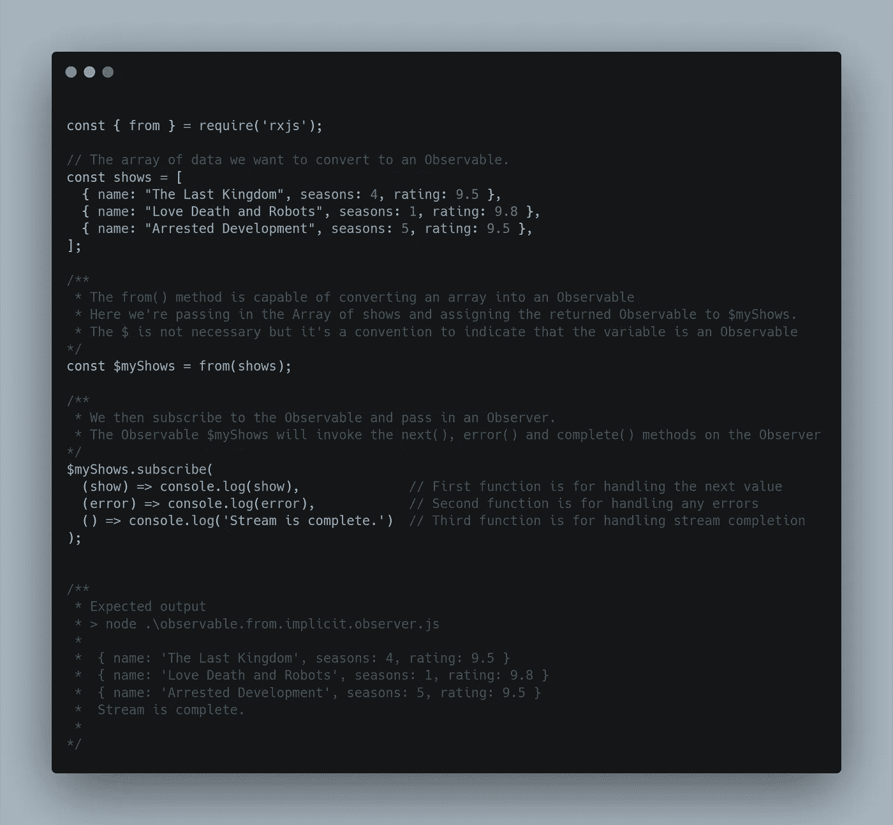**

**Example showing the subscribe method of an Observable taking functions as arguments.**

**当处理承诺时，`from()`函数返回一个发出承诺的*解析的*值的可观察值。如果承诺被*解析*，则从可观察值中发出解析值，否则从承诺中发出*拒绝错误*。**

**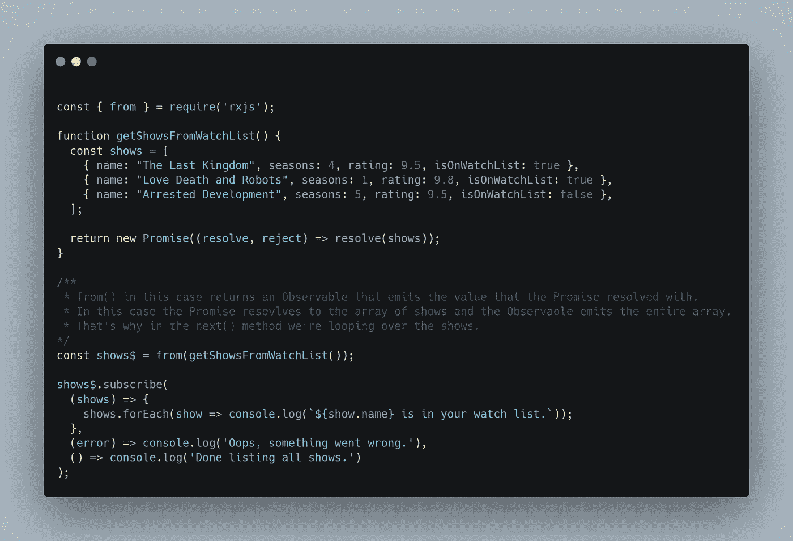**

**Example of using the from() function to handle Promises as an Observable**

## **Observable.create()**

**`create()`方法将函数作为参数，并将其转换为可观察值。每当观察者*订阅*该可观察对象时，该函数就会被执行。该功能参数称为`onSubscription`。**

**本质上，这允许我们定义当观察者*订阅*这个可观察时会发生什么。这使得**我们的**职责是在`onSubscription`函数中调用观察者的`next()`、`error()`和`complete()`方法。**

**调用`onSubscription`函数时，`Observer`是其唯一的参数。**

****注意:***`create()`*方法已被弃用，您应该使用* `new Observable()` *构造函数来代替。在下面的例子中我使用了* `new Observable()` *构造函数，但是在代码文件中你可以看到* `Observable.create()` *的用法。****

**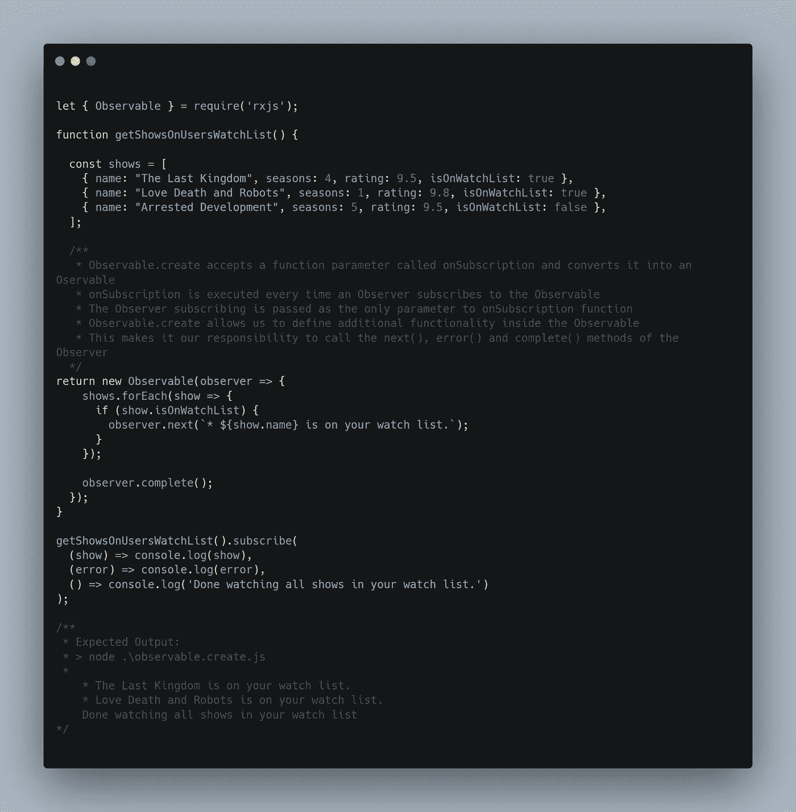**

**Example of creating an Observable manually using the constructor method.**

## **of()函数**

**该函数接受任意数量的参数，并返回一个可观察值，该可观察值将每个参数作为可观察序列发出。**

```
**const { of } = require('rxjs');of(1, 2, 3).subscribe(data => console.log(data));**
```

**注意: *我在这里举了一个非常简单的例子，这个例子也可以在 RxJs 文档中找到。在这篇文章的后面，你会看到更多的使用方法。***

**在本节中，我们介绍了如何使用三种不同的方法来创建一个可观察对象。当然还有更多方法我们没有在这里介绍，但是可以随意浏览 [RxJs 文档](https://rxjs-dev.firebaseapp.com/guide/operators)。您可以在创建操作符标题下找到它们。**

**在下一节中，我们将看看 RxJs 提供的最常用的操作符。**

# **RxJs 运算符**

**…只是功能。**

**仅此而已。**

**它们是具有明确定义的输入和输出的函数。一个算子把一个可观察量作为输入，产生一个可观察量作为输出。它们充当转换功能，转换通过它们的数据。**

**以 Array 类为例，它有一个名为`map()`的内置方法。此方法将函数作为参数，并返回一个包含转换后的值的新数组。**

**同样，RxJs 提供了一个名为`map()`的操作符。像来自数组的`map()`方法一样，它也接受一个函数作为参数，但是操作符返回一个可以订阅的可观察值。**

**有两种类型的运算符**

*   **创建操作符——用于*创建*一个新的可观察对象。这些是我们在这篇文章的第一部分所涉及的内容。**
*   **可管道化运算符-用于在多个步骤中转换数据。这些将一个可观测值作为输入，并产生一个可观测值作为输出。它们是纯函数。这意味着先前的可观测值保持不变。**

**RxJs 中有很多可用的操作符，但是有一些你可能会更频繁地使用。**

**以下是您可能会经常使用和看到的 7 个运算符:**

*   **地图**
*   **过滤器**
*   **减少**
*   **串联**
*   **合并**
*   **合并地图**
*   **开关图**

## **map()、filter()和 reduce()运算符**

**如果您过去使用过数组，这些操作符可能听起来非常熟悉。它们以完全相同的方式工作，但是在操作符的情况下，每个操作符都返回一个可观察值。**

**考虑以下情况**

**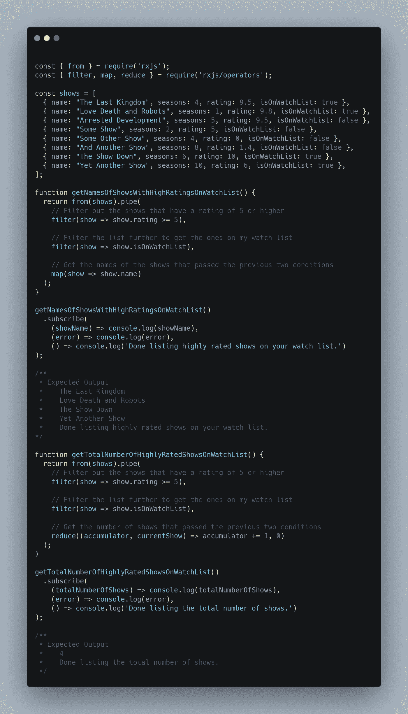**

**Example of how to use the map(), filter() and reduce() Operators in RxJs**

## **concat()和 merge()运算符**

**…两者都做同样的事情。**

**它们都返回一个从每个给定的输入可观察对象中发出值的可观察对象。**

**两者的关键区别在于*各自散发的数值如何。 ***如何*** 将决定您在不同的用例中使用哪一个。***

**`concat`将多个可观察值连接在一起，并依次发出它们的值*。***

***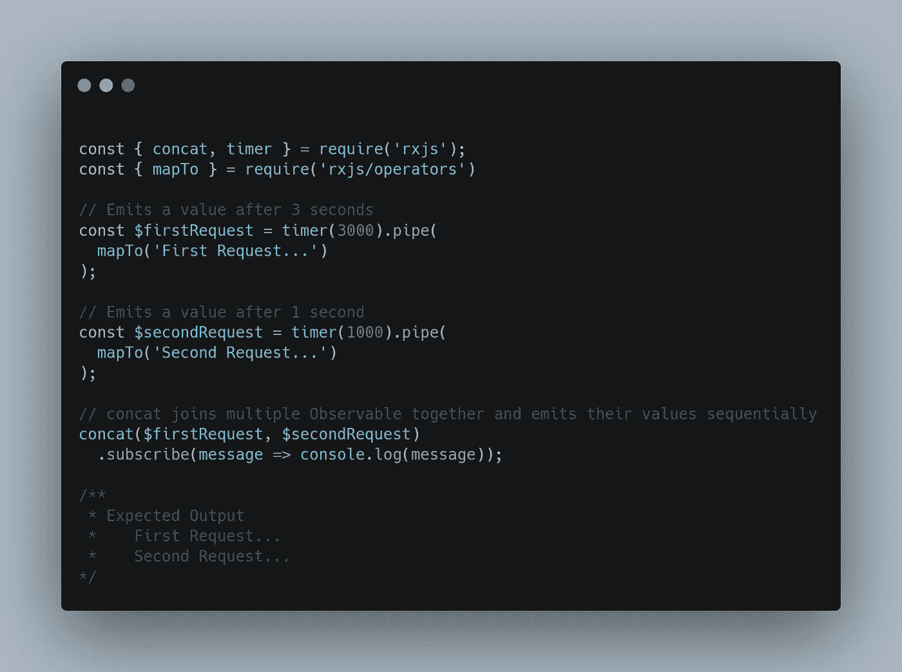***

***Example of how to use the concat() Operator using RxJs***

***`merge`将多个可观测值结合在一起，并发发出它们的值*。****

******

***Example of how to use the merge() Operator using RxJs***

## ***mergeMap()运算符***

***A.又名`flatMap()`操作符允许我们展平嵌套的可观察对象。***

***让我们继续我们的网飞类比。***

***一个系列中有多个**季**是可以观察到的。在每一季中，你有 10 集**可以观看。这种情况下的 10 集是嵌套的，可以在每一季中观察到。*****

***要观看整个系列，您首先必须选择(订阅)第一季。然后你要一集一集的选(订阅)，看完。***

***如果我们不使用`mergeMap`操作符，这就是我们必须要做的。为了看完整场演出，我们必须有嵌套订阅。***

***考虑下面的*(不使用* `*mergeMap*` *)****

**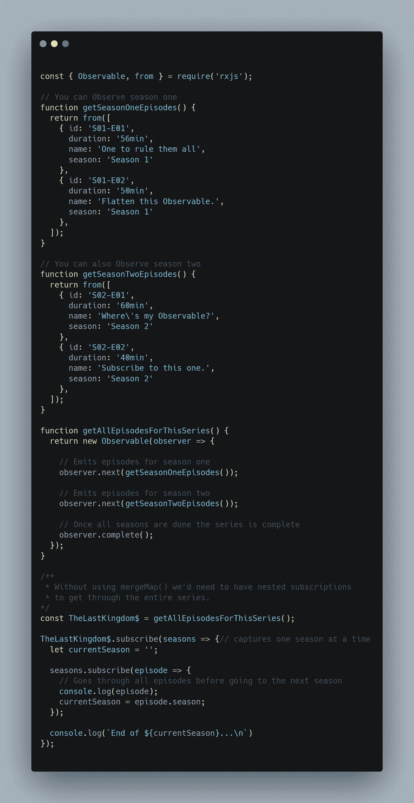**

**Example of nested subscriptions when not using mergeMap**

**下面是从上面的代码中提取的关键内容:**

```
**/**
* **Without using mergeMap() we'd need to have nested subscriptions**
* to get through the entire series.
*/const TheLastKingdom$ = getAllEpisodesForThisSeries();// captures one season at a time
TheLastKingdom$**.subscribe**(seasons => { 
  let currentSeason = '';

  seasons**.subscribe**(episode => {
    // Goes through all episodes before going to the next season console.log(episode);
    currentSeason = episode.season;
  });

  console.log(`End of ${currentSeason}...\n`)
});**
```

**`mergeMap`操作符允许我们展平嵌套的可观察对象，这样我们就不需要*嵌套订阅*。**

**在我们的类比中，`mergeMap`将允许我们有一个无缝的体验，每一集将一个接一个地播放，而你不必选择(订阅)下一季。**

**上面代码中的所有内容都保持不变。当使用`mergeMap`操作符时，最后一部分看起来像这样。**

```
**const TheLastKingdom$ = getAllEpisodesForThisSeries();TheLastKingdom$
  .**mergeMap**(seasons => seasons)
  .subscribe(episode => console.log(episode));**
```

**`[mergeMap](https://rxjs-dev.firebaseapp.com/api/operators/mergeMap#description)`运营商的[官方文档是这样描述的:](https://rxjs-dev.firebaseapp.com/api/operators/mergeMap#description)**

> **基于对源可观察对象发出的每个项目应用您提供的函数，返回发出项目的可观察对象，其中该函数返回一个可观察对象，然后合并这些结果可观察对象并发出此合并的结果。**

## **switchMap()运算符**

**还在看网飞吗？**

**很好。**

**让我们继续类比。**

**你进入搜索页面，搜索你想看的标题。该应用程序向服务器发送请求以获取该标题的详细信息。现在，您正在等待回应，但这花费的时间太长了。这可能是你这边的网络问题，或者是网飞那边的某个东西花了更长时间。**

**不管是什么情况，你会失去耐心，去寻找另一个头衔。这一个马上回来。你正在通读描述，突然你首先搜索的标题突然出现在屏幕上。**

**你的经历，被毁了。**

**发生了什么事？为什么第一个标题回来了，并得到显示，即使你不再关心它？**

**你的第一个请求从未被取消。不管出于什么原因，它只是花了更长的时间来回应。一旦它做出响应，浏览器就会显示通过的内容。**

**要修复这种性质的问题，您可以使用`switchMap`操作符。让我们看看那会是什么样子。**

**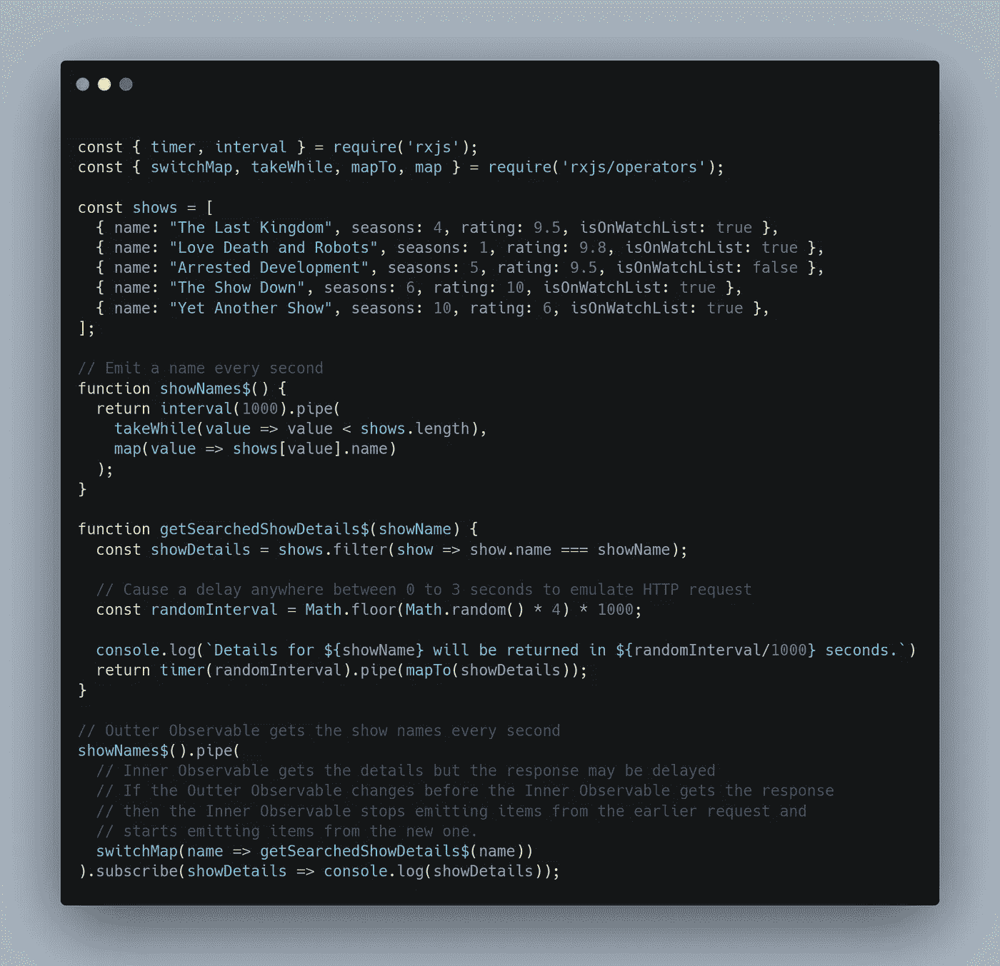**

**Example of using the switchMap Operator in RxJs**

**它是这样工作的。**

**源 observable，在本例中是`showNames$`，以一秒钟的间隔发出每个节目的名称。内部可观察对象`getSearchedShowDetails$`模拟一个 HTTP 请求，通过在返回响应之前添加一个随机延迟来获取节目的细节。**

**如果在内部可观察对象得到响应之前，源可观察对象发生了变化，那么内部可观察对象将停止发出先前请求中的项目，并开始发出新请求中的项目。**

**这意味着如果`getSearchedShowDetails$`的响应时间超过一秒，那么这个节目的细节就不会被显示出来。任何小于或恰好在一秒钟内返回的内容都将被发出。**

**下面是上面代码的输出。**

**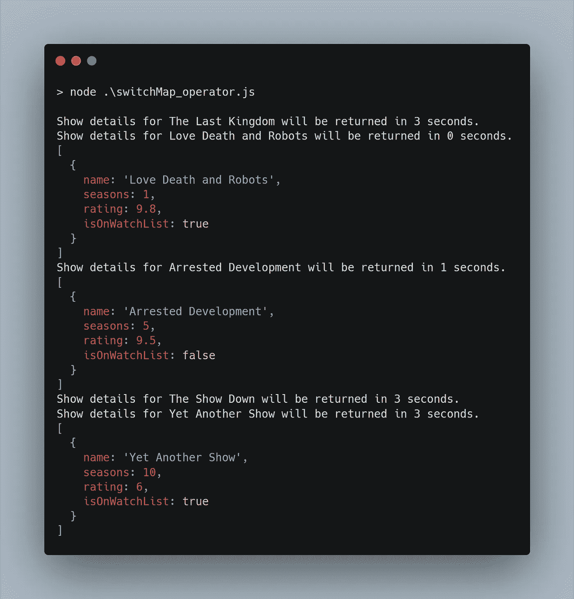**

**Example of the output from the switchMap() operator code**

**在这种情况下，发出的最后一个值将花费整整三秒钟来响应。那是因为源可观测值在那段时间内没有改变它的值。**

****注意:** *由于* `*getSearchedShowDetails$*` *函数的随机延迟，运行* `*switchMap_operator.js*` *文件中的代码时，输出可能不一样。***

# **结论**

**好了，这个帖子到此为止。**

**您现在应该对有了很好的理解**

*   **RxJs 中使用的术语**
*   **观察者、被观察者、订户和运营商的角色及其责任**
*   **如何使用各种方法创建一个可观察的。**
*   **一些最常用的运算符及其工作原理**

**在 RxJs 的土地上还有很多要介绍的内容，但是这应该会让您了解正在发生的事情。**

**下次再见，✌️和平**

**一定要看看这篇文章的第二部分，它涵盖了错误处理。**

**[](https://medium.com/@haseebkhan_90/3-ways-to-handle-errors-in-rxjs-97a04f2ecdc) [## RxJs 中处理错误的 3 种方法

### 使用 catchError、retry 和 retryWhen 运算符

medium.com](https://medium.com/@haseebkhan_90/3-ways-to-handle-errors-in-rxjs-97a04f2ecdc) 

资源:

*   [关于操作员的 RxJs 文件](https://rxjs-dev.firebaseapp.com/guide/operators)

## 简单英语的 JavaScript

喜欢这篇文章吗？如果有，通过 [**订阅解码，我们的 YouTube 频道**](https://www.youtube.com/channel/UCtipWUghju290NWcn8jhyAw) **获取更多类似内容！****