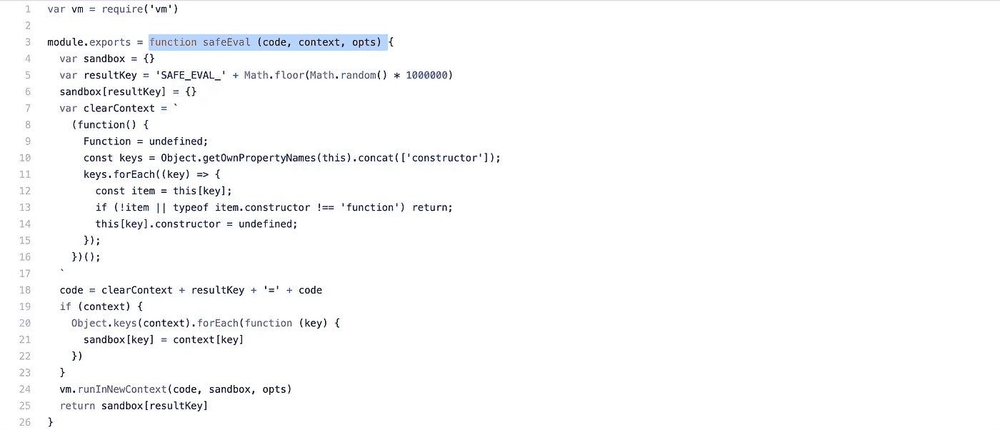
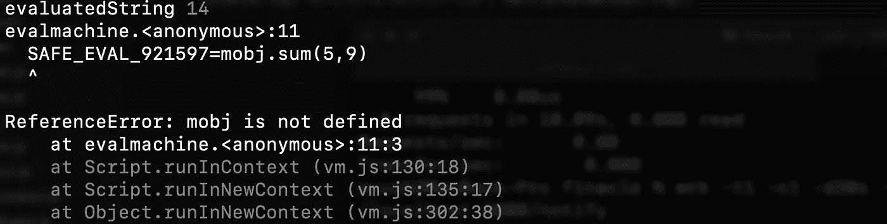
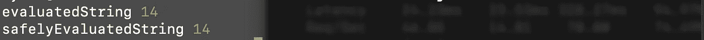
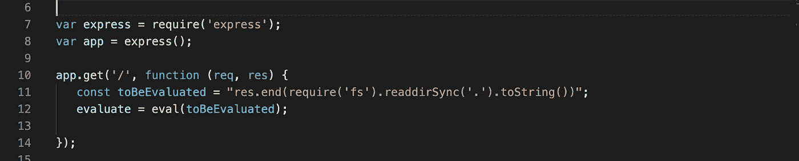
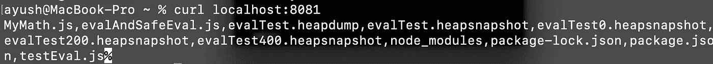
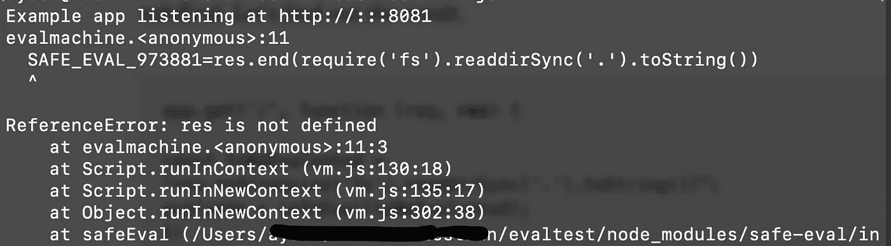
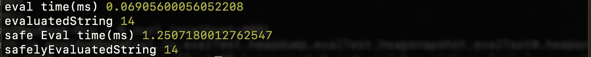

# 安全评估和评估的比较

> 原文：<https://javascript.plainenglish.io/safe-eval-and-eval-whats-the-fuss-aa495c4eaa96?source=collection_archive---------4----------------------->

## 评估和安全评估与示例和统计数据的比较。



Source github:[https://github.com/hacksparrow/safe-eval/blob/master/index.js](https://github.com/hacksparrow/safe-eval/blob/master/index.js)

嗨，我在这里分享我从一个大型 nodeJS 应用程序的性能优化中学到的东西。

在这里，我们不讨论是否应该使用 eval/safeEval，我们将看到它们的性能比较和安全问题，我们还将看到 safeEval 的安全性和开销，如果您已经决定使用它，请阅读本文。

它们是什么的简介

Eval 用于评估以字符串格式编写的 JS 语句，safe Eval 安全地做同样的事情。

“好吧，这么详细”

当然，让我来。

> Eval 就像核能，如果控制住并明智地使用，你可以给整个城市供电，如果没有控制住，你可以炸毁整个城市。
> 安全评估是核电站。

“嗯”

Eval 和 safeEval 用于计算表达式。
点击[评估](https://developer.mozilla.org/en-US/docs/Web/JavaScript/Reference/Global_Objects/eval)和[安全评估](https://www.npmjs.com/package/safe-eval)，了解更多信息

但是，这个博客并不是要理解什么是 eval 和 safeEval，在这里我们将看到它们之间的区别以及它们是如何工作的。

> **safeEval** 创建自己的上下文，然后进行评估，相反 **eval** 在应用上下文中进行评估。

我们来理解一下上面那行。

如果你看看 safeEval 的方法签名，它是这样的

```
function safeEval (code, context, opts)[https://github.com/hacksparrow/safe-eval/blob/master/index.js](https://github.com/hacksparrow/safe-eval/blob/master/index.js)
```

每当我们调用 safeEval 时，我们向它传递上下文，假设我有一个函数 sum " my math ",那么为了调用这个函数，我会这样做。

```
mobj.sum(a,b)
```

请看下面的片段

```
//Addition example //MyMath.js
function sum(a,b){return a+b;}
const safeEval = require('safe-eval')
const mobj = require('./MyMath');
var toBeEvaluated = "mobj.sum(5,9)"var evaluatedString = eval(toBeEvaluated); // --------------1 console.log("evaluatedString", evaluatedString);var safelyEvaluatedString = safeEval(toBeEvaluated);//---2 console.log("safelyEvaluatedString", safelyEvaluatedString);
```

上面我们准备了一个字符串进行评估，我们对同一个字符串进行 eval 和 safeEval 并打印输出。现在，让我们看看输出

在第一种情况下



对于第二种情况，它抛出 ReferenceError。

让我们在上面的代码中添加几行代码，使它看起来像这样。(为安全评估做更改)。

```
let context= {"mobj":mobj}
var safelyEvaluatedString = safeEval(script,context);----------2
console.log("safelyEvaluatedString", safelyEvaluatedString);
```

现在我们得到了与上述 eval 相同的输出。



Output after passing the context.

# **这里发生了什么？**

**在评估情况下**

> Eval 在当前**应用程序上下文中执行。**

在这里，它可以访问" **mobj"** object 和任何我们通过 eval 进行评估的字符串，eval 将使用在它之外创建的对象并执行应用程序。让我们看看攻击者是如何利用这一点的，请看下面的代码片段。



Image snippet of an example exploit code. app.js

上面 curl 调用代码片段的输出是目录中的文件和目录列表。



Curl call output to the above server code.

在上面的终端代码片段中，可以看到执行 curl 调用列出了 app.js 文件所在目录中的所有文件。

由于 **eval** 可以访问 res 对象，因此它将在评估后返回数据字符串中所述的结果。

**在安全案例中**

> 它创建自己的上下文，然后执行代码。

因此，当我们在 safeEval 的上下文中传递对象时，它只能访问上下文中的那些对象，任何其他对象引用都会导致错误。
现在我们知道了为什么在加法的例子中失败了，以及为什么我们一旦通过了上下文就开始工作了。

现在，让我们以利用代码为例，尝试用 safeEval 执行它。让我们来看看结果。

```
app.get('/', function (req, **res**) {const toBeEvaluated = "res.end(require('fs').readdirSync('.').toString())";
evaluate = safeEval(toBeEvaluated);
})
```

现在会发生什么？你是对的，它会坏掉，但是为什么呢？你又答对了，因为它没有访问“res”对象的权限，所以它会给出一个错误，见下面的执行输出。**参考错误**



Output snippet on server side (safeEval)

> 我们现在知道 safeEval 比 Eval 更安全。

# 这给我们留下了什么？

你一定在想，如果要进行安全评估，有什么好大惊小怪的。

沉住气，让事情安全有自己的开销，上下文创建确实是一个昂贵的操作，这使得安全评估比评估慢得多，它可以在很大程度上影响应用程序的性能，所以要明智地使用它。
如果需要对某个数据集进行评估，先执行 safeEval，再执行 Eval。

# 性能比较

让我们修改上面的代码来计算 eval 和 safeEval 所用的时间。
我们将使用 perf_hooks 的性能来计算执行所花费的时间


Using perf_hooks to calculate the time taken

这是上面运行的输出



The output of the above code snippet (performance comparison)

在上面的代码片段中，您可以看到 safeEval 花费的时间几乎是 Eval 的十八(18)倍(18 在这里不是一个标准数字，只是为了便于比较)

*   *好的，伙计，我们在使用 safeEval 时会小心的**

另一件我们应该小心的事情是我们将什么对象传递到上下文中，让我们以上面的例子来理解我想说的。

在上面的漏洞利用示例中，当我们使用 safeEval 时，它给出了 **res not found 错误**，因为我们没有在上下文中提供 res 对象，如果我们这样做并使用 safeEval 会怎么样:

```
app.get('/', function (req, **res**) {const toBeEvaluated = "res.end(require('fs').readdirSync('.').toString())";//I know passing require in context is extreme, I am just trying to // show something let context = {"res":res,"require":require}; 
evaluate = safeEval(toBeEvaluated,res);
})
```

你认为现在会发生什么？

是的，它将成功执行，并且输出将与 **eval 相同。**

因此，我们需要小心我们在上下文中传递的内容，也许我们可以将处理敏感信息的对象与正常对象分开一次。
就是不要放过里面的一切。

你们很聪明，会处理好的。

# 结论

Eval 和 safeEval 是非常强大的工具，在使用时，我们应该考虑应用程序的安全性和性能，不应过度使用。

这是我的第一个媒体博客(可能你已经知道了)🤞🏽)，所以请大家的宝贵意见帮助我做得更好。请让我知道我是否应该添加更多的信息来使它变得更好。

感谢您的耐心阅读。快乐发展。

*合十礼。*