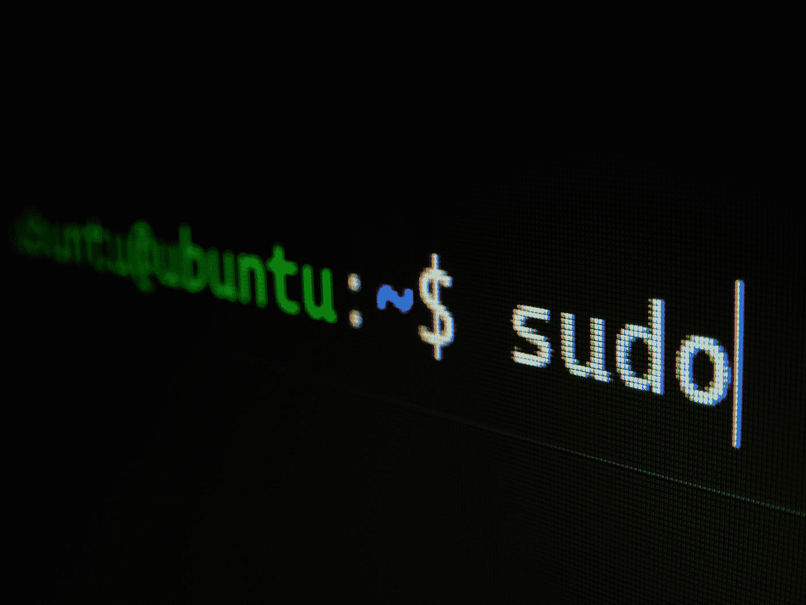
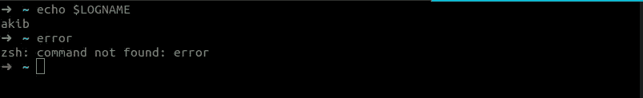
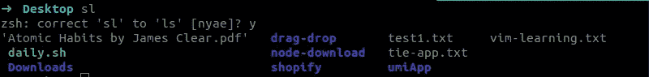
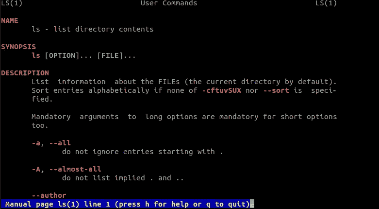
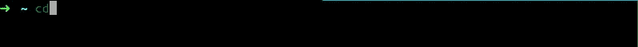

# 我用 Zsh 和 Oh my Zsh 美化了我的 Ubuntu 终端！

> 原文：<https://javascript.plainenglish.io/save-your-time-when-using-the-terminal-with-zsh-and-oh-my-zsh-8e51485afa91?source=collection_archive---------11----------------------->



Photo by [Gabriel Heinzer](https://unsplash.com/@6heinz3r?utm_source=medium&utm_medium=referral) on [Unsplash](https://unsplash.com?utm_source=medium&utm_medium=referral)

> 在我的 [***个人博客***](https://akib.dev/) 上阅读更多文章。

如果你像我一样花很多时间在终端上，是时候考虑让你的终端看起来更好了。这可以帮助你感觉更专注，从而提高你的生产力，同时节省你的时间和精力。

> 如果你在终端上花了很多时间，为什么它看起来如此乏味？让我们把它变漂亮。

为什么是`zsh`？

好吧。问得好。我很感激。

`zsh`拥有强大的默认自动完成功能，以及更多的配置选项。`zsh`配置有一个开源的、社区驱动的框架`oh my zsh`，它有数千个有用的功能、助手、插件和主题。`zsh`也兼容`bash`语法。

## 安装 Zsh

在我们的系统中默认的 shell 是`bash`。要使用`zsh`，我们必须将默认的 shell `bash`改为`zsh`。为此，我们必须在我们的系统上安装`zsh`。打开您的终端并执行这个命令。

```
sudo apt -y install zsh
```

检查它是否安装成功。

```
zsh --version
```

如果你遇到任何错误，尝试谷歌并解决它们。

## 更换外壳

我们系统的默认 shell 是`bash`。我们得把它改成`zsh`。

```
chsh -s $(which zsh)
```

`chsh`看台换壳。更换外壳后，我们从终端注销或重启电脑。然后，当您再次打开终端时，`zsh`会提示`zsh`配置功能。我们可以按照说明来配置外壳。但是我们想按下`0`退出，什么也不做。

## 安装哦我的 Zsh！

我们可以用两种方式安装它— `curl`和`wget`。你可以选择你喜欢的。

```
sh -c "$(curl -fsSL https://raw.github.com/ohmyzsh/ohmyzsh/master/tools/install.sh)"
```

或者，

```
sh -c "$(wget https://raw.github.com/ohmyzsh/ohmyzsh/master/tools/install.sh -O -)"
```

当你成功做到这一点后，哇哦！我们的终端提示改变了。现在四处玩耍。

它提供自动完成功能，并通过按`tab`在命令、文件夹和文件之间切换。


当前面的命令成功执行时，突出显示绿色提示符，当出现错误时，突出显示红色提示符。



你感觉如何？很酷吗？

## 调整`.zshrc`

为此，我们将调整我们的`.zshrc`文件。

```
vim ~/.zshrc
```

你看，有很多配置都被注释掉了。我们需要改变其中的一些。

*   注释掉`$PATH`
*   通过设置`ENABLE_CORRECTION=”true”`启用自动校正
*   通过设置`UPDATE_ZSH_DAYS="how many days you prefer"`自动更新时间
*   其他的`bash`配置比如`nvm`，把它们添加到文件的末尾(如果你有的话)。

如果自动更正功能检测到输入错误的命令，它会建议进行命令更正。



这 4 个选项是:

*   `n`(否):运行输入错误的命令
*   `y`(是):运行建议的命令
*   `a`(中止):停止，什么都不做
*   `e`(编辑):在重新运行之前编辑您的命令

## 更改主题

如果想换个主题，可以在这里探索[你最喜欢的一个](https://github.com/ohmyzsh/ohmyzsh/wiki/Themes)。如果你找到一个。将此`ZSH_THEME=”theme name”`添加到`.zshrc`文件中并保存。那就跑

```
source ~/.zshrc
```

默认的是我的最爱。你可以从这里找到你喜欢的主题。

## 添加插件

现在我们想使用`oh my zsh`插件让它更酷。我们已经通过默认主题添加了`git`插件。

*   **彩色手册页**

我们需要经常读取命令的细节，为此我们使用`man`命令。那很难读。帮助我们轻松阅读。这个插件突出显示文本。

将此`plugins=(git colored-man-pages)`添加到`.zshrc`文件中并保存。那就跑

```
source ~/.zshrc
```

现在`man`页面将看起来像这样。



*   **zsh-自我暗示**

`colored-man-pages`是默认安装。但是我们必须添加它。在里面克隆插件。

```
git clone https://github.com/zsh-users/zsh-autosuggestions ${ZSH_CUSTOM:-~/.oh-my-zsh/custom}/plugins/zsh-autosuggestions
```

然后将此`plugins=(git colored-man-pages zsh-autosuggestions)`添加到`.zshrc`文件中并保存。那就跑

```
source ~/.zshrc
```

当你想再次运行之前的命令时，这个插件非常方便。它将显示我们命令历史中的匹配命令。我们可以用箭头键来切换命令。

当我输入`cd`时，我会立即得到建议。


按右箭头键接受。


*   **zsh-语法-高亮显示**

我们必须添加它。在里面克隆插件。

```
git clone https://github.com/zsh-users/zsh-syntax-highlighting.git ${ZSH_CUSTOM:-~/.oh-my-zsh/custom}/plugins/zsh-syntax-highlighting
```

然后将这个`plugins=(git colored-man-pages zsh-autosuggestions zsh-syntax-highlighting)`添加到`.zshrc`文件中并保存。那就跑

```
source ~/.zshrc
```

它突出显示命令行中的命令。它还将您键入的命令的名称着色为绿色(如果找到了),红色(如果没有找到)。

如果它找到了命令



如果它没有找到该命令


## **最后一句话**

这里是我最喜欢的插件和主题。你可以在这里找到你喜欢的主题[和插件](https://github.com/ohmyzsh/ohmyzsh/wiki/Themes)[。让我知道你最喜欢的主题和插件是什么。](https://github.com/ohmyzsh/ohmyzsh/wiki/Plugins)

欢迎来到美丽的终点站。好好享受吧！

> 有兴趣的话多看看我的 [***个人博客***](https://akib.dev/) 的文章。

*更多内容请看*[***plain English . io***](http://plainenglish.io/)