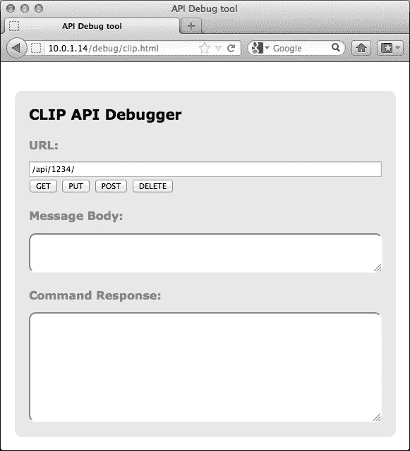
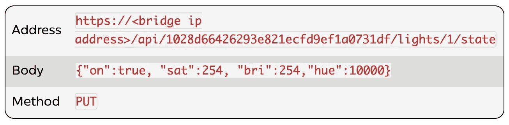
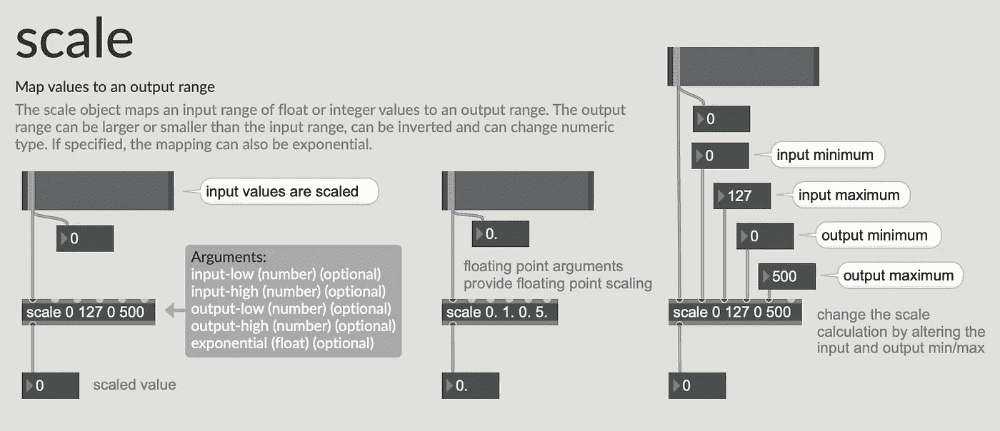
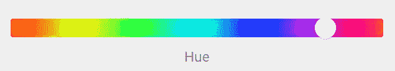
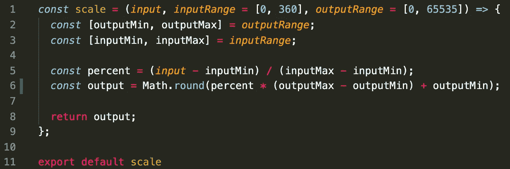
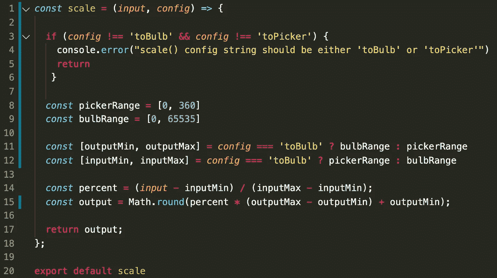
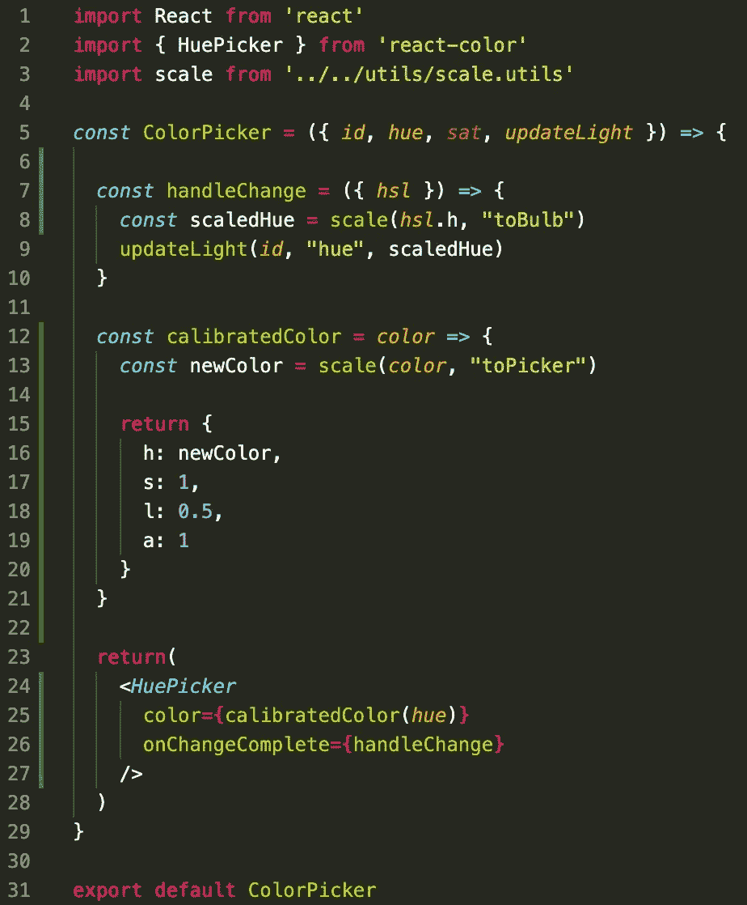

# 缩放数据:从 Max/MSP 到 JavaScript

> 原文：<https://javascript.plainenglish.io/scaling-data-in-max-msp-or-javascript-65440d919e06?source=collection_archive---------11----------------------->

# 介绍

最近，我在摆弄一个 [React](https://reactjs.org/) 应用程序来控制我家周围的[飞利浦 Hue](https://developers.meethue.com/) 智能 LED 灯。我想玩一些低风险的东西，我想最终在一个本地触摸屏连接的 [Raspberry Pi](https://www.raspberrypi.org/) 上运行，甚至可以挂在墙上！

如果您不知道，飞利浦 Hue 智能照明生态系统向您的本地网络公开了一个 REST-ish [API](https://developers.meethue.com/develop/hue-api/) ，您可以通过 GET 请求查询一般设置、状态、时间表和配置，然后使用 PUT 请求进行更改。他们的网站上也有很棒的开发者资源，包括一些有用的软件开发工具包。

作为额外的奖励，它们甚至包括 Philips Hue Bridge 上的板载调试器(本质上充当 API 服务器)，使您能够在浏览器中尝试请求。对于入职:谁还能要求更多？

你可以在这里参观:`https://<bridge ip address>/debug/clip.html`

Philip Hue Bridge’s built-in API debugger

要找到 IP 地址，我建议使用 [Fing](https://www.fing.com/) 或 [Nmap](https://nmap.org/) 。这是他们更多的炸弹文件:

PUT request example to change the state of a bulb

# 为什么要使用缩放？

## TL；DR = >

我的编码之旅始于一个面向艺术家和创意人员的视觉编码生态系统，名为 [Max/MSP](http://www.cycling74.com) 。它基本上可以让你接受任何输入，对它做一些很酷的事情，并以任何格式输出给任何设备、软件或硬件。

我发现自己做的一个常见任务是将 MIDI 控制器值(0–127)缩放到 DMX 值(0–255)。MIDI 代表“乐器数字接口”我用 MIDI 把 USB MIDI 控制器插到我的 MacBook 上，控制灯光和各种东西。DMX 是…

DMX, American rapper

…DMX 也代表“数字多路复用”，是一种串行通信协议，用于控制戏剧制作中的照明设备和调光器。

以下是 Max 中缩放对象的文档:

scale object documentation

# 回过神来

我发现了一个很棒的 UI 组件库，用于为色调选择色调，哈。我使用了 [React Color](https://casesandberg.github.io/react-color/) 的`<HuePicker />`组件，但是很快就遇到了范围不匹配的问题。

HuePicker component

`HuePicker`期望一个从`0`到`360`的范围，因为色调通常在一个圆上直观地表示。在这个实现中，红色既是`0`又是`360`，以完成环绕圆圈。有趣的是，飞利浦的色调值在`0`到`65535`的范围内。

因此，我需要一种基于`inputMin`、`inputMax`和`outputMin`、`outputMax`将输入缩放为输出的方法。下面是我使用的实现:

scaling function

这适用于从`[0, 360]`到`[0, 65535]`的缩放，但我在这里使用的是受控组件，还需要以另一种方式向下缩放:`[0, 65535]`到`[0, 360]`。我对它进行了重构，以接受一个配置参数，使这个函数更加动态。这是我想到的:

refactored scaling function

这是我做的`ColorPicker`组件。我在第 8 行和第 13 行调用`scale()`

scaling function in use

# 后续步骤

接下来，我将从颜色选择器 UI 的线性表示转移到三维表示来处理其他属性:亮度和饱和度。