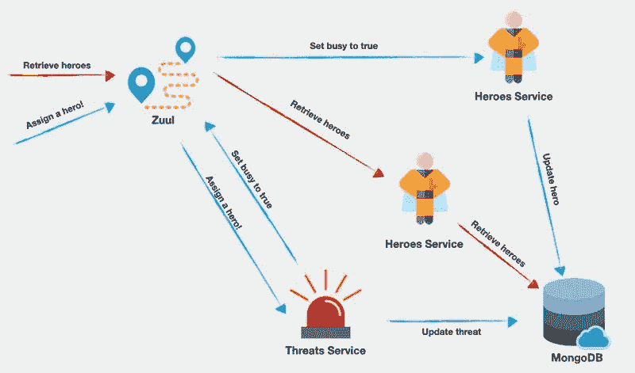

# 在共享的 MongoDB Atlas 云持久层上扩展 Node.js JavaScript 微服务

> 原文：<https://javascript.plainenglish.io/scaling-node-js-javascript-microservices-on-shared-mongodb-atlas-cloud-persistence-layers-620bf975ebfd?source=collection_archive---------6----------------------->


使用微服务架构在 Node.js 上构建 JavaScript 应用程序，使您能够通过添加更多服务实例来扩展应用程序，以响应不断增加的负载水平。但是当一个服务的多个实例处理相同的数据时，您的应用程序将有一个额外的设计需求:您将需要一个*持久层*，服务实例可以使用它来存储和共享数据。

这篇文章将向您展示如何使用数据库作为 JavaScript 微服务应用程序的持久层。您将看到该应用程序如何使用网飞尤里卡和网飞祖尔来进行服务发现和负载平衡。您将能够应用您在这里学到的技术来构建可以纵向扩展和横向扩展的应用程序，同时避免自己构建服务发现和负载平衡的复杂性。

您还将获得使用 [MongoDB Atlas](https://www.mongodb.com/cloud/atlas) 作为数据库即服务(DBaaS)的实践介绍。基于云的数据库是基于云的微服务应用程序的自然补充，MongoDB Atlas 可以在 Azure、AWS 或 Google Cloud 上运行。

# 先决条件

为了完成这篇文章中的任务，你需要:

*   [Node.js 和 npm](https://nodejs.org/)(node . js 安装也会安装 NPM。)
*   [Java 运行时环境 SE](https://www.java.com/en/download/)
*   [MongoDB Atlas 帐户](https://cloud.mongodb.com/user)(选择了一个自由层集群)

要从这篇文章中最有效地学习，你应该具备以下条件:

*   JavaScript、Node.js 和数据库的工作知识
*   对 HTTP 协议有所了解

为了给你一个好的开始，这篇文章是建立在本系列前两篇文章的代码和概念之上的:

[使用 Node.js 构建 JavaScript 微服务](https://medium.com/swlh/building-javascript-microservices-with-node-js-d88bf0bb2b92) —介绍微服务的概念，并向您展示如何在 Node.js 上使用 JavaScript 构建微服务应用程序。

[在 Node.js 上运行的 JavaScript 微服务中为服务发现和动态路由实现 Eureka 和 Zuul](https://medium.com/javascript-in-plain-english/implementing-eureka-and-zuul-for-service-discovery-and-dynamic-routing-in-javascript-microservices-45a7ac18837a?)—演示如何将网飞 Eureka 服务注册中心和网飞 Zuul 的动态路由和负载平衡集成到微服务应用中。

如果您对这些概念不熟悉，您可能想阅读这些帖子，并从它们开始一步一步地构建项目。如果您熟悉微服务，并希望专注于学习实现持久层，那么配套的资源库中有您开始这篇文章所需的代码。下面的说明将向您展示如何编写本系列前两篇文章中的代码。

案例研究项目包括四项服务。Node.js 上运行着两个 JavaScript 服务:

维护超级英雄的列表、他们的属性以及他们的忙/闲状态。

`threats-service`–维护一个危险情况列表，以及负责应对各种威胁的英雄。

这些服务使用一个助手函数`registerWithEureka`，这使得它们能够方便地连接到服务发现系统。这些组件共同构成了应用程序的功能方面。

还有两个 Java 服务为 Node.js 服务提供基础设施支持:

**网飞尤里卡** —是一个服务注册和发现工具，使服务能够找到其他服务，而不需要知道它们在哪里运行。

**网飞 Zuul** —是一个负载平衡器和动态路由服务，它从 Eureka 获取每个服务的可用实例列表，在服务之间路由请求，并在服务器实例之间平衡负载。

这些 Java 服务是在 Java 归档文件中提供的。jar)文件:一旦安装了 Java SE 运行时环境，您需要做的就是运行它们。它们是打包的，所以您可以在自己的项目中使用它们，无需修改。

该项目的架构如下所示:


如果您没有遵循之前的帖子并在这样做的同时构建了项目，或者您想要开始新的代码副本，那么您可以为这篇帖子从 [GitHub 仓库中克隆项目。](https://github.com/maciejtreder/introduction-to-microservices)

通过在您想要创建项目目录的目录中执行以下命令来克隆它:

```
git clone [https://github.com/maciejtreder/introduction-to-microservices.git](https://github.com/maciejtreder/introduction-to-microservices.git)
cd introduction-to-microservices/heroes
git checkout step4
npm install
cd ../threats
npm install
cd ../eureka-helper
npm install
cd ..
```

请注意，这些步骤包括在适当的目录中安装所需的 npm 软件包。

通过在应用程序的根目录中执行以下命令行指令来启动 Eureka。这将是*微服务简介*目录，除非您在克隆存储库时更改了目标目录。

Windows 用户应该在 Windows 命令提示符(cmd.exe)窗口而不是 PowerShell 窗口中执行以下指令以及所有后续指令，除非另有说明。

```
java -jar eureka-service-0.0.1-SNAPSHOT.jar
```

在应用程序的根目录中打开另一个控制台窗口，并通过执行以下命令行指令启动 Zuul 服务。这将是您打开的第二个控制台窗口:

```
java -jar zuul-0.0.1-SNAPSHOT.jar --eureka.instance.leaseRenewalIntervalInSeconds=30
```

注意启动 Zuul 时使用的参数。它减少了 Zuul 从 Eureka 检索服务信息的时间间隔。这在开发环境中很有用，但是在生产环境中，您应该坚持使用默认设置。Spring 文档提供了为什么注册服务的过程相对[缓慢](http://projects.spring.io/spring-cloud/spring-cloud.html#_why_is_it_so_slow_to_register_a_service)的背景。

在项目根目录中打开第三个控制台窗口，并执行以下命令行指令:

```
node threats/threats.js 3000
```

在项目根目录中打开第四个控制台窗口，并执行以下命令行指令:

```
node heroes/heroes.js 3001
```

通过在新的控制台窗口中从项目根目录执行下面的 curl 命令，检查是否一切正常。这将是您打开的第五个控制台窗口:

```
curl -i --request POST --header "Content-Type: application/json" --data "{\"heroId\": 1, \"threatId\": 1}" localhost:8080/threats-service/assignment
```

如果服务运行正常，您应该会看到类似于 curl 的以下控制台输出的结果:

```
HTTP/1.1 202 
X-Application-Context: application:8080
X-Powered-By: Express
ETag: W/"79-ER1WRPW1305+Eomgfjq/A/Cgkp8"
Date: Fri, 05 Apr 2019 18:05:54 GMT
Content-Type: application/json;charset=utf-8
Transfer-Encoding: chunked{"id":1,"displayName":"Pisa tower is about to collapse.","necessaryPowers":["flying"],"img":"tower.jpg","assignedHero":1}
```

# 秤婴儿秤！

一场 UFO 入侵即将降临地球！你的英雄们很快就会变得非常忙碌，所以你需要为`heroes-service`增加的流量做好准备。有了尤利卡和祖尔，一切都变得简单了。您需要做的是添加另一个`hero-service`实例，并向 Eureka 注册它。Zuul 将自动检索关于新服务实例的信息。

在项目的根目录中打开一个新的控制台窗口(6 号),并执行以下命令行指令:

```
node heroes/heroes.js 3002
```

请注意，`heroes-service`的新实例被分配了一个不同的端口号 3002，而服务的原始实例被分配了端口 3001。虽然这对于在同一个 Node.js 服务器(或任何其他服务器)上使用同一个 Eureka 句柄的同一个服务的两个实例是必要的，但是在不同机器上运行的多个服务实例可以使用同一个端口号。

`heroes-service`的新实例应该报告以下内容:

```
Registering heroes-service with Eureka
Heroes service listening on port 3002
Registered with Eureka.
```

您还应该在其控制台窗口中看到向 Eureka 注册的新实例，该窗口将显示类似如下的状态消息:

```
2019-04-23 16:27:49.739  INFO 30580 --- [nio-8761-exec-3] c.n.e.registry.AbstractInstanceRegistry  : Registered instance HEROES-SERVICE/heroes-service-3002 with status UP (replication=false)
2019-04-23 16:27:50.246  INFO 30580 --- [nio-8761-exec-5] c.n.e.registry.AbstractInstanceRegistry  : Registered instance HEROES-SERVICE/heroes-service-3002 with status UP (replication=true)
2019-04-23 16:28:05.235  INFO 30580 --- [a-EvictionTimer] c.n.e.registry.AbstractInstanceRegistry  : Running the evict task with compensationTime 0ms
```

打开浏览器选项卡，导航到 [http://localhost:8761，](http://localhost:8761,)您在启动第一个 Java 时创建的 Eureka 实例的 URL。罐子，上图。

你应该看到尤里卡的 [Spring Boot](https://spring.io/projects/spring-boot) 状态页面，如下所示。在当前向 Eureka 注册的*实例下，您应该看到 HEROES-SERVICE 对于*可用性区域*的值为 2，端口 3001 和 3002 处的两个实例在*状态*下列为“启动”。您还应该看到端口 3000 上显示为“UP”的威胁服务。*


现在您需要给 Zuul 一个机会从 Eureka 检索关于新实例`heroes-service`的信息。这不会花费超过 30 秒的时间(由启动 Zuul 时使用的参数`--eureka.instance.leaseRenewalIntervalInSeconds=30`指定),并且将由类似如下的日志条目指示:

```
2019-04-29 19:55:33.834  INFO 14446 --- [freshExecutor-0] com.netflix.discovery.DiscoveryClient    : Getting all instance registry info from the eureka server
```

每当向`heroes-service`发出请求时，Zuul 使用循环算法从两个实例中选择一个来处理请求。

排列您的桌面，以便您可以看到两个 heroes-service 实例的控制台窗口，以及您之前执行 curl 命令的窗口。每个`heroes-service`实例应该每隔几秒钟显示以下消息:

```
Successfully sent heartbeat to Eureka.
```

在执行前面 curl 命令的控制台窗口中，多次执行下面的 curl 命令，同时在`heroes-service`窗口中观察输出:

```
curl -i --request GET localhost:8080/heroes-service/heroes
```

当您重复执行 curl 命令时，您应该会看到在每个窗口中交替显示以下状态消息:

```
Returning heroes list
```

这展示了 Zuul 的[负载平衡](https://github.com/Netflix/zuul/wiki/Core-Features#load-balancing)特性。使用循环算法，Zuul 将请求发送给所请求服务的最可用实例。在这个简单的例子中，它(通常)将请求发送给它没有发送前一个请求的实例。

仔细查看一下`heroes-service`实例的控制台日志。如您所见，请求被路由到这两个服务器:


在连续执行 curl 命令时，查看控制台窗口中的输出。您将看到，当 Zuul 在两个实例之间交替时，每个实例都有不同的响应，如下所示:


`heroes-service`的一个实例回应说主角“Cooper”很忙，而另一个实例说他不忙。你给他分配了一个威胁，但只有一个实例似乎得到了消息。

为什么？因为两个实例都将关于`heroes`对象的信息保存在内存中，并且不会在彼此之间共享关于状态变化的信息。每个实例只报告它所知道的关于它所执行的任务的信息。

# 用 MongoDB 添加持久层

为了解决服务实例在内存中保存独立数据集的问题，您可以添加一个*持久层*来保存由多个服务实例共享的数据元素的值。当响应更改数据的请求时，每个服务都将写入和读取持久层。

使用数据库是向系统添加持久层的一种常见方式。它具有非易失性存储器的额外优势，这意味着即使其他系统组件没有运行，也可以从数据存储中读取系统状态。它还可以用来维护系统状态随时间变化的记录。例如，在这个项目中，了解一个英雄在一段时间内面临的威胁可能会有所帮助。

在这个项目中，持久层将存储关于哪些英雄被分配到特定威胁的信息。当英雄服务的一个实例将一个英雄分配给一个威胁时，其他实例会知道这一点，并且他们会知道一个英雄什么时候忙，所以他们不会试图同时给一个英雄分配两个威胁。

持久层还使您能够添加或减少特定服务的实例，以响应对这些服务的不同需求。当负载平衡器调用新实例时，它将使用数据库中的数据无缝地开始处理请求。相反，当需求较低时，可以从 Eureka registry 中撤回一个实例以降低处理成本:其最近处理的请求的结果将存储在数据库中。

下图描述了新的系统架构:


导航至[https://cloud.mongodb.com/user](https://cloud.mongodb.com/user)并登录您的账户。要注册新集群，请点击*构建新集群*，然后选择最合适的地区和云基础设施提供商。(您可以选择“可用的免费层”区域，以避免运营费用。)

当您的集群准备就绪时，单击 **Connect** 按钮，并按照 *Connect to Cluster()* 面板上的提示:1)将您的连接 IP 地址列入白名单，2)创建一个 MongoDB 用户。

**提示:**创建密码时，避免使用在系统命令行中输入时必须进行 URL 编码的字符。请务必将您的 MongoDB 用户名和密码保存在安全的地方。

在*选择连接方式*步骤中，选择*连接 Mongo Shell* 。按照适当的说明下载、安装和配置 MongoDB Shell，以便在您的系统上运行。

当您将 MongoDB Shell 配置为在您的系统上运行时，将提供的命令行指令复制到一个安全的地方。在*连接到集群()*对话框打开的情况下，保持该选项卡打开；你很快就会回来。

在控制台窗口中执行命令行指令来启动 shell。您需要输入刚刚创建的用户密码。

**给 Windows 用户的提示:**在 PowerShell 窗口中执行下面的 MongoDB 命令行指令；这将使您能够在一个步骤中粘贴并执行整个指令块。

成功连接到 MongoDB 实例后，通过执行以下 MongoDB 命令行指令向其添加数据:

返回浏览器选项卡，打开*连接到集群()*对话框。

点击**返回**按钮返回到*选择连接方式*步骤。

点击**连接您的应用**。

在*选择您的驱动程序版本*下，选择的值应该是:

驱动程序:Node.js

版本:3.0 或更高版本

仅选择**连接串**，点击**复制**按钮。保存连接字符串；稍后您将使用它将 Node.js 服务连接到 MongoDB Atlas 数据库。

根据您选择的云服务，连接字符串应该如下所示:

```
mongodb+srv://youruserid:<password>@cluster0-se0aa.azure.mongodb.net/test?retryWrites=true
```

# 实现使用持久层的服务的新版本

您已经创建了持久层，并在数据库中植入了相同的数据，这些数据被硬编码到当前版本的`heroes-service`和`threats-service`的源代码中，但是每个服务的代码都必须更新才能使用数据库。在传统的应用程序中，这将需要更新代码并部署它，停止应用程序的原始版本，并重新启动新版本。很难做到这一点而不给用户造成服务中断。

使用微服务，您可以将新版本与当前版本一起部署，然后在您对新版本正常工作感到满意时，将旧版本脱机。用户体验到 100%的正常运行时间和无缝集成到应用程序体验中的新功能。您可以通过启动其他实例来扩展新版本的服务。当您在代码中实现持久层功能时，您将看到这个过程的运行。

在应用根目录下新建一个目录 */heroes-v2* 。

通过在 */heroes-v2* 目录中执行以下命令行指令，初始化 npm 项目并安装所需的 npm 依赖项:

```
npm init -y
npm install body-parser express mongodb
```

在/ *heroes-v2* 目录下创建一个新文件 *heroes.js* ，并插入以下 JavaScript 代码:

用从 MongoDB Atlas*Connect to Cluster*对话框中复制的连接字符串的 URL 部分替换`dbUrl`赋值的占位符文本。连接字符串将类似于:

```
mongodb+srv://youruserid:<password>@cluster0-se0aa.azure.mongodb.net/test?retryWrites=true
```

对于`threats-service`来说，过程是一样的。

在应用程序根目录下创建一个新目录 */threats-v2* 。

通过在 */threats-v2* 目录中执行以下命令行指令，初始化 npm 项目并安装所需的 npm 依赖项:

```
npm init -y
npm install body-parser express request mongodb
```

在/ *threats-v2* 目录下创建一个新文件 *threats.js* ，并插入以下 JavaScript 代码:

在/*threats-vs/threats . js*中，用 MongoDB 连接字符串替换`dbUrl`占位符。

如果您想使用 GitHub 存储库中的代码赶上这一步，请在您想要创建项目目录的目录中执行以下命令:

```
git clone [https://github.com/maciejtreder/introduction-to-microservices.git](https://github.com/maciejtreder/introduction-to-microservices.git)
cd introduction-to-microservices/heroes
git checkout step5
npm install
cd ../threats
npm install
cd ../eureka-helper
npm install
cd ../threats-v2
npm install
cd ../heroes-v2
npm install
cd ..
```

# 验证当前配置

至此，您已经修改了许多文件并运行了许多程序。在继续之前，最好验证应用程序的所有部分都已就位并正确运行。

您应该有 5 个进程在单独的控制台窗口中运行。

两个 Java 应用程序:

`java -jar eureka-service-0.0.1-SNAPSHOT.jar`

`java -jar zuul-0.0.1-SNAPSHOT.jar`

这些程序将定期显示状态信息。

三个 Node.js 服务:

`node threats/threats.js 3000`

`node heroes/heroes.js 3001`

`node heroes/heroes.js 3002`

这些服务将定期显示心跳状态消息。

通过在浏览器中导航到 [http://localhost:8761](http://localhost:8761) 来验证所有服务是否已注册到 Eureka。您应该看到这三个服务列在当前向 Eureka 注册的*实例下。*

通过在控制台窗口中执行以下 curl 命令，检查服务是否可以相互通信。(Windows 用户应该使用 Windows 命令提示符窗口，而不是 PowerShell 窗口。)

```
curl -i --request POST --header "Content-Type: application/json" --data "{\"heroId\": 1, \"threatId\": 1}" localhost:8080/threats-service/assignment
```

该命令将 hero 1 分配给 threat 1，并在 HTTP 标头后生成以下 JSON 输出:

```
{"id":1,"displayName":"Pisa tower is about to collapse.","necessaryPowers":["flying"],"img":"tower.jpg","assignedHero":1}
```

通过在控制台窗口中执行您在 *Connect 与 Mongo Shell* 中获得的命令行指令，启动 MongoDB 命令行界面。您需要输入创建连接时使用的密码。

执行以下 CLI 指令，验证所有三个数据集合都存在:

```
MongoDB Enterprise Cluster0-shard-0:PRIMARY> show collections
```

您应该看到列出了三个集合:`heroes`、`powers`和`threats`。

使用以下 CLI 说明验证每个集合:

```
MongoDB Enterprise Cluster0-shard-0:PRIMARY> db.threats.find()
MongoDB Enterprise Cluster0-shard-0:PRIMARY> db.heroes.find()
MongoDB Enterprise Cluster0-shard-0:PRIMARY> db.powers.find()
```

每个命令的输出应该与您在上面为`threats`、`heroes`和`powers`集合添加的数据相对应。

让 MongoDB CLI 在这个控制台窗口中运行。稍后您将使用它来验证信息是否被正确地写入数据库。

# 介绍更新的服务

有了持久层，您可以从微服务架构的优势之一中受益:在保持 100%系统正常运行的同时，很容易更新服务。不用重新启动当前正在运行的服务实例，您可以用更新的代码启动新的实例，等待一段时间直到它们注册到 Eureka，然后删除旧的服务实例。

这种方法还使您能够在生产环境中测试新代码，而无需提交整个应用程序来使用它。您可以注册已更新服务的一个实例，并在更新其余实例之前监控其性能。如果新版本有错误或性能问题，只有一小部分服务请求会受到影响。

首先在新的控制台窗口(编号 6)中启动更新的`threats-service`的新实例:

```
node threats-v2/threats.js 5000
```

大约 30 秒钟后，Zuul 将从 Eureka 中检索关于这个新实例的信息，这将由一个类似如下的日志条目来指示:

```
2019-03-20 16:20:37.469  INFO 50245 --- [trap-executor-0] c.n.d.s.r.aws.ConfigClusterResolver      : Resolving eureka endpoints via configuration
```

通过在两个新的控制台窗口(编号 7 和 8)中执行以下命令行指令，启动新`heroes-service`的两个新实例:

```
node heroes-v2/heroes.js 5001
node heroes-v2/heroes.js 5002
```

在浏览器中，导航至 Eureka 状态面板，网址为 [http://localhost:8761。](http://localhost:8761.)您应该会看到四个`heroes-service`实例和两个`threats-service`实例。新版本在 5XXX 端口上运行，旧实例在 3XXX 系列端口上运行。

您现在可以停止在端口 3001 和 3002 上运行的原始版本的实例和在端口 3000 上运行的原始版本的实例。您还可以关闭相关的控制台窗口，将打开的控制台窗口减少到更易于管理的五个。

再次检查 Eureka 状态页面，验证服务的旧实例是否已被取消注册。注销所有服务可能需要 5 分钟或更长时间。当尤里卡的服务被移除时，你可以继续这个项目。

通过这些简单的操作，您已经将您的应用程序转换为第二版的`heroes-service`和`threats-service`。您的应用程序现在可以使用 MongoDB 持久层了。

从体系结构的角度来看，更新服务的过程是这样的:


# 验证版本 2 服务正在更新持久层

第 1 版服务将英雄分配给内存中的威胁，这导致了`heroes-service`实例所知道的英雄分配状态之间的潜在冲突。版本 2 的服务将从数据库中获得英雄、威胁和力量的列表。他们也将在那里存储他们的分配数据。

要给一个威胁分配一个英雄，在一个新的(或未被占用的)控制台窗口中执行以下 curl 命令:

```
curl -i --request POST --header "Content-Type: application/json" --data "{\"heroId\": 1, \"threatId\": 1}" localhost:8080/threats-service/assignment
```

curl 命令应该从端口 8080 上的 Zuul 返回以下响应:

```
HTTP/1.1 202 
X-Application-Context: application:8080
X-Powered-By: Express
ETag: W/"79-ER1WRPW1305+Eomgfjq/A/Cgkp8"
Date: Tue, 30 Apr 2019 13:38:42 GMT
Content-Type: application/json;charset=utf-8
Transfer-Encoding: chunked{"id":1,"displayName":"Pisa tower is about to collapse.","necessaryPowers":["flying"],"img":"tower.jpg","assignedHero":1}
```

通过在运行 Mongo CLI 的控制台窗口中运行以下 MongoDB CLI 命令，验证 hero 分配是否已存储在数据库中:

```
db.heroes.findOne({id:1})
db.threats.findOne({assignedHero:1})
```

数据库查询应该返回以下结果:

```
{
        "_id" : ObjectId("5cc84fdb0df9400439fa6299"),
        "id" : 1,
        "type" : "spider-dog",
        "displayName" : "Cooper",
        "powers" : [
                1,
                4
        ],
        "img" : "cooper.jpg",
        "busy" : true
}{
        "_id" : ObjectId("5cc814820df9400439fa628d"),
        "id" : 1,
        "displayName" : "Pisa tower is about to collapse.",
        "necessaryPowers" : [
                "flying"
        ],
        "img" : "tower.jpg",
        "assignedHero" : 1
}
```

如果您留意 Eureka、Zuul 和服务的控制台窗口，您可能会发现其中一个`heroes-service`实例正在处理 curl 请求。

通过从持久层获取英雄的状态，验证两个`heroes-services`实例是否返回威胁分配的一致结果。这样做的过程与您之前用来演示旧版本服务的实例返回不一致结果的过程相同。

如果有必要的话，花点时间整理一下你的桌面，这样你就可以看到三个服务的控制台窗口，Eureka，Zuul，以及你运行 curl 命令的窗口。

重复执行下面的 curl 命令行指令，注意请求是通过 Zuul、Eureka 和某个`heroes-service`实例传递的。这两个实例应该交替处理请求，因为它们被 Zuul 以循环方式调用。

```
curl -i --request GET localhost:8080/heroes-service/heroes
```

仔细注意返回给 curl 请求的响应。您将会看到`heroes-service`的每个实例都返回关于哪些英雄当前正忙的一致信息，并且这些信息与您之前执行的数据库查询的结果相匹配。如果所有这些结果在您的开发环境中都是正确的，那么您已经正确地实现了持久层。

下图显示了应用程序中*请求*的流程。为简单起见，尤里卡服务不包括在内；因为它只提供服务注册，所以不会影响系统中的信息流。



描述了两种情况。

蓝色箭头显示用户要求应用程序为一个威胁分配一个英雄:

1.  一个 HTTP POST 请求到达位于 [http://localhost:8080](http://localhost:8080) 的 Zuul，路由为`threats-service`分配端点:*/分配*。POST 请求包括一个 JSON 有效载荷，指定威胁和请求的英雄。
2.  Zuul 将 POST 请求转发给`threats-service`实例(端口 5000)。
3.  威胁服务 `instance asks Zuul to perform a request to` 英雄服务 `and set the requested hero's status to busy.`
4.  Zuul 选择一个可用的英雄-服务 `instances and sends the request from` 威胁-服务`.`
5.  被选中的英雄-服务 `instance updates the status of the hero in database.`

红色箭头显示用户询问英雄列表:

1.  在 [http://localhost:8080](http://localhost:8080) 处，一个 HTTP GET 请求通过英雄服务`heroes list endpoint: */heroes*.`的路由到达 Zuul
2.  Zull 将 GET 请求转发给一个可用的英雄服务 `instances (in this case, to the second one) based on its round robin load-leveling algorithm .`
3.  heroes-service '实例从共享的 MongoDB 数据库中检索请求的数据。因为所有服务实例都共享持久层，所以每个服务都可以检索由任何其他实例写入的最新信息。

# 摘要

在本文中，您了解了持久层如何对微服务应用程序的架构做出贡献，以及如何使用 MongoDB Atlas 实现基于云的持久层。您看到了如何通过向系统添加新实例来扩展服务。您看到了如何使用网飞·尤里卡和网飞·祖尔为微服务发现、动态路由和负载平衡提供开箱即用的解决方案。将整个系统放在一起，您看到了服务的多个实例如何通过持久层轻松共享信息，而不需要复杂的路由或数据操作功能。您还看到了如何将新版本的服务添加到正在运行的应用程序中，以提供新功能的无缝升级路径。

下一步[使用 JSON Web 令牌和 Twilio Authy](https://medium.com/@maciejtreder/protecting-javascript-microservices-on-node-js-with-json-web-tokens-and-twilio-authy-90d8ed780f5e) 保护 Node.js 上的 JavaScript 微服务。

# 额外资源

[架构风格和基于网络的软件架构的设计](https://www.ics.uci.edu/~fielding/pubs/dissertation/top.htm)，罗伊·托马斯·菲尔丁，2000——菲尔丁的博士论文描述了表述性状态转移(第五章)和其他架构风格。

[微服务](https://en.wikipedia.org/wiki/Microservices)——尽管有缺陷，维基百科的文章是一个很好的起点，可以找到更多关于微服务架构和实现的信息。

[Node.js](https://nodejs.org/en/docs/) —为应用服务器提供参考文档。

[MongoDB 4.0 手册](https://docs.mongodb.com/manual/) —涵盖了用 JavaScript 和其他编程语言实现 MongoDB。

[Spring Cloud 网飞项目](https://github.com/spring-cloud/spring-cloud-netflix)“…通过自动配置和绑定到 Spring 环境和其他 Spring 编程模型习惯用法，为 Spring Boot 应用程序提供网飞操作系统集成。”

*我是 Maciej Treder，通过*[*【contact@maciejtreder.com】*](mailto:contact@maciejtreder.com)*[*https://www.maciejtreder.com*](https://www.maciejtreder.com/)*或@ maciejtreder on*[*GitHub*](http://github.com/maciejtreder)*[*Twitter*](https://twitter.com/maciejtreder)*和*[*LinkedIn*](https://www.linkedin.com/in/maciej-treder/)*。***

***本帖原载于 Twilio 博客*[](https://www.twilio.com/blog/scale-node-js-javascript-microservices-shared-mongodb-atlas)**。****