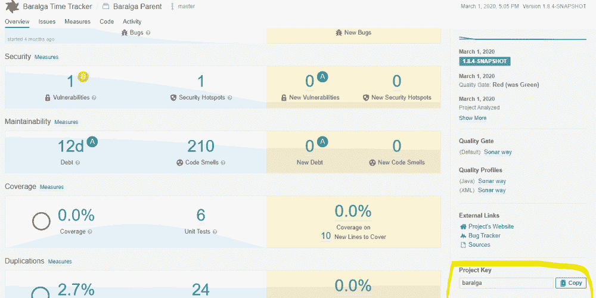
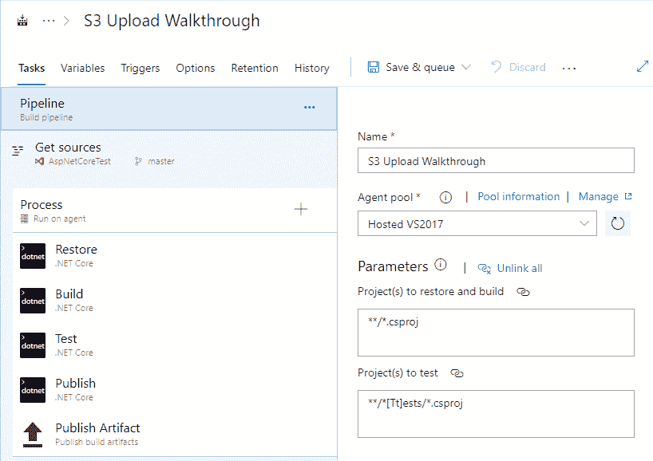
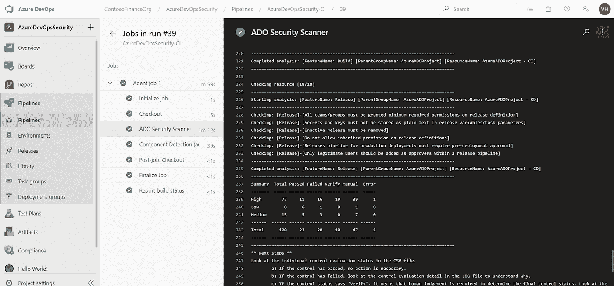
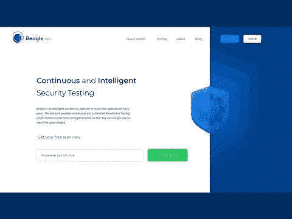

# 使用 Azure DevOps 工具扫描您的代码漏洞

> 原文：<https://javascript.plainenglish.io/scan-your-code-for-vulnerabilities-with-azure-devops-tools-7db80955d4fe?source=collection_archive---------3----------------------->

Photo by [Egor Myznik](https://unsplash.com/@vonshnauzer?utm_source=unsplash&utm_medium=referral&utm_content=creditCopyText) on [Unsplash](https://unsplash.com/s/photos/loopholes?utm_source=unsplash&utm_medium=referral&utm_content=creditCopyText)

漏洞无处不在。软件工程师构建的软件系统也不例外，我们都知道它们是漏洞。通常，严重性以指数速度增加。因此，如果一个漏洞没有被修复，它可能会导致其他漏洞。

理想情况下，作为软件工程师，我们希望开发没有漏洞的软件系统，但事实并非总是如此。现实世界中的软件确实存在漏洞。

为了识别它们，我们需要使用不同的工具来扫描我们的代码。这些工具可以是手动的，也可以集成到 DevOps 管道中，在部署之前自动扫描代码。

今天，我们将回顾一些可用于扫描 Azure 管道中代码的工具。他们来了。

# 1.声纳云

[**SonarCloud**](https://sonarcloud.io/) 是另一个领先的代码安全在线工具，可以集成到 Azure DevOps 管道中。SonarCloud 几乎支持所有主流编程语言，如 JavaScript、TypeScript、C/C++、C#、VB。并且对开源项目也是免费的。

然而，如果你有一些封闭的源代码，那么 SonarCloud 会收取订阅费来分析私有存储库。

有了 SonarCloud，您将拥有跨所有拉取请求和分支自动检测漏洞和错误的优势。它还可以提供构建任务，您可以将这些任务集成到您的构建定义中。

然而，SonarCloud 给出了与代码相关的所有问题的详细日志，让您有机会甚至在合并和部署之前修复它们。当您在项目级别工作时，您还将通过一个专用的小部件获得对应用程序整体健康状况的详细跟踪。

# 2.AWS 工具包

用于 Azure DevOps 的[**AWS 工具包**](https://aws.amazon.com/vsts/) 使您能够在 Azure DevOps 中添加任务以轻松构建和发布管道，从而与大量 AWS 产品无缝协作，包括 AWS CodeDeploy、AWS Elastic Beanstalk、亚马逊 S3、AWS Lambda、亚马逊简单队列服务、亚马逊简单通知服务和 AWS CloudFormation。

通过 AWS Toolkit，您还可以使用 AWS CLI 和 Windows PowerShell AWS 工具运行命令。它在[Visual Studio market place](https://marketplace.visualstudio.com/items?itemName=AmazonWebServices.aws-vsts-tools)的 Azure DevOps 类别中免费提供。

由于 AWS Toolkit 是一个开源项目，您可以为它做贡献，改进它的文档或提出功能请求。

# 3.Ado 安全扫描程序

[**Ado 安全扫描器**](https://azsk.azurewebsites.net/09-AzureDevOps(VSTS)-Security/Readme.html) 是微软 DevLabs 推出的另一款用于 Azure DevOps 管道中代码扫描的开源工具。该工具专门用于通过持续扫描和安全问题的可视化，在内置 ADO dashboard 小部件的帮助下，帮助组织管理安全的 Azure DevOps 管道。

它帮助你保存你的 Azure DevOps 工件，比如项目/组织设置、构建/发布配置、代理池、服务连接等。安全配置。此外，您可以通过 marketplace 扩展在 Azure DevOps 管道中运行它，也可以在 PowerShell 控制台中单独运行它。

它管理 Azure DevOps 的不同组件，并像构建、发布、组织、服务连接、用户等一样扫描它们。

# 4.比格安全公司

[**Beagle Security**](https://beaglesecurity.com/) 是一款智能、自动化、全面的工具，让您的应用程序免受与漏洞相关的问题。它提供了持续的渗透测试，这需要一些人为的监督，以便组织能够保持安全，免受网络威胁和利用。

它能在真正的黑客之前发现你的应用程序中的漏洞。使用 Beagle Security 的优势在于，它允许您使用 San 和 OWASP 标准对 web 应用程序进行渗透测试。

您还可以下载 PDF 和其他用户友好格式的报告。除此之外，在整个过程中，您还会得到他们经验丰富的安全研究人员团队的全力支持。

# 结论

简而言之，有许多工具可以用来扫描代码中的漏洞。如果您正在寻找能够很好地处理开源和闭源项目的综合工具，那么您可以尝试上面列表中提到的任何工具。