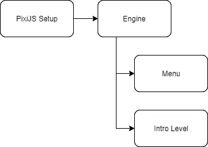
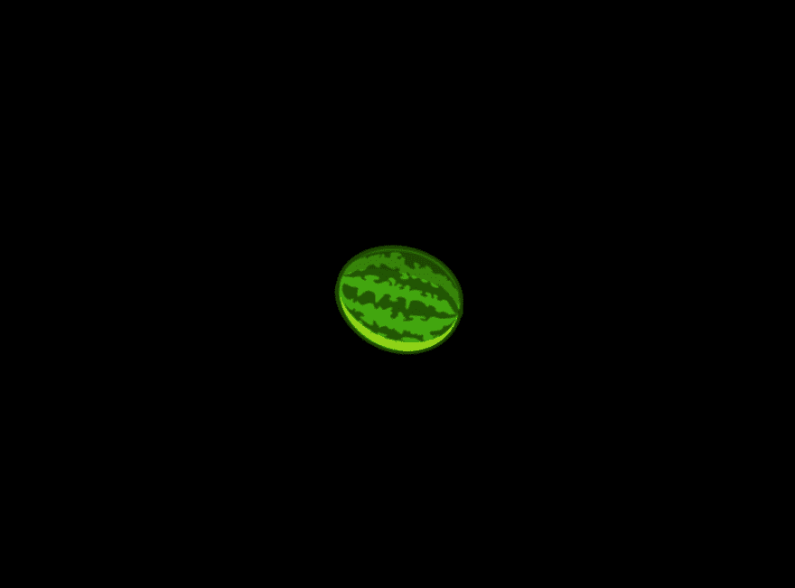

# 在 PixiJS 中创建场景

> 原文：<https://javascript.plainenglish.io/scenes-in-pixijs-1ee4b0af5116?source=collection_archive---------2----------------------->


Photo by [Kyle Head](https://unsplash.com/@kyleunderscorehead?utm_source=medium&utm_medium=referral) on [Unsplash](https://unsplash.com?utm_source=medium&utm_medium=referral)

# 介绍

PixiJS 是一个在 HTML5 中处理 2D 渲染的极好的库。它速度很快，公开了一个简单的 API，可以在多种设备上运行——台式机、笔记本电脑、手机、平板电脑等等。

应该也适用于你的智能冰箱。天哪，现在我希望我有一个。

作为一个渲染引擎，它可以用来创建任何类型的图形体验，它不像游戏引擎那样面向特定的用例，让我们来看看一个简单的设置:

```
import * as PIXI from "pixi.js";
import "./resources/css/styles.css";const MELON = require("./resources/images/watermelon.png");// Load resources
const Loader: PIXI.Loader = PIXI.Loader.shared;
Loader.add(MELON).load(setup);const app = new PIXI.Application({
    antialias: true
});app.stage.interactive = true;document.body.appendChild(app.view);function setup() {
    // create base container
    const sceneContainer = new PIXI.Container();
    app.stage.addChild(sceneContainer); // create the sprite
    const melonSprite = new PIXI.Sprite(
        Loader.resources[MELON].texture
    ); // Move the anchor to the center
    melonSprite.anchor.x = 0.5;
    melonSprite.anchor.y = 0.5; // position the sprite
    melonSprite.x = app.renderer.width / 2;
    melonSprite.y = app.renderer.height / 2; sceneContainer.addChild(melonSprite); // render loop
    app.ticker.add(delta => {
        // rotate the sprite every frame        
        melonSprite.rotation += 0.1 * delta;
    });
}
```

PixiJS API 提供了一个名为`setup`的回调函数，在这个函数中我们创建了自己的精灵，修改了它们的属性，并且可以选择在应用程序 ticker 中对它们做一些事情——我们控制了渲染循环。

对于小的交互式演示来说，它很好地满足了目的，但是很明显，如果我们想要很多对象，一些代码分割对于保持功能精简是必要的。

如果我们想做一个游戏呢？对于 flappy-bird 之类的游戏或其他简单的游戏来说，用一些功能来设置和更新实体就可以了，不需要把事情复杂化，尽管如果我们想要一些稍微复杂一点的，有多个层次的东西，那么“场景”就开始有意义了。

*简单的设置资源库可以在* [*这里找到*](https://github.com/MustSeeMelons/pixijs-typescript-starter) *。*

# 会是什么场景？

在视频游戏的世界中，它将服务于创建和更新其实体的目的，这是应用程序的一个自包含部分——它将是一个游戏级别。也可以认为是戏剧界的一种行为。

还有一件事是必需的——管理场景的东西，我们称之为引擎，流程如下所示:



logic flow

从`setup`函数中，我们现在将只实例化引擎，传入我们希望使用的场景配置。

是时候把手弄脏了。

# 创造抽象

我们将使用`Typescript`,因为这将使我们的抽象更加清晰和精确。我们还会在场景之间添加过渡，让引擎看起来更加花哨！

```
export interface SceneTransition {
    init(
      app: PIXI.Application,
      type: TransitionType, 
      sceneContainer: PIXI.Container
    ): void; update(delta: number, callback: () => void): void;
}export interface SceneSettings {
    index: number;
    name?: string,
    gameScene: AbstractGameScene;
    fadeInTransition: SceneTransition;
    fadeOutTransition: SceneTransition;
}export class Engine {
    private sceneSettings: SceneSettings[];
    private app: PIXI.Application;
    private currentScene: SceneSettings; constructor(
      app: PIXI.Application,
      scenes: SceneSettings[]
    ) {
        this.app = app;
        this.sceneSettings = scenes;
        this.sceneSettings.forEach(
          (sceneSettings: SceneSettings) => {
            sceneSettings.gameScene.init(
              this.app,
              this.sceneSwitcher
          );
        }); // Finding the scene with the lowest index
        this.currentScene = scenes.reduce((prev, curr) => {
            if (prev === undefined) {
                return curr;
            } else {
                return prev.index > curr.index ? curr : prev;
            }
        }, undefined); this.setupScene(this.currentScene);
    } sceneSwitcher = (sceneName: string) => {
        this.currentScene.gameScene.setFinalizing(() => {
            const scene = this.sceneSettings.find(
              (sceneSettings) => {
                return sceneSettings.name === sceneName;
              }
            ); if (scene) {
            this.setupScene(scene);
                this.currentScene = scene;
            } else {
                console.error("SCENE NOT FOUND: " + sceneName);
            }
        });
    } setupScene(sceneSettings: SceneSettings) {
        this.app.stage.removeChildren();
        const sceneContainer = new PIXI.Container();
        this.app.stage.addChild(sceneContainer); const gameScene: AbstractGameScene =    sceneSettings.gameScene; gameScene.setup(sceneContainer); sceneSettings.fadeInTransition.init(this.app, TransitionType.FADE_IN, sceneContainer); sceneSettings.fadeOutTransition.init(this.app, TransitionType.FADE_OUT, sceneContainer); gameScene.fadeInTransition = sceneSettings.fadeOutTransition; gameScene.fadeOutTransition = sceneSettings.fadeInTransition;
    } update(delta: number) {
        this.currentScene.gameScene.update(delta);
    }}
```

我们的引擎接受一系列游戏场景设置，这些设置稍后用于设置场景本身，它还提供了在场景之间切换的功能。在`PixiJS`跑马灯中会调用`update`方法，然后引擎会将调用委托给活动场景。

```
export enum SceneState {
    LOAD,
    PROCESS,
    FINALIZE,
    DONE
}
export interface GameScene {
    sceneUpdate(delta: number): void;
}export abstract class AbstractGameScene implements GameScene {
    protected sceneState: SceneState;
    protected app: PIXI.Application;
    protected sceneSwitcher: (sceneName: string) => void;
    protected fadeInSceneTransition: SceneTransition;
    protected fadeOutSceneTransition: SceneTransition;
    protected sceneContainer: PIXI.Container;
    private onDone: () => void; set fadeInTransition(fadeInSceneTransition: SceneTransition) {
        this.fadeInSceneTransition = fadeInSceneTransition;
    } set fadeOutTransition(fadeOutSceneTransition: SceneTransition) {
        this.fadeOutSceneTransition = fadeOutSceneTransition;
    } init(
      app: PIXI.Application,
      sceneSwitcher: (sceneName: string) => void): void {
        this.app = app;
        this.sceneSwitcher = sceneSwitcher;
    } abstract setup(sceneContainer: PIXI.Container): void;
    abstract preTransitionUpdate(delta: number): void;
    abstract sceneUpdate(delta: number): void; update(delta: number): void {
        switch (this.sceneState) {
            case SceneState.LOAD:
                this.fadeInSceneTransition.update(delta, () => {
                    this.sceneState = SceneState.PROCESS;
                });
                this.preTransitionUpdate(delta);
                break;
            case SceneState.PROCESS:
                this.sceneUpdate(delta);
                break;
            case SceneState.FINALIZE:
                this.fadeOutSceneTransition.update(delta, () => {
                    this.sceneState = SceneState.DONE;
                    if (this.onDone) {
                        this.onDone();
                    }
                });
                break;
        }
    } setFinalizing(onDone: () => void) {
        this.onDone = onDone;
        this.sceneState = SceneState.FINALIZE;
    }
}
```

场景本身有一个让它运行的核心方法——`update`，用`update`方法表示。

创建一个抽象类来实现场景生命周期:加载、处理、最终确定,“真实”场景将扩展这个类并提供所有抽象方法的实现:

*   `setup` —设置时由引擎调用
*   `preTransitionUpdate` —当转换正在进行时调用
*   `sceneUpdate` —当场景处于活动状态时调用

该类被标记为 abstract，以避免该类的实例化，因为它只提供了部分实现—没有创建精灵，这将在具体的类中完成:

```
const MELON = require("../../resources/images/watermelon.png");const Loader: PIXI.Loader = PIXI.Loader.shared;export class ClockwiseScene extends AbstractGameScene {
    private melon: PIXI.Sprite; setup(sceneContainer: PIXI.Container) {
        this.sceneState = SceneState.LOAD;
        this.melon = new PIXI.Sprite(
          Loader.resources[MELON].texture
        );
        this.melon.anchor.x = 0.5;
        this.melon.anchor.y = 0.5; this.melon.x = this.app.renderer.width / 2;
        this.melon.y = this.app.renderer.height / 2; this.melon.interactive = true;
        this.melon.addListener("pointerup", () => {
            this.sceneSwitcher("counterClockwise");
        }); sceneContainer.addChild(this.melon);
    } preTransitionUpdate(delta: number) {
        this.melon.rotation += 0.1 * delta;
    } sceneUpdate(delta: number) {
        this.melon.rotation += 0.1 * delta;
    }
}
```

具体的类负责添加对象和相关的逻辑，比如点击监听器和框架更新。有了这一切，我们钟爱的 Pixi 本身的`setup`函数现在看起来非常精简:

```
function setup() {
    const engine: Engine = new Engine(app, [
        {
            index: 0,
            name: "clockwise",
            gameScene: new ClockwiseScene(),
            fadeInTransition: new SimpleFadeTransition(0.1),
            fadeOutTransition: new SimpleFadeTransition()
        },
        {
            index: 1,
            name: "counterClockwise",
            gameScene: new CounterClockwiseScene(),
            fadeInTransition: new SimpleFadeTransition(0.1),
            fadeOutTransition: new SimpleFadeTransition()
        }]); app.ticker.add(delta => {
        engine.update(delta);
    });
}
```

我们创建场景，加上一些配置，将它们传递给引擎。必要时，引擎将设置正确的场景。

*注意:设置功能必须清除任何先前的状态。*

添加了一个额外的场景，一个向相反方向旋转甜瓜的场景，结果可以在下面的`gif`中看到(抱歉，这不是一个完美的循环):



a beautiful, rotating melon

# 结论

通过一些抽象，我们创建了基础架构，通过将责任划分给不同的对象来管理更复杂的 Pixi 项目。

有几件事可以改进:

*   场景共享——不需要每次都重新设置场景，如果我们经常在它们之间切换的话，比如 RPG 中的房间
*   可重复使用的过渡-目前他们重新创建，有一个淡入，淡出，将是一个很好的优化
*   更多的生命周期挂钩——当我们淡出当前场景时的过渡后更新(将非常类似于前挂钩)

*成品库可以在* [*这里找到*](https://github.com/MustSeeMelons/pixi-scene) *，干杯。*

*对不起我叫西瓜瓜。*