# React 16.x 中的调度

> 原文：<https://javascript.plainenglish.io/scheduling-in-react-16-x-a6108db99208?source=collection_archive---------1----------------------->


# 什么是调度程序？

先说一些理论。

JavaScript 是一种单线程语言。这意味着我们有一个调用堆栈，它可以同时执行一段代码。在执行代码的过程中，浏览器需要执行一种不同的工作。这包括:

*   管理事件(用户点击处理程序， *setTimeout* 回调等)。)
*   布局计算(建筑 DOM / CSSOM)和
*   重画(基于布局计算)

让我们把重点放在最后一个。在一秒钟内，浏览器通常会重画 60 次，这意味着每 16.6 毫秒就有一次重画(或多或少，取决于环境)。

当你运行一段同步代码大约一秒钟的时候，你会意外地丢失大约 60 帧，这会导致延迟，影响 UX，让你的应用程序没有反应。

因此，调度器的主要目标是平衡浏览器中正在执行的所有活动，不要让它们中的任何一个挨饿，同时保持你的应用程序的重画意识。

但是，作为开发者，我们应该关心吗？毫无疑问，我们应该意识到这个问题。如今，在开发我们的应用程序时，我们将相当多的职责外包给第三方实体。

Web 框架为我们做了很多，它们管理路由和状态，提供变化检测机制，双向数据绑定(Angular/Vue.js)，直接更新 DOM，等等。它们充当我们和浏览器之间的中间件，所以它似乎是一个解决调度问题的好地方，对吗？

web 框架就是这样做的。React 也不例外(至少 React 16.x 是这样)。

# 尝试实现一个简单的调度程序

我将解释 React 是如何管理它的，但是，为了理解潜在的问题，让我们编写一些简单的代码…

我们来模拟一个重度浏览器 app:

```
setInterval(() => {
    document.body.appendChild(document.createTextNode('hi'))
}, 3)
```

它迫使浏览器进行重画(由每 3 毫秒进行一次的 DOM 操作引起)。现在，考虑这段代码:

```
setInterval(() => {
    document.body.appendChild(document.createTextNode('hi'))
}, 3)render()function render() {
    for (let i = 0; i < 20; i++) {
        performUnitOfWork()
    }
}function performUnitOfWork() {
    sleep(5)
}function sleep(milliseconds) {
    // sleep for given {milliseconds} period (synchronous)
}
```

我们的浏览器渲染机制有什么影响？嗯，*渲染*是同步的，所以冻结浏览器 100ms (20 * 5ms = 100ms)。在这段时间内不能重新油漆。用户输入事件也不回调。让我们来看看 Chrome 对给定代码的“性能工具”输出:

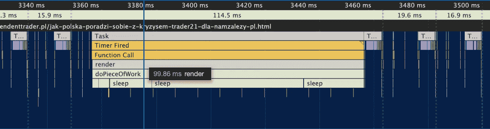

在本例中，我们丢帧超过 100 毫秒(见垂直虚线，它们显示帧何时结束)。如前所述，浏览器每隔 16.6 毫秒(每秒 60 帧)重画一次。在这种情况下，重画被延迟，这将冻结当时执行的任何动画。用户输入处理程序也会被延迟。这不是我们想要的，对吗？

现在，让我们假设提供的*渲染*函数是渲染机制的 React 15.x 实现。在这个过程中，React 跟踪变化，调用我们的生命周期方法，比较道具等。这是一个耗时的过程，可能需要很长时间来计算，尤其是在繁重的应用程序中。

React 15.x 到底有没有调度器机制？不，没有，所以我们的同步*渲染*函数和 React 15.x 渲染实现没有区别。

互联网上有一个很好的例子，展示了 React 15.x 如何管理繁重的应用程序，其中包括大量的浏览器重画(调整大小)以及 JavaScript 计算(生命周期方法执行):

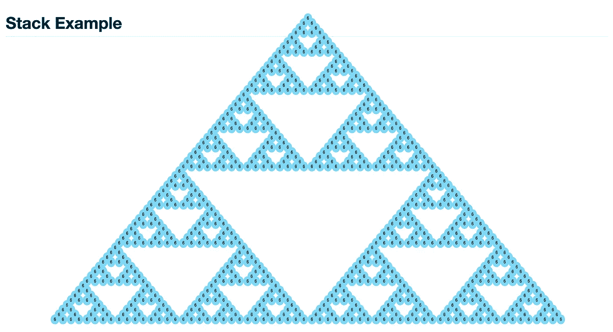

React 15.x render problems

在这里看它是如何工作的[。安静的懒虫，对吧？让我们回到我们的例子…我们如何改进这种基于同步的渲染机制？增加 *setTimeout* 怎么样？](https://claudiopro.github.io/react-fiber-vs-stack-demo/stack.html)

```
...function render() {
    performUnitOfWork()
    setTimeout(render, 0)
}...
```

结果如何？

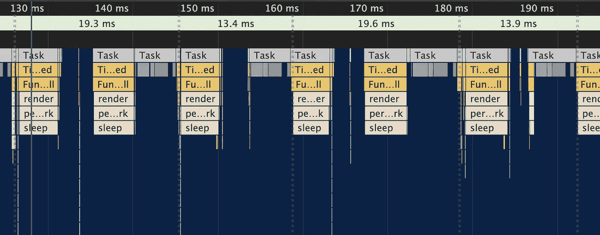

是的，好多了，我们的画面不再延迟了。我们的`*performUnitOfWork*`函数在每一帧上都被单独处理。重画是定期进行的——没有帧延迟。

那么，这是 React 16.x 应用程序解决调度问题的方式吗？不完全是。在整个内部引擎重写(所谓的 React Fiber)中，React 团队引入了一个专用模块(“React Scheduler”)来解决调度问题。它是如何工作的？我将很快解释它，但首先—我们需要引入… [通道消息 API](https://developer.mozilla.org/en-US/docs/Web/API/Channel_Messaging_API) 。

# 基于消息通道的调度

它做的事情很简单。它允许你在不同的 JavaScript 上下文中进行通信，例如，在你的代码和 iframe 之间，或者在你的代码和 web worker 的上下文之间。

考虑下面的例子:

```
// index.html
<iframe src="iframe-page.html"></iframe><script>
var iframe = document.querySelector('iframe')
var channel = new MessageChannel()iframe.addEventListener('load', () => {
    channel.port1.onmessage = e => console.log(e.data)
    iframe.contentWindow.postMessage('hi!', '*', [channel.port2])
})
</script>// iframe-page.html
<script>
window.addEventListener('message', event => {
    console.log(event.data)
    event.ports[0].postMessage(
        'Message back from the IFrame'
    )
})
</script>
```

您需要做的是在一个端口( *port1* )上设置一个监听器，并使用 *postMessage* API 将另一个端口( *port2* ，它将被发送方使用)转移到另一个上下文(即 iframe)中。然后就可以双向交流了。

但是我们的 app 里需要和 iframe 或者 WebWorker 沟通吗？不尽然，但是 API(除了通信能力之外)还有另一个优势。它让你友好地安排工作，尊重其他浏览器活动，如渲染，DOM 计算等。

怎么会？通过所谓的“消息循环”机制。现在，让我用下面的代码替换前面同步*渲染*函数的实现:

```
setInterval(() => {
    document.body.appendChild(document.createTextNode('hi'))
}, 3)const channel = new MessageChannel()render()function render() {
    channel.port1.onmessage = onMessageReceived
    channel.port2.postMessage(null)
}function onMessageReceived(event) {
    performUnitOfWork()
    channel.port2.postMessage(null)
}function performUnitOfWork() {
    sleep(5)
}
```

我们的渲染函数已更新，以利用 MessageChannel API。我们刚刚创建了“消息循环”。在*端口 2* 上发送消息(在*渲染*函数内)强制`*onmessage*` *(* 即 *onMessageReceived)* 被调用，后者做一些计算(`*performUnitOfWork*`)。然后，它再次强制在*端口 2* 上发送一条消息，最终……是的……你看到模式了，对吗？这就是消息循环的创建方式。

现在让我们看看我们的性能概况:

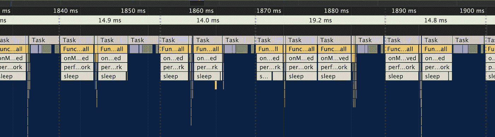

每隔 14 毫秒/19 毫秒重新油漆一次。在单帧期间，我们可以看到 *performUnitOfWork* 甚至被执行了 3 次，这比 *setTimeout* 方法要好。更重要的是，在 *setTimeout* 解决方案中,“执行栏”之间有更多的空白空间，浏览器在那里什么也不做。在消息循环中不是这样。

# React 16.x 中的调度

有趣的部分来了。我刚刚向您描述了 React Scheduler 的最新实现是如何工作的。它使用 MessageGlobal API 来实现他们的浏览器内调度目标。与`*setTimeout*`实现相比，这种方法甚至更好，因为它最终能够在框架内执行更多的工作。

现在，这种方法需要将一个作品分割成更小的块。我们的示例实现 *render* 函数执行大约 5 毫秒的计算(`*performUnitOfWork*`)。React 实现也没有什么不同——它也将工作分成更小的块，在 5 毫秒内执行。

为什么我们要把执行分成更小的块呢？让主线程同时执行未决事件/重画/管理动画，这样就不会有 UX 延迟。

考虑这段 React [代码](https://github.com/facebook/react/blob/v16.13.1/packages/react-reconciler/src/ReactFiberWorkLoop.js#L1467-L1472):

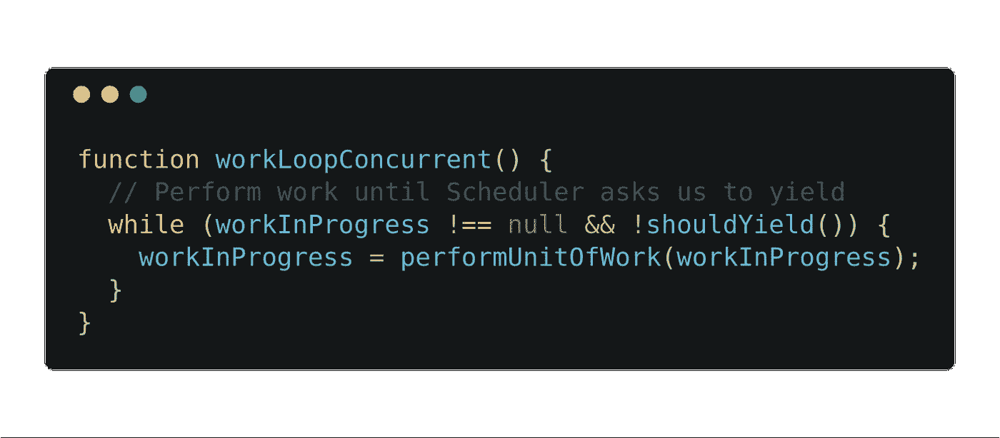

这是 React 代码中最重要的片段之一。主工作循环。如前所述，React 的最新版本(与 React 15.x 相反)允许你将工作分成小块( *workInProgress* )。它们中的每一个都被逐一处理( *performUnitOfWork* )，只要:

1.我们有些工作要做。== null )
2。并且 *shouldYield()* 返回 false。

如此多的同步工作正在`*performUnitOfWork*`中进行。这段代码来自 React 的“调解器”机制。如果你想了解更多 React 的工作原理，我强烈建议你搜索“React Fiber”短语。出于本文的目的，让我们假设 *performUnitOfWork* 是一个遍历组件树、进行变更检测计算的函数，包括调用生命周期方法、副作用标记。这是一个反应渲染过程的核心。

React 纤程的设计方式是，每个完成的工作结果都保存在堆中，所以我们可以随时中断一个`*workLoopConcurrent*`循环，稍后再返回。

但是我们如何知道何时中断这项工作呢？

这里出现了 *shouldYield* 函数，它是“调度程序”模块的一部分。它只有一个责任——决定是停止还是继续工作任务(`*performUnitOfWork*`)。当我们应该停止计算并让位于主线程时，它返回 *true* ，或者当我们应该继续计算时，它返回 *false* 。

什么是[一个 *shouldYield*](https://github.com/facebook/react/blob/v16.13.1/packages/scheduler/src/forks/SchedulerHostConfig.default.js#L164-L166) 的实现？

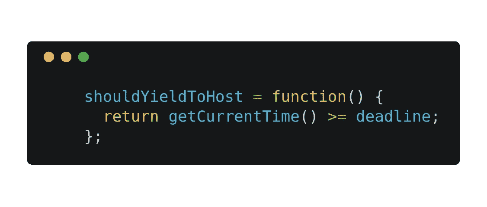

它检查我们是否超过了最后期限。截止日期是什么时候？这是一个 *currentTime + 5m，*所以看起来，React scheduler 每隔
5 ms 中断一次执行，所以是一样的，正如我们在本文前面的例子中所介绍的。在源代码中有一个描述性的注释介绍了它的工作方式:

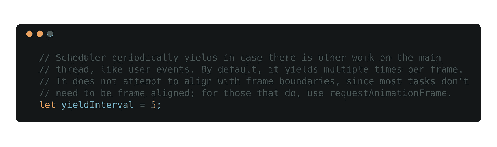

好了，呈现 MessageChannel 循环的代码在哪里？

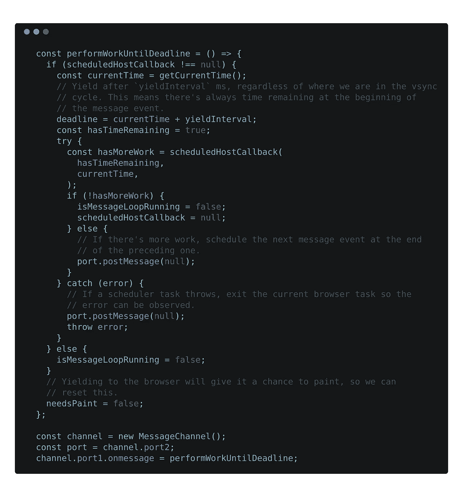

这有点复杂，但是在代码清单的最底部，我们有一个通道设置。您可以简单地浏览代码注释来查看流程。`*performWorkUntilDeadline*`里面有`*port.postMessage(null)*`*；保持消息循环运行。*

我们也有一段代码，准备截止日期(`*deadline = currentTime + yieldInterval;*`)

什么是`*scheduledHostCallback*`？长话短说，它最终触发了前面提到的 *workLoopConcurrent* ，这是 React 渲染过程的主要工作循环。但是该函数被设计为返回信息，无论工作是否完成，或者我们是否应该在下一个消息循环迭代中继续( *hasMoreWork* )。

还记得呈现[调度问题](https://claudiopro.github.io/react-fiber-vs-stack-demo/stack.html)的 React 15.x app 例子吗？


[在这里](https://claudiopro.github.io/react-fiber-vs-stack-demo/fiber.html)你可以看到相同的应用，但采用 React 16.x 及其新的 React Fiber 方法。好多了，对吧？

# React 的调度程序模块

`*shouldYield*`不是 React devs 内部使用的唯一 API。

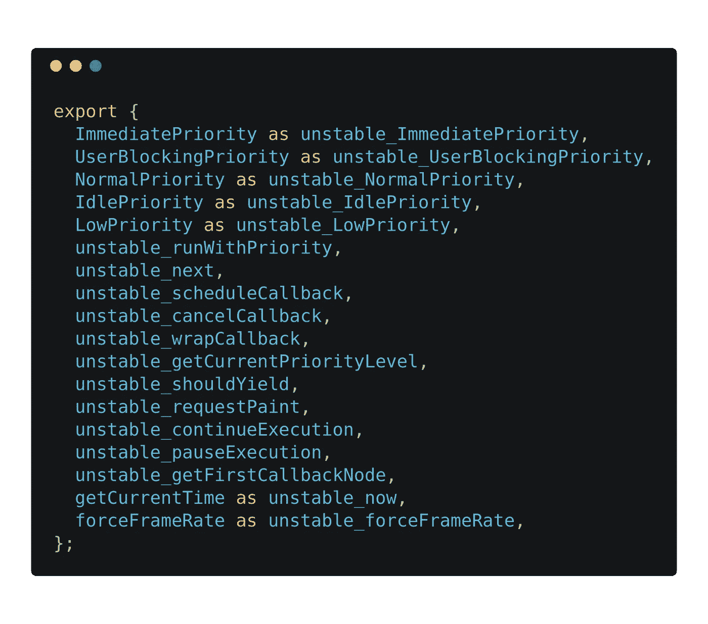

考虑到[公开函数](https://github.com/facebook/react/blob/v16.13.1/packages/scheduler/src/Scheduler.js#L415-L434)的命名约定，我们可以断定该模块仍处于开发阶段，API 届时可能会发生变化。

当心！这个 API 不是为开发人员(比如你和我)设计的。它仅供团队成员/贡献者内部使用。当然，我们使用它，但是间接的。

可以看到，该模块导出了函数`*runWithPriority*`以及一些预定义的常量(*用户阻塞优先级*、*正常优先级*、*低优先级*)。它还没有在 React 中广泛使用，但是这样做的目的是让 React schedule 以不同的优先级工作。我们可以预期在未来的 React 版本中，这个 API 将支持更多的用例。

这样的逻辑目的是什么？以优先呈现特定元素。在脸书的应用中，首先看到*新闻提要*比看到页眉、页脚或认证用户部分更重要。在这种情况下，我们可能会以更高的优先级呈现与*新闻提要*相关的组件。

这就是目标，希望在即将到来的 React 版本中看到一些真实的用例。是未来，但现在呢？我们在哪里使用调度器模块调度任务？

嗯，钩子的效果[正在使用 React 调度器模块进行调度](https://github.com/facebook/react/blob/v16.13.1/packages/react-reconciler/src/ReactFiberWorkLoop.js#L2190-L2193)。

有一个令人费解的[*enqueuePendingPassiveHookEffectMount*](https://github.com/facebook/react/blob/v16.13.1/packages/react-reconciler/src/ReactFiberWorkLoop.js#L2182-L2196)函数，它调度 *scheduleCallback* 任务，优先级为*正常*。

让我们把注意力集中在函数名(*enqueuePendingPassiveHookEffectMount*)上，并找出每个名字的含义:

*   *enqueuePending…* :幕后的调度程序模块构建了一个需要调用的回调列表(并为其分配了优先级)，因此 *enqueue* 前缀在这个上下文中是准确的。
*   *…PassiveHookEffect…:* 这才是真正的乐趣。什么是**被动** **挂钩效果**？：

我们有两类效果，**被动** ( *使用效果*)和**布局** ( *使用布局*)。想象一下这个组件:

```
const App = () => {
    useEffect(() => {
        console.log('passive effect')
    }, []) useLayout(() => {
        console.log('layout effect')
    }, [])
}
```

哪个效果会先被调用？**布局效果**。为什么？正如文档中提到的，**布局效果**在 DOM 突变后被调用，但在浏览器渲染前被调用。**另一方面，被动效果**在浏览器渲染后被延迟(使用调度模块)调用**。**

*   *…挂载:*最容易理解**挂载**，以及**卸载**的钩子效果的例子是:

```
useEffect(() => {
    // this is "mount" passive hook
    return () => {
        // this is "unmount" passive hook
    }
}, [])
```

根据组件的状态，React 调解器模块调用**挂载**或**卸载**(即在销毁组件时)。

总而言之，所有的**被动效果**钩子都被异步调用**——在浏览器重画之后。与阻止浏览器重绘的旧实现*componentid mount*或*componentid update*相比，这是一种不同的方法。同样值得注意的是，在钩子世界中，我们没有选择*组件将安装*或*组件将更新*。这些方法曾经是开发人员引入副作用的好地方(这可能会再次延迟重画)，因此他们决定放弃它。**

所以，你放在**被动效果**中的所有代码都要通过 React 调度程序。

# 什么是' isInputPending '？

该功能是脸书工程师努力缩短用户输入(即点击、鼠标、键盘事件)执行时间的结果。

让我们看看这个例子:

```
while (workQueue.length > 0) {
    if (navigator.scheduling.isInputPending()) {
        // Stop doing work if we have to handle an input event.
        break;
    } let job = workQueue.shift();
    job.execute();
}
```

通过`*navigator.scheduling.isInputPending()*`我们可以发现是否有未决的用户事件(点击、鼠标、键盘、拖拽&等等)。)所以我们可以通过将执行交给主线程(即通过 *break* 语句)来处理事件，从而快速做出反应。

当然是实验，不是官方标准。作为 [Chrome Origin 试用](https://developers.chrome.com/origintrials/#/view_trial/4544132024016830465)的一部分，从版本 74 到 78(直到 2019 年 12 月 4 日)都可以在 Chrome 浏览器上获得。

你可以在 Gihub 和脸书的工程博客上了解更多。

但是为什么我要在这篇基于调度器的文章中描述这个东西呢？有趣的是，[React Scheduler 的当前实现](https://github.com/facebook/react/blob/v16.13.1/packages/scheduler/src/forks/SchedulerHostConfig.default.js#L127-L161)利用了这个特性:

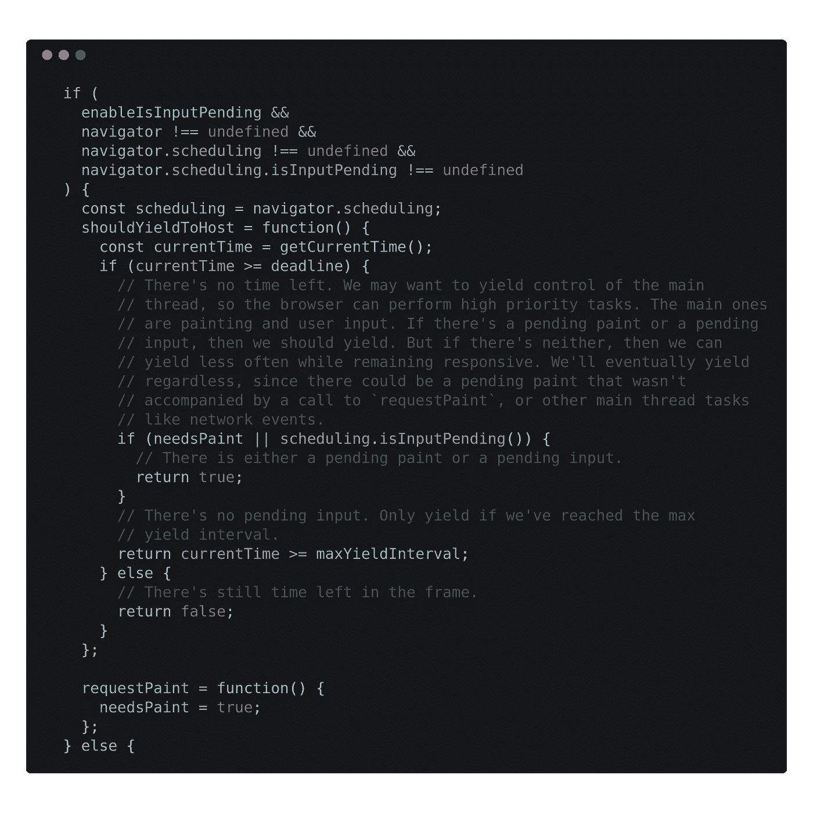

满足特定要求后:

*   我们的 React 应用构建启用了一个特性标志(`*enableIsInputPending*`)
*   我们使用谷歌浏览器，并启用了实验性的`*navigator.scheduling.isInputPending*`功能

我们的 React 调度器模块提供了一个改进版本的 *shouldYield* 实现，当有任何未决事件等待执行时，它会将执行让给主线程。

# React 中的计划历史

React 15.x 的问题是整个渲染过程是同步进行的。一、大型、耗时、同步、递归(！)的一段代码。这不能与其他浏览器活动合作，对不对？

在 React Fiber 开发(16.x)的最开始，React 团队使用的是 *requestIdleCallback* 。但是，就像丹·阿布拉莫夫说的那样，这似乎没有团队希望的那么有侵略性。

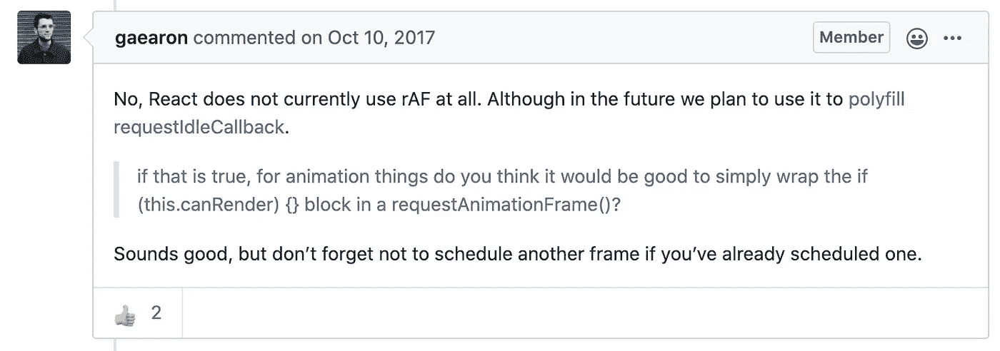

下一步是用 *requestAnimationFrame* 模拟`*requestIdleCallback*`。他们试图猜测帧大小，并将 React 渲染机制与 vsync 循环对齐。这还不错，直到最近的一部(由安德鲁·克拉克制作)去掉了 *requestAnimationFrame* ，如此处[所述](https://github.com/facebook/react/pull/16271)。

# 摘要

如前所述，我们有几个 API 可能会有所帮助，比如 *requestAnimationFrame* 、 *requestIdleCallback* 、消息循环( *MessageChannel* )，甚至 *setTimeout* 。

但是，嘿——它们是为稍微不同的目的而设计的，不是吗？

毫无疑问，调度问题已经摆在桌面上，一些概念最近已经在浏览器供应商环境中公布。如果你对这个话题感兴趣——我推荐[WICG/main-thread-scheduling](https://github.com/WICG/main-thread-scheduling)repo 以及它的“[延伸阅读](https://github.com/WICG/main-thread-scheduling#further-reading--viewing)”部分。

想要更多吗？关注我的博客， [adasq.github.io](https://adasq.github.io/) 。