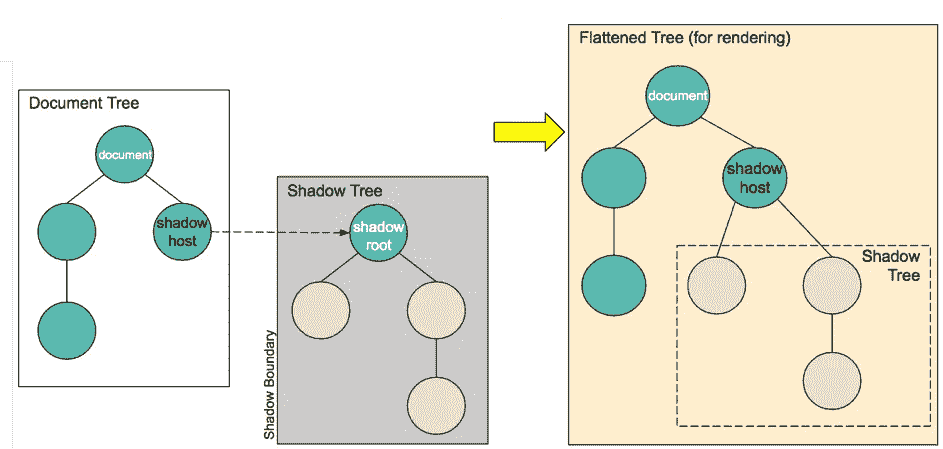

# 使用影子 DOM 使作用域 CSS 变得容易

> 原文：<https://javascript.plainenglish.io/scoping-css-easy-with-shadow-dom-991a1fc568b9?source=collection_archive---------6----------------------->

Photo by [Greg Rakozy](https://unsplash.com/@grakozy?utm_source=unsplash&utm_medium=referral&utm_content=creditCopyText) on [Unsplash](https://unsplash.com/s/photos/css?utm_source=unsplash&utm_medium=referral&utm_content=creditCopyText)

你有没有遇到过将你的 CSS 隔离到某个区域的问题？你有没有试过把 CSS 应用到你页面的一部分，但是那个该死的东西就是不在一个盒子里(div)？

嗯，我也在这个问题上卡住了，但是阴影 DOM 帮助了我。

TLDR:如果你不想看完整个故事，可以在下面用 shadow DOM 找到最终的应用。

 [## marrej/shadow DOM 示例

### 此时您不能执行该操作。您已使用另一个标签页或窗口登录。您已在另一个选项卡中注销，或者…

github.com](https://github.com/marrej/shadowDOMexamples) 

给你一点背景知识，我一直在尝试用我的定制 web 组件更新一个页面。web 组件有自己的样式表，如果您将 CSS 文件放在 HTML 文件中，它将覆盖文件中已经存在的 CSS。

 [## 2019 年最值得学习的编码语言|数据驱动的投资者

### 在我读大学的那几年，我跳过了很多次夜游去学习 Java，希望有一天它能帮助我在…

www.datadriveninvestor.com](https://www.datadriveninvestor.com/2019/02/21/best-coding-languages-to-learn-in-2019/) 

经过一段时间的搜索，我偶然发现了影子 DOM。一种将你的 DOM 分成更有意义的部分的技术，通过在你的 DOM(轻 DOM)树中创建阴影根并在其中附加阴影树。

[https://developer.mozilla.org/en-US/docs/Web/Web_Components/Using_shadow_DOM](https://developer.mozilla.org/en-US/docs/Web/Web_Components/Using_shadow_DOM)

如果你想了解更多关于 shadow DOM 的知识，我建议你去 [Mozilla](https://developer.mozilla.org/en-US/docs/Web/Web_Components/Using_shadow_DOM) 。

否则，让我们开始编码练习。

让我们从填充段落的空白 html 开始，并将段落背景涂成红色。

编码了一段时间后，我们决定我们的一些段落应该是**绿色**，而不增加一个类。(这是一个愚蠢的练习，但是请原谅我，:D)但是我们该怎么做呢？

让我们从添加新段落开始，只是为了看到该段落将有一个红色的背景。

让我们定义一个自定义元素名(比如我们的-custom-element)并将其推入我们的 Light DOM(这基本上意味着在 html 中创建<our-custom-element>，因为 Light DOM 只是描述我们实际 DOM 的另一种方式)。</our-custom-element>

然后我们需要添加 JavaScript 片段来调用 **customElements.define()** 来定义我们的 HTML 元素，并以编程方式传入属性。

我们要做的是扩展 HTMLElement 类，并在构造函数中使用 **super()** 初始化它。(因为我们希望在自定义元素中保留基本的 **HTMLElement** 属性)

然后我们可以使用 **createElement()** 来定义新元素，这些新元素将被附加到 **our-custom-element** 上，比如一个 **DIV** 。此外，我们可以用段落的 HTML 填充 DIV，将其移动到自定义元素的范围内。

然后将**影子根**附加到实际的**html element(our-custom-element)**，并为其追加子元素，比如我们的 **DIV** 。

此时，段落应该缺少了**红色背景**。

太好了！:D

所以我们刚刚在 shadowDOM 中隔离了我们的自定义元素，正如你所看到的，我们的主应用程序的 CSS 并没有漏入其中。

所以，如果我们想在自定义元素中包含样式，我们只需要创建元素 **<样式>** (就像我们对 div 做的那样)，这将是我们的 CSS 载体。然后我们只需添加 style.textContent，这就是实际的 CSS。

由于样式将连接到 shadowRoot，您应该会在 customElement 段落下面看到一个绿色背景。

> 瞧啊。简单有效。

因此

现在让我们假设您已经准备好了一个 webComponent。如何监听它发出的事件？只需在查询后将事件侦听器附加到元素上。您可以在自定义元素定义中直接附加侦听器，或者尝试从外部获取元素，但是首先您需要查询附加了 shadowRoot 的元素，然后获取 shadowRoot 并在 shadowDOM 中导航。

您可以在这里查看整个解决方案

 [## marrej/shadow DOM 示例

### 此时您不能执行该操作。您已使用另一个标签页或窗口登录。您已在另一个选项卡中注销，或者…

github.com](https://github.com/marrej/shadowDOMexamples)