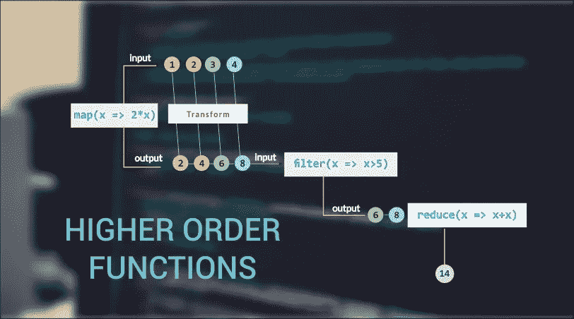

# 了解 JavaScript 中高阶函数的皮毛

> 原文：<https://javascript.plainenglish.io/scratching-the-surface-of-higher-order-functions-in-javascript-4d4859bdb46b?source=collection_archive---------9----------------------->

## 理解高阶函数以及引擎盖下的内容的初级指南。map()，。过滤器()和。减少()。



Visual representation of .map(), .filter(), and .reduce()

不管是哪种语言，每个人都有追求编程事业的理由。有些人学习它是因为他们喜欢它，它模仿了他们的思维方式。有些是为了钱。我想，其他人可能会在它周围成长，在这一点上这只是第二天性。我个人对它感兴趣已经有一段时间了。我离开了一份利润丰厚的职业，开始编程和构建我真正感兴趣的东西。对我来说，喜欢你做的事情是重要的，不可替代的。

不管你来自哪里，也不管你编码的原因是什么，我们都必须经历学习基础知识的过程。对于那些在它周围长大的人来说，它可能会变得更容易。然而，从一开始就学习这些东西的人可能会对其中一些概念感到非常困难。

今天，我将分解 3 个最广泛使用的高阶函数，并展示这些函数背后发生了什么。理解当你使用这些功能时会发生什么是非常重要的，而且你很有可能在面试中看到这些功能。

# 高阶函数

首先…什么是高阶函数？

接受和/或返回另一个函数的函数称为**高阶函数**。这意味着我们可以和这些人一起做一些非常有趣的事情。

## 使用其他函数作为参数

```
isEven = (number) => number % 2 ===0;
result = [1, 2, 3, 4, 5].filter(isEven)
console.log(result)// [2, 4]
```

您可以看到，我们创建了一个箭头函数来确定一个数字是否为偶数。然后我们将那个`isEven`函数作为参数传递给了`.filter`。

## 返回函数

```
add = (x) => (y) => x + y;
```

`add`是一个需要两个参数的函数。首先，它请求`x`，但是它返回一个请求`y`的函数。

这是因为 JavaScript 允许函数作为返回值，就像字符串、数字和布尔值一样。

如果你想立即传递这些参数，你可以写一个叫做双重调用的东西——连续调用两个东西。看起来会像这样:

```
result = add(10)(20)console.log(result) //30
```

您也可以在不同的时间调用它们:

```
add10 = add(10)
result = add10(20)console.log(result) //30
```

## 更高的可重用性

也许高阶函数最好的一点就是它们的可重用性。可重用性意味着更少的代码。更少的代码意味着更高效、更易读。微波炉上没有 1 分钟按钮有意义吗？那个按钮是预先设定好的，用来执行特定的功能，帮助你反复执行某个动作。

子丽和子思正在吹嘘他们最新的程序的规模。子礼道:“二十万行，不算评论！”子思回答说:“嘘，我的已经差不多一百万行了。”元马大师说:“我最好的程序有五百行。”听了这话，子礼和子思恍然大悟。”—元马大师，编程之书

以同样的方式思考高阶函数。这些功能使得反复执行某些动作变得更加容易。再次强调效率和可读性。

有两种方法来构建一个软件设计:一种是让它简单到没有明显的缺陷，另一种是让它复杂到没有明显的缺陷— C.A.R. Hoare，1980 年 ACM 图灵奖讲座

我想先讲 3 个主要的高阶函数。地图()。我将从头开始研究函数的样子，然后研究高阶函数的样子。


Funny picture that breaks down each method of .map(), .filter(), and .reduce()

# 。地图()

从头开始:

```
const nums = [9, 4, 23, 52, 65];const plusTwo = () => {
const newArray = [];for (let i = 0; i < nums.length; i++) {
   newArray.push(nums[i] + 2)
}
return newArray;
}// [11, 6, 25, 54, 67]
```

使用高阶函数:

```
const nums = [9, 4, 23, 52, 65];const plusTwo = nums.map(number => number + 2)console.log(plusTwo) 
// [11, 6, 25, 54, 67]
```

你可以看到第一个选项——从头开始——有更多的内容。使用这个选项，我们遍历整个`nums`数组，对每次迭代做一些事情，将其推送到`newArray`，然后返回那个`newArray`。

我们的第二个选择——使用`.map()`——需要少得多。我们绘制地图，命名每一个迭代`number`，并对这个数字做一些事情。默认情况下，map 方法自动返回一个新数组，所以我们最终得到的是`const plusTwo = [11, 6, 25, 54, 67]`。`.map()`基本上是在`nums`的基础上创建了一个新的数组，但是在每个数字上加了 2，而且用了更少的代码，更容易阅读。

# 。减少()

从头开始:

```
const nums = [15, 25, 7, 3, -2, 90];
let sum = 0;const sumArray = (nums) => {
  for ( let i = 0; i < nums.length; i++) {
    sum += arr[i]
  }
console.log(sum);
}
```

使用高阶函数:

```
const nums = [15, 25, 7, 3, -2, 90];const sum = nums.reduce((total, currentVal) => total + currentVal, 0)
```

所以这个有点令人困惑。想象一个缩减器，一个可以把很多事情缩减成一件事情的东西。在这种情况下，我们将一个数组中的许多数字一个接一个地加在一起，以便*将它们减少到一个数字。*

不过，这里的语法可能有点复杂。我用`total`和`currentVal`来让自己的头脑保持清醒。基本上，正在发生的事情是`total`从 0 开始(我们告诉它在最后从哪里开始——这是 reduce 函数的第二个参数)。对于每次迭代，执行`total + currentVal`。本质上是把这些数字一个一个加起来。`sum`，最后，将有一个什么价值的减速器想出了。在这种情况下,`sum = 138`一切都结束后。

重要的是要记住`.reduce()`是一个**非常**灵活的函数。它是所有高阶函数的万能工具。它可以用在许多不同的方面，我在这里展示的只是一个更容易理解的方面。小步骤…

# 。过滤器()

从头开始:

```
const nums = [9, 4, 23, 52, 65];const filterArray = () => {
const newArray = [];for (let i = 0; i < nums.length; i++) {
  if (nums[i] % 2 ===0) {
    newArray.push(nums[i])
    }
  }
return newArray;
}
```

使用高阶函数:

```
const filtered = nums.filter(number => number % 2 === 0)
```

好多了，对吧？在这两种情况下，返回的数组都是`[4, 52]`，但是两者使用的代码看起来有很大的不同。首先，我们必须遍历`nums`数组，对每个数字使用一个条件语句，如果它通过了，就把它推到`newArray`，然后返回`newArray`。这里发生了很多事情…

第二个选择是**更加**直截了当。它做同样的事情，但是代码更少。`number`代表`nums`数组中的每一个数字，因为函数会遍历该数组。每次我们处理一个新号码时，它都会检查是否在使用`number % 2 === 0`。非常重要的是要记住。filter()函数总是返回一个数组。因此，每个“通过测试”的数字都被推送到返回的新数组中。

## 结论

因此，一开始学习这些东西可能会相当令人生畏。特别是，它是以训练营或其他快节奏的形式出现的。然而，理解幕后发生的事情是非常重要的，同样重要的还有我们为什么以这种方式做事。如果你发现自己真的在挣扎，记得休息一下。

特别感谢 FreeCodeCamp.org 在这篇文章中提供的一些信息。我强烈推荐任何新的或有经验的程序员利用他们提供的资源。你可以在这里找到他们文章[的完整内容](https://www.freecodecamp.org/news/a-quick-intro-to-higher-order-functions-in-javascript-1a014f89c6b/)。