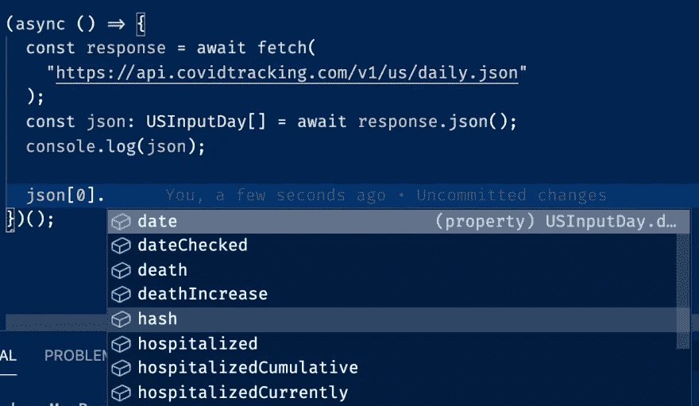

# 从 JavaScript 迁移到 TypeScript(从头开始)

> 原文：<https://javascript.plainenglish.io/scripting-javascript-to-typescript-from-scratch-8189c85095da?source=collection_archive---------11----------------------->


# 为什么？

脚本通常需要某种程度的修补和调整才能得到想要的输出。如果用 JavaScript 编写，开发人员必须记住输入和输出的形状。我个人不得不记录输出来回忆我得到的响应。到目前为止，大多数 JavaScript 社区都意识到了转向 TypesScript 的好处。如果你想复习一下，请访问 [Serokell 的帖子](https://serokell.io/blog/why-typescript)

# 我们在做什么？

我们将从[covid 跟踪 api](https://api.covidtracking.com/) 中获取输入，并以稍微不同的方式对其进行格式化，以准备将其绘制在图表上。下面是一个美国一天产出的例子

## 样本值输入

## 抽样输出

不是从一个全功能的 JavaScript 脚本开始…我们将运行一个脚本并切换到 TypeScript 来开始构建结构并为未来的变化做文档记录

# JavaScript 示例入门

## 先决条件

*   [节点 JS](https://nodejs.org/en/)
*   接触终端或电源外壳

## 设置项目空间

```
mkdir script-in-ts && cd script-in-ts
```

然后初始化一个`package.json`，它将允许您指定所需的脚本和依赖项

```
npm init --y
```

## 我们将首先让脚本在 JavaScript 中运行，因此让我们安装必要的依赖项

```
npm install @babel/core @babel/node @babel/preset-env
```

巴别塔让我们有能力编译现代的 JavaScript。`@babel/core`和`@babel/node`都使这成为可能，而 [@babel/preset-env](https://babeljs.io/docs/en/babel-preset-env) 允许我们指定诸如节点版本或浏览器支持之类的事情

## 设置 babel 运行 JavaScript

添加一个`.babelrc`文件

```
touch .babelrc && code .babelrc
```

粘贴以下设置以指定使用节点版本 10。这将使我们能够访问像[扩展操作符](https://developer.mozilla.org/en-US/docs/Web/JavaScript/Reference/Operators/Spread_syntax)这样的东西，你很快就会在这里看到

```
{
  "presets": [
    [
      "@babel/preset-env",
      {
        "targets": {
          "node": "10"
        }
      }
    ]
  ]
}
```

## 现在我们准备创建

制作一个`index.js`文件

```
touch index.js && code index.js
```

从一个 [hello world](https://en.wikipedia.org/wiki/%22Hello,_World!%22_program) 的例子开始

```
console.log("hello world")
```

## 打开`package.json`，添加一个启动脚本，如下所示

```
{
...
   "scripts": {
       "start": "babel-node index.js",
      ...
   },
...
}
```

## 让我们确保我们的脚本能够运行，并且一切都已经设置好，可以转移到 TypeScript 上了

```
npm run start
  hello world // expected output
```

# 将 JavaScript 迁移到 TypeScript

## 安装依赖项

```
npm install typescript @babel/preset-typescript @babel/plugin-transform-typescript
```

第一个依赖项是 [TypeScript](https://www.typescriptlang.org/) 本身，第二个是使用 [babel](https://babeljs.io/) 转换文件类型脚本的预置

我们需要更新我们的`.babelrc`,以包含如下的类型脚本预置

```
{
  "presets": [
    "@babel/preset-typescript",
    [
     ...
    ]
  ]
}
```

## 创建一个`tsconfig.json`

```
npx tsc --init
```

## 将`index.js`更名为`index.ts`

```
mv index.js index.ts
```

## 在`package.json`更新你的开始脚本

```
{
   ...
   "scripts": {
      "start": "babel-node index.ts --extensions '.ts'",
     ...
   },
   ...
}
```

尽管我们已经添加了[@ babel/preset-typescript](https://babeljs.io/docs/en/babel-preset-typescript)babel 仍然需要一个规范来允许`.ts`文件

## 验证 babel 编译并运行`index.ts`

```
npm run start
hello world // expected output
```

🤞虽然这看起来不像是很大的一步…但确实是。除非您经常配置 babel，否则您会忘记这些设置说明，并可能让您的搜索功能发挥作用

# 用 TypeScript 弄脏你的手👨🏻‍💻

如果你不熟悉定义类型和接口，我强烈建议你在这里休息一下，熟悉一下 [JavaScript](https://www.javascript.com/) 和 [TypeScript](https://www.typescriptlang.org/) 之间的细微差别。当我越来越熟悉的时候，我喜欢这个 [devhints cheatsheet](https://devhints.io/typescript)

## 获取数据

我们将以 json 格式输出来自美国新冠肺炎撞击事件的响应

您可以随意使用任何您喜欢的抓取库。我将使用[节点获取](https://www.npmjs.com/package/node-fetch#json)

```
npm install node-fetch @types/node-fetch
```

获取并记录响应

```
import fetch from "node-fetch";(async () => {
  const response = await fetch(
    "https://api.covidtracking.com/v1/us/daily.json"
  )
  const json = await response.json() // console.log(json)
})();
```

## 键入输入内容

您的控制台应该会记录类似这样的内容…

让我们制作一个界面来复制它！

上面的接口是一个`USInputDay`数组，所以如果我们将该类型应用于 json 响应常数

```
import fetch from "node-fetch";interface USInputDay {
 ... 
};(async () => {
  const response = await fetch(
    "https://api.covidtracking.com/v1/us/daily.json"
  )
  const json: **USInputDay[]** = await response.json()
  console.log(json)
})();
```

我们现在可以尝到切换到 TypeScript 的好处了！



自动完成使将来更改输入或输出的请求变得容易。我们不再需要记录文件获取来理解它应该是什么样子！

## 键入输出

与输入格式相比，我们将把它分成`x`和`y`值，以展示如何将它转换成新的格式

;

上面我们重用了`USInputDay`接口，并使用了[省略](https://www.typescriptlang.org/docs/handbook/utility-types.html#omittype-keys)实用程序来删除我们不想考虑的键

## 格式化输出

现在我们要做的就是将输入格式化成输出结构

```
import fetch from "node-fetch";interface USInputDay {
   ...
};interface USOutputDay {
  ... 
};(async () => {
  const response = await fetch(
    "https://api.covidtracking.com/v1/us/daily.json"); const json: USInputDay[] = await response.json(); **const output: USOutputDay[] = json.map(
    ({ date, dateChecked, lastModified, hash, ...theRest }) => ({
      x: date,
      y: theRest
    })
  );**
})();
```

我在这里想了一点，使用了[扩展操作符](https://www.javascripttutorial.net/es6/javascript-spread/)。因为我知道输出格式只从输入中排除了几个键，所以我取出了我想要的键，而`...theRest`是对象中我需要满足输出的所有剩余键。

## 写入文件

导入[文件系统](https://nodejs.org/api/fs.html#fs_file_system)并将其写入输出文件

就是这样！现在，您的脚本已经准备好进行新的修改或按原样使用了！

如果你在任何时候迷路了，不要害怕，[这里的](https://github.com/keonik/scripting-in-ts)是一个显示制作内容的存储库！

# 摘要

我们学习了如何从头开始设置一个项目来使用 babel 和运行基本的 JavaScript 文件。然后，我们将 JavaScript 转换为 TypeScript，并设置 babel 来处理 TypeScript 文件。接下来我们学习了如何使用`node-fetch`获取文件。我们在构建类型/接口以控制输入和输出方面获得了一些经验，例如自动完成。最后，我们学习了使用`fs`将内容写入文件

如果你已经做到了这一步，我很感激你的时间，我希望你能分享这篇文章给其他学习脚本、类型脚本或文件解析的人。如果您看到一些可以改进的地方，请发表评论并分享您的观点