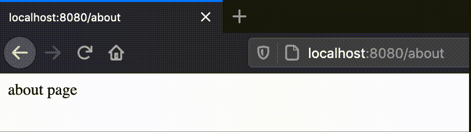
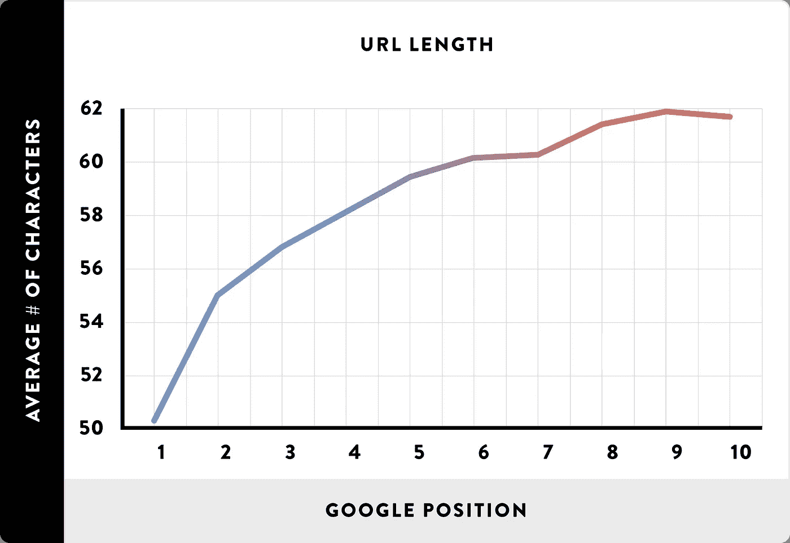

# Web 开发人员应该知道的关于 SEO 的 8 件事

> 原文：<https://javascript.plainenglish.io/search-engine-optimization-35e0f45fb56?source=collection_archive---------8----------------------->

## 小小的技术提示，影响巨大


Source: [Pixabay](https://pixabay.com/de/vectors/schnittstelle-internet-programm-3614766/)

一个不吸引访客的网站值多少钱？我会说，没什么。

当然，有付费广告，你可以不断地把用户带到你的网站或应用程序，但也可以更容易地通过**搜索引擎优化**。

最终，搜索引擎优化不能替代付费广告，因为两者是非常不同的营销形式，但对谷歌和谷歌公司来说，优化你的网站总是一个好主意。web 开发人员也应该知道一些关于 SEO 的基础知识。

# 什么是 SEO？什么不是呢？

[SEO](https://circuit.ooo/blog/seo-for-beginners) 代表搜索引擎优化。所以这是关于在谷歌上更好地排列你自己的网站。如果我们在搜索引擎中输入一些东西，它会吐出成堆的结果。但是顺序不是任意的；它基于一个定性网站应该涵盖的许多因素。

SEO 就是**拉动式营销**。这正是它无法替代付费广告的原因——因为后者是推送营销。随着排名的提高，我们可以更好地接触到寻找我们或我们的主题的人。因此，如果我们有一个网站，提供化妆品，我们的目标与良好的优化应该是，我们的网站显示高时，人们正在寻找它。

这是令人难以置信的强大——毕竟，它让我们能够接触到已经愿意购买我们的产品或使用我们的网站的人——更重要的是，SEO 通常不会产生运行成本，而是一次性优化。

另一方面，推式营销意味着我们在我们认为感兴趣的人面前推销某种东西。

## 搜索引擎优化的类型

一个网站的排名是由两个因素定义的——网站本身的优化和网站外部的优化。

前者叫做**页面内 SEO** ，后者叫做**页面外 SEO** 。

优化我们在搜索引擎中的排名是在我们自己的网站之外；例如，它是关于建立推荐链接。这些链接然后从其他网站指向我们的网站，使我们网站的可信度显得更高。

在本文中，我们只讨论页面搜索引擎优化。这一部分可以再分为两个部分，我称之为:

*   **内容搜索引擎优化**——这意味着调整内容的长度、关键词密度、选择好的图片、撰写标题，以确保网站有较长的阅读时间。
*   [**技术搜索引擎优化**](https://circuit.ooo/blog/an-introduction-to-technical-seo)——这是关于使网站在技术上干净，以便它运行良好&快速，并似乎值得搜索引擎信赖。

构建内容、文案和选择图片不是 web 开发人员的工作——这就是为什么我在本文中解释了属于技术 SEO 的所有内容。

# 1.标题标签的正确使用

h1、h2 等应该是每个人都知道的——它们用作标题。从视觉上看，它们只是字体大小不同而已——无论如何都可以用 CSS 进行调整。
因此，网络开发人员使用 h1 标签来定义标题的情况时有发生——但在搜索引擎优化方面，这是绝对不行的。

h1 是整个文档的标题。h2 等是子标题——您应该以同样的方式使用它们。

*   因此，h1 标记应该每页只出现一次。
*   h2、h3、h4 等也可能出现几次。
*   注意安排。如果出现一个 h1 和几个 h3，那么肯定也有一个 H2——否则，结构就没有意义了；它是不完整的。
*   当然，下一个较低的标题应该是指较高的标题。您可以将几个 h2 从属于一个 h1，几个 h3，依此类推。

所以这不仅仅是视觉外观的问题——确保在有意义的结构中使用标题。

# 2.避免尾随斜线

对于网络开发者来说，这是一个非常明确的任务。所谓的尾部斜线是 URL 资源末尾的斜线，实际上在那里已经不再需要了。

这里有一个例子:`codingcheats.io/javascript/`所以最右边的斜线是尾随斜线。如果我们忽略它并打开页面，我们会到达同一个页面——如果一切正常，那么在调用域时应该重定向尾部斜杠，所以我们得到了没有这个斜杠的 URL。下面是一个例子:



Source: the author

我的页面确实有这个问题——不管有没有斜杠，都出现了相同的页面——根据一些搜索引擎优化工具，这被认为是重复的内容。

确保您的 web 服务器删除尾随斜线——在 Express.js 中；这是有中间件的；在 PHP 中，您可以为此使用一个修剪函数。如果您使用的是 Firebase 或 Netlify 这样的托管服务，通常可以在那里进行配置，也可以自己完成。

# 3.良好的页面结构

根据经验，网站上的所有内容离主页的点击次数不应超过两次。一次又一次，也有人说，搜索引擎也包括网站的结构，包括在他们的评估子页面。但是，即使没有直接评级，一个好的、清晰的、平坦的结构也是有意义的，这样用户就可以找到他周围的路，并且不会立即再次跳下。

# 4.良好的链接结构

我们已经有了单个页面的结构；现在是关于链接的结构和 URL 的结构。

基本上，URL 应该是人类可读的，包含关键字，但仍然尽可能短。

一项广泛的研究很好地证明了这一点——谷歌上排名最好的网站通常都有非常短的网址:



Source: [Neil Patel](https://neilpatel.com/de/blog/seo-urls/)

我找这个考试的时候，自己考的。以下是排名前两位的网址:

```
/de/blog/seo-urls//learn/seo/url
```

它们对人类来说是可读的，包含关键词，不长，但仍然可以理解文章的内容。

# 5.针对移动设备的优化

谷歌获得的流量中，很大一部分来自移动设备。这就是为什么谷歌正式宣布它更喜欢为移动设备优化的网站——当然，这是可以理解的。

要提供一个移动网站，有不同的方法——使用设备查询是其中之一——但这里也必须考虑加载时间，因为谷歌也为移动设备测试网站。

为了实现这一点，例如，有移动优先的方法，其中媒体查询用于为桌面设备提供良好的体验。但是对于一个网站来说，如何实现应该取决于大多数用户的流量和设备类型。当然，为大多数用户提供最好的体验是很重要的。

# 6.标签和链接标题

大多数人都应该知道图像标签的 alt 属性，但它并不常用。这是一个最佳实践，因为它有助于搜索引擎理解你的图像是什么。当你在谷歌图片搜索中调用任何关键词的第一个结果时，这只会产生积极的影响——所有排名靠前的图片都有 alt 标签。

``

比 alt-tag 更罕见的是用于左边描述的 title-tag——直到几周前，我甚至不知道它的存在。然后我在一个搜索引擎优化工具上看到一个警告，说我绝对应该使用它。向搜索引擎提供更多关于你的内容的信息也是很有用的——因为，除了好的排名本身，我们还想对真正与我们相关的东西进行排名。

`<a href="" title="description of your link" />`

作为一名 web 开发人员，您应该确保这两个标签都可以使用——具体的内容不是您的任务。如果是的话，确保写一个简短易读的描述，包括关键词。

# 7.子域与子目录

当你扩展你的网站时，你经常会遇到这个古老的冲突——你应该使用子域还是子目录来添加内容到你的网站？如果你不太确定这两者是什么，这里有一个例子——在我自己的网站上，我想添加一个博客。有两种可能性:

子域:`blog.codingcheats.io`
子目录:`codingcheats.io/blog`

从技术的角度来看，一个子域可能是诱人的，因为它通常是免费的，并且有自己的 DNS 条目。

从谷歌这边来说，两者是同等对待的。然而，总是有猜测。一次又一次，你读到报告说，在从子域名切换到子目录后，你自己网站的排名飙升——但你必须小心这样的研究。

毫无疑问，大多数公司不会在没有进一步修改的情况下从一个子域转移他们的内容——所以我可以想象这样的转移是在网站完全更新的情况下进行的。所以其他变化可能是排名提高的真正原因。

一个仍然有效的假设是，子域名有自己的**域名管理机构**。因此，如果您的子域下有内容，它将不会受益于您的主域的权威。另一方面，如果你的子域提供了完全不同主题的内容，这可能是一个优势，至少这是假设。真相如何，只有搜索引擎运营商知道，如果有的话。将属于网站主题的所有内容放在主域名下是一个很好的做法。

亚马逊使用了这一原则——它的云服务 AWS 在主题上不属于购买平台 Amazon.com。因此它有子域 aws.amazon.com。

# 8.快速翻页

在今天的互联网中，一切都比过去快得多——这就是为什么用户比过去更不耐烦——大约是几秒钟，有时更短。

网站的速度可以包括在你自己的排名中，原因有两个:

*   当搜索引擎第一次搜索你的站点并把它列入索引时，它可以测量加载时间——当然，它更喜欢加载时间快的站点。
*   跳出率是用户用搜索引擎打开网站后离开的比率。当然，每个人都会在某个时候离开一个页面，所以这只是时间问题——如果用户通过谷歌找到你的页面，打开它，由于加载时间长，还没有什么可看的，他或她会立即离开。
    现在他回到了搜索结果页面，谷歌(或任何其他搜索引擎)可能会发现用户很快就退出了，即不满意该页面，这将影响排名。

因此，我们的目标是让页面尽可能快地显示可视内容，这正是我们可以通过一些优化技巧实现的目标:

*   让**的一切都不是次要的。**这是关于加载 JavaScript、CSS 和图像的。所有不直接影响用户在网站上看到的第一样东西都只是次要的。
*   这可以通过使用 [Async 和 Defer](https://medium.com/javascript-in-plain-english/async-and-defer-the-complete-guide-to-loading-javascript-properly-ce6edce1e6b5) 来实现，这可以大大减少网站的初始加载时间。
*   此外，CSS 可以很好地延迟加载或拆分，以至于页面上不会加载任何未使用的 CSS。
*   图像通常过大，因此仍然可以压缩。除了 PNG 或 JPEG 等传统格式之外，还有一些对网络特别有用的新格式。
*   使用客户端缓存来存储反复加载的资源。
*   服务器端缓存。例如，您可以为 API 设计一个缓存，以节省从应用服务器到 API 服务器的时间。此外，在服务器端呈现中，可以进行缓存，这样就不必为每个请求在服务器上重新组装页面。
*   使用 CDN。这可用于在全球范围内分发静态内容，如图像或 JavaScript 库，从而尽可能缩短每个地区的加载时间。一个完整的网站如果是静态的，也可以通过 CDN 交付。
*   覆盖世界各地不同的客户位置也适用于更复杂、非静态的网站。有了 AWS 的 Route 53 等服务，访问某个域的用户可以根据他们的位置被重定向到最近的服务器，从而将加载时间保持在最短。
*   使用服务器端呈现或静态生成器，而不是客户端站点呈现。长期以来，CSR 一直被认为对 SEO 不利——但这并不是因为谷歌和谷歌。CSR 页面无法阅读——过去是这样，但显然不再适用。尽管如此，许多 CSR 页面的第一次内容绘制比使用 SSR 或静态转换要晚得多。
*   重新思考你的图书馆的用途。第三方开发人员通常会使用不必要的大代码堆，在这种情况下，一个单独的实现，或者至少是一个不太复杂的替代方案，会更加合理。

这是一个网站开发者和任何接触到他们网站技术的人应该知道的关于 SEO 的知识。

**感谢您阅读&祝您排名好运！**

[加入我的邮件列表保持联系](http://eepurl.com/hacY0v)