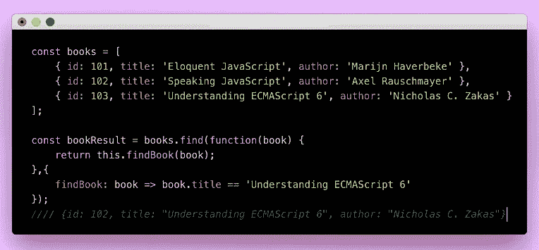
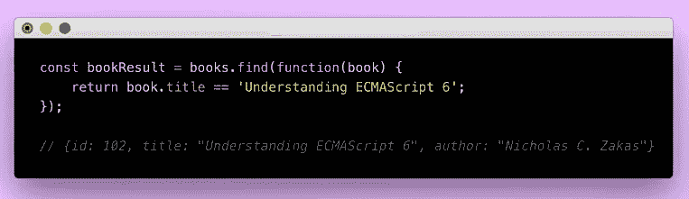
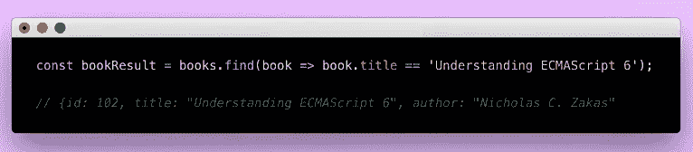
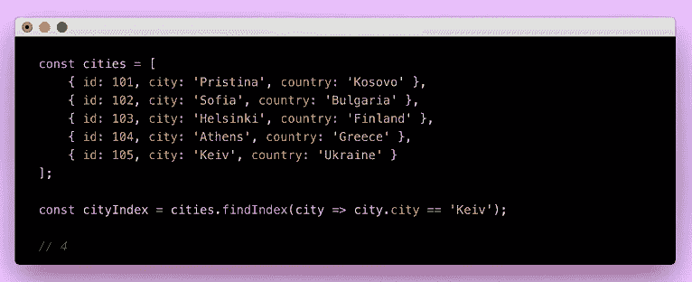
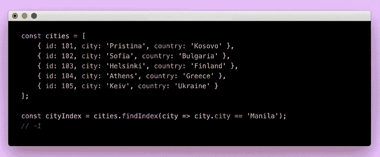
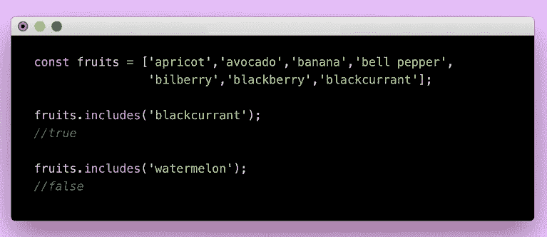
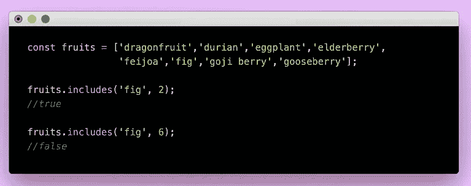
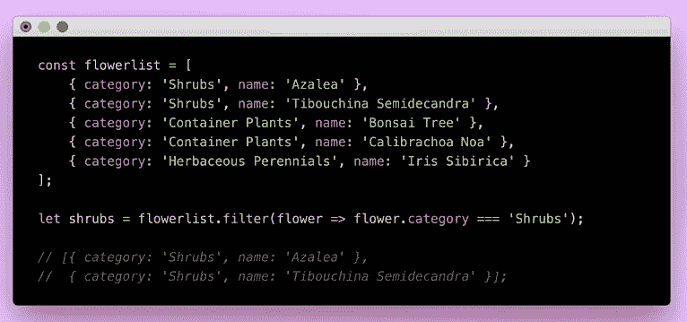
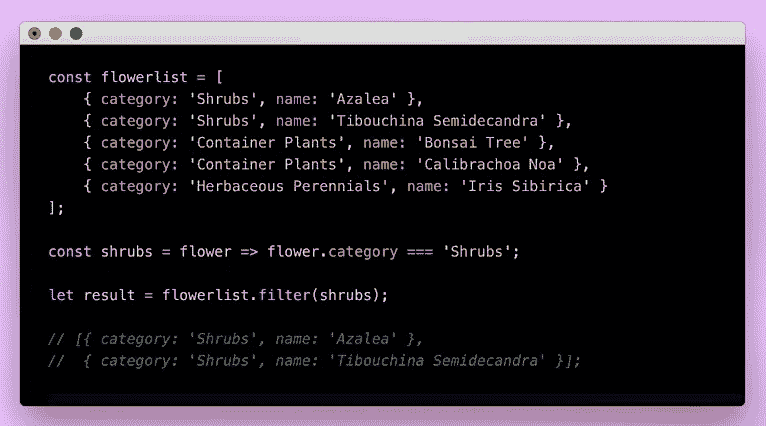

# 用 JavaScript 数组方法搜索数组元素

> 原文：<https://javascript.plainenglish.io/searching-for-array-elements-using-javascript-array-instance-methods-51ed6383b4fa?source=collection_archive---------10----------------------->

如果可以使用实例方法，为什么要浪费时间为循环写长*。这将使我们的代码更短，并清楚地表明我们的意图。 *For loops* 肯定也会这样做，但有时会使我们的代码难以理解，更难维护。*

我已经将这些方法分成组，以便更容易掌握。当条件通过时，第一个组将返回一个元素，而第二个组将返回所有实例。

你可以通过这个[链接](https://github.com/foobearer/Javascript-Array-Instance)找到样本代码。

## **返回数组搜索结果的第一个实例。**

## 发现

此方法返回匹配测试条件的第一个元素的值。

在本例中，我们将查找标题为*‘Understanding ECMAScript 6’*的书，并将检索该对象中包含的所有详细信息。

如果条件满足，那么它将返回一个项目，否则返回 undefined。

让我们看看下面的第一个例子。

还有另一种写法:

这是一个更简短的版本:

## findIndex

这个方法本质上与 *find* 方法相同，但是这次它返回找到元素的位置的索引。

当什么都没有找到时，它将返回 *-1* 。下面再看一个例子。

这里，我们有一个城市数组，我们正在寻找“Keiv”的索引。

现在，让我们尝试传递一个不在数组中的城市名。

## 包含

此方法检查数组是否包含您要搜索的元素，并返回 true 或 false。这是一个非常简单但有效的方法。

为此，我们可以简单地放置*。调用数组后包含*，同样:

*包含*方法也是以一个指标作为第二个参数。然后，它将从提供的索引开始检查数组中的值，并返回结果。如果第二个参数大于项目所在位置的索引，将返回 *false* 。

## 返回满足测试函数的数组搜索结果的所有实例。

## 过滤器

该方法获取数组并返回一个新的数组，该数组只包含符合条件的元素。

让我们看下面的例子来进一步理解这一点。

在这个例子中，我们希望得到“灌木”类别下的所有花。

另一种方法是在使用回调函数之前定义它。

## 备忘单:

***find:*** 将遍历数组内的元素，然后返回使其返回 true 的第一个值。

***filter:*** 将通过函数过滤元素，返回所有满足条件的值。

***findIndex:*** 将查找项目，并从您希望它搜索的位置开始返回其索引。

***包含:*** 如果数组中有要查找的项，则返回 true，否则返回 false。

Which method will you use to return the index of the yellow door above?

## 结论

JavaScript 数组中的元素可以有多种搜索方式，但是我们必须考虑代码的可读性、可维护性以及每种方法的性能。这些数组实例是我们可以用来解决问题的强大的小方法。

你觉得这个博客有帮助吗？别忘了在评论区留下一些反馈。

## **资源**

[包含 for noobs](https://dev.to/bananabrann/includes-for-noobs-41cc) | [访问数组元素](https://developer.mozilla.org/en-US/docs/Web/JavaScript/Reference/Global_Objects/Array#:~:text=Instance%20methods,-Array.prototype.concat&text=Returns%20a%20new%20array%20that,%2For%20value(s).&text=Copies%20a%20sequence%20of%20array%20elements%20within%20the%20array.&text=Returns%20a%20new%20Array%20Iterator,each%20index%20in%20the%20array.)