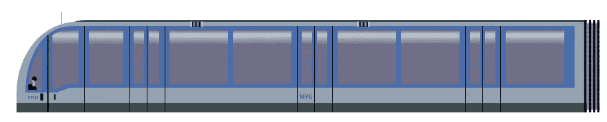

# 用 CSS 和单个 DIV 绘图的秘密

> 原文：<https://javascript.plainenglish.io/secrets-of-drawing-with-css-and-a-single-div-ce9930ec9050?source=collection_archive---------4----------------------->

最近 [#divtober](https://twitter.com/hashtag/divtober) ，一个由 [Lynn Fisher](https://medium.com/u/8e13fec1db81?source=post_page-----ce9930ec9050--------------------------------) 发起的标签结束了——至少到 2020 年。在她的网站上，她向#divtober 展示了自己的贡献。这是一个令人惊叹的 CSS 艺术收藏。一旦你知道这些相当复杂和详细的类似剪贴画的图像是只用一个 DIV 和纯 CSS 绘制的，这意味着没有像萨斯/SCSS 这样的预处理程序，没有图像，没有 SVG，那就更令人印象深刻了。只有 CSS 和一个 DIV——用 CSS 绘制图像所需的最小 HTML 量。

我自己也有一个小小的[单 DIV CSS 美术](https://codepen.io/collection/XywLkm)收藏。例如，MacBook Pro 的图像具有光滑的屏幕和下面机箱的反射，仅使用一个 DIV 和纯 CSS 绘制。已经有一些关于如何创建 CSS 艺术的文章了。例如阿里·斯皮特尔的文章。或者[这里](https://jstutorial.medium.com/css-art-tutorial-a35f5369ea08)由 [JavaScript 老师](https://medium.com/u/6727c1eb71f8?source=post_page-----ce9930ec9050--------------------------------)讲解。完全值得一读！如果你有时间，可以去看看。但是他们的文章集中在多个 div 上。然而，在这篇文章中，我将用简单易懂的语言向你揭示如何用纯 CSS 和一个 DIV 绘制图像的秘密。


Drawn with a single DIV and pure CSS. See code [here](https://codepen.io/pandaquests/pen/bGepwEv)

一切都从一个`<div/>`开始。这是对 HTML 元素应用 CSS 所需的最少数量。用单个 DIV 绘制 CSS 通常意味着利用一切可以用来创建任何形状或形式的手段来实现您的想法。就像在传统绘画中，你的画笔越多，效果就越好。CSS 为您提供了更多的形状和形式，而您最初认为只有一个 DIV 是可能的。

## 方框阴影

先说一个简单的。如果你以前用过 CSS，你可能知道`[box-shadow](https://developer.mozilla.org/de/docs/Web/CSS/box-shadow)`属性。在下面的例子中，您创建了一个默认为黑色的方框阴影，向左和向上偏移 10px，模糊和扩散半径分别为 10px。

```
div {
  width: 100px;
  height: 100px;
  background-color: green;
  **box-shadow: 10px 10px 10px 10px;**
}
```


By default the box shadow is black

只需对上面的代码做一些修改，即通过将模糊和扩散半径设置为`0px`，您就可以模拟第二个元素，因为减少模糊和扩散半径会使阴影的边界变得模糊，从而产生一个附加元素的幻觉。

```
div {
  width: 100px;
  height: 100px;
  background-color: green;
  box-shadow: 10px 10px 0px 0px red;
}
```


`box-shadow`属性可以接受任意多的值。通过改变颜色和位置，您可以创建任意多附加元素的幻觉:

```
div {
  width: 100px;
  height: 100px;
  background-color: green;
  box-shadow: 10px 10px 0px 0px red,
    23px 200px 0px 0px blue,
    140px 90px 0px 0px yellow,
    250px 40px 0px 0px pink;
}
```


One DIV with multiple box-shadows

好吧，酷。但是你为什么想要很多方形的彩色盒子呢？真的能用它画画吗？技术上来说是的。因为基本都是像素。电脑游戏是由像素构成的图画。[这里的](https://www.youtube.com/watch?v=KACYxrl9Mjw)是一个仅使用方框阴影的 CSS 图像的例子。也是动画的像素。

虽然可能，但仅使用像素绘制整张图片(您必须单独设置它的位置)太单调乏味，并且缺乏大多数人欣赏的单个 DIV 艺术的复杂性。但是，您可以将它们组合起来，以创建除父元素之外的不同图形:

```
div {
  width: 100px;
  height: 100px;
  background-color: green;
  box-shadow: 150px 50px 0px 0px red,
    250px 50px 0px 0px red,
    350px 50px 0px 0px red,
    400px 50px 0px 0px red;
}
```


Different objects drawn with one and the same DIV

这是我经常使用的技巧。例如在[我的 MVG 地铁图](https://codepen.io/pandaquests/pen/KKMzgVG)中，我使用了一个垂直笔画来创建你在图中看到的所有垂直笔画:



举例来说，我放大并标记了用于复制所有其他垂直线的红色部分:


I marked the single vertical line in red to exemplify the technique

下面平行的线只是那条线的阴影。:)你可以看到一个简单但强大的技术。

## 伪元素

当人们想到单一的 DIV 艺术时，他们会认为你只有一个元素要设计，并且困惑于你如何仅仅使用一个元素就能“画”出一幅图像。这个假设并不完全正确。您总是会得到两个所谓的伪元素，`before`和`after`，您可以对它们进行样式化——就像任何其他 div 一样。唯一的区别是您必须用 any 字符串设置`content`属性，并且您必须设置 position 属性:

```
div {
  width: 100px;
  height: 100px;
  background-color: green;
}**div::before** {
  content: "";
  width: 100px;
  height: 100px;
  background-color: yellow;
  position: absolute;
  top: 25px;
  left: 25px;
}**div::after** {
  content: "";
  width: 100px;
  height: 100px;
  background-color: red;
  position: absolute;
  top: 50px;
  left: 50px;
}
```


These three elements were created just by using one DIV and pseudo-elements

通常你必须设置一个空字符串，除非你也想使用`content`字符串作为设计的手段。但更多的是关于如何使用字符串作为一种手段来设计您的单个 DIV CSS 绘图。

在我几乎所有的 CSS 绘图中，我都会使用伪元素。它们是单个 DIV CSS 艺术最重要的部分。为了向您展示这些元素在哪里，我在[我的 iPhone 绘图](https://codepen.io/pandaquests/pen/abZNmdb)中标记了这些元素:红色边框的元素是 DIV。绿色边框的元素是`before`伪元素。蓝色边框的元素是`after`伪元素。


Pseudo elements highlighted in green and blue. The red one is the main DIV

您可以像处理任何其他 DIV 一样处理每个伪元素，并对任何其他 DIV 使用所有可用的技术。

## 线性渐变

你可能会问:“你怎么能只使用伪元素和方框阴影来绘制 iPhone 呢？如何实现那些金属效果？”


Metallic effects created with CSS

你可能已经猜到了，它们是使用 CSS [线性渐变](https://developer.mozilla.org/en-US/docs/Web/CSS/linear-gradient)创建的。线性梯度是属性`background-image`的一个值。仅用线性渐变，你就可以创造出大量惊人的效果。首先:

```
div {
  width: 100px;
  height: 100px;
  background-image: linear-gradient(red, yellow);
}
```


Fire-like effect with linear-gradient

通过更改角度和设置某种颜色填充 DIV 的百分比，您可以创建像金属光泽外观一样的酷效果:

```
div {
  height: 100px;
  width: 100px;
  background-image: linear-gradient(to right, rgba(115, 107, 98, .5) 1px, rgba(253, 247, 240, .5) 4px, #fdf7f0 8px, #d2c6b9 11px, #d2c6b9 37px, #d2c6b9 80px, transparent 80px, transparent 215px, #d2c6b9 215px, #d2c6b9 264px, #d2c6b9 286px, #fdf7f0 291px, rgba(253, 247, 240, .2) 295px, rgba(115, 107, 98, .4) 299px);
}
```


大多数人不知道的是，你可以添加任意多的线性渐变。此外，您也可以创建硬边线没有梯度与线性梯度，太。例如，我使用多重线性渐变来创建如下所示的条形码:


首先，我创建了两个水平不透明的酒吧。和一个水平透明条之间。这可以通过一个线性梯度来实现:

```
div {
  height: 200px;
  width: 200px;
  background: linear-gradient(#ddd 145px, transparent 145px, transparent 190px, #ddd 190px);
}
```


接下来，我将添加垂直线，以实现条形码的幻觉。正如你所看到的，你可以在一种颜色的末端和下一种颜色相同的位置创建硬边线条。如果一种颜色的结束点与下一种颜色的开始点相同，您会产生一种硬边线条的错觉:

```
div {
  height: 200px;
  width: 200px;
  background: linear-gradient(#ddd 145px, transparent 145px, transparent 190px, #ddd 190px), linear-gradient(90deg, transparent 120px, black 120px, black 121px, transparent 121px, transparent 122px, black 122px, black 123px, transparent 123px, transparent 128px, black 128px, black 130px, transparent 130px, transparent 131px, black 131px, black 132px, transparent 132px, transparent 133px, black 133px, black 138px, transparent 138px, transparent 139px, black 139px, 140px, transparent 140px, transparent 145px, black 145px, black 146px, transparent 146px, transparent 147px, black 147px, black 150px, transparent 150px, transparent 155px, black 155px, black 156px, transparent 156px, transparent 157px, black 157px, black 158px, transparent 158px, transparent 159px, black 159px, black 160px, transparent 160px, transparent 161px, black 161px, black 162px, transparent 162px);
}
```


Hard edgled lines created using linear gradient

## 径向梯度

除了线性渐变，你也可以使用[径向渐变](https://developer.mozilla.org/en-US/docs/Web/CSS/radial-gradient)作为`background-image`属性的值。与线性渐变类似，您可以单独设置位置、颜色和颜色扩散:

```
div {
  height: 200px;
  width: 200px;
  background: radial-gradient(circle at center, red 0, blue, green 100%);
}
```


例如，我只使用径向渐变绘制了[的眼镜、眼睛、瞳孔和这个仆人](https://codepen.io/pandaquests/pen/xxOWMOo)的反光:


Glasses, eye, pupil, and light reflection were created using radial gradient

## 背景尺寸

我们谈了很多关于`background-image`的事情。但是你知道你也可以使用`background-size`作为一种手段来画画吗？调整`background-size`的大小意味着增加你在`background-image`中绘制的元素数量。例如，下面的代码创建了一个圆

```
div {
  width: 100px;
  height: 100px;
  background: radial-gradient(circle, white 10%, transparent 0%), green;
  background-size: 100% 100%;
}
```


通过将`background-size`从`100%`减少到`50%`，您可以复制`background-image`:

```
div {
  width: 100px;
  height: 100px;
  background: radial-gradient(circle, white 10%, transparent 0%), green;
  **background-size: 50% 100%;**
}
```


我在下面的机器人的[图上应用了这种技术:](https://codepen.io/pandaquests/pen/xxOWMRo)


安卓的眼睛只是一个用`radial-gradient`画的圆。通过简单地改变`background-size`，我可以创建`background-image`的 2 个副本。

## 信

如果你足够仔细地检查机器人的代码，你会看到它是用我到目前为止在这里解释的所有技术绘制的。除了一个:信。为此你需要一点创造力。这是我很少在其他画中看到的技巧。我不知道为什么人们不用它，但是我经常用它。对于 Android 的天线，我在其中一个伪元素的内容值中添加了一个`"\000a0V”`。`V`代表两根天线。`\000a0`代表不间断空格。我用这个来垂直放置字母。为了将其水平放置，您可以使用`\A`。这增加了一个换行符。

使用字母作为设计手段的另一种方式是使用某些符号。例如[这辆赛车的方向盘](https://codepen.io/pandaquests/pen/poyMGKM)实际上是一个字母——一个[“右半直积”](https://www.htmlsymbol.com/unicode-code/22cc.html)(不要问我这个字母是做什么用的。如果你知道，那就在下面评论吧。我很想知道):


那个字母用`\22cc`编码，看起来像这样:


[Right Semidirect Product](https://www.htmlsymbol.com/unicode-code/22cc.html)

再比如[宠臣图](https://codepen.io/pandaquests/pen/xxOWMOo)。腿实际上是字母`k`的，臂是字母`v`的:


通过在伪元素的`content`属性中添加字母，我可以创建更复杂的形状和形式，以补充绘图。

## 反射

你可能还会问自己，我是怎么创造出 MacBook Pro 机箱的倒影的。其实挺简单的。CSS 为此提供了一个属性:`box-reflect`。它镜像水平应用的元素:

```
div {
  width: 100px;
  height: 100px;
  background-color: green;
  border-bottom-right-radius: 50px;
  border: 1px solid blue;
  -webkit-box-reflect: 
      below 0px 
      -webkit-gradient(linear, left top, left bottom, 
         from(transparent), color-stop(5, transparent), to(white));
}
```


正如你看到的厂商前缀，它是[不是 CSS 标准](https://developer.mozilla.org/en-US/docs/Web/CSS/-webkit-box-reflect)，不应该在产品代码中使用。它也没有全面的浏览器支持，正如你在[caniuse.com](https://caniuse.com/)看到的:


## 结论

CSS 提供给你的不仅仅是 DIV 元素。有很多方法可以从一个 DIV 中创建其他元素。其中一个是伪元素。在绘制 CSS 时它们是必不可少的。使用新的和实验性的。最后但同样重要的是，你可以通过使用字母来增强你的图画。

总的来说，CSS 艺术并不意味着生产，因为我向你展示的技术并不能在所有的浏览器上响应。因此，一些绘图在不同的浏览器或屏幕上看起来会很糟糕。

但是绘制 CSS 艺术帮助我培养了我的创造力，并且在这个过程中我学到了我以前不知道的很酷的新功能。

你也画单个 DIV CSS 图像吗？在这里分享你的作品。或者你有另一个我在这篇文章中没有提到的技巧？让我知道并在下面评论。不管怎样，我希望明年能在#divtober2021 见到大家。