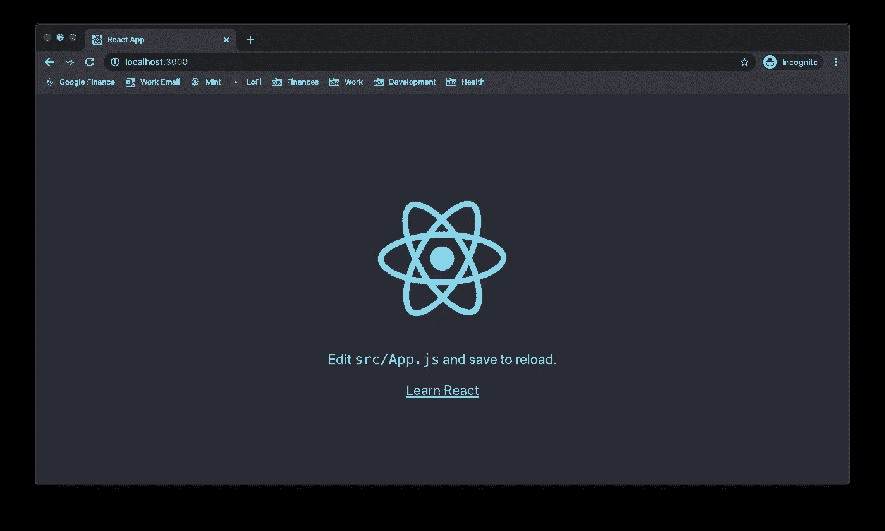
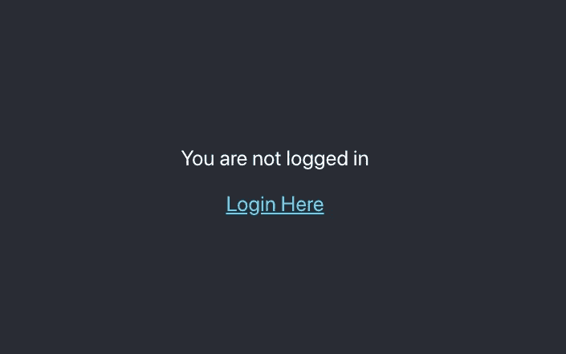
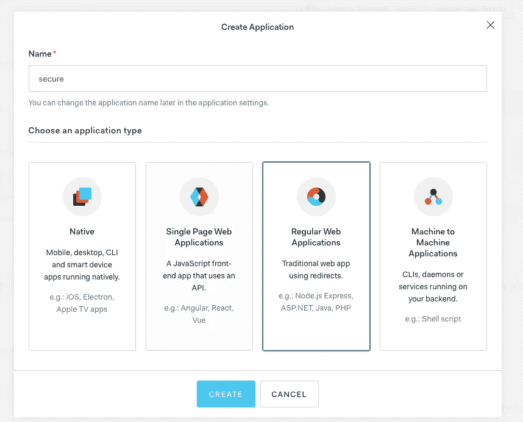
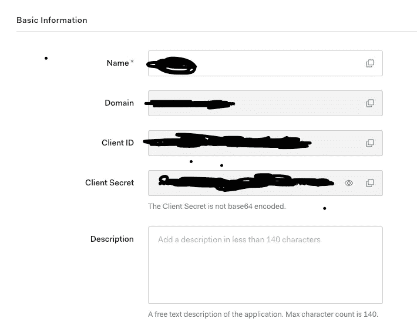
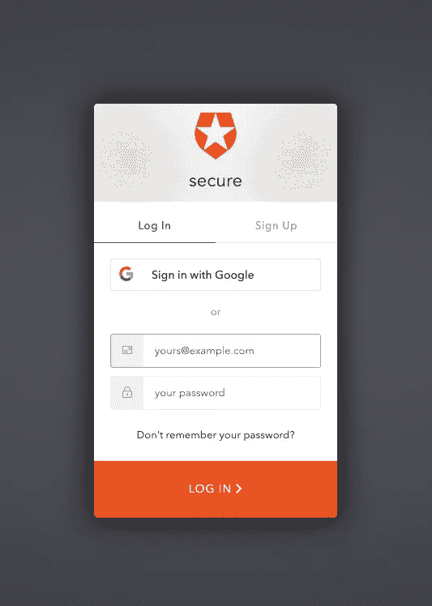
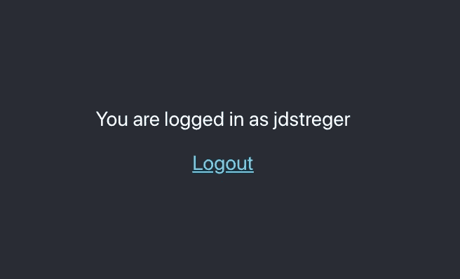

# 如何创建安全的 React & Express 应用

> 原文：<https://javascript.plainenglish.io/secure-react-express-apps-jsonwebtoken-cookie-session-auth0-and-passport-tutorial-e58d6dce6c91?source=collection_archive---------2----------------------->

## 使用 jsonwebtoken、cookie 会话、auth0 和 passport


我长期学习 express、node 和 react 项目。我总是从一个例子跳到另一个例子，试图找出我的 express 服务器的最佳配置。在我的发展过程中，有一个特定的话题/问题似乎从我的生活中抽走了几天(如果不是几周的话)。

## 您将如何保护您的会话？

无论您是通过谷歌、脸书或其他第三方认证机构来认证您的用户，还是创建您自己的本地认证机构(除非您知道自己在做什么，否则这通常是个坏主意)，您的认证过程的安全性还取决于您如何与您的用户保持会话。

本教程的重点是创建一个安全的 express react 应用程序，我们可以在其他酷项目中反复使用。对于那些正在为他们的 react-express 项目寻找一个简单而安全的设置的人，我将回顾我的首选配置，以及我对它的理解。有更多的配置具有更高的安全性或易用性，所以如果你遇到任何或希望击败我的摊位，我很乐意听到他们。

## **你首先需要知道的:**

我将在本教程中使用几个关键概念，所以这里有一个简短的概述:

**饼干**

HTTP Cookies 是存储在 web 浏览器上的小块数据，从服务器端发送。cookies 中有一些关键属性。安全的 cookie 只能通过加密连接(https)传输。客户端 API(如 javascript)无法访问仅支持 http 的**cookie。这些 cookies 被发送回原始服务器，因此它们可以保存有关连接用户的信息。**

**JSON 网络令牌(JWT)**

JWT 令牌是加密签名的 base64 JSON 对象。您可以创建这些令牌，并将它们从后端服务器发送到前端进行存储。当这些令牌被发回时，您可以验证令牌上的签名，以验证 JWT 是否有效。这可以作为验证会话的一种非常方便的方法。

**为什么 Cookies 保存 jwt 而不是本地存储？**

浏览器上的本地存储易受 XSS 攻击，恶意代码可以窃取用户的浏览器存储并窃取有价值的会话数据。这很容易通过安全/仅 http cookie 来避免

# 我第一次学习时遇到的情况是:

有两个非常受欢迎的软件包可用于维护 express 中的会话:

`express-session and cookie-session`

**快速会议**

Express-session 是一个会话中间件，用于存储会话数据**服务器端。**这意味着当用户登录时，他们的会话数据被存储在后端的某个数据库中，会话 id 被存储在 cookie 中，然后被传递到前端。当 cookie 根据请求返回时，这个会话 Id 用于在数据库中查找会话。

**Cookie-session**

Cookie-session 是另一个会话中间件。这个中间件创建了一个 cookie，可以用来存储发送到前端的 cookie 中的信息。这不会在服务器上存储任何数据，因此不涉及存储。

## 为什么一个在另一个之上？

在我在网上找到的教程中，Express-session 似乎用得更多，尤其是与 passport 等流行的认证库一起使用。对于那些只想通过快速教程深入学习的初学者来说，这无疑可以节省一些时间和头痛。

不幸的是，超越开发是 express-session 更复杂的地方。因为快速会话的默认会话存储是 MemoryStore，所以它不是专门为生产环境而设计的，并且由于它不能扩展到单个进程之外，所以会泄漏内存。它需要一个独立的服务器端存储系统，比如 redis 或 mongodb，以便在生产环境中很好地运行。

添加服务器端会话存储也会带来性能障碍，但是允许存储更多关于会话的数据，因为它是一个实际的存储系统，而不是一个小 cookie。cookie(根据 RFC625 规范)建议浏览器应该允许每个 cookie 至少 4096 字节。不幸的是，这意味着每个域不能超过 4093 字节。

**为什么 Cookie-session 是一个可爱的选择:**

Cookie 会话不需要用于生产的服务器端存储，并且您可以自由操纵进入 cookie 会话的内容。我们可以很容易地给我们的会话 cookie 赋值，比如一个 JWT 令牌。这可以让您的服务器在负载平衡的情况下减少延迟和问题。

如果您想添加服务器端存储来跟踪会话，您可以将此逻辑添加到 cookie 会话设置中，以防您有此功能的用例。cookie 会话中间件很灵活，只需要一点点爱。

# 它看起来像什么:

我们将使用 **passport、jsonwebtoken 和 cookie-session。**我也将使用 ReactJS 前端。

创建一个新的项目目录并初始化一个新的节点项目。

```
$ mkdir secure-starter
$ cd secure-starter
$ npm init
```

没什么特别的，我只是喜欢将我的“main”设置为 server.js，现在我们有了一个 package.json 文件。

让我们下载起始依赖项

```
$ npm install --save express cookie-session
```

现在，我们在根目录下为一个简单的 express 应用程序创建 server.js:

```
// server.js
const express = require('express');
const session = require('cookie-session');

/* Create Express App */
const app = express();

app.listen(8080, () => {
  console.log("I'm listening!");
});

module.exports = app;
```

在上面的例子中，我们做了以下事情

1.  导入我们的依赖项
2.  使用`express()`创建快速应用程序
3.  我们的应用程序现在监听端口 8080

如果我们运行我们的服务器，我们可以看到它是活的:

```
$ npm start
> node server.jsI'm listening!
```

让我们添加饼干的东西:

```
/* Create Express App */
const app = express();.../* Set Cookie Settings */
app.use(
  session({
    name: 'session',
    secret: 'secretKeyWooo',
    expires: new Date(Date.now() + 24 * 60 * 60 * 1000), // 24 hours
  })
);...app.listen(8080, () => {
    console.log("I'm listening!");
});
```

好吧，这意味着什么

1.  我们告诉我们的应用程序使用 cookie 会话中间件
2.  名称:是 cookie 设置的名称
3.  secret:用于签名和验证 cookie 值的字符串
4.  过期时间:我们的 cookie 将于何时过期。

**需要注意的是，我们可以将其他选项传递到我们的 cookie 设置中，这也是我没有包括它们的原因:**

*   secure:一个布尔值，指示 cookie 是否只通过 https 发送。默认情况下，http 为 false，https 为 true。所以我们现在可以把它留为空白，但是对于生产来说，这应该是正确的。**因此，请始终通过 https 托管您的站点**。
*   httpOnly:一个布尔值，指示 cookie 是否只通过 http(s)发送。这在默认情况下是正确的，这很好，因为我们不希望客户端 Javascript 使用它。
*   signed:一个布尔值，指示是否要对 cookie 进行签名。默认情况下是这样的。

还有一些我们不需要的其他设置，但对您的应用程序可能有用，所以请查看文档了解详细信息。

## 添加一些额外的安全中间件

以下是一些附加的安全中间件及其说明:

```
$ npm install --save helmet hpp csurf express-rate-limit
```

**头盔—** 设置各种 HTTP 头，帮助防御常见的 web 应用安全漏洞，如 xss 攻击。

**hpp —** 这可以防止 HTTP 参数污染攻击

**csurf —** 这可以防止跨站点请求伪造。这需要在我们的 cookie 会话连接之后使用。

我们的 server.js 在实现后看起来像这样:

```
// server.js
const express = require('express');
const session = require('cookie-session');
const helmet = require('helmet');
const hpp = require('hpp');
const csurf = require('csurf');

/* Create Express App */
const app = express();

/* Set Security Configs */
app.use(helmet());
app.use(hpp());

/* Set Cookie Settings */
app.use(
    session({
        name: 'session',
        secret: 'secretKeyWooo',
        expires: new Date(Date.now() + 24 * 60 * 60 * 1000), // 24 hours
    })
);
app.use(csurf());

app.use(limiter);

app.listen(8080, () => {
    console.log("I'm listening!");
});

module.exports = app;
```

# 创建 react 前端:

```
$ npx create-react-app client
```

这将在名为 client 的新目录中创建一个样板 react 应用程序。

安装完成后，我们可以像这样运行 react 前端:

```
$ cd client
$ yarn start
```

这将启动我们的开发服务器，并在 localhost:3000 上打开我们的模板



非常好。

是时候去掉一些 App.js 并创建一些新页面了。并且还设置了我们的代理:

```
$ cd client
$ yarn add http-proxy-middleware
```

setupProxy.js:这是在 client/src 中

```
const proxy = require('http-proxy-middleware').createProxyMiddleware;

module.exports = function (app) {
    app.use(proxy(`/auth/**`, { target: 'http://localhost:8080' }));
};
```

我们这样做的原因是为了能够将去往`/auth/*`的请求传递到我们的后端，而不是被 localhost:3000 捕获，这个代理设置不应该影响生产中的任何事情。

App.js

```
import React, {useState} from 'react';
import './App.css';
import Home from "./Home";
import Profile from "./Profile";
import Loading from "./Loading";

function App() {
  const [auth, setAuth] = useState(null); // IF WE CHANGE THIS INITIAL VALUE WE GET DIFFERENT PAGES

  if (auth === null) {
    return <Loading/>
  }
  if (auth) {
    return <Profile/>
  }
  return <Home/>
}

export default App;
```

**解释:**我们的 App.js 文件现在将根据用户的身份验证状态来“路由”用户。当页面第一次加载时，我们不知道我们的用户是否经过身份验证，所以我们使用`useState`创建一个 auth 值，并将其初始值设置为 null

当 auth 值为 null 时，我们返回加载屏幕。如果我们的身份验证是真的，那么我们返回我们的个人资料屏幕，否则我们将显示主屏幕(或登录屏幕)。稍后我们将实现一个逻辑，根据用户是否登录来改变 auth 值。

**Home.js:在客户端/src**

```
import React from 'react';
import './App.css';

function Home() {
    return (
        <div className="App">
            <header className="App-header">
                <p>
                    You are not logged in
                </p>
                <a
                    className="App-link"
                    href={"/auth/login"}
                >
                    Login Here
                </a>
            </header>
        </div>
    );
}

export default Home;
```

**解释:**这是一个简单的登录屏幕，我们的登录链接指向/auth/login，它应该路由到我们的后端。

**Loading.js**

```
import React from 'react';
import './App.css';

function Loading() {
    return (
        <div className="App">
            <header className="App-header">
                <p>
                    Loading...
                </p>
            </header>
        </div>
    );
}

export default Loading;
```

**Profile.js**

```
import React from 'react';
import './App.css';

function Profile() {
    return (
        <div className="App">
            <header className="App-header">
                <p>
                    You are logged in :)
                </p>
                <a
                    className="App-link"
                    href={"/auth/logout"}
                >
                    Logout
                </a>
            </header>
        </div>
    );
}

export default Profile;
```

因此，如果 auth 为空，我们的屏幕如下所示:


如果我们的认证是假的:



到目前为止，这些链接和按钮不会做任何事情，但是在我们配置了我们的 auth0 和后端服务器 auth 设置之后，它们就有意义了。

# **创建一个 auth0 帐户并设置回拨/重定向 URL**

Auth0 是一个很棒的第三方认证方，它允许对所有类型的应用程序进行多方面的集成。您不需要使用 Auth0，基于 passport 的身份验证策略有许多选项，但 Auth0 是我尚未使用过的一种，它们允许自己的登录屏幕，并记录所有身份验证尝试。

1.  转到[https://manage.auth0.com/welcome/#](https://manage.auth0.com/welcome/#)
2.  通过注册创建一个帐户
3.  选择一个与您或您的应用相关联的租户域
4.  选择“个人”并进入下一步
5.  创建应用程序并选择常规 web 应用程序



选择 node.js 作为项目背后的技术。

创建新应用程序后，您将能够在仪表板中查看基本信息和属性。您还可以访问 Auth0 的快速入门教程，这非常方便，但只有在您决定使用 express-session 时才完全有用。找到 Node.js、auth0 和 cookie-session 的教程实际上比我想象的要困难。



**你需要做的一件重要的事情是:在你允许的回调 url 部分，你应该输入** `[http://localhost:3000/auth/callback.](http://localhost:3000/auth/callback.)`这是 Auth0 在完成对你的用户的认证后将重定向到的 URL。

您需要将您的 Auth0 应用程序域、clientID 和客户端机密复制到您的应用程序中。最佳实践是将其存储在一个`.env`文件中，并使用`dotenv`包将这些配置应用到您的节点流程中，不要忘记将它们从您的 git 提交中排除，这样您就不会公开显示您的客户端秘密。你也可以用这个。env 文件来保存您的 cookie 的秘密。

甚至在制作这个教程的时候，我不小心把我的 auth0 秘密提交给了 github。幸运的是，Auth0 允许您旋转您的密钥。呜呜:)

```
$ npm install --save dotenv
```

然后我们添加我们的 dotenv 配置设置

```
const dotenv = require('dotenv');
const path = require('path');

/* Import config */ // THIS IS NEW :)
dotenv.config({path: path.resolve(__dirname, '.env')});/* Create Express App */
const app = express();

/* Set Security Configs */
app.use(helmet());
app.use(hpp());

/* Set Cookie Settings */
app.use(
    session({
        name: 'session',
        secret: process.env.COOKIE_SECRET, // WE USE THIS NOW :)
        expires: new Date(Date.now() + 24 * 60 * 60 * 1000), // 24 hours
    })
);
app.use(csurf());
```

现在我们的……env 文件，该文件应位于根目录:

```
AUTH0_SECRET=<your secret>
AUTH0_CLIENT_ID=<your client id>
AUTH0_DOMAIN=<your domain>
AUTH0_CALLBACK_URL=http://localhost:3000/auth/callback
COOKIE_SECRET=<move your cookie secret here>
JWT_SECRET_KEY=secretttttttt // THIS IS ALSO NEW
```

# 执行护照:

Passport 是 Node.js 的一个身份验证中间件，它非常好。它有许多认证策略，例如通过谷歌、facebook，甚至本地认证策略。我们将实现两个策略:auth0 和 jwt。

```
$ npm install --save passport passport-auth0 passport-jwt jsonwebtoken
```

现在我们创建了 passport.js 文件:

```
// middlewares/passport.js
const passport = require('passport');
const Auth0Strategy = require('passport-auth0');
const JwtStrategy = require('passport-jwt').Strategy;
const auth0Strategy = new Auth0Strategy(
    {
        domain: process.env.AUTH0_DOMAIN,
        clientID: process.env.AUTH0_CLIENT_ID,
        clientSecret: process.env.AUTH0_SECRET,
        callbackURL: process.env.AUTH0_CALLBACK_URL,
    },
    (accessToken, refreshToken, extraParams, profile, done) => {
        return done(null, profile);
    }
);

const jwtStrategy = new JwtStrategy(
    {
        jwtFromRequest: (req) => req.session.jwt,
        secretOrKey: process.env.JWT_SECRET_KEY,
    },
    (payload, done) => {
        // *TODO: add additional jwt token verification* return done(null, payload);
    }
);

passport.use(auth0Strategy);
passport.use(jwtStrategy);

module.exports = passport;
```

我们来谈谈这些策略:

1.  **Auth0Strategy** :这将从获取您的域、clientId、clientSecret 和回调 URL。，并使用它将用户重定向到 Auth0 登录页。一旦用户完成登录，Auth0 将他们重定向回回调 url，现在我们将在其中拥有此用户的配置文件。
2.  **JwtStrategy** 是 passport 验证 jwt 令牌的一种简单方法，它使用给定的秘密来解码 jwt 的签名并返回编码到令牌中的有效负载。

将 passport 文件导入 app.js 文件，确保这是在导入`.env`文件之后，因为`passport.js`使用`process.env`配置。

```
const passport = require('./middlewares/passport');
```

初始化应用程序后，您应该告诉它使用 passport 中间件:

```
app.use(passport.initialize());
```

**现在我们的应用程序正在使用 passport，而且我们配置的策略可用。**

# 实现我们的身份验证路由

我们应该创建 auth.js 路由。这些将是中公开的开放终结点，供我们的前端重定向以进行登录/注销过程。

```
const express = require('express');
const passport = require('passport');
const jwt = require('jsonwebtoken');

const jwtRequired = passport.authenticate('jwt', { session: false });

const router = express.Router();

router.get(
    '/login',
    passport.authenticate('auth0', {
        scope: 'openid email profile',
    }),
    (req, res) => {
        res.redirect('/');
    }
);

router.get('/callback', (req, res, next) => {
    passport.authenticate('auth0', (err, user) => {
        if (err) {
            return next(err);
        }
        if (!user) {
            return res.redirect('/login');
        }
        console.log("CALLBACK SUCCESSFUL!")
        const userReturnObject = {
            nickname: user.nickname,
        };
        req.session.jwt = jwt.sign(userReturnObject, process.env.JWT_SECRET_KEY);
        return res.redirect('/');
    })(req, res, next);
});module.exports = router;
```

解释:

1.  我们的`/login`路由利用了我们新的 auth0 passport 身份验证，为配置文件请求了一些用户范围。当此终结点被命中时，它实际上将用户重定向到 Auth0 登录屏幕。
2.  `/callback`需要从 Auth0 登录屏幕接收回用户数据。这将把我们的凭据传递回 passport 身份验证过程，该过程将验证从 Auth0 返回的信息是否有效。如果出现错误或用户为空，我们会将用户重定向回/login 路径。否则，我们现在拥有用户的信用

```
req.session.jwt = jwt.sign(userReturnObject, process.env.JWT_SECRET_KEY)
```

3.上面的代码片段是为我们的用户创建无状态会话的基础。我们获取来自用户对象的一些信息，将其打包在 JWT 令牌中，并使用我们的密钥对其进行签名。然后，我们将 JWT 令牌分配给我们的 req.session，这是我们使用`cookie-session`库创建的 cookie。

**此 cookie 将在每个请求时发回，并应包含我们的用户 jwt 令牌。**

在我们的 server.js 文件中，我们需要包含新的身份验证路由:

```
app.use(passport.initialize()); //... this is new stuff
const authRoutes = require('./routes/auth');
app.use('/auth', authRoutes);
//...app.listen(8080, () => {
    console.log("I'm listening!");
});
```

现在，当我们点击登录按钮时，我们应该正确地重定向到我们的 auth0 登录屏幕:



当我们登录时，我们应该成功地重定向回我们的应用程序。不幸的是，我们还没有完全完成我们的前端，所以可能很难确定我们是否真正登录。但是你可以在回调函数中放置一些日志来打印一些成功的语句！我添加的那个应该显示:

`CALLBACK SUCCESSFUL!`

# 设置私有路由

我们已经正式给了我们的新用户一个 jwt 令牌。但是我们希望能够使用该令牌来验证他的会话是有效的。

**在我们的授权路由文件中，我们可以添加 passport-jwt 策略作为保护路由的中间件:**

```
const jwtRequired = passport.authenticate('jwt', { session: false });

router.get('/private-route', jwtRequired, (req, res) => {
    return res.send('This is a private route');
});
```

现在，当我们在`/private-route`端点接收到一个请求时，我们的 passport-jwt 策略试图解码附加到请求的 cookie 会话上的令牌。如果有问题，或者没有令牌，将发送 401。如果没有问题，那么这条路线是可行的！

# **如果我们想要保护前端路由怎么办？**

我们的浏览器有 cookie，但是我们实际的客户端 react 前端不知道身份验证状态。当我们在浏览器中加载页面时，我们希望我们的应用程序能够检查后端以获取当前用户会话。我们可以向我们的授权路由添加另一个路由来实现这一点:

```
router.get('/current-session', (req, res) => {
    passport.authenticate('jwt', { session: false }, (err, user) => {
        if (err || !user) {
            res.send(false);
        } else {
            res.send(user);
        }
    })(req, res);
});
```

在这个端点中，我们验证用户的 cookie 会话是否包含有效的 jwt 令牌，但是一旦令牌被解码，我们就获取存储在该令牌中的信息，并将其发送到前端。

# 前端工作

我们需要设置我们的前端，以便当我们的网站加载时，我们向后端发送一个请求来获取我们的会话，如果我们的会话存在，那么我们可以正确地路由我们的用户。我们将安装 axios，以便轻松发送请求:

```
$ cd client 
$ yarn add axios
```

在我们的 App.js 中，我们添加了将请求发送到新的`current-user`端点的逻辑:

```
import React, {useState, useEffect} from 'react';
import axios from 'axios';
import './App.css';
import Home from "./Home";
import Profile from "./Profile";
import Loading from "./Loading";

function App() {
  const [auth, setAuth] = useState(null);

  useEffect(() => {
    axios.get('/auth/current-session').then(({data}) => {
      setAuth(data);
    })
  }, [])

  if (auth === null) {
    return <Loading/>
  }
  if (auth) {
    return <Profile auth={auth}/>
  }
  return <Home/>
}

export default App;
```

您可以看到，无论我们从请求中获得什么数据，我们都会设置我们的前端身份验证状态。如果您看一下端点逻辑，如果我们的会话不存在(我们的用户没有登录),那么就会返回一个 false 值，告诉我们的前端显示主屏幕。如果我们的会话存在，我们的身份验证状态就是我们的用户对象。我们将 auth state 对象传递给我们配置文件。

现在我们可以在 Profile.js 屏幕中使用我们的 auth 对象了:

```
import React from 'react';
import './App.css';

function Profile({auth}) {
    return (
        <div className="App">
            <header className="App-header">
                <p>
                    You are logged in as {auth && auth.nickname ? auth.nickname : null}
                </p>
                <a
                    className="App-link"
                    href={"/auth/logout"}
                >
                    Logout
                </a>
            </header>
        </div>
    );
}

export default Profile;
```

登录时应该看起来有点像这样:



# **注销时销毁您的会话**

您可能会注意到，在我们的 Profile.js 屏幕上，我们有一个重定向到`/auth/logout`的按钮。为了实现这一点，我们需要将该端点添加到我们的后端身份验证路由中:

```
router.get('/logout', (req, res) => {
    req.session = null;
    const homeURL = encodeURIComponent('http://localhost:3000/');
    res.redirect(
        `https://${process.env.AUTH0_DOMAIN}/v2/logout?returnTo=${homeURL}&client_id=${process.env.AUTH0_CLIENT_ID}`
    );
});
```

在这种情况下，我们只是去掉了分配给 req.session 的 jwt 令牌，并让 Auth0 知道我们的用户已经请求注销。这应该会重定向到我们的主页！我们正式结束了！

# **结论**

实现可靠身份认证层的方法有很多，一旦你习惯了每一部分的工作方式，你就可以将它们组合在一起，形成一个适合你的应用功能的流程。

非常感谢您的阅读，如果有任何不清楚的地方，请给我发问题！

下面是源代码:[https://github.com/jdstregz/secure-starter](https://github.com/jdstregz/secure-starter)

黑客快乐！

## **用简单英语写的 JavaScript**

喜欢这篇文章吗？如果有，通过 [**订阅获取更多类似内容解码，我们的 YouTube 频道**](https://www.youtube.com/channel/UCtipWUghju290NWcn8jhyAw) **！**