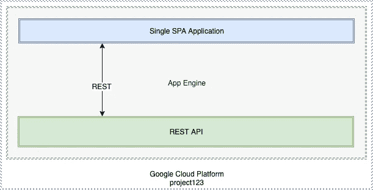
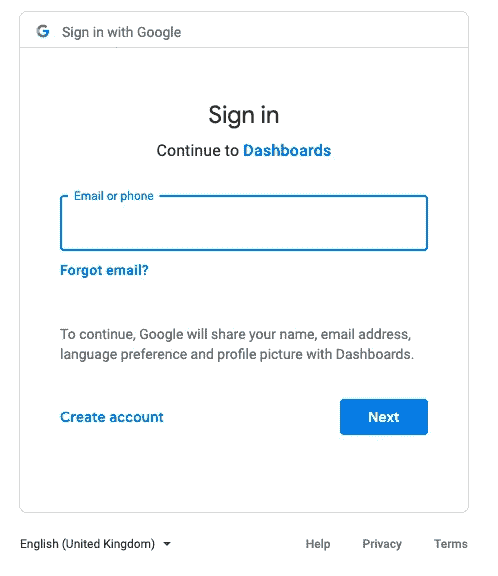
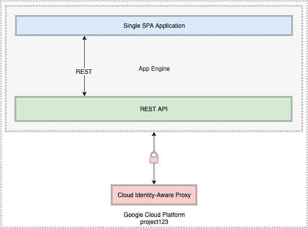

# 保护您的 React/Angular/Vue 应用程序和 REST API，使用 GCP 应用程序引擎和 IAP(身份识别代理)进行部署

> 原文：<https://javascript.plainenglish.io/secure-your-spa-react-angular-vue-and-rest-api-deployed-using-gcp-app-engine-with-iap-f325182ddcb0?source=collection_archive---------1----------------------->


在本文中，我们将介绍使用谷歌云的 IAP ( [云身份感知代理](https://cloud.google.com/iap/))来**保护两个应用**；一个是 UI ( [SPA](https://en.wikipedia.org/wiki/Single-page_application) )应用，例如 Angular 或 React 应用，另一个是 SPA 使用 REST 范式与之交互的 API。

两者都已经作为服务部署在 GCP 的应用引擎灵活环境中。

***注意:如果您在 GCP 项目中部署了多个应用程序，那么您必须使用 flex 环境，而不是标准环境。***

在最简单的形式中，我们的架构可以这样描述:



默认情况下，这两种服务都向公众公开，并可通过类似以下的 URL 获得:

https://single-spa-dot-project-123.appspot.com
https://rest-api-dot-project-123.appspot.com

现在，我们希望保护这些应用程序，以便能够验证用户对我们应用程序的访问。

由于我们已经在 GCP 部署了我们的应用程序，依靠一些谷歌魔法来保护我们的应用程序是有意义的。

现在，IAP 可以成为谷歌推向市场的几乎所有应用的一个重要入口。


# 启用 IAP

开启 IAP 再简单不过了。下面的文章中提到了一些配置步骤，但实际上就像轻触开关并为一些用户设置正确的 IAM 权限一样简单。

 [## 快速入门:使用 Google 帐户管理访问|身份识别代理文档| Google 云

### 本页将引导您部署 App Engine 标准或灵活环境应用程序，并通过以下方式保护它

cloud.google.com](https://cloud.google.com/iap/docs/app-engine-quickstart) 

一旦你完成了上述文章中的步骤，当你试图访问你的公共网址时，它会提示你登录。

*提示:如果你已经有一个谷歌认证会话，使用一个匿名窗口，在这种情况下，它会使用这个窗口并绕过认证屏幕。*



Google Auth Screen

现在，我们的简单架构可以说明如下，其中 IAP 现在保护我们的应用程序引擎服务(应用程序):



# 访问我们 IAP 保护的应用程序

IAP 对我们的单个 SPA 应用程序非常有效，为我们的内部应用程序提供了一个类似硬壳的外部环境，有助于减少对我们应用程序的授权访问。

事实上，这一切都是在没有一行代码的情况下实现的，这很了不起——感谢谷歌！


但是 REST API 呢……那不是一样简单吗？

因此，如果您通过浏览器会话访问 API，那么它将作为单个 SPA 应用程序工作。

但是一般来说，对于 REST APIs，您将使用一个不能像浏览器一样处理 auth 重定向的客户端。

所以……我们如何为我们的 REST APIs 处理这个问题呢？

# 使用 IAP 服务帐户保护 REST API

我在互联网上搜索了几个小时，找到了一个很好的解决方案，我能想到的最好的办法是使用一个 Google 服务帐户来处理 API 认证，现在我将带您浏览一下...

*这个概念很大程度上是从这篇文章中搬来的:*

[](https://cloud.google.com/iap/docs/authentication-howto) [## 程序化认证|身份识别代理文档| Google 云

### 本页描述如何从用户帐户或身份识别代理(IAP)安全资源进行身份验证

cloud.google.com](https://cloud.google.com/iap/docs/authentication-howto) 

我的 SPA 应用程序(*静态文件*)是使用 [Express 节点提供的。JS](https://expressjs.com/) 服务器内部 App Engine，大概如下图:

```
const express = require('express');const app = express();app.use(express.static('dist'));app.listen($PORT, $HOST);
```

在使用 IAP 保护之前，我的 API 调用是通过 [http-proxy-middleware](https://github.com/chimurai/http-proxy-middleware) 代理的，这意味着来自*https://single-spa-dot-project-123.appspot.com/api/foo*的调用被代理到[*https://rest-api-dot-project-123.appspot.com/foo*。](https://reset-api-dot-project-123.appspot.com/foo.)

```
const express = require('express');
const proxy = require('http-proxy-middleware');

const app = express();app.use(express.static('dist'));app.use('/api/*', proxy({
   pathRewrite: {
      '^/api': ''
   },
   target: '[https://rest-api-dot-project-123.appspot.com](https://reset-api-dot-project-123.appspot.com)',
   secure: false,
   changeOrigin: true
}));
```

使用上述方法，当我激活 IAP 时，我的 API 调用不再工作，因为对 REST API 的调用不知道我的 Google auth 会话。

在几次拦截请求头并试图将它们传递给 REST API 应用程序的尝试失败后(*顺便说一下*这不起作用)，我想到了以下依赖于[Google-auth-library-nodejs](https://github.com/googleapis/google-auth-library-nodejs)库的解决方案:

```
const { auth } = require('google-auth-library');const SERVICE_ACCOUNT = require('./my-service-account-key.json');
const CLIENT_ID = 'my-service-account-id.apps.googleusercontent.com';async function useServiceAccount(options) {
   const client = auth.fromJSON(SERVICE_ACCOUNT);
   client.additionalClaims = { target_audience: CLIENT_ID };
   const response = await client.request(options);
   return response.data;
}
```

*为了上面的工作，你需要做以下事情:*

*   创建服务帐户来处理 IAP 认证并获取 JSON 密钥(上面代码片段中的*my-service-account-key . JSON*)
*   从 GCP 控制台的 IAP 页面获取 OAuth 客户端 ID(上面代码片段中的*my-service-account-id.apps.googleusercontent.com*

这两个步骤在下面的文章中都有描述

[](https://cloud.google.com/iap/docs/authentication-howto#authenticating_from_a_service_account) [## 程序化认证|身份识别代理文档| Google 云

### 本页描述如何从用户帐户或身份识别代理(IAP)安全资源进行身份验证

cloud.google.com](https://cloud.google.com/iap/docs/authentication-howto#authenticating_from_a_service_account) 

一旦有了这两条信息，您就可以更改代理来使用我们的 **useServiceAccount()** 方法:

```
app.use(express.json());app.use('/api/*', async (req, res) => { let options = {
      url:  `[https://rest-api-dot-project-123.appspot.com](https://rest-api-dot-project-123.appspot.com)/${req.baseUrl.replace('/api/','')}`,
      method: req.method
   } if (options.method === "POST" || options.method === "PUT") {
      options = {
         ...options,
         data: req.body
      }
   } body = await useServiceAccount(options);});
```

***注意:*** *我们在这里将 POST 和 PUT 方法的 JSON 主体作为数据(而不是主体)传递，因此它将被依赖于* [*gaxios*](https://github.com/googleapis/gaxios/) *客户端的 Google Auth 库正确地序列化为 JSON。*

# 包扎

在本文中，我们发现了如何在我们的 App Engine 应用程序上激活 Google 的 IAP 服务，以及它对我们的单个 SPA (UI)和 REST API 的影响。

虽然单个 SPA 运行得很好，但我选择在一个节点内使用服务帐户。JS Express 服务器运行在我的单个 SPA 中，使用 Google 的 auth 库代理对我的 REST API 应用程序的请求。

**我建议增加的一项内容是，在尝试使用服务帐户获得额外的安全层之前，在我的节点代理中使用** `**X-Goog-IAP-JWT-Assertion**` **请求头来验证用户。**

我希望这对某人有所帮助，并随时建议替代/更好的方法。

> 感谢您花时间阅读我的文章。