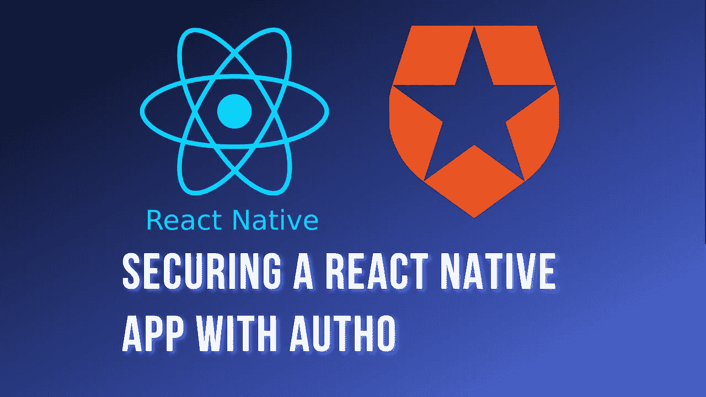
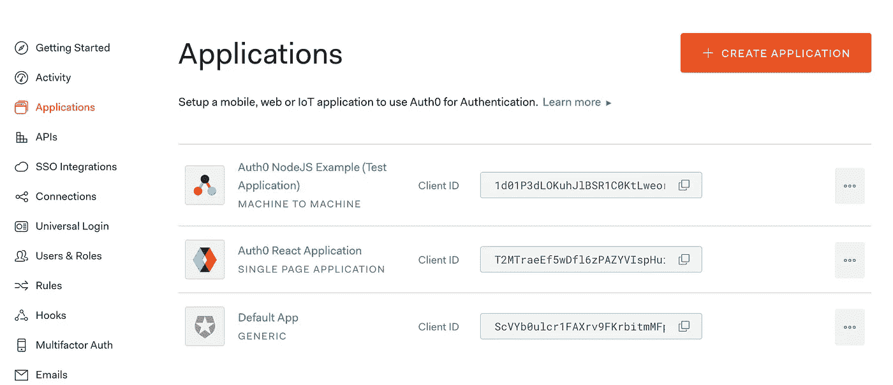
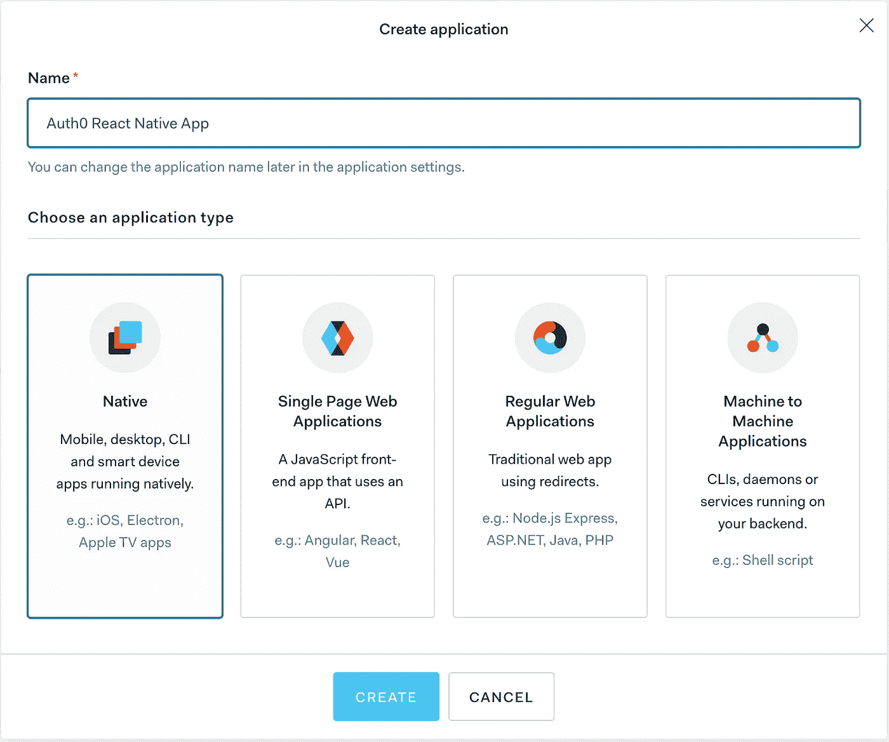
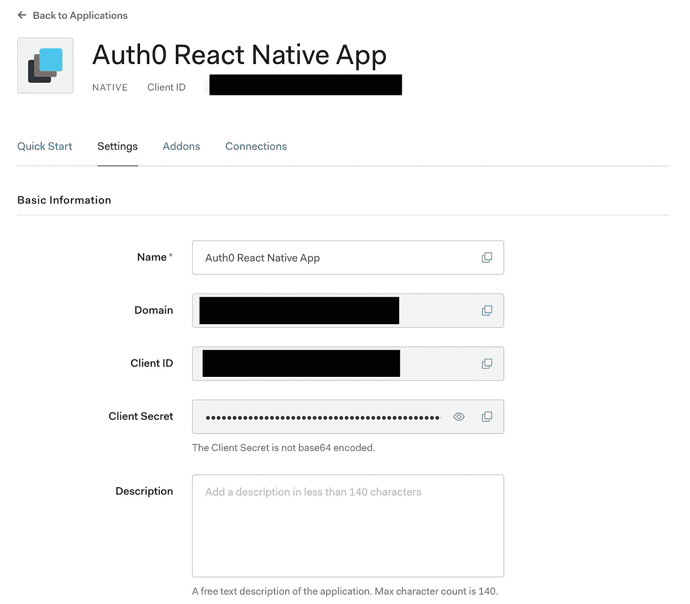
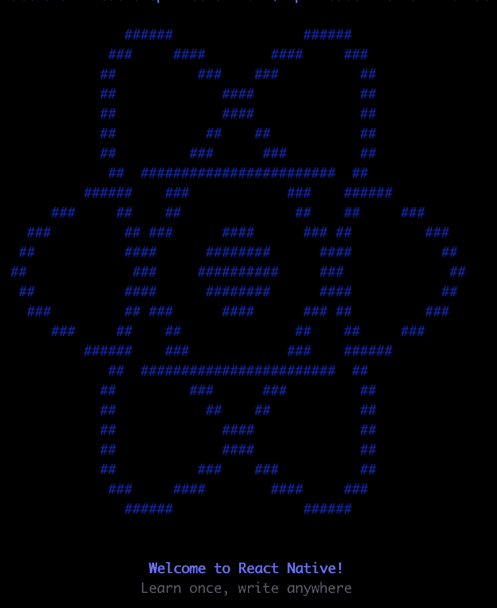
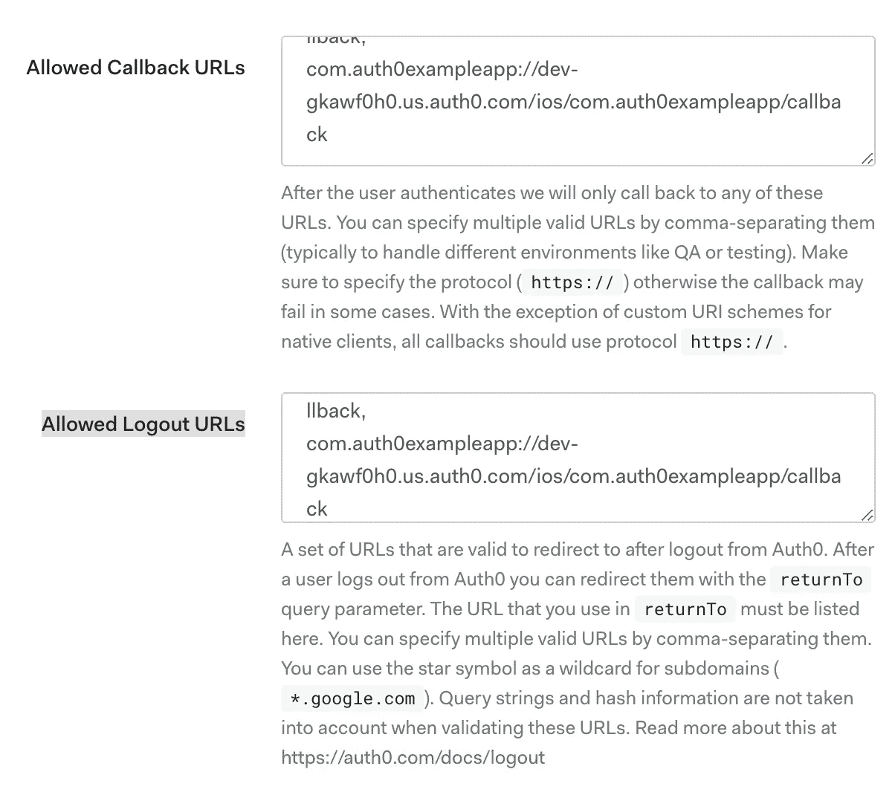
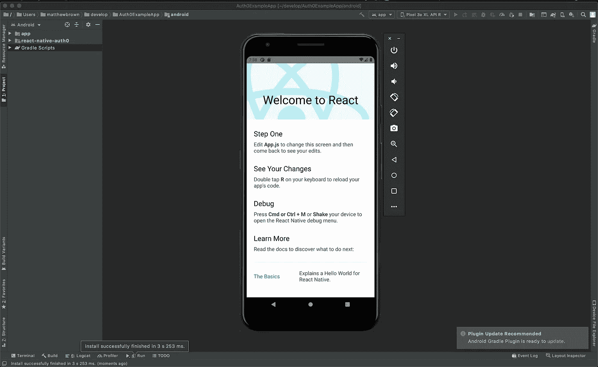
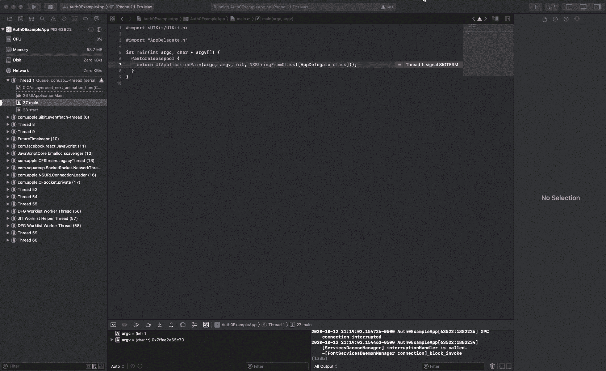
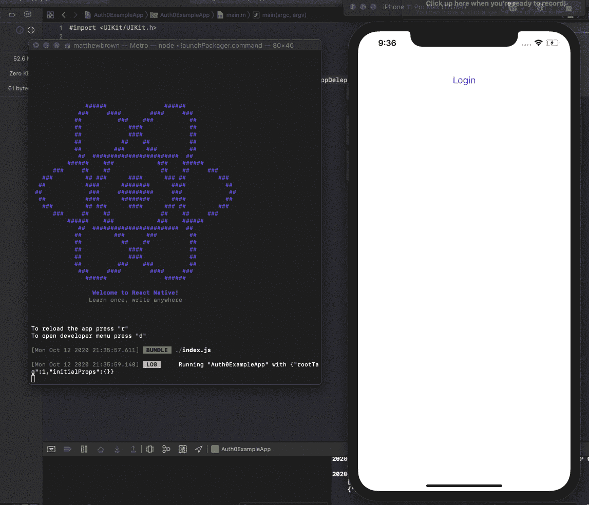

# 使用 Auth0 保护 React 本机应用程序

> 原文：<https://javascript.plainenglish.io/securing-a-react-native-app-with-auth0-1f21525cdbd1?source=collection_archive---------3----------------------->

## 使用 Auth0 引导 React 本机应用程序的指南



Made by the author in [Canva](https://www.canva.com/)

我已经写了几篇关于使用 Auth0 和我是一个多大的粉丝的文章。在本文中，我想演示如何用 React 本地移动应用程序设置 Auth0。

现在，如果您碰巧不熟悉 React Native，它可以让您使用 React 构建本地移动应用程序。使用 React Native 的好处是，你不必为你的 iOS 和 Android 应用程序维护单独的代码库。你用 React Native 构建它，能够跨平台运行。

另一个主要的好处是，如果你已经有了经验，你就不必学习全新的东西。这是不一样的，但概念是大致相同的，所以你将能够很快学会它。

我工作的初创公司已经同时使用 React Native 和 Auth0 有一段时间了，我希望我在这一过程中学到的一些经验教训能够让你受益，如果你开始走上同样的道路的话。

正如我上面提到的，我已经写了几篇关于使用 Auth0 的文章，我将在下面链接这些文章。如果你感兴趣，一定要去看看。

[](https://medium.com/javascript-in-plain-english/securing-react-applications-with-auth0-333180f8ea06) [## 使用 Auth0 保护 React 应用程序

### 使用 Auth0 引导新 React 应用程序的指南

medium.com](https://medium.com/javascript-in-plain-english/securing-react-applications-with-auth0-333180f8ea06) [](https://medium.com/javascript-in-plain-english/securing-a-node-js-api-with-auth0-7785a8f2c8e3) [## 使用 Auth0 保护 Node.js API

### 使用 Auth0 设置 Node.js API 的指南

medium.com](https://medium.com/javascript-in-plain-english/securing-a-node-js-api-with-auth0-7785a8f2c8e3) [](https://medium.com/javascript-in-plain-english/customize-auth0-with-rules-cbc1f063d12e) [## 使用规则自定义 Auth0

### 如何使用定制的 JavaScript 规则让 Auth0 为您的应用程序工作

medium.com](https://medium.com/javascript-in-plain-english/customize-auth0-with-rules-cbc1f063d12e) 

不要求您已经阅读了上一篇文章，但是在按照本文中的演示进行操作之前，您需要设置或创建一个现有的 Auth0 帐户。

## 在 Auth0 中创建新应用

在进入应用程序之前，我们首先需要在 Auth0 admin 中设置一个新的应用程序。您需要转到 Applications 部分，并选择右上角的 create application 按钮。



Screenshot by the author

这将弹出一个对话框，询问我们的新应用程序的一些信息。输入名称以标识新应用程序，并从应用程序类型列表中选择本机选项。



请注意，如果您转到新创建的应用程序的设置选项卡，您可以看到域和客户端 ID，稍后我们开始配置应用程序时，您将需要参考这些信息。



## 创建新的 React 本机应用程序

请注意，我在 Mac 上安装 React Native 和创建新应用程序的步骤。如果您使用的是不同的操作系统，可能会出现其他问题，所以请记住这一点。此外，如果你在 Mac 上，你需要确保在安装 React Native 之前已经安装了 XCode。

首先，我们需要安装 React Native CLI。一旦我们设置好了，我们就可以创建新的应用程序了。在终端中运行以下命令。

```
npm install -g react-native
npx react-native init Auth0ExampleApp
```



Screenshot by the author

我们还需要一点配置来将 Auth0 SDK 添加到我们的应用程序中。在项目目录中运行以下命令。React Native 使用 yarn 作为包管理器，所以要确保你已经安装了它。

```
// Install yarn if you don't have it
npm install -g yarn
yarn add react-native-auth0
```

我们还需要为 iOS 和 Android 模块做一些配置。此外，在配置之前，我们需要运行命令在项目的`ios`文件夹中安装依赖项。

```
cd ios 
pod install
```

## 配置 Android

对于 Android 配置，我们需要在您的编辑器中打开`android/app/src/main/AndroidManifest.xml`,并将其更新为以下内容。

结果是我们现在添加了一个新的 intent-filter 来处理到 Auth0 登录的重定向。

## 配置 iOS

我们需要打开`ios/PROJECT NAME/AppDelegate.m`，用下面的代码替换内容。

我们还需要向`ios/PROJECT NAME/Info.plist`添加一个新的键/值对

## 配置 Auth0 回调和注销 URL

我们需要跳回 Auth0 admin 来配置几个 URL。用户使用 Auth0 登录屏幕登录后，Auth0 将对应用程序执行回调，当他们注销时也是如此。

URL 遵循以下约定:

*安卓*

```
{YOUR_APP_PACKAGE_NAME}://dev-gkawf0h0.us.auth0.com/android/{YOUR_APP_PACKAGE_NAME}/callback
```

*iOS*

```
{PRODUCT_BUNDLE_IDENTIFIER}://dev-gkawf0h0.us.auth0.com/ios/{PRODUCT_BUNDLE_IDENTIFIER}/callback
```

你需要用你的应用包名称替换`{YOUR_APP_PACKAGE_NAME}`和`{PRODUCT_BUNDLE_IDENTIFIER}`。例如，对于我创建的项目，包名是`com.auth0exampleapp`。此外，用您自己的 Auth0 应用程序域替换该域。我在示例中添加了自己的 URL，只是为了演示如何构建这些 URL。

你将调出你的应用程序设置 Auth0，并为“允许的回拨 URL”和“允许的注销 URL”添加这些用逗号分隔的值，就像我在下面的截图中所做的那样。



Screenshot by the author

这应该完成了配置，现在我们可以看到 Auth0 在我们的应用程序中工作了。

## 将 Auth0 添加到应用程序

现在，我们已经完成了配置，可以开始编写代码了。

要在 iOS 中运行应用程序，请在 Xcode 中打开`/ios/PROJECT NAME/PROJECT NAME.xcworkspace`，然后在模拟器或您的设备上构建并运行。


Screenshot by the author

要运行 Android 版本，请在 Android Studio 中打开`/android`文件夹，然后在虚拟设备或您自己的设备上构建并运行。



Screenshot by the author

我们现在将对 App.js 进行更改。让我们删除当前存在的几乎所有内容，并将代码更新为如下所示。

简单的屏幕，我们只有一个登录按钮，重定向到印刷机上的 Auth0 登录。成功登录后，我们收到的返回结果是用户当前会话的访问令牌。



Screen capture by the author

我们做到了！我们的用户被重定向到我们的 Auth0 租户，以登录或注册新帐户。

让我们对我们的 App.js 文件再做一次更新，让他们在拥有访问令牌后能够注销。我们还将添加第二个按钮，以便在获得访问令牌后向 Auth0 请求用户的配置文件。

这就是我们添加新功能所需要的。查看下面的屏幕截图，了解完整的演示。



Screen capture by the author

## Auth0 的更多移动登录选项

该设置为我们提供了基本的登录/注销设置。Auth0 还提供了让用户登录的其他方法。他们可以通过无密码选项向用户发送电子邮件链接或通过短信发送密码。两者都是移动应用的绝佳选择。

*这篇关于将 Auth0 登录添加到 React Native 应用程序的文章到此结束。如果你想在应用程序中建立这种连接，我希望本指南能有所帮助。谢谢你的阅读！*

喜欢这篇文章吗？如果是这样，通过 [**订阅我们的 YouTube 频道**](https://www.youtube.com/channel/UCtipWUghju290NWcn8jhyAw) **获得更多类似内容！**