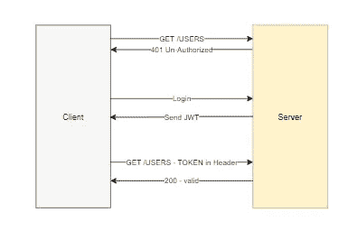
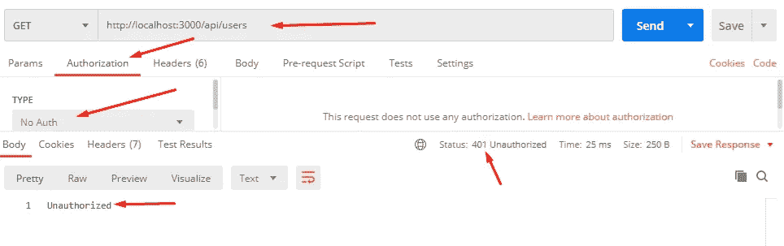
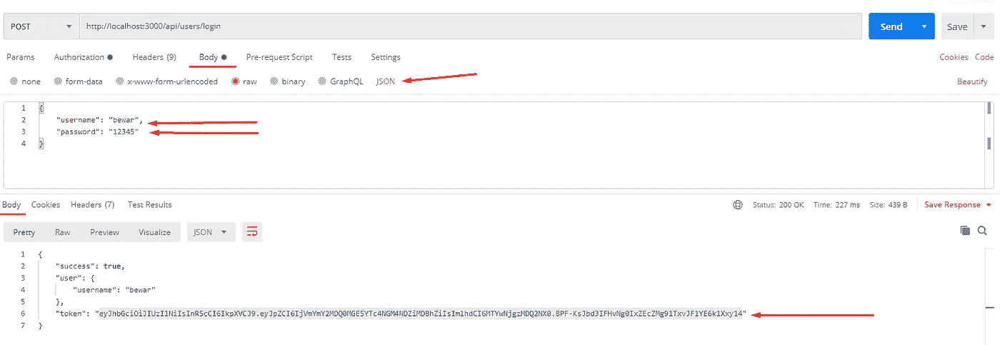
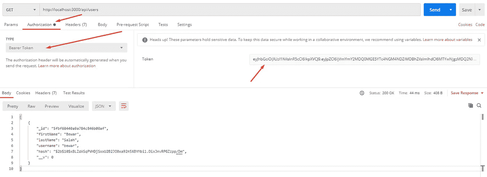

# 使用 JWT 保护 Express.js API

> 原文：<https://javascript.plainenglish.io/securing-express-js-api-using-jwt-b2834325d2e8?source=collection_archive---------1----------------------->


Express.js — JWT Authentication

在这篇文章中，我将展示如何使用 **jsonwebtoken** 将 JWT 认证集成到 Express.js 应用程序中。

# 介绍

我们需要保护用户的数据不被擅自更改或显示。有许多类型的认证。我们通常使用 JWT 认证来保护 web APIs。这种方法最适合 web APIs。它不需要在客户机上存储 cookies，也不需要在服务器上存储会话。这是一种无状态的资源授权方式。实现起来超级简单。在众多方法中，它是非常流行的 web APIs 认证方法。

有很多关于这个话题的文章。我将尽量减少这个话题，并展示一些安全方面的最佳实践，比如散列密码。 [**Jsonwebtoken**](https://www.npmjs.com/package/jsonwebtoken) 是一个可以生成 JWT 令牌并进行验证的 NPM 包。我们还使用 [**bcrypt**](https://www.npmjs.com/package/bcrypt) 包来散列密码，然后将其保存在 DB 中。它保护密码不被数据库管理员显示。

# 什么是 JWT？

> JSON Web 令牌是一种开放的行业标准 [**RFC 7519**](https://tools.ietf.org/html/rfc7519) 方法，用于在双方之间安全地表示声明— [https://jwt.io](https://jwt.io/)

在现实世界的应用程序中，会有许多 web APIs 来读取或写入资源。我们需要授权一些人做某些动作。如果一个未经授权的人试图进行授权的操作，那么在响应中将会收到一个 **401** http 状态代码。

让我们用一个例子来证明这一点。首先，让我们考虑我们有一个资源用户。下图显示了 JWT 认证演示的步骤；

*   首先，我们尝试在没有任何身份验证的情况下获取用户并显示。API 返回未授权，状态码为 **401** 。
*   然后，我们尝试登录并接收应用程序生成的 JWT 令牌
*   最后，令牌可用于**验证**授权的 API 并显示用户。



Diagram/ demonstrating JWT authentication

## 授权 API

有许多方法可以授权应用程序资源。一个简单的方法是创建一个中间件，注入任何需要授权的 express.js 路由。

让我们考虑我们的例子，资源 ***获取/用户*** *。*我们需要检索存储在数据库中的用户列表，只有授权用户才能检索。

*   中间件检查包含 JWT 令牌的请求头中的授权。
*   它使用[**jsonwebtoken**](https://www.npmjs.com/package/jsonwebtoken)**库验证令牌。**

```
const authenticateMiddleware = (req, res, next) => {
  const { authorization } = req.headers;
  const token = authorization && authorization.split(" ")[1];
  if (token == null) return res.sendStatus(401);
  jwt.verify(token, SECRET_KEY, (err, user) => {
    if (err) return res.sendStatus(403);
    req.user = user;
    next();
   });
};
```

*   **该中间件可以通过 **Express.js** 应用的任意路径注入**。****

```
app.get("/api/users", authenticateMiddleware, async (req, res) => {
  const { id } = req.params;
  const { title, content } = req.body;
  var blog = await User.find({});
  res.json({
    success: true,
    blog,
  });
});
```

**现在，如果我们尝试获取没有令牌的 API 或带有无效令牌的事件，我们会收到**未授权的** **401** 。**

****

****Fetching an Authorized Resource****

## **生成 JWT 令牌**

**因此，在尝试读取或写入任何授权资源之前，我们需要一个 JWT 令牌。**

**生成 JWT 令牌的最简单方法是允许用户向服务器发送用户名/密码。服务器根据存储在数据库中的用户验证用户名/密码。最后，如果用户存在于数据库中，应用程序会生成一个令牌并将其发送给客户端。**

**最好在保存之前对密码进行哈希处理。这限制了授权的数据库用户只使用哈希登录。 [**bcrypt.js**](https://www.npmjs.com/package/bcryptjs) 是一个 NPM 包，它使我们的应用程序能够对密码进行哈希处理，并将普通密码与哈希后的密码进行比较。**

```
app.post("/api/user/login", async (req, res) => {
  const { username, password } = req.body;
  const user = await User.findOne({ username });
  if (user == null) {
    res.sendStatus(401);
    return;
  }
  bcrypt.compare(password, user.hash, (err, result) => {
    if (err) res.sendStatus(401);
    else if (!result) res.sendStatus(401);
    else {
      jwt.sign({ id: user._id }, SECRET_KEY, (err, token) => {
        if (err) res.sendStatus(500);
        else res.json({
          success: true,
          user: { username: user.username },
          token,
        });
      });
    }
  });
});
```

****

****Login****

## **验证请求**

**现在，我们需要在授权标签中选择**承载令牌**。用户被检索并显示在请求的正文中。**

****

**Reading an Authorized Resource**

# **完整示例**

**下面是使用 JWT 授权 express.js 应用程序的完整示例。在这个例子中，我创建了两个资源**用户**和**博客**。**

*   ****开机自检:API/用户/登录—** 只有该路径未被授权。它被用户用来登录和生成 JWT 令牌。**
*   **其他路由是授权的，需要在报头中进行授权。**

# **结论**

**这是关于如何使用 [**jsonwebtoken**](https://www.npmjs.com/package/jsonwebtoken) 库来保护 Express.js 应用程序的完整指南。如果你不熟悉 Express.js 应用程序，我之前已经创建了一个关于 [**使用 Express.js**](https://medium.com/javascript-in-plain-english/building-web-api-using-express-js-c0ae69901cf3) 创建 API 的教程。**

*   **欢迎您的评论，我将很高兴一起增强代码。**