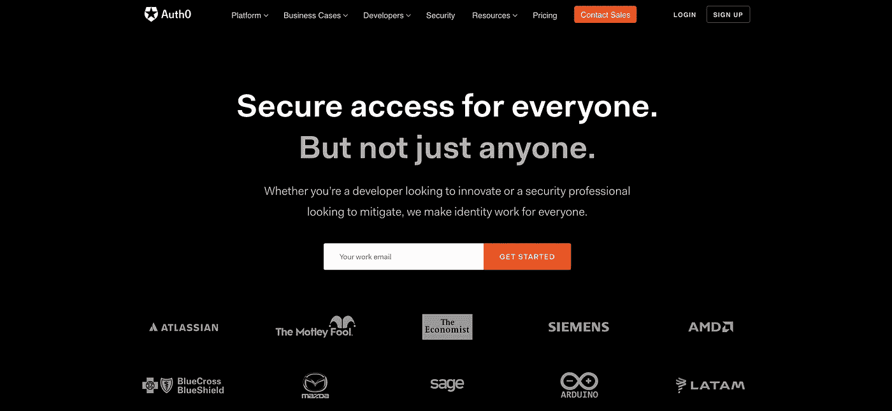
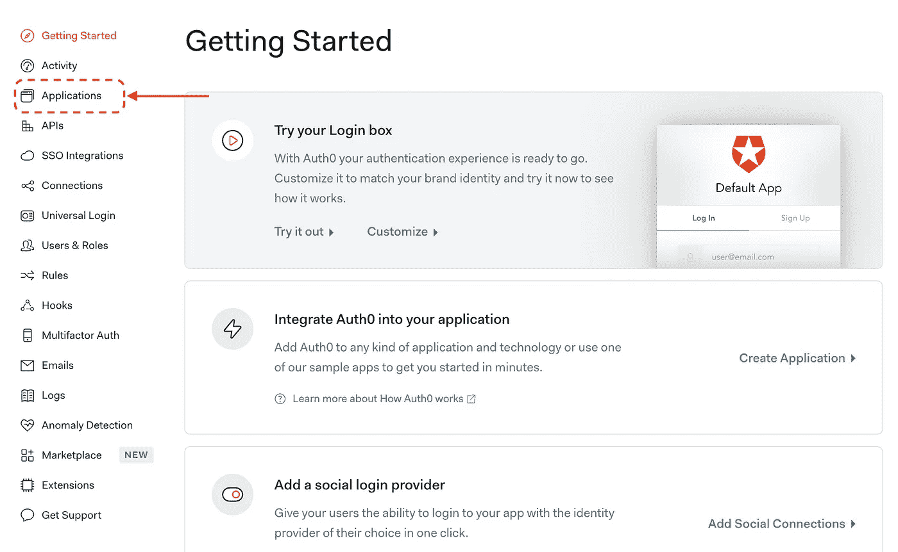
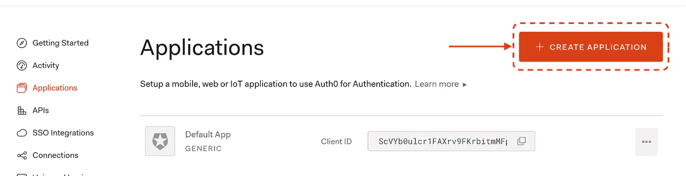
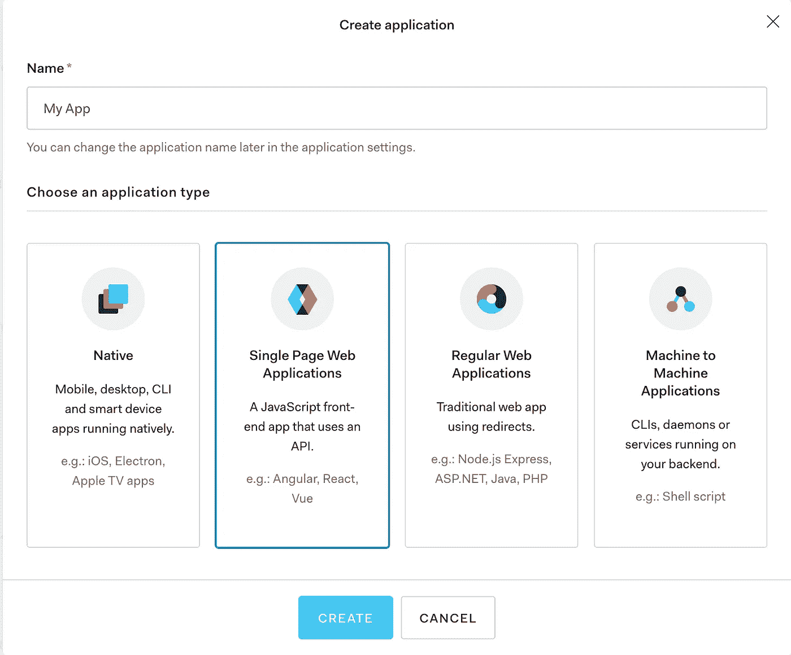
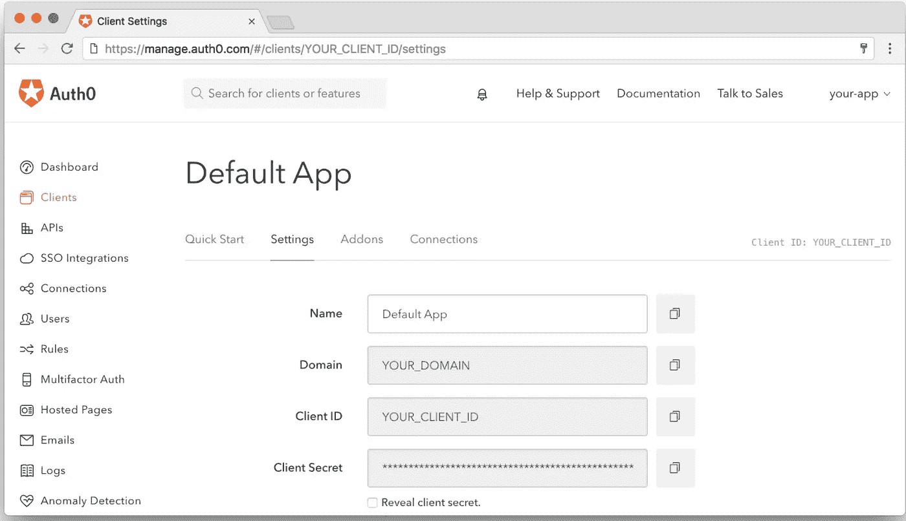
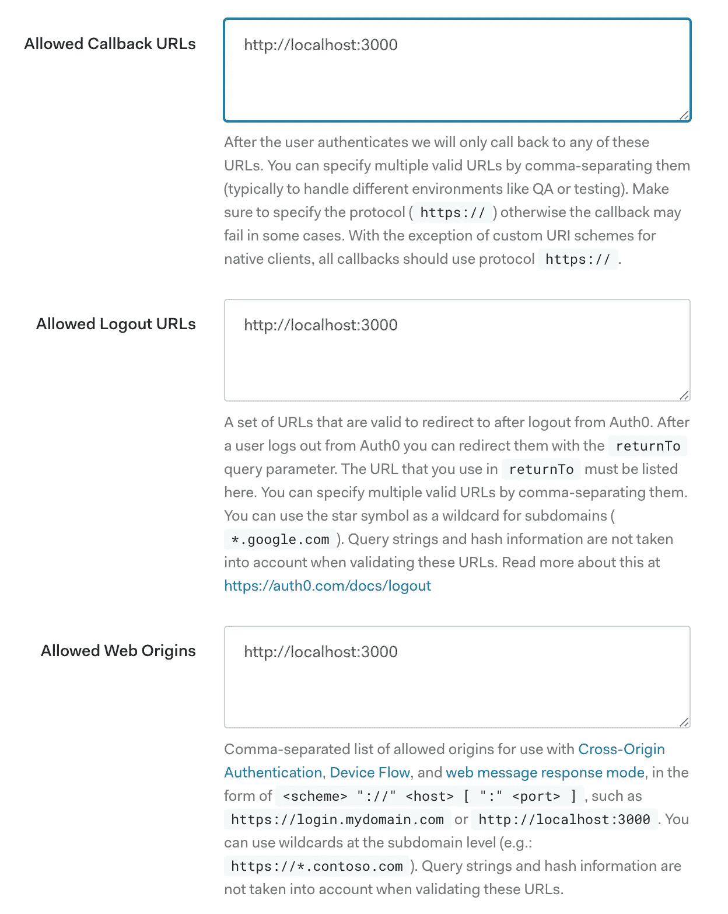
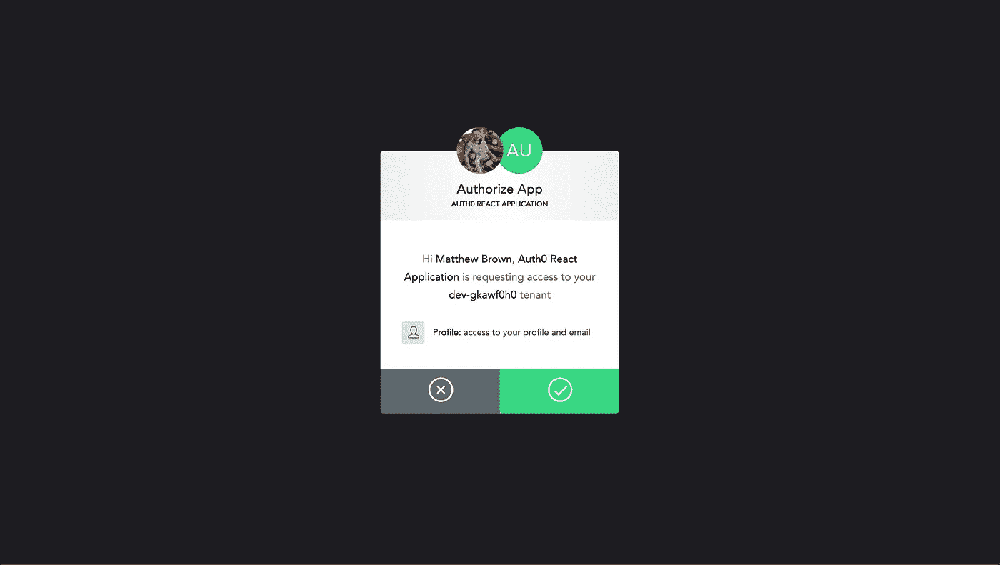
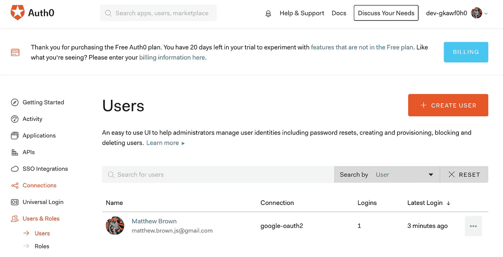
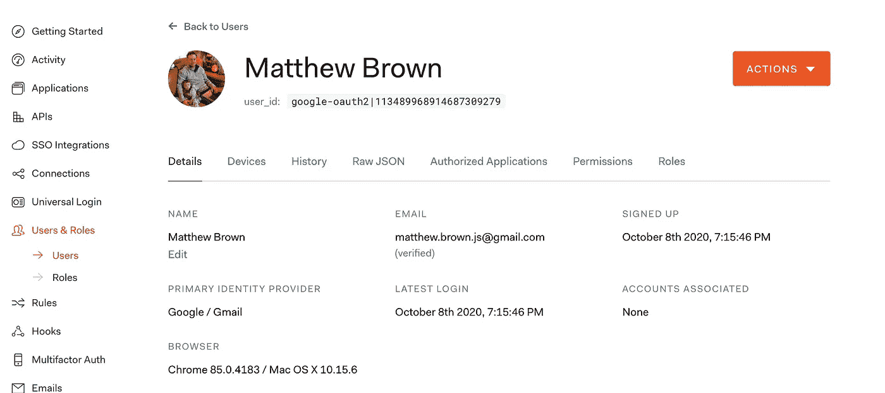
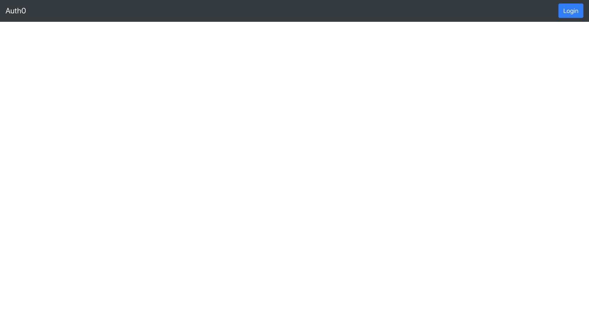

# 使用 Auth0 保护 React 应用程序

> 原文：<https://javascript.plainenglish.io/securing-react-applications-with-auth0-333180f8ea06?source=collection_archive---------4----------------------->

## 使用 Auth0 引导新 React 应用程序的指南


Created by the author with [Canva](https://www.canva.com/)

如果您正在寻找一个关于如何创建一个新的 React 应用程序并使用 Auth0 作为登录提供者的全面指南，那么这篇文章就是为您准备的。我将从头到尾进行一次完整的演示，展示它是如何完成的，并在此过程中给出一些指导。

## 为什么对登录提供者使用 Auth0？

我工作的初创公司从一开始就在他们的应用程序中使用 Auth0。我们将它设置为 web 应用程序和 React 本地移动应用程序的登录提供者。

Auth0 通过为您的用户处理所有登录、注册和密码管理来提供价值。您无需构建登录和密码管理的用户界面，即可获得所有这些功能。

这为您的工程团队节省了大量的前期时间，因为他们不必自己构建和维护所有这些。Auth0 还可以免费使用一定数量的每日活跃用户，这是相当慷慨的。请注意，在最初的免费预览窗口期间，您可以使用一些高级功能，但除非在最初的预览期结束后切换到付费帐户，否则您将无法使用这些功能。

## 使用 Auth0 获取设置

在我们开始构建我们的演示应用程序之前，您需要为自己设置一个 Auth0 帐户。



[Visit Auth0 site](https://auth0.com/)

成功创建帐户后，您将进入以下屏幕。我们将需要创建一个新的单页应用程序。首先点击菜单中的应用程序选项。



Screenshot by author

这将带您进入应用程序列表。我们需要单击“创建应用程序”。



Screenshot by author

该对话框将询问新应用程序的名称，我们希望选择“单页 Web 应用程序”选项。



Screenshot by author

创建应用程序后，您可以看到域、客户端 ID 和客户端密码。当我们构建应用程序时，您将需要参考这些信息。



Screenshot by author

在我们进入应用程序之前，还有一个步骤。您需要在三个字段中输入运行应用程序的 URL。你可以在下面我输入的截图中看到:

```
[http://localhost:3000](http://localhost:3000)
```

默认情况下，Create React 应用程序在端口 3000 上运行，所以这就是我在这里输入的内容。如果你想在另一个端口上运行，你可以切换到那个端口。

请注意，当您想要将应用程序部署到其他地方时，也需要添加该 URL。您可以添加任意数量的 URL 作为逗号分隔值。



Screenshot by the author

这就包括了我们需要的所有配置。现在我们可以继续设置演示应用程序了。

## 演示应用程序

现在我们已经配置好了一切，我们可以开始编码了。首先，我们将使用 Create React App 引导一个新的应用程序，然后通过 npm 安装 Auth0 包。

在终端中运行以下命令来创建应用程序，安装 Auth0-React SDK，最后运行应用程序。

```
npx create-react-app auth0-react-demo
cd auth0-react-demo/
npm install @auth0/auth0-react
yarn start
```

Auth0 使用 React 上下文来管理用户的身份验证状态。我们添加的第一个代码是将 Auth0 提供程序添加到应用程序的根目录。您将需要用我们之前创建的 Auth0 应用程序中的值替换*域*和*客户端 Id* 。

**src/index . js**

## 反应引导和登录

我们还将在我们的应用程序中添加 React Bootstrap，以便利用它提供的预构建组件，并为我们的演示添加一点风格。

在终端中运行以下命令，从 npm 安装 React 引导。

```
npm install react-bootstrap bootstrap
```

现在我们有了可用的引导组件，我们将更新我们的 *App.js* 文件，如下所示。

***src/App.js***

我们在 UI 的顶部添加了一个导航栏和一个按钮，作为我们的登录按钮。为了重定向到默认的 Auth0 登录屏幕，我们将使用来自 *useAuth0* 的*loginwithrirect*函数。

如果我们运行我们的应用程序，并单击登录按钮，我们应该重定向到登录屏幕。


Screen capture by the author

默认登录后，您可以选择使用 Google 帐户登录，或者使用电子邮件和密码创建自己的登录帐户。

我选择了一个 Google 帐户进行首次登录，Auth0 将询问您是否允许访问您的个人资料。



Screenshot by the author

现在您已经注册了一个用户，如果您转到 Auth0 admin 中的用户列表，您将在您的列表中看到该用户，如下所示。



Screenshot by the author

单击列表中的用户会将您带到他们的详细信息页面。在这里，您可以看到用户的完整信息和历史记录，还可以执行更新用户或重置密码等操作。

如果你在邮件下面看，你会看到一条*已验证的*消息。如果您使用的是 Auth0，您可以选择要求用户在他们的帐户实际激活之前，按照发送到他们电子邮件的验证链接进行操作。默认情况下，此设置是关闭的。



Screenshot by the author

## 注销

下一步是让我们的用户能够注销他们当前的会话。我们希望首先能够检查用户是否登录，并根据他们的身份验证状态切换显示哪个按钮。让我们展示一下这是如何做到的。

我们可以使用来自 *useAuth0 的 *isAuthenticated* 标志来检查用户是否通过了身份验证。我们的逻辑非常简单。如果为真，我们希望注销按钮，以便用户可以结束他们的会话，如果为假，我们显示登录按钮。*

## 用户概要

我们演示的最后一部分是在用户登录后显示他们的个人资料。我们将为用户配置文件创建一个新组件。

***src/user profile . js***

我们再次使用 *isAuthenticated* 来确保用户在显示他们的个人资料之前已经登录。我们还从 Auth0 上下文中的*用户*对象获取所有用户详细信息。

最后一步是简单地将这个新的概要组件添加到我们的主 App.js 文件中。完成这一更改后，文件的最终版本将如下所示。

添加了配置文件后，我们现在可以看到从登录到注销的完整用户会话。



Screen capture by the author

## 使用 Auth0 深入挖掘

所以我们的演示完全正常，但这绝对只是 Auth0 的皮毛。它提供许多功能和服务，例如:

*   使用 JavaScript 规则从数据库向用户配置文件添加角色的能力。这只是 Auth0 中规则威力的一个例子，基本上有无限的可能性
*   许多社交提供商，如谷歌、脸书、苹果、LinkedIn 等等。
*   一长串扩展名
*   通过文本消息向用户发送代码来设置登录的能力(我在 React 本地应用程序中使用了这个特性)
*   更多！

我希望这为在 React 应用程序中包含 Auth0 提供了一个温和的介绍。如果您正在寻找处理身份管理的东西，请确保检查 Auth0。感谢阅读！