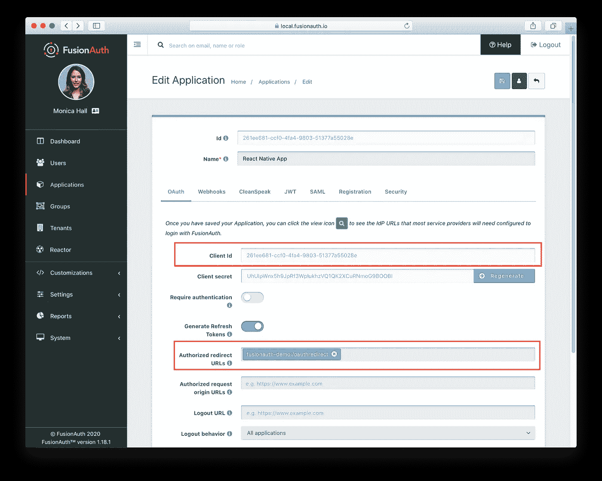
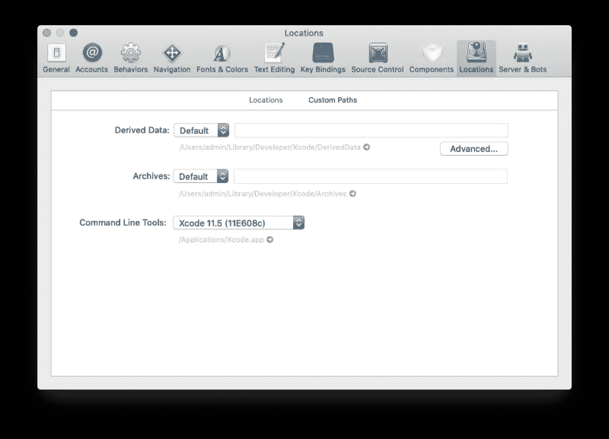

# 使用 OAuth 保护 React Native

> 原文：<https://javascript.plainenglish.io/securing-react-native-with-oauth-75fceaa5f3c8?source=collection_archive---------6----------------------->

## 如何设置 React 本机应用程序来使用 OAuth

在本教程中，我们将设置一个 React 本机应用程序来使用 OAuth。我们将使用 FusionAuth 进行 Auth，但是 React 本机代码应该可以与任何 OAuth 兼容的服务器一起工作。

首先，我们将安装和配置 FusionAuth。然后我们将建立一个 React 本地项目。然后，我们将从 React 本机应用程序中执行授权代码授权。最后，我们将从 OIDC 端点请求信息。有了这些数据，我们将在 React 本地应用程序中显示用户的电子邮件。

这是很多，但乘坐会很有趣。准备好出发了吗？

# 要求

以下是您需要开始的内容:

*   节点版本> = 8.0
*   VScode 或任何其他文本编辑器
*   `git`
*   `npx`
*   Xcode，如果为 iOS 构建
*   自制(可选)

# 你需要知道的关于 OAuth 的事情

如果您是 web 开发人员，您可能对 OAuth 很熟悉。在网络开发方面，我们有三个参与者:

```
The browser -> The server -> The OAuth server
```

浏览器与服务器对话，服务器与 OAuth 服务器对话。OAuth 服务器生成提供给服务器的访问令牌。服务器将它们安全地存储在会话中，并在需要时将它们传递给其他 API 进行授权。这是我们在用 OAuth 保护 React 应用程序时使用的架构。

然而，随着移动设备的出现，事情发生了一些变化。相应的场景可能是这样的:

```
The mobile device -> The server -> The OAuth server
```

但是，这种架构可以简化。可以删除服务器；移动设备可以直接从 OAuth 服务器处理回调。在本教程中，我们将使用授权码授予 PKCE 扩展。下面是来自 RFC 8252 的建议[流程，这是我们将要实现的。](https://tools.ietf.org/html/rfc8252#page-5)


接下来，让我们配置 OAuth 服务器并设置我们的编码环境。

# 将 FusionAuth 设置为您的身份验证提供者

为了设置 FusionAuth，请遵循 [5 分钟设置指南](https://fusionauth.io/docs/v1/tech/5-minute-setup-guide)。它既简单又快捷。默认情况下，OAuth 服务器将运行在地址`[http://localhost:9011](http://localhost:9011.)` [。](http://localhost:9011.)

# 配置 FusionAuth 应用程序

在这一步，我们将配置一个 FusionAuth 应用程序。这不同于 FusionAuth 服务器实例或 React 本机应用程序。在 FusionAuth 中，应用程序是用户可以登录的任何东西。要对此进行配置，请登录到 FusionAuth 管理界面并导航到“应用程序”。从那里，创建一个新的应用程序。

完成后，导航到“OAuth”选项卡，添加一个重定向 URI`fusionauth-demo:/oauthredirect`。稍后，我们将在 React 本机应用程序中使用这个重定向 URL。

另外，请注意“客户端 Id”的值；我们以后也需要它。点击*保存*。正确配置后，应用程序详细信息屏幕应如下所示:



确保将您的用户注册到新的应用程序中。这样做会在用户和新创建的应用程序之间创建一个关系。


如果您愿意，您可以在“用户”选项卡中添加更多用户，但请确保将他们注册到您的新应用程序中。现在，我们继续设置 React 本地项目。

# 设置 React 本机开发环境

由于我们将使用 React 本机命令行界面(CLI)进行开发，因此我们必须安装 React 本机开发环境。有关安装说明，请遵循[官方文档](https://reactnative.dev/docs/environment-setup)。你也要确保你选择了`react-native-cli`而不是`expo`。这些说明还会引导您启动应用程序，所以如果您是 React Native 的新手，请务必阅读它们。

我们还需要为 iOS、Android 或两者安装开发环境。我们还将使用 [brew](https://brew.sh/) 来安装所需的软件包。如果您正在跟进，请确保安装了`brew`，或者以不同的方式安装软件包。

# iOS 环境

首先，我们将安装 watchman，它用于在文件发生变化时自动重建文件:

```
brew install watchman
```

然后我们需要安装 Xcode CLI 工具，这些工具通常是不存在的，并且不能用`brew`来完成。若要安装，请打开 Xcode 并导航到“偏好设置”，然后导航到“位置”。选择命令行工具的 Xcode 版本，如下图所示:



iOS 蓄势待发。

# Android 环境

对于 Android，需要 JDK 8，因为其他版本可能会导致错误。我们可以从 Oracle 网站或使用`brew`下载该版本，如下面的代码片段所示:

```
brew cask install adoptopenjdk/openjdk/adoptopenjdk8
```

接下来，我们需要下载并安装 [Android studio](https://developer.android.com/studio/install) 。

然后，我们需要在系统路径中配置`ANDROID_HOME`环境变量。我们可以在我们的`$HOME/.bash_profile`或`$HOME/.bashrc`中添加以下几行。如果你用的是 zsh，文件是`~/.zprofile`或者`~/.zshrc`。

```
export ANDROID_HOME=$HOME/Library/Android/sdk
export PATH=$PATH:$ANDROID_HOME/emulator
export PATH=$PATH:$ANDROID_HOME/tools
export PATH=$PATH:$ANDROID_HOME/tools/bin
export PATH=$PATH:$ANDROID_HOME/platform-tools
```

现在，Android 平台的设置已经完成。

# 反应本地项目设置

我们现在将创建一个新的 React 本地项目。首先，创建一个目录来包含我们所有的代码，然后`cd`到那个目录。选择应用程序名称；我们选择了`RNfusionauth`，并将在整个教程中使用这个名字。

运行此命令创建基本项目文件和配置:

```
react-native init RNfusionauth
```

在构建应用程序时，我们将对这些文件进行额外的修改。

# 安装`react-native-app-auth`以与 OAuth 2.0 和 OpenId 连接服务器通信

我们的应用程序的一个关键依赖项是`[react-native-app-auth](https://github.com/FormidableLabs/react-native-app-auth)`包。这在 [AppAuth-iOS](https://github.com/openid/AppAuth-iOS) 和[app auth-Android](https://github.com/openid/AppAuth-Android)SDK 之间建立了一座桥梁，用于与 [OAuth 2.0](https://tools.ietf.org/html/rfc6749) 和 [OpenID Connect](http://openid.net/specs/openid-connect-core-1_0.html) 提供者进行通信。

这个库应该支持任何实现了 [OAuth2 规范](https://tools.ietf.org/html/rfc6749#section-2.2)的服务器，就像 FusionAuth 一样。

这个包支持授权码授权，并默认启用 PKCE 扩展。这很重要，因为移动设备不是[【机密客户端】](https://tools.ietf.org/html/rfc6749#section-2.1)，我们希望确保恶意行为者无法拦截我们的授权代码。

要安装`react-native-app-auth`，请在项目目录中运行以下命令:

```
yarn add react-native-app-auth
```

使用这个库将帮助我们快速安全地构建 OAuth 集成。它负责 RFC 8252 规定的许多步骤；我们只需确保启动该流程(步骤 1)并接收和存储访问令牌(步骤 6)。提醒一下，这是来自 RFC 的图表:


# 设置 iOS 授权

现在，我们将为 React 本机应用程序的 iOS 版本配置 auth。基本内容将在下面介绍，但是如果你想了解更多关于其他选项的信息，请查看[文档](https://github.com/FormidableLabs/react-native-app-auth#setup)。

首先，我们需要通过运行如下所示的命令来安装 cacao pod:

```
cd ios ; pod install
```

然后，我们需要用 Xcode 打开 React 原生项目。编辑`info.plist`文件并注册重定向 URL 方案，如下面的代码片段所示:

```
<key>CFBundleURLTypes</key>
 <array>
   <dict>
     <key>CFBundleURLName</key>
     <string>com.your.app.identifier</string>
     <key>CFBundleURLSchemes</key>
     <array>
       <string>fusionauth.demo</string>
     </array>
   </dict>
 </array>
```

这里，`CFBundleURLSchemes`定义了这个应用程序处理的 URL 方案。我们正在注册的方案`fusionauth.demo`应该看起来很熟悉，因为我们配置了 FusionAuth 来重定向到一个包含该方案的 URL。如果你在这里修改它，你也应该在那里修改它。

最后一步是更改`AppDelegate.h`文件，以包含所需的导入和属性:

```
#import <React/RCTBridgeDelegate.h>
#import <UIKit/UIKit.h>
#import "RNAppAuthAuthorizationFlowManager.h"
@interface AppDelegate : UIResponder <UIApplicationDelegate, RCTBridgeDelegate, RNAppAuthAuthorizationFlowManager>@property (nonatomic, strong) UIWindow *window;
@property(nonatomic, weak)id<RNAppAuthAuthorizationFlowManagerDelegate>authorizationFlowManagerDelegate;
@end
```

# 为 Android 设置身份验证

对于 Android，我们需要额外的配置来捕获[授权重定向](https://github.com/openid/AppAuth-android#capturing-the-authorization-redirect)。向`android/app/build.gradle`文件中的`defaultConfig`对象添加以下属性:

```
android {
 defaultConfig {
   manifestPlaceholders = [
     appAuthRedirectScheme: 'fusionauth.demo'
   ]
 }
}
```

这里的`appAuthRedirectScheme`、`fusionauth.demo`是另一个方案定义，和 iOS 一样。如果您在这里修改它，您应该在 FusionAuth 管理界面和 iOS 配置中修改它。

然而，当我们开始开发 Android 应用程序时，一个新的问题出现了。在 Mac 上开发和调试 Android 应用很困难，因为模拟器并不完全受支持。在其他问题中，与 iOS 模拟器相比，模拟器速度较慢。

更好的解决方案是使用实际的 Android 移动设备。当您这样做时，如何将运行在本地主机上的 FusionAuth 服务器连接到 wifi 或蜂窝网络上的设备？解决方案是使用 ngrok 之类的本地隧道服务。

## 设置 ngrok

ngrok 使我们能够在本地服务和互联网之间进行代理。你需要[下载](https://ngrok.com/download)它，然后安装它。通过运行以下命令连接您的帐户。它会将我们的 auth token 添加到默认的`ngrok.yml`文件中，这将允许我们访问更多的特性和更长的会话时间。

```
./ngrok authtoken Your key
```

运行隧道将在 ngrok 仪表板的[状态页面](https://dashboard.ngrok.com/status/tunnels)中列出。

现在我们要开始 HTTP 隧道转发到`localhost`和端口`9011`，FusionAuth 在那里监听。运行以下命令启动 ngrok 代理:

```
./ngrok http 9011
```

我们将获得一个随机的 URL，它将流量转发到我们的 FusionAuth 实例。它会有点像`https://ce2f267ff5a5.ngrok.io`。使用这个，我们可以配置我们的 Android 设备与 FusionAuth 的本地实例进行通信。出于一致性的考虑，我们也将为我们的 iOS 应用程序使用这个 URL，即使 iOS 模拟器可以不通过隧道连接到本地主机。

现在，我们可以继续编码了。

# 编写 React 本机应用程序以使用 OAuth 和 FusionAuth

最后是代码！如果您想跳过这一步，请从 [GitHub 库](https://github.com/fusionauth/fusionauth-example-react-native)获取 Apache2 许可代码。

总的来说，我们将在`App.js`文件中构建我们的逻辑和视图。对于一个更大的项目，您可以将这些代码拆分成组件，但是对于我们的教程，拥有一个文件会使事情变得更简单。然而，我们将使用库来管理授权和数据的安全存储。

下面是我们完成后`App.js`的样子(别担心，看起来很多，但我们会解释大部分):

```
import React, { useState, useCallback, useMemo } from 'react';
import { Alert, StyleSheet, View, Image, Text, TouchableOpacity } from 'react-native';
import { authorize, prefetchConfiguration } from 'react-native-app-auth';
import * as Keychain from 'react-native-keychain';
const defaultAuthState = {
  hasLoggedInOnce: false,
  provider: '',
  accessToken: '',
  accessTokenExpirationDate: '',
  refreshToken: ''
};
export default () => {
  const [authState, setAuthState] = useState(defaultAuthState);
  const [userinfo, setuserinfo] = useState(null)
  React.useEffect(() => {
    prefetchConfiguration({
      warmAndPrefetchChrome: true,
      ...configs.fusionauth
    });
  }, []);
  const configs = {
    fusionauth: {
      issuer: 'https://ce25267ff5a5.ngrok.io',
      clientId: '253eb7aa-687a-4bf3-b12b-26baa40eecbf',
      redirectUrl: 'fusionauth.demo:/oauthredirect',
      additionalParameters: {},
      scopes: ['offline_access'],
    }
  } const getAccesstoken = async () => {
    try {
      // Retrieve the credentials
      const credentials = await Keychain.getGenericPassword();
      if (credentials) { return credentials.password } else {
        console.log('No credentials stored');
      }
    } catch (error) {
      console.log("Keychain couldn't be accessed!", error);
    }
  }
  const getUser = async () => {
    try {
      const access_token = await getAccesstoken();
      if (access_token !== null) {
        fetch(configs.fusionauth.issuer + "/oauth2/userinfo", {
          method: "GET",
          headers: {
            Authorization: "Bearer " + access_token,
          },
        })
          .then((response) => response.json())
          .then((json) => {
            console.log(json);
            setuserinfo(json);
          })
          .catch((error) => {
            console.error(error);
          });
      }
    } catch (e) {
      console.log(e);
    }
  };
  const handleAuthorize = useCallback(
    async () => {
      try {
        const newAuthState = await authorize(configs.fusionauth);
        console.log(newAuthState)
        setAuthState({
          hasLoggedInOnce: true,
          ...newAuthState
        });
        await Keychain.setGenericPassword('accessToken', newAuthState.accessToken);
      } catch (error) {
        Alert.alert('Failed to log in', error.message);
      }
    },
    [authState]
  ); return (
    <View style={styles.container}>
      <Image
        source={require('./fusionauth.png')}
      />
      {authState.accessToken ? (
        <TouchableOpacity
          style={styles.button}
          onPress={() => getUser()}
        >
          <Text style={styles.buttonText}>Get User</Text>
        </TouchableOpacity>
      ) : (<TouchableOpacity
        style={styles.button}
        onPress={() => handleAuthorize()} >
        <Text style={styles.buttonText}>Login with FusionAuth</Text>
      </TouchableOpacity>)}
      {userinfo ? (
        <View style={styles.userInfo}>
          <View>
            <Text style={styles.userInfoText}>
              Username:{userinfo.given_name}
            </Text>
            <Text style={styles.userInfoText}></Text>
            <Text style={styles.userInfoText}>Email:{userinfo.email}</Text>
            <Text style={styles.userInfoText}></Text> </View>
        </View>
      ) : (
          <View></View>
        )} </View>
  );} const styles = StyleSheet.create({
  container: {
    flexDirection: "column",
    backgroundColor: "grey",
    flex: 1,
    alignItems: "center",
    justifyContent: "space-evenly",
  },
  button: {
    backgroundColor: "#f58321",
    padding: 20
  },
  buttonText: {
    color: "#000",
    fontSize: 20,
  },
  userInfo: {
    height: 300,
    width: 300,
    alignItems: "center",
  },
  userInfoText: {
    color: "#fff",
    fontSize: 18,
  },
  errorText: {
    color: "#fff",
    fontSize: 18,
  },
  profileImage: {
    height: 64,
    width: 64,
    marginBottom: 32,
  },
});
```

首先，我们需要向`App.js`添加必要的导入:

```
//...
import React, { useState, useCallback, useMemo } from 'react';
import { Alert } from 'react-native';
import { authorize, refresh, revoke, prefetchConfiguration } from 'react-native-app-auth';
//...
```

接下来，我们需要创建一个`configs`对象。这将包含应用程序的客户端 id 等详细信息:

```
//...
const configs = {
  fusionauth: {
    issuer: 'https://ce25267ff5a5.ngrok.io', 
    clientId: '253eb7aa-687a-4bf3-b12b-26baa40eecbf',
    redirectUrl: 'fusionauth.demo:/oauthredirect',
    additionalParameters: {},
    scopes: ['offline_access'],
  }
}
//...
```

更多关于配置参数的信息，因为这是您需要在代码中更改的内容。`issuer`是 FusionAuth 服务器的 URL 您可以看到，我们已经将其设置为 ngrok URL。`clientId`是我们从 FusionAuth 管理用户界面获取的 ID。

`redirectUrl`是我们在 FusionAuth 应用程序中设置的 URL，使用了我们在配置 iOS 和 Android 时使用的方案。值`oauthredirect`是 react native app auth 库定义的回调路径。确保使用您的配置值更新该对象中的`issuer`和`clientId`键。

我们还可以添加任何额外的参数(本例中没有)。如果您需要自定义范围，这也是添加它们的地方。我们正在请求`offline_access`范围，以便 OAuth 服务器将返回一个`refresh_token`。如果我们当前的访问令牌过期，此类令牌可用于请求额外的访问令牌。

接下来，在文件中创建一个默认的 auth state 对象。这将被修改，因为我们的用户首先查看 React 本机应用程序，然后进行身份验证。这包含像令牌值和到期日期这样的信息。

```
//...
const defaultAuthState = {
  hasLoggedInOnce: false,
  provider: '',
  accessToken: '',
  accessTokenExpirationDate: '',
  refreshToken: ''
};const [authState, setAuthState] = useState(defaultAuthState);
//...
```

现在，我们准备配置接收令牌的代码。

# 配置 React 本机 OAuth 授权

让我们创建获取令牌的函数；这将使用先前创建的`configs`对象。它还将使用`react-native-app-auth`包中的`authorize`函数。它将完成所有繁重的工作，并与 OAuth 服务器连接。该函数的实现如下:

```
//...
const handleAuthorize = useCallback(
  async provider => {
    try {
      const newAuthState = await authorize(configs.fusionauth); setAuthState({
        hasLoggedInOnce: true,
        ...newAuthState
      });
    } catch (error) {
      Alert.alert('Failed to log in', error.message);
    }
  },
  [authState]
);
//...
```

`newAuthState`是从`authorize`函数返回的，因为我们可以将我们的身份验证状态设置为该返回值。现在我们有了与 FusionAuth 接口的代码，所以我们想给用户一个调用代码的方法。

# 构建用户界面

所以，我们需要创建一个用户界面(UI)。我们将创建一个简单的 UI 来开始身份验证。用户登录后，我们将显示访问令牌。一旦用户成功登录，FusionAuth 就会提供访问令牌。

当然，您通常不希望简单地显示或存储访问令牌。您需要它是因为它允许您的应用程序进行其他 API 调用，通常是为了收集更多信息以显示给用户。在本教程的后面，我们将使用访问令牌从 OpenID 连接端点检索用户信息，并在我们的应用程序中显示这些信息。

您还可以向 API 提供令牌，让应用程序发送电子邮件、记录待办事项或下订单。然而，我们今天不会构建这些集成。

要设置用户界面，将其添加到`App.js`:

```
//...
return (
  <View style={styles.container}>
    <Image
      source={require('./fusionauth.png')}
    />
    {authState.accessToken ? (
      <View style={styles.userInfo}>
        <View>
          <Text style={styles.userInfoText}>
            accessToken
          </Text>
          <Text style={styles.userInfoText}>
            {authState.accessToken}
          </Text>
          <Text style={styles.userInfoText}>
            accessTokenExpirationDate
          </Text>
          <Text style={styles.userInfoText}>
            {authState.accessTokenExpirationDate}
          </Text>
        </View>
      </View>
    ) : (
        <TouchableOpacity
          style={styles.button}
          onPress={() => handleAuthorize()}
        >
          <Text style={styles.buttonText}>
            Login with FusionAuth</Text>
          </TouchableOpacity>
      )}
  </View>
);
```

该应用程序将显示两种状态之一，这取决于我们是否有一个`accessToken`。现在，我们可以通过在终端中键入`npx react-native run-ios`来运行 iOS 模拟器中的应用程序:

您可以通过修改`styles`对象和添加更多 CSS 来改善应用程序的外观和感觉，但是我们将把这些留给读者作为练习。遵循最佳实践，请注意移动应用程序打开系统浏览器进行用户身份验证，而不是 webview 或嵌入式用户代理。

# 安全存储 JWT

一旦用户成功通过身份验证，我们将拥有一个访问令牌，可能还有一个刷新令牌，应该安全地存储起来。访问令牌是一个 JSON Web 令牌，也称为 JWT。在典型的 React Native client 存储选项`Asyncstorage`中存储像 JWT 这样的敏感数据是一种糟糕的做法。我们可以使用第三方包来访问 iOS 钥匙扣和 Android 安全存储，这是一个更好的选择。

有很多选择，但是强大的团队，我们正在使用的`react-native-app-auth`包的创建者，推荐`[react-native-keychain](https://github.com/oblador/react-native-keychain)`。通过运行以下命令来安装它:

```
yarn add react-native-keychain
```

要在成功认证后存储访问令牌，请将其添加到`App.js`文件中:

```
//...
try {
  const newAuthState = await authorize(configs.fusionauth);
  console.log(newAuthState)
  setAuthState({
    hasLoggedInOnce: true,
    ...newAuthState
  });
  await Keychain.setGenericPassword('accessToken', newAuthState.accessToken);
} catch (error) {
  Alert.alert('Failed to log in', error.message);
}
//...
```

以前，我们调用`setAuthState`将 JWT 存储在内存中，但是现在我们安全地存储它以备将来调用。这是我们为此添加的代码行:

```
//...
await Keychain.setGenericPassword('accessToken', newAuthState.accessToken);
//...
```

以这种方式存储令牌的另一面是，我们必须在返回密钥之前创建一个函数来检查凭证。如果它不在那里，我们就返回`null`:

```
//...
const getAccesstoken = async () => {
  try {
    // Retrieve the credentials
    const credentials = await Keychain.getGenericPassword();
    if (credentials) {
      return credentials.password
    } else {
      console.log('No credentials stored');
    }
  } catch (error) {
    console.log("Keychain couldn't be accessed!", error);
  }
}
//...
```

现在，我们可以在获得访问令牌后，安全地存储和检索 JWT。接下来，让我们看看我们可以用令牌做什么。

# 检索有关已验证用户的更多信息

因为我们有了访问令牌，所以现在可以从 FusionAuth 检索用户数据。当然，您也可以使用访问令牌来调用其他服务或 API，但这超出了本教程的范围。

为了检索用户信息，在`App.js`文件中创建一个名为`getUser`的新函数。在其中，我们将构造一个 URL 并从存储中检索访问令牌，然后我们将调用一个端点来获取用户信息。

```
//...
const getUser = async () => {
  try {
    const access_token = await getAccesstoken();
    if (access_token !== null) {
      fetch(configs.fusionauth.issuer+"/oauth2/userinfo", {
        method: "GET",
        headers: {
          Authorization: "Bearer " + access_token,
        },
      })
        .then((response) => response.json())
        .then((json) => {
          console.log(json);
          setuserinfo(json);
        })
        .catch((error) => {
          console.error(error);
        });
    }
  } catch (e) {
    console.log(e);
  }
};
//...
```

当然，如果不显示数据，获取数据就没什么意思了。让我们更新 UI 以显示我们对用户的了解:

```
//...
    {userinfo ? (
      <View style={styles.userInfo}>
        <View>
          <Text style={styles.userInfoText}>
            Username:{userinfo.given_name}
          </Text>
          <Text style={styles.userInfoText}></Text>
          <Text style={styles.userInfoText}>Email:{userinfo.email}</Text>
          <Text style={styles.userInfoText}></Text> </View>
      </View>
    ) : (
        <View></View>
    )}
//...
```

在这个 UI 片段中，我们检查是否有`userinfo`。如果是这样，我们将显示用户的名字和电子邮件地址；该数据是从 FusionAuth 检索的。这里有一个视频，展示了仿真器执行这些更改后的代码:

这就是了。您已经成功地配置了一个 React 本机应用程序来与 FusionAuth 进行交互。我们已经对用户进行了身份验证，安全地存储了他们的访问令牌，并显示了来自该用户的信息。

# 结论

本教程是关于移动认证信息的过山车。我们能够执行授权并从 OAuth 服务器获取用户数据。提醒一下，React 原生项目的[代码可以在 Github 上获得。](https://github.com/fusionauth/fusionauth-example-react-native)

我希望你喜欢这个教程。你有什么意见或问题吗？请把它们贴在下面。

编码快乐！

## 简单英语的 JavaScript

喜欢这篇文章吗？如果是这样，通过 [**订阅解码获得更多类似内容，我们的 YouTube 频道**](https://www.youtube.com/channel/UCtipWUghju290NWcn8jhyAw) **！**