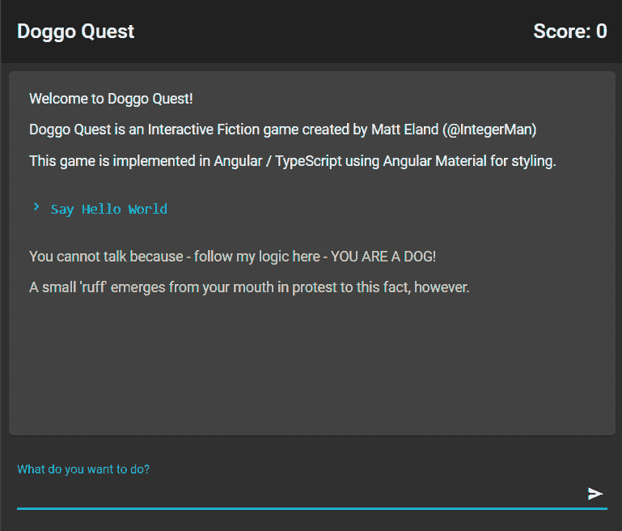

# 使用 ngSwitch 进行选择性角度分量渲染

> 原文：<https://javascript.plainenglish.io/selective-angular-component-rendering-with-ngswitch-4ec3a2b5e05e?source=collection_archive---------2----------------------->

有时在 Angular 中，您有一个项目集合，并且需要为同一集合中的不同项目显示不同的组件。幸运的是，Angular 提供了一个名为`ngSwitch`的指令，让我们可以灵活地处理组件的呈现方式。在这篇短文中，我将向你展示我的游戏开发项目中的一个例子，以及我如何使用`ngSwitch`来解决它。

# 问题是

在我的例子中，我正在用 Angular 构建一个基于文本的冒险游戏。我有一个故事文本将去的中心区域，但不是所有的文本都是平等的。一些文本代表玩家输入的命令，一些代表故事叙述，一些代表一般的系统状态信息。

我希望这些不同类型的文本有不同的格式，如下图所示:

问题是当你使用`ngFor`在 Angular 中循环一个集合时，`ngFor`指令所在的元素是将被重复的元素。这使得基于行中的值动态表示内容变得更加困难。

更具体地说，我有一个枚举来表示可用的不同类型的故事文本:

`StoryEntry`类表示交互故事中的单个线条，如下所示:

这个类以集合的形式存储在组件中，如下所示:

所以，现在问题来了，我们如何在这个集合上做一个`ngFor`，用不同的组件呈现不同的`EntryType`值。

# 解决方案:ngSwitch

我为这个问题找到的最简单、最易维护的解决方案是引入一个新组件，它接受`StoryEntry`对象，然后*的*模板使用它根据条目的`EntryType`有条件地呈现一个附加组件。

`ngSwitch`允许您评估 HTML 中的一些内联条件，并通过一个`ngSwitchCase`指令用一个匹配切换条件的指令呈现元素。如果没有匹配的条件，如果通过`ngSwitchDefault`指令定义了一个条件，将包含默认条目。

这看起来像这样:

这里特别值得注意的是`ngSwitchCase`指令中的值。为了便于维护，我们需要能够在 HTML 中通过名称引用枚举成员。事实证明，为了在 Angular 中干净利落地做到这一点，您需要做一点小小的修改，在组件内部为您的枚举定义一个别名，如下所示:

第 16 行增加的复杂性/攻击是不幸的，但这是我所知道的解决这个问题的最好方法。你可以完全不使用枚举，而使用字符串值和字符串比较，这就消除了这个问题。但是，如果您这样做，您将失去该解决方案提供的枚举成员安全性。

# 最终结果

组件的这种用法，`ngSwitch`和使用 enum 别名为我们提供了一种相当简单的方法来有条件地显示某些类型条目的组件，这就是我们要做的。

请继续关注，在接下来的一个月里，我将继续打造这款冒险游戏。

*原载于 2020 年 2 月 6 日*[*【https://killalldefects.com】*](https://killalldefects.com/2020/02/06/selective-angular-component-rendering-with-ngswitch/)*。*