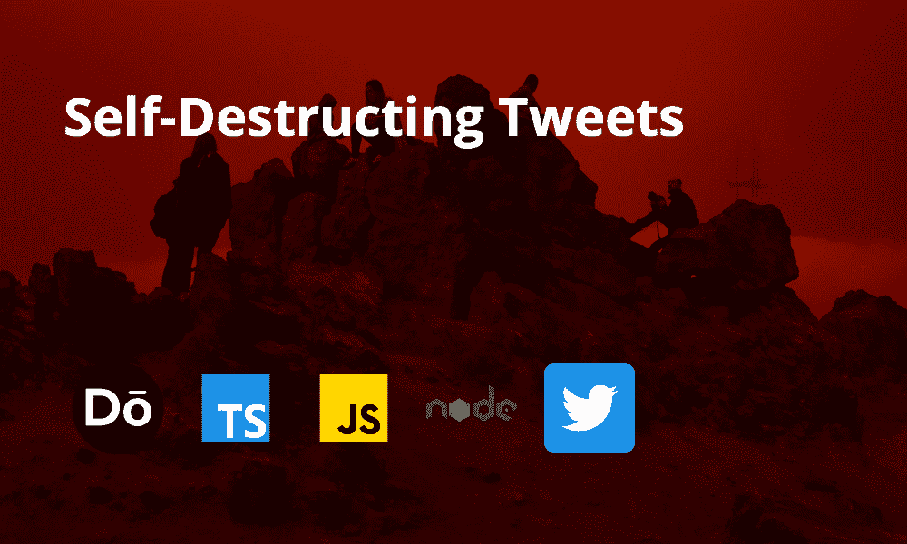

# 用 Node.js 和 TypeScript 创建自毁推文

> 原文：<https://javascript.plainenglish.io/self-destructing-tweets-cce39e59cca2?source=collection_archive---------19----------------------->

## 让 Twitter 按照你的方式工作

我会第一个承认: ***我不喜欢社交媒体*** 。

这并不是说我不喜欢与我爱的人保持联系，并有办法跟上他们的生活。事实上，我们的梦想是利用社交媒体来实现这一点。

我不喜欢社交媒体的原因是**社交媒体对我的控制超过了我对它的控制**。好了，我承认了。开心吗？

你可以说我过于乐观，但是我仍然相信我仍然可以让它工作。然而，让它为我工作需要一些微调。

对脸书和 Instagram 的微调意味着删除它。我六个月前做过这个。我确信，出于商业和广告的原因，脸书账户会有一个用例，但是应用奥卡姆剃刀理论来解释我为什么在*时刻同时使用这两个应用程序并不是出于商业目的*，因此我轻轻一弹。

至于 Twitter，它可能是一个真正的负面南希，然而，我确实从那里收到了一些非常重要的通知。我想在 Twitter 上做的是尽量减少负面影响，尽可能地从应用程序中删除我的历史记录。

为了开始这个过程，我构建了一个简单的 Twitter bot，它运行在 cron 作业上，将从我的个人资料中删除任何超过 7 天的推文。

在本教程中，我将演示删除推文的第一部分。

## 先决条件

1.  基本的节点理解。
2.  基本的 Typescript 理解。
3.  阅读我关于用 JavaScript 构建你的第一个 Twitter 机器人的帖子。我不会重复这些内容。
4.  阅读我在[上的帖子，使用 AWS CDK 在 cron 作业](https://blog.dennisokeeffe.com/blog/2020-06-22-cdk-lambda-to-send-slack-message/)期间调用 Lambda 函数。在本教程中，我今天不讨论 cron 作业部分。
5.  您参加 [Twit](https://github.com/ttezel/twit) 所需的证件。

## 入门指南

在您选择的新文件夹中，运行以下命令:

在本教程中，我想尝试一下我上周在网上看到的 [esbuild-node-tsc](https://github.com/a7ul/esbuild-node-tsc) 和 [DayJS](https://github.com/iamkun/dayjs) ，因为我还没有机会尝试那一个！

## 设置 Dotenv

如果您遵循了先决条件，您将拥有您的帐户密钥。

将正确变量的密钥添加到`.env`中:

## 设置 TypeScript、nodemon.json 和 package.json

在`tsconfig.json`中，我们将告诉它目标节点的需求。我们添加了`ES2020.Promise`库，这样我们就可以使用`Promise.allSettled`，但是如果你想用`Promise.all`代替，你可以省略它(不是说任何拒绝都会导致所有拒绝，如果没有`allSettled`)。

将以下内容添加到文件中:

在`nodemon.json`中，我们基本上会告诉它在扩展名为`ts`的文件改变时运行`etsc`。

对于`package.json`，将以下内容添加到脚本键中(为简洁起见，其余部分省略):

## 创建我们的 Twitter 助手文件

在`src/twitter/index.ts`内，添加以下内容:

这篇文章期望你能够理解上面的内容，但是最重要的是我们使用`dotenv`从`.env`文件中获取局部变量。

然后我们有两个主要的函数`getUserTimeline`和`destroyMany`，它们将从你的账户获取`n`条推文，然后分别销毁所有这些推文。

现在是时候编写将利用这些函数的主脚本了。

## 编写主脚本

在`src/index.ts`中，添加以下内容:

在这里，我们等待通过我们的`getUserTimeline`调用获得最大 tweet 计数(200 ),然后遍历响应数据，以确定创建日期是否超过一周。如果是，我们将它推送到一个`tweetsToDelete`数组，然后最终将该数组传递给`destroyMany`。

我们注销`manyDestroyed`变量，查看哪些请求被满足，哪些推文被删除。

## 运行脚本

要运行脚本模式，运行`npm start`(在观察模式下与`nodemon`一起运行)。这将启动 Nodemon，如果成功，你将看到你的推文超过 7 天开始删除！

如果你已经发了 200 多条推文，你可能需要重新运行这个脚本几次，直到它没有更多要删除的了！

## 结论

这是一个快速的帖子，但它概述了我如何编写一个脚本来开始删除我超过一周的推文！

从这里开始，我设置了一个 cron 作业，每天午夜运行，以重新检查和删除任何其他推文。

我真的希望这能激励*(我不严格地使用这个术语)停止在 Twitter 上发帖，用它来消费。我对 Twitter 的下一步举措将是使用 ML/AI 在我的 feed 中添加一些过滤推文的东西。*

## *资源和进一步阅读*

1.  *[用 JavaScript 构建你的第一个 Twitter 机器人](https://blog.dennisokeeffe.com/blog/2020-07-11-twitter-bot/)*
2.  *[在 cron 作业期间使用 AWS CDK 调用 Lambda 函数](https://blog.dennisokeeffe.com/blog/2020-06-22-cdk-lambda-to-send-slack-message/)*
3.  *[Twit — GitHub](https://github.com/ttezel/twit)*
4.  *[esbuild-node-tsc — GitHub](https://github.com/a7ul/esbuild-node-tsc)*
5.  *[DayJS — GitHub](https://github.com/iamkun/dayjs)*

**图片来源:* [*帕特里克·帕金斯*](https://unsplash.com/@stay_in_touch)*

**原贴于我的* [*博客*](https://blog.dennisokeeffe.com/blog/2020-10-05-self-destructing-tweets/) *。**