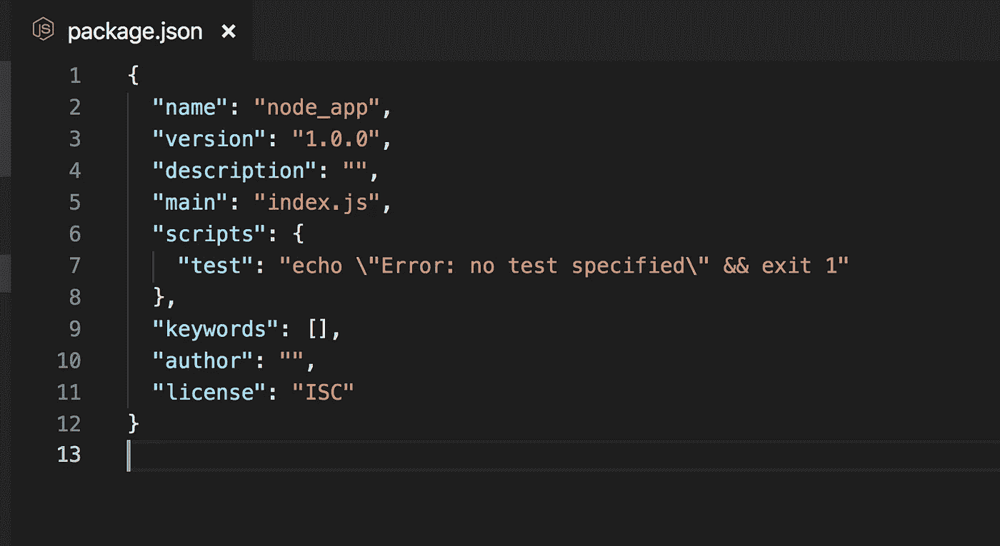
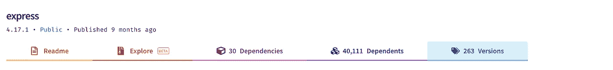
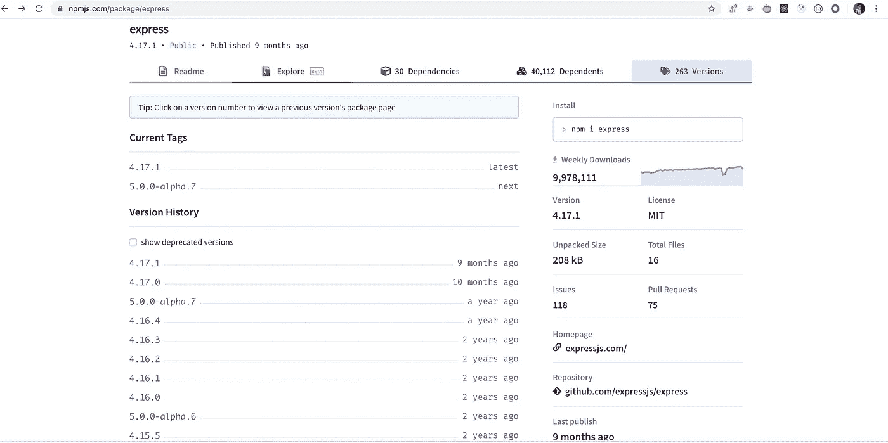
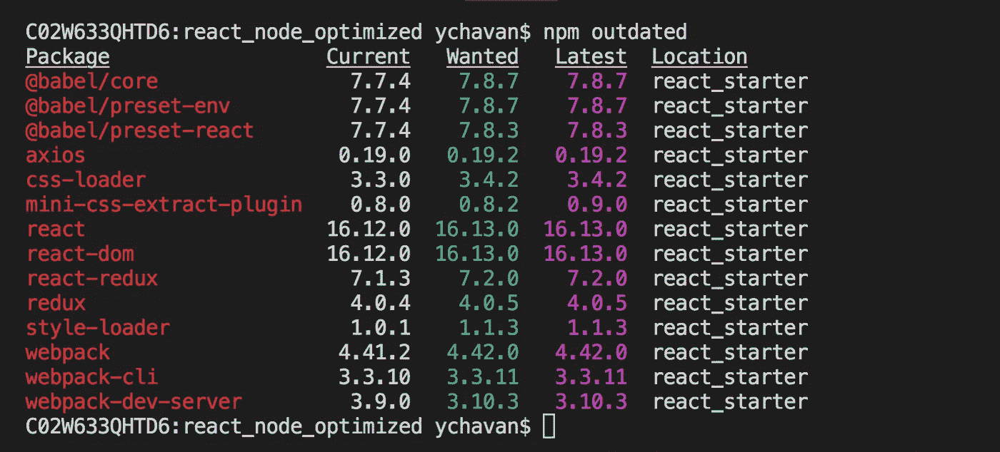
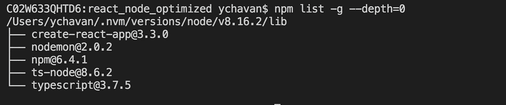

# npm 中的语义版本控制

> 原文：<https://javascript.plainenglish.io/semantic-versioning-in-npm-54d5b02c3536?source=collection_archive---------3----------------------->

## 轻松更新 npm 软件包，无需担心会破坏应用程序


Photo by [Caspar Camille Rubin](https://unsplash.com/@casparrubin?utm_source=medium&utm_medium=referral) on [Unsplash](https://unsplash.com?utm_source=medium&utm_medium=referral)

语义版本控制是一件非常重要的事情，无论你是`Nodejs`、`Reactjs`还是`Angularjs`开发人员，每个开发人员都需要了解它。

这也是面试中经常被问到的问题之一。

它定义了如何管理我们安装的 npm 软件包的依赖关系。

所以让我们从一些基础开始。

当我们从头开始创建任何新的 Nodejs 或 reactjs 项目时，我们执行

```
npm init -y
```

这将创建一个基本的`package.json`文件，我们可以在其中管理包的依赖关系。

通常情况下，`package.json`会是这个样子。



如您所见，package.json 为新项目指定了以`1.0.0`开头的`version`属性。

假设我们安装了特定版本的`express`包，使用

```
npm install express@4.16.1
```

它将被添加到`package.json`的依赖关系部分，作为

```
"dependencies": {
  "express": "^4.16.1"
}
```

您还会看到，还会创建一个新的`package-lock.json`文件。这是一个非常重要的文件，它包含了主软件包及其安装的依赖软件包的确切版本和下载 url。

**你千万不要编辑或删除 *package-lock.json* 。它会在安装或删除软件包时自动更新。**

**语义版本化:**

如您所见，package.json 中的`dependencies` 是一个具有键值对的对象。

该值是由`dot`运算符分隔的 3 位数字的组合。假设版本是`a.b.c`

1.第一个值(`a.b.c`中的`a`)指定了包的主要版本——这意味着这个版本有主要的代码变更，它可能包含重大的 API 变更。

2.第二个值(`a.b.c`中的`b`)指定次要版本，该版本包含次要变更，但不包含重大 API 变更。

3.第三个值(`a.b.c`中的`c`)指定通常包含错误修复的补丁版本。

> 如果您正在创建自己的 npm 软件包，也应该遵循这些版本规则。

如果包中有重大更改，在将包发布到 npm 存储库时，将 package.json 中的版本属性的第一位数字增加`one`。对于较小的变化，增加第二个数字，对于错误修复，增加第三个数字值`one`。

您还会注意到，在版本号前面有一个脱字符号`(^)`

```
"express": "^3.16.1"
```

有两个最常用的符号有特定的含义。让我们来理解他们。

1.`^`:此符号表示当我们想更新`package.json`中提到的所有包时，使用`npm update`，将只更新到`patch`和`minor`发布版本。因此，如果你的当前版本是`3.16.1`并且有次要版本发布，那么这个包将被更新到`3.17.1`。如果只有补丁版本发布，那么它将被更新到最新的可用补丁版本，如`3.16.3`

注意，如果版本号前有`^`符号，那么如果运行`npm update`，包将永远不会更新到主版本。

如果您想更新到主要的可用版本，您可以使用

```
npm install express@4.16.1
```

如果您想安装软件包的最新可用版本，请运行

```
npm install express@latest
```

2.`~`:该符号表示包将只更新到补丁版本，即从`4.16.1`到`4.16.2`或`4.16.3`的最后一位数，而不是`4.17.1`或`5.16.1`

您可以只安装那些由 npm 包(在我们的例子中是`express`包)提供的版本。
如果你在这里转到 npm 库的 express 包[，你可以看到这个包的所有版本。在这种情况下，`263 versions`截止到今天。](https://www.npmjs.com/package/express)



如果你点击那个链接(`263 versions`)，你会看到那个包的可用版本的长列表。



一些有用的命令:

1.如果您想查看 package.json 中所有包的当前和最新版本，您可以执行`npm outdated`命令



2.执行
`npm list -g --depth=0` 命令，获得所有全局安装包的列表



3.要获得项目中所有易受攻击包的报告以及如何修复它们的说明，请执行`npm audit`命令。如果你在 Mac 上，你可能需要像`sudo npm audit`一样在它前面加上 sudo

> 该命令将列出所有易受攻击的软件包，链接有关漏洞的更多信息、其严重性(低、中或高)以及修复漏洞所需执行的命令。

您应该偶尔为您的项目运行一下`npm audit`命令，看看最近是否有任何漏洞被报告，并在需要时修复它们，以保持包是最新的，从而保证您的应用程序的安全性。

今天到此为止。希望你今天学到了新东西。

**别忘了直接在你的收件箱** [**订阅我的每周简讯，里面有惊人的技巧、诀窍和文章。**](https://yogeshchavan.dev/)