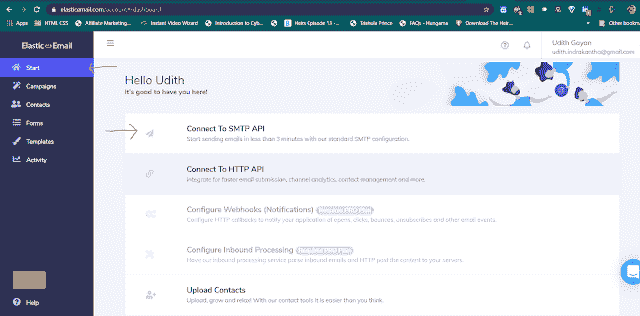
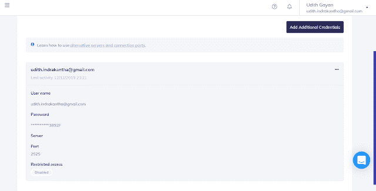

# 用 Angular 发送没有服务器端代码的电子邮件

> 原文：<https://javascript.plainenglish.io/send-emails-without-a-server-side-code-with-angular-e227c3e62dbd?source=collection_archive---------0----------------------->

无需在服务器上托管任何服务器端代码，您就可以使用 smtpJS(一个客户端 Javascript 库)通过您的 Angular 应用程序发送电子邮件。

首先，您需要下载这个库，并将其包含到 Angular 应用程序的必要组件中。
[点击这里](https://www.smtpjs.com/v3/smtp.js)下载库文件。(如果无法下载 js 文件，请点击 [*此链接*](https://www.smtpjs.com/) 并点击下载)

接下来，将这个下载的 js 文件放到项目的 *src* 目录下的 ***assets*** 文件夹中。

接下来，我们必须得到电子邮件服务提供商的帮助来发送电子邮件。我在这里使用弹性电子邮件网站。首先去[弹性邮箱](https://elasticemail.com/account#/create-account)网站创建一个账户。只需完成注册过程，就这么简单。
登录站点后，进入*开始— →连接 SMTP API。*

接下来，您可以看到一个创建新凭据的按钮。按照简单的步骤创建新的凭据。系统将为您生成一个密码。**在关闭弹出模型之前，复制密码并保存在某个地方。**

最后你会看到这样的东西。

在这里，可以看到您的用户名和密码(您之前保存的)。这些详细信息用于访问此。

**编码部分**

转到 angular 项目的相关组件，必须从该组件发送电子邮件。

1.  通过键入以下命令，将 smtp.js 文件从 assets 文件夹导入组件

> ***导入’。/../../../assets/SMTP . js '；//路径可能改变
> 声明 let Email:any；***

2.编写代码，使用 onSubmit()方法中的用户输入发送电子邮件，如下所示，

feedback.ts

在这里，在 Email.send(…);方法，你可以给弹性邮箱注册邮箱为*用户名*，而早先保存的密码为*密码*字段。*发自*:电子邮件应该等于弹性邮件的注册电子邮件，您可以在*到*字段下设置收件人的电子邮件。
其他字段可以从您的表单中创建。

就是这样。

## 进一步阅读

 [## 使用 Angular 创建员工满意度调查，并将结果存储在 MongoDB 集合中

### 一步一步的教程来建立一个员工满意度调查使用 Angular 和 SurveyJS，一个免费的，开源的…

简明英语. io](https://plainenglish.io/blog/create-an-employee-satisfaction-survey-using-angular-and-store-results-in-a-mongodb-collection) 

*更多内容请看*[***plain English . io***](https://plainenglish.io/)*。报名参加我们的* [***免费周报***](http://newsletter.plainenglish.io/) *。关注我们关于*[***Twitter***](https://twitter.com/inPlainEngHQ)[***LinkedIn***](https://www.linkedin.com/company/inplainenglish/)*[***YouTube***](https://www.youtube.com/channel/UCtipWUghju290NWcn8jhyAw)*[***不和***](https://discord.gg/GtDtUAvyhW) ***。*****

*****对缩放您的软件启动感兴趣*** *？检查* [***电路***](https://circuit.ooo/?utm=publication-post-cta) *。***