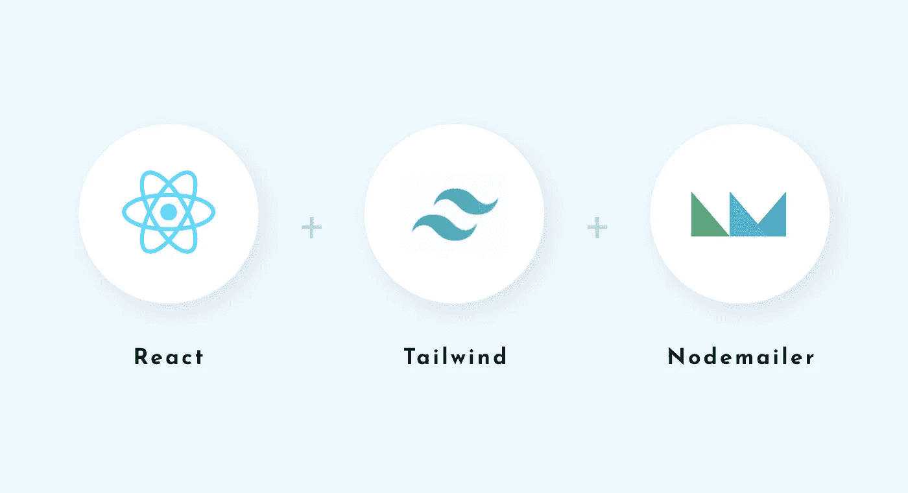
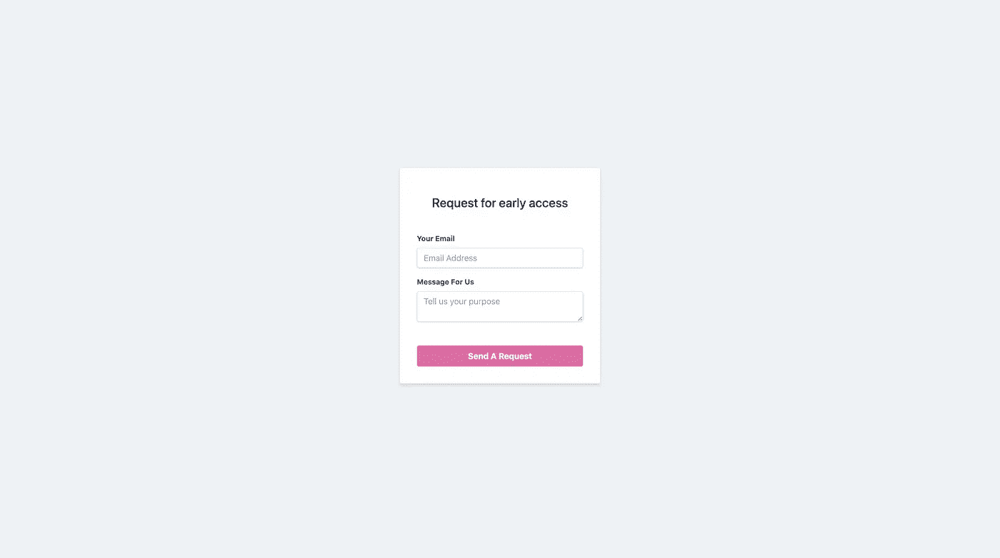

# 使用 Nodemailer 从 React 应用程序发送电子邮件

> 原文：<https://javascript.plainenglish.io/sending-email-in-react-application-with-nodemailer-afcef6906608?source=collection_archive---------1----------------------->

## 发送电子邮件是大多数应用程序中最需要的功能之一。这里我们将自己实现一个。



React(hooks) + Tailwind + Nodemailer

这里，我们将为我们的演示应用程序实现一个**请求访问**特性。当用户可以进入我们的应用程序，他们可以填写电子邮件和消息的名称，并提交它。我们将配置特定的表单数据，并将其直接发送到我们所需的电子邮件中。

对于前者，我们将使用 React 钩子和 Tailwind CSS 来实现它。让我们看看我们将要制作的表格。



Our Simple Form UI

# 前端

让我们从为表单创建一个组件开始。在这里，我们将制作一个组件，并使用我们的顺风来增加风格，并进行必要的导入和更改，使它看起来像上面的东西。经过必要的修改后，我们的***request access . js****组件看起来如下*

*[Github Gist Link](https://gist.github.com/ishan-me/093d892ba03df9324d21b2bd3ef49ba4)*

*在这里，我们刚刚添加了一些从 Tailwind 导入的样式，以使我们的 UI 看起来更好。我们现在将继续使用 React 中的`*useState*` *hook* 来连接输入字段中的值。之后，我们只需在本机 *fetch* 方法的帮助下，将稍后创建的 API 路由添加到 URL 端点。*

*[Github Gist Link](https://gist.github.com/ishan-me/4916569fa7041f613b8c0d8ed2e6f958)*

*在这里的代码中，我们刚刚将异步函数添加到`*onSubmit*` 处理程序中，该处理程序最终将调用我们的 API 端点，我们将使用消息和电子邮件为我们的后端创建该端点。*

# *后端*

*在我们的后端，我们将创建一个简单的服务器，它将接收从我们的 react 应用程序发送的对象，并触发一封电子邮件给所需的人，并在 UI 中填充详细信息。为此我们将使用`*nodeMailer*` *。在我们开始写之前，让我们导入我们将使用的必要的包**

```
*yarn add express nodemailer nodemon*
```

**Express* 是我们的首选框架，完全易于上手。 *Nodemailer* 是我们将用来发送电子邮件到所需地址的库，以及当我们修改代码时用来重启服务器的`*nodemon*`。现在让我们创建 ***app.js*** 文件，我们将在其中编写所有代码(我们也不会创建单独的路径**)。env** 文件以便于简化)。*

*我们现在将在这里导入我们想要的包，并创建一个 SMTP 协议，以便 Nodemailer 发送邮件。该协议由 gmail、hotmail 等电子邮件主机使用。*

*[Github Gist Link](https://gist.github.com/ishan-me/6902cb2a111a65e5e4a6076895308889)*

*接下来，我们将使用验证回调来验证 SMTP 连接。我们也将在控制台中记录我们的错误。*

*[Github Gist Link](https://gist.github.com/ishan-me/50a1df9c12bf070cb0d4ea748835ecaf)*

*最后，我们可以添加 POST 路由来发送 UI 中填充的表单内容。在所有这些都设置好之后，我们就可以拥有一个可以工作的迷你应用程序了，它会向我们发送电子邮件，并在应用程序 UI 中填入数据。让我们看看这里的最终代码*

# *结论*

*你刚刚建立了一个表单，可以发送邮件到我们想要的电子邮件地址。这是我们应用程序中最常见的特性之一。如果需要的话，我们可以调整并使之变得更好。你也可以在 这里找到资源库 [**中的代码。**](https://github.com/ishan-me/React_node_email)*

*编码快乐！*

## ***用简单英语写的 JavaScript***

*喜欢这篇文章吗？如果有，通过 [**订阅获取更多类似内容解码，我们的 YouTube 频道**](https://www.youtube.com/channel/UCtipWUghju290NWcn8jhyAw) **！***