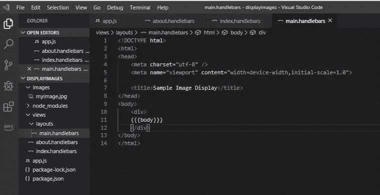

# 具有快速手柄的服务器端图像渲染

> 原文：<https://javascript.plainenglish.io/server-side-image-rendering-with-express-handlebars-cb224187b276?source=collection_archive---------2----------------------->

Photo by Cristina Gottardi on [Unsplash](https://unsplah.com)

如果你不熟悉我最喜欢的服务器端渲染工具之一的手柄，你可能不习惯在服务器端渲染图像。

在本文中，我将向您展示一种在进行服务器端渲染时快速处理图像的方法。

> 请注意，我使用的是快速把手，但该命令并不特定于把手。

## 假设

我想让这篇文章简短。稍后我会写一篇关于服务器端渲染的更长的文章。所以我假设你已经在使用手柄或者刚刚开始使用，有一些使用 node.js 和 VS 代码的经验。我将主要关注下面代码的两个部分。但也将简要解释其他部分，以便您可以学到一些额外的东西。

> 尽管这不是关于手柄或服务器端渲染的教程，但您可能会学到一些东西。

我的重点将是显示一个索引和关于页面的图像。为什么只关注一个图像？因为我注意到图像的显示方式太复杂了。这个很简单。

## 我们将做什么

*   设置节点 web 服务器
*   安装[快递](https://expressjs.com/)
*   安装[快速把手](https://www.npmjs.com/package/express-handlebars)
*   创建一个基本的车把文件夹结构
*   创建三个页面，index.handlebars、about.handlebars 和 main.handlebars

## 我们开始吧

1.  创建名为 displayimage 的目录。
2.  因为我们需要它们，所以在 **displayimage** 下创建一个 **images** 文件夹，在 **views** 文件夹下创建一个**布局**。

Folder Structure

3.启动 VS 代码并打开 displayimage 文件夹

4.打开一个新的终端并键入， ***npm init***
创建 package.json .接受默认设置*，除了将默认页面改为* ***app.js*** ，而不是 index . js . js .这将使它与我的保持一致。

5.在终端窗口中键入***NPM install express***
来安装轻量级 web 框架。

6.在终端窗口输入***NPM install express-handlebars***
安装 Handlebars 服务器端渲染视图引擎。

7.键入以下内容，在端口 5005 上设置 web 服务器。

Basic node web server

8.在终端中，按 F5 启动 web 服务器。您应该会得到上图中的信息。

我们想要一个**索引**页面和一个**关于**页面。记住，这些是在服务器端渲染的。每个页面将显示相同的图像。但首先我们要确保它们能正常工作。

9.将以下代码添加到 app.js 中的第 10 行之后。我想让你注意的就是这第 13 行。

通过第 13 行，你告诉应用程序你的图片将被存储在哪里。您将不必在您的元素中为您的图像指定一个混乱的路径。

*和所有东西一样，总会有更多，所以使用 app.use()或 express.static 之类的东西来了解更多。*

我们将添加**索引.车把**(默认)和**关于.车把**。每个都将显示图像和一些文本。现在，让我们为这些添加**路线**。

布局文件夹中的 **main.handlebars** 像往常一样包含您想要在每页上显示的内容。通常这可能是类似于引导导航条的东西。

app.js 应该如下所示。

app.js

我们有到达索引('/')和 about ('/about ')的路线。

## 创建我们的三个页面

## 索引.把手

在**视图**文件夹中，我添加了以下内容

index.handlebars

如果您刚刚开始使用车把，请注意{{greeting}}，也请注意 app.js 中的内容。“问候”这个名字没什么特别的，可以是任何东西。app.js 中的 route 将用我们发送给它的文本填充{{greeting}}占位符。

## 大约.把手

为简单起见，与 index.handlebars 的代码完全相同

about.handlebars

## 主把手

在视图/布局文件夹中创建。

main.handlebars

如果您是手柄的新手，{{{body}}}是一个占位符，表示“对于每个页面，在正文中放置发送到该页面的内容。”

在我们看来，这是一种问候。

确保您的 web 服务器正在运行，并在必要时刷新它。

在浏览器中运行您的应用程序，并通过转到 **localhost:5005** 获取索引和 **localhost:5005/about** 获取 about 页面来测试到 **index** 和 **about** 的路由。

## 现在是图像

有点失望，因为我没做什么特别的事。app.js 的第 13 行处理了这个问题。我只是在我的主手柄中加入了一个元素，这样它就会出现在每一页上。

如果我想把图片放在一个页面上，我们可以把放在那个页面上，而不是主手柄上。

> 重要的是它知道在哪里可以找到我们的图片，因为 app.js 的第 13 行。

修改 index.handlebars，使第 13 行出现以下

main.handlebars

刷新您的网络服务器和浏览器，图像应该显示当您访问索引和关于。

index

about

# 结论

对于在服务器端呈现的网页中引用的图像，一种选择是使用 [express.static](https://expressjs.com/en/starter/static-files.html) 。

在这个过程中，我们看到了如何使用 node 和 express 来建立一个 node web 服务器，如何使用 Handelbars 来进行 web 页面的服务器端呈现，以及对服务器端路由的一瞥。

我计划在以后的文章中花更多时间讨论最后两项。

感谢您的阅读和快乐编码！