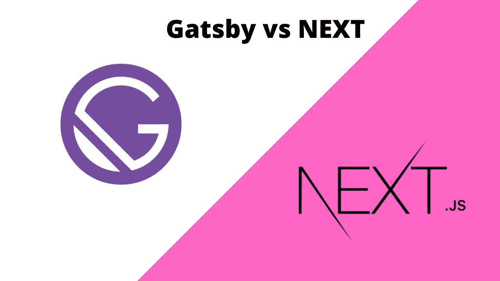
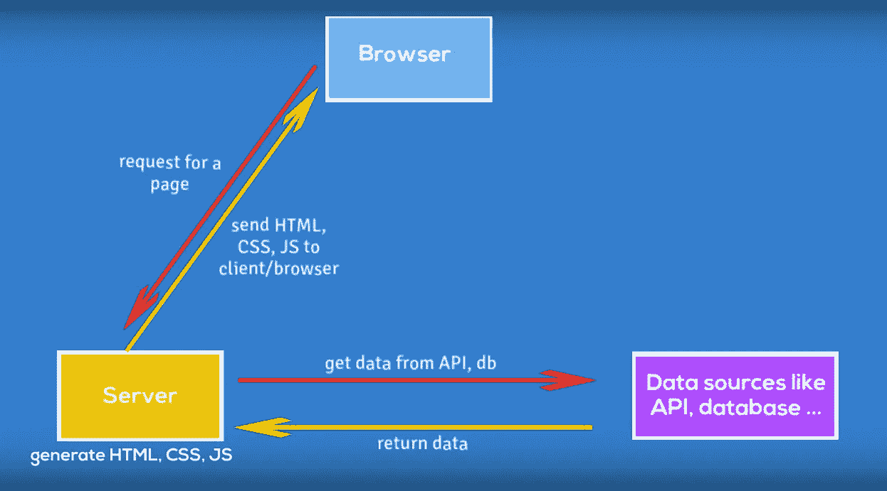
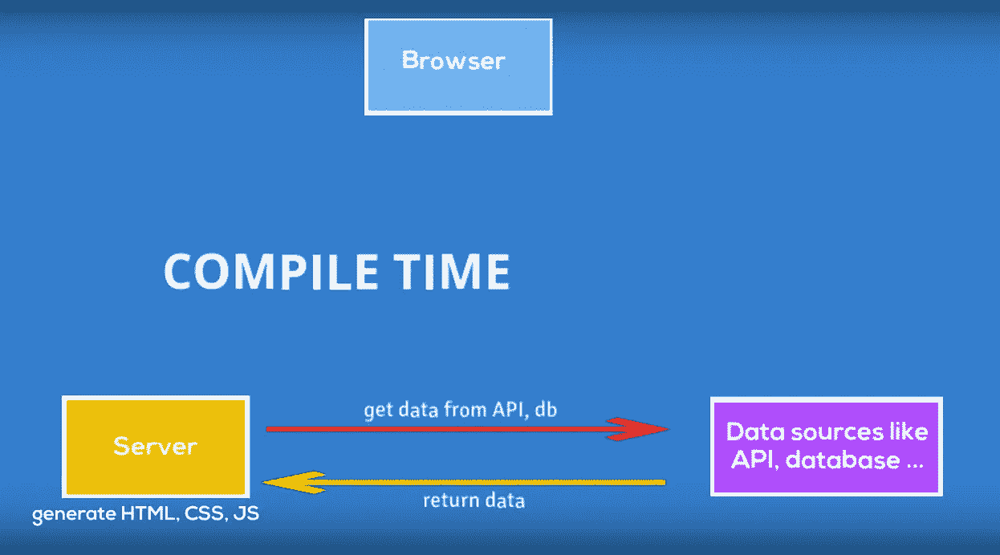
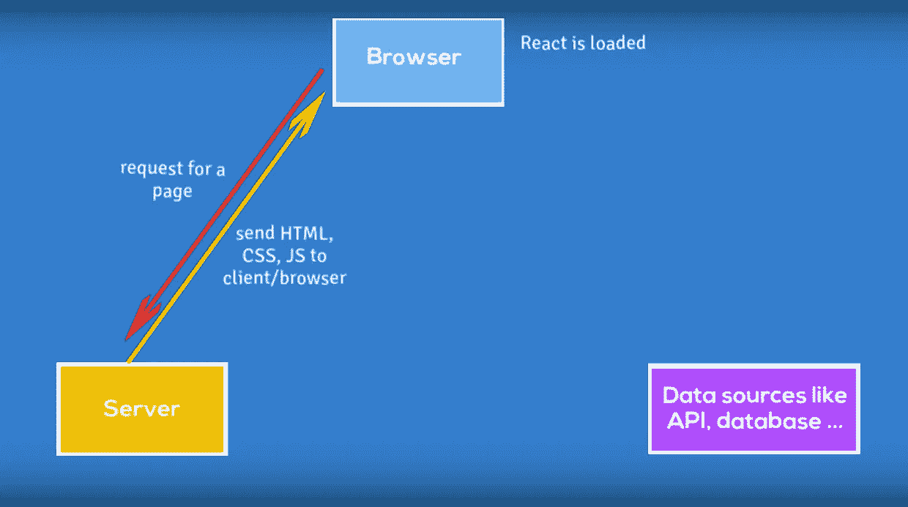
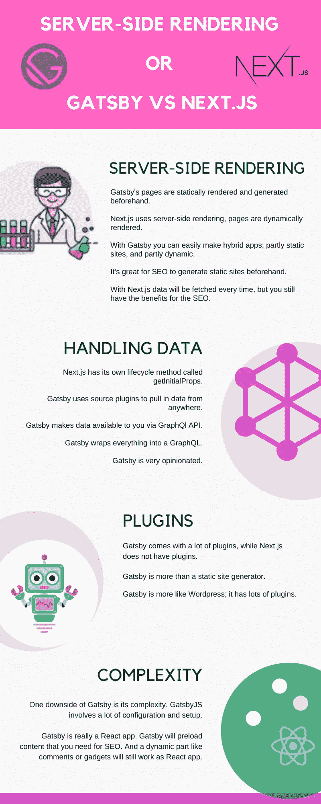
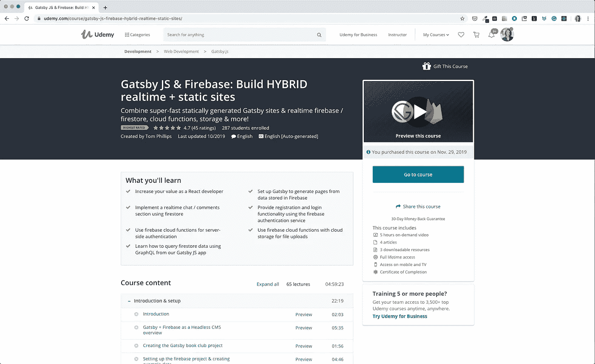

# 网站或盖茨比 vs Next 的服务器端渲染。射流研究…

> 原文：<https://javascript.plainenglish.io/server-side-rendering-for-websites-or-gatsby-vs-next-js-6caed9a79e16?source=collection_archive---------3----------------------->

## 需要一个速度超快的适合 SEO 的静态网站吗？但它仍然是动态的。你需要一个外观和感觉都像 app 的网站吗？

在本文中，您将看到:

*   Gatsby & NEXT.js 如何做服务器端渲染
*   他们在处理数据方面有多么不同
*   他们有多少插件

先说丹尼斯的一个故事。

丹尼斯是一名网页设计师。他设计页面。他也做 HTML，CSS，熟悉 React 和 Angular。他想重新设计他的页面。他有一个简单的页面，但现在他想将其升级为一个简单的商店。他想卖设计模板。他希望他的网站是静态的，这样它可以加载得更快。

丹尼斯从一个朋友那里听说，他可以使用 **Next.js 和 React** 来创建一个静态网站。他的一些朋友推荐使用静态站点生成器，**盖茨比**。

他应该用哪一个？

GatsbyJs 和 Next.js 有什么区别？

# Gatsby 和 Next.js 关于服务器端渲染

**盖茨比的页面被静态渲染**并预先生成。

**Next.js 使用服务器端渲染**，使用 Next.js 创建的页面将被动态渲染。

让我们看看这在幕后是什么样子的。

## **当我们向运行 Next.js** 的服务器发送请求时会发生什么？

1.  Next.js 服务器正在节点中运行。服务器将接受对特定页面的请求。
2.  收到请求后，服务器将查找该页面。
3.  该页面可能从数据库或 API 获取一些数据；服务器将等待该数据。
4.  然后，服务器将呈现数据，并将其转换为 HTML、javascript 和 CSS。
5.  最后，服务器将向客户机发送 HTML、javascript 和 CSS。

What is happening when we send a request to the server running Next.js

盖茨比是一个智能站点生成器。盖茨比仍然是一个 React 应用程序，但工作方式完全不同。

## **当我们向 Gatsby 生成的站点发送请求时，会发生什么情况。**

1.  Gatsby 将会把这个页面预先制作成一个静态的 HTML 页面。Gatsby 将在编译时获取数据。那是在你部署你的网站之前，或者作为一些部署过程的一部分。
2.  编译后，你会有一个名为 about 的文件夹和一个 index.html 文件。
3.  这些文件将立即提供给浏览器。

1.  浏览器加载页面后，**加载 React 部分**。因为 React 部分与静态页面相同，所以在加载 React 之后，您看不到任何区别。但是页面开始作为动态页面工作。这意味着你也可以拥有动态的内容。

有了 Gatsby，你可以轻松制作混合应用程序。部分是静态网站的应用程序，预先生成，部分是作为 React 应用程序工作的动态页面。

**预先生成静态站点对 SEO 来说很棒**。Gatsby 将预加载搜索引擎优化所需的内容。评论或小工具等动态部分仍将作为 React 应用程序工作。Gatsby 创建的页面仍然是一个完整的 React 应用程序。

**在 Next.js 的例子中，你仍然有 SEO 的好处，但是你有一个额外的步骤来获取数据。**用 Next.js 每次都会取数据**。**它将被编译成静态页面，然后提供给浏览器。

Next 中的呈现是针对每个请求完成的，而在 Gatsby 的情况下，您只为预先呈现的静态站点提供服务。

# 盖茨比和 Next.js 在处理数据

Gatsby 对事情应该如何做非常固执己见，而 Next.js 对你如何处理数据并不固执己见。

Next.js 有自己的生命周期方法 getInitialProps ，在这里数据被调用，但是你可以用任何你想要的方式处理数据。

有了 Gatsby，你可以从任何地方获取数据，可能是 markdown、API、数据库或 Wordpress。

**盖茨比使用源码插件拉进数据**。许多源插件已经存在，用于从其他 API、CMS 和数据库获取数据。

**每个插件从其来源获取数据**。例如，文件系统源码插件知道如何从文件系统获取数据，WordPress 插件知道如何从 WordPress API 获取数据，等等。通过包含许多源插件，您可以获取数据并将其全部组合在一个数据层中。

**然后** **Gatsby 通过 GraphQl API** 提供给你。当您构建页面时，您需要查询 GraphGl API。例如，博客文章、产品、文章内容等的列表。

盖茨比把一切都打包成一个图表。在呈现时，Gatsby 将使 GraphQL 对您可用，然后 Gatsby 将为您呈现那些 HTML 页面。

盖茨比很固执己见。页面上来自数据、图像和样式的所有资源都需要对 Gatsby 可见。只有这样，它们才会呈现在静态 HTML 页面中。但这并不是一件坏事。它对你有很大的帮助。

# 关于插件的 Gatsby 和 Next.js

盖茨比更像是 Wordpress。

**盖茨比自带很多插件，而 Next.js 没有插件。有了插件，你可以最小化图片，编译 Javascript 并缩小它。还有更多可用的插件，例如，Mailchimp 插件，Google Analytics 插件，sitemap 插件等等。一个非常有用的插件是图像预加载，它可以超快地加载图像，并把图像从小变大。**

盖茨比不仅仅是一个静态站点生成器。

使用 Gatsby，您想要构建一个 React 网站或应用程序，但您不想处理创建 React 应用程序时出现的棘手问题。您不想处理路由、配置或服务器端呈现。

我会向丹尼斯推荐什么？嗯，是的，跟盖茨比去吧！这会让你的生活更轻松。

# Gatsby 和 Next.js 的主要区别

让我们一起回顾一下主要的区别。

Server-side rendering — Gatsby vs Next.js

盖茨比是事先静态渲染生成的。

当我们使用 Next.js 时，页面将被动态呈现。每个请求都会提取所有数据。

Gatsby 只在编译时渲染时提取数据。

《盖茨比》的一个缺点是它的复杂性。GatsbyJS 涉及大量的配置和设置。你正在学习全新的东西。您不只是像在 React 和 Node.js 应用程序中那样编写 Javascript。不要气馁。对于建设网站来说，是最好的。

**从插件上看，盖茨比更像 Wordpress**；它有很多插件。

**盖茨比真的是 React app** 。Gatsby 将预加载搜索引擎优化所需的内容。评论或小工具等动态部分仍将作为 React 应用程序工作。Gatsby 创建的页面仍然是一个完整的 React 应用程序。

关于 Udemy 的一门很棒的课程是汤姆·菲利普斯的课程，它将教你如何从盖茨比身上得到最大的收获。题目是[盖茨比 JS & Firebase:构建混合实时+静态站点](http://bit.ly/35XOvQo)。我强烈推荐这道菜。它的收视率很高，汤姆很友好，反应也很快。

[Gatsby JS & Firebase: Build HYBRID realtime + static sites](http://bit.ly/35XOvQo)

如果你想创建一个简单的博客，又没有时间学习 React、GraphQL 和 Gatsby，你应该看看 Jekyll。

我有一篇[文章](https://medium.com/javascript-in-plain-english/how-not-to-go-wrong-when-choosing-a-static-website-generator-gatsby-vs-jekyll-510cea59e6e1)和一个[视频](https://www.youtube.com/watch?v=XRxcUv6vXYU)比较杰基尔和盖茨比。也欢迎你来看或者看:)。

如果你喜欢这篇文章，我想邀请你到我的 youtube 频道，在那里我会发布更多关于 web 开发主题的文章。

 [## 贾娜·贝尔甘特

### 嗨，我是一名自学了 20 年的网络开发人员。教学是我的热情所在，这也是我在 Udemy 上开设课程的原因

www.youtube.com](https://www.youtube.com/c/JanaBergant-learn-to-code)