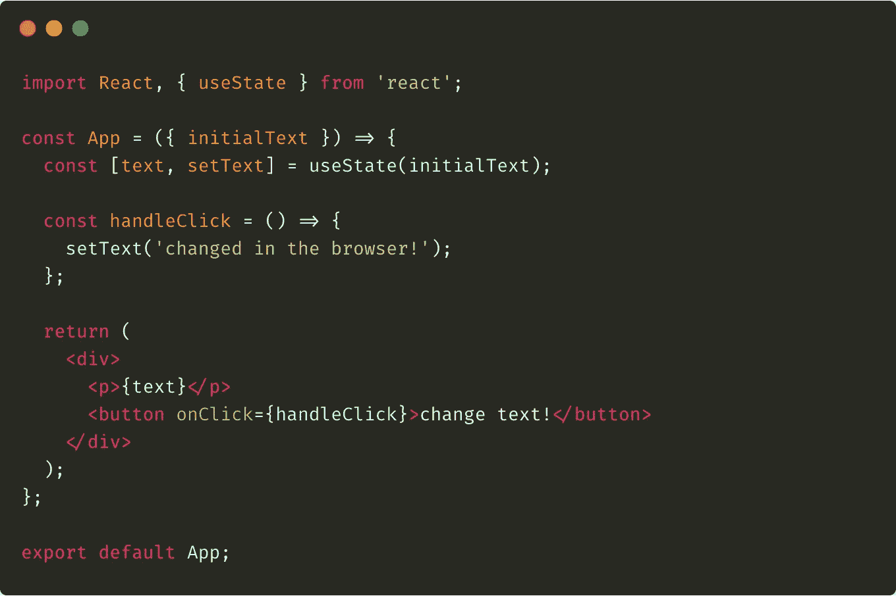
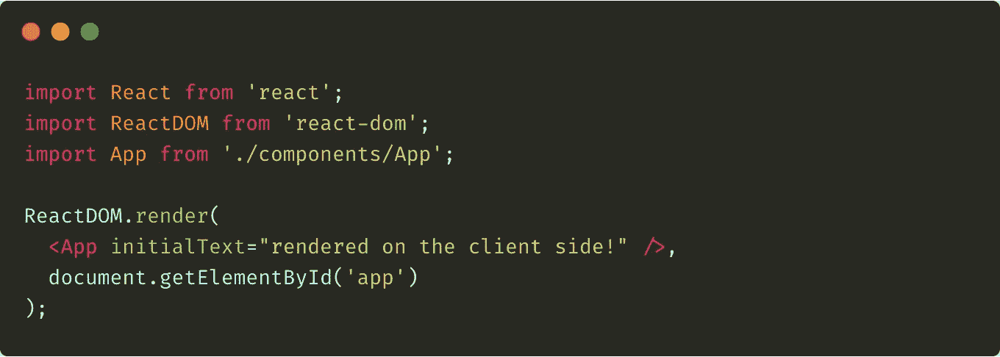
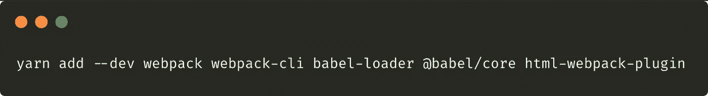
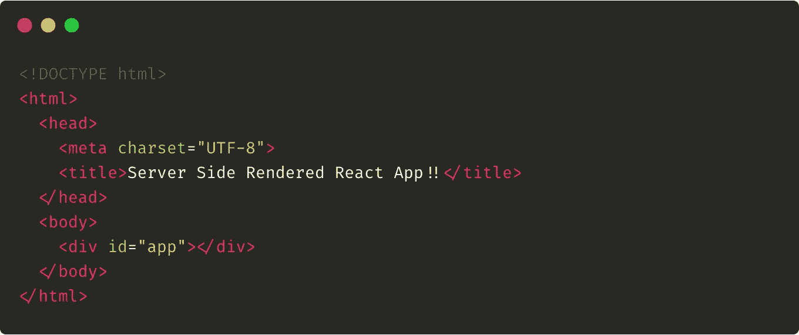
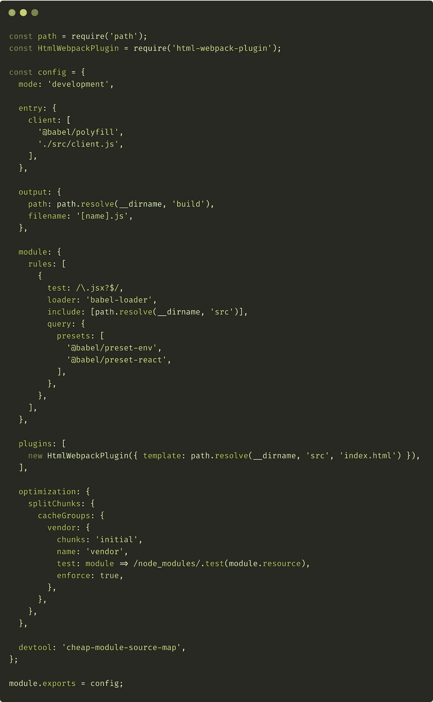
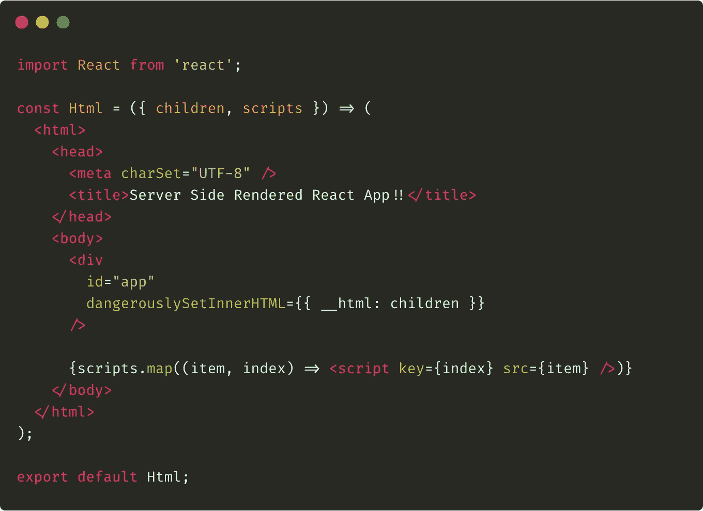
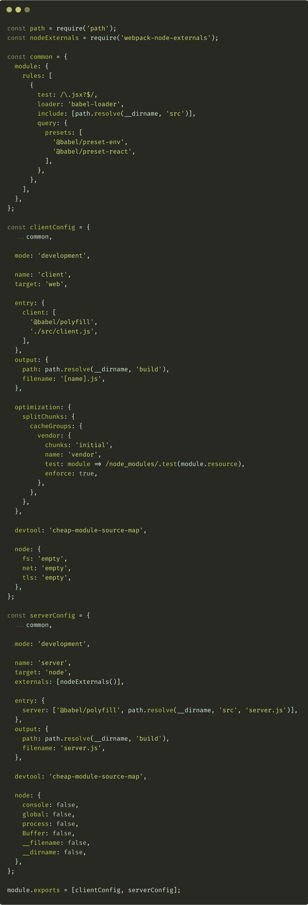
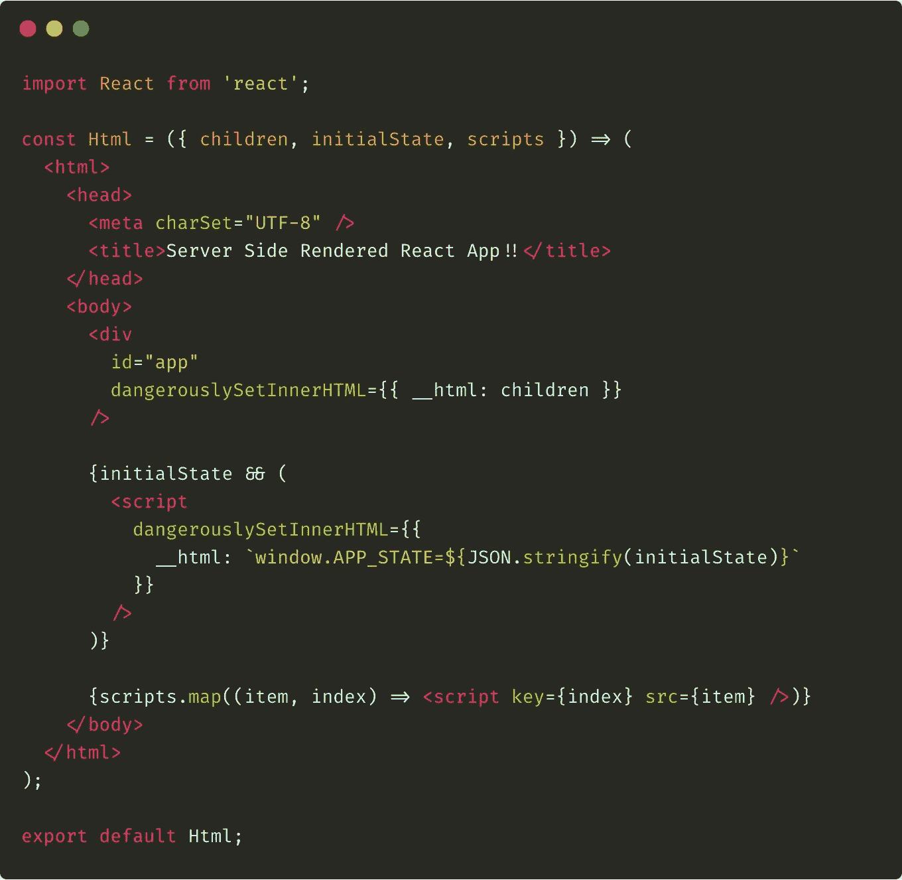
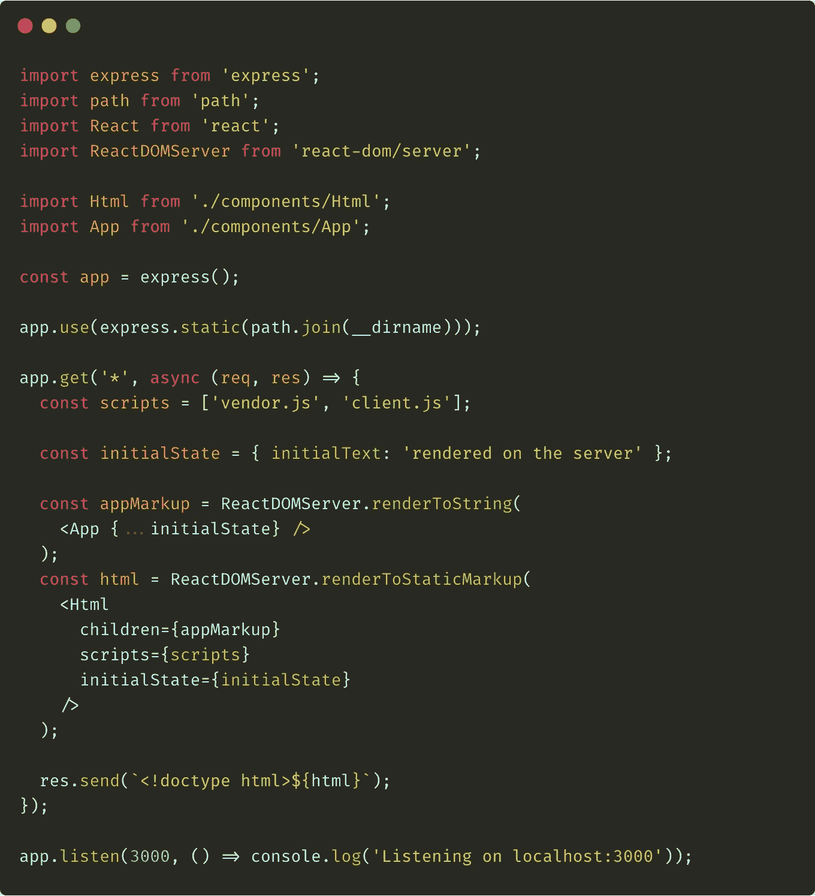
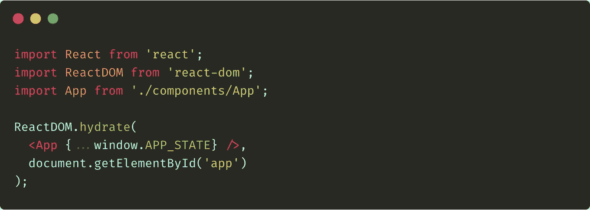

# React-express js 中的服务器端渲染

> 原文：<https://javascript.plainenglish.io/server-side-rendering-in-react-expressjs-8a87af0edba4?source=collection_archive---------1----------------------->

## 如何使用 ExpressJS 框架将 React 应用程序配置为在服务器和客户机上呈现。

在我之前关于 React 中服务器端渲染的文章中，我简要描述了同构和通用应用程序的概念。我还展示了这种方法的优点和缺点。今天，我将**进入要点**并向您展示如何使用 [ExpressJS](https://expressjs.com) 框架配置通用 React 应用程序！

首先，我将描述如何为客户端配置应用程序，然后我将转换它，使它也可以在服务器端工作。这将是 React 通用应用程序的最基本的例子。稍后，在本系列的后续问题中，我将通过使用 [Redux](https://redux.js.org) 和 [react-router](https://reacttraining.com/react-router/web/guides/quick-start) 来扩展我的代码。

# 起点 React 组件示例

如果我们正在创建一个通用的应用程序，我们必须处理两种情况:在服务器和客户端的渲染。当 web 浏览器请求内容时，我们的应用程序应该准备所有必要的数据，用它填充 HTML 代码，并将其返回给浏览器。然后，浏览器将加载包含我们的应用程序的客户端版本的所有 JavaScript 文件。由于这一点，与我们网站的进一步互动将成为可能。

要实现以上目标，我们的 app 需要两个出发点。对于服务器，它将是`server.js`文件，对于`client.js`客户机，它将是文件。我们稍后将讨论这两个文件，但是首先，让我们创建主要的 React 组件。它可能看起来像下面这样(`App.js`):

App.js

如您所见，这是一个简单的组件，它从它的`props`中获取一些初始文本，将其分配给状态，然后呈现它——我们希望它在服务器上完成**。**

此外，还有一个按钮可以改变州的`text`属性的值。这种互动将在客户端上**完成。**

# 客户端渲染

现在我们有了一个组件，我们可以渲染它了。现在，让我们只为客户做这件事。请看下面`client.js`文件的内容:

client.js

如果您使用 React 已经有一段时间了，那么您应该熟悉上面的代码。多亏了`ReactDOM`对象的`render`方法，我们可以将`App`组件注入到带有“app”标识符的 HTML 元素中。它只发生在浏览器加载了我们的 JavaScript 文件之后(之前呈现了一个空白页面)。请注意初始文本是如何传递到组件中的。

当然，如果我们想要完成所有这些工作，我们必须向我们的项目添加一些包:

Add react and react-dom to your project

请注意，**我在这里没有使用**中的`--dev`参数。这是因为我不仅在客户端的“捆绑包”中需要这些包，在服务器上也需要。

## 客户端准备

下一步是准备`index.html`文件。它将附加我们的客户端脚本(浏览器将在加载索引文件后加载它)。它还将有一个带有“应用程序”标识符的容器，我们的应用程序将被注入其中。要处理这一切，将使用 [webpack](https://webpack.js.org) 。

让我们从安装所有必要的**软件包开始:**

Add webpack, babel and html-webpack-plugin

我们还需要一些巴别塔预设(预定义的巴别塔插件):

Add Babel presets

最后但同样重要的是，我们应该安装 Babel polyfill 包(用于客户端和服务器，因此没有`--dev`参数):

我们为什么需要这个？嗯，Babel 可以翻译 JavaScript 语法，但 ECMAScript 的后续版本引入了各种本机方法或全局对象(例如`Promise`)。感谢`babel-polyfill`我们可以**模拟**整个 ES6+环境。

好了，现在我们准备将`index.html`文件添加到我们的项目中:

index.html

我们将使用这个文件作为应用程序的起点——至少现在是这样——当我们添加服务器端配置时，这个文件就不再需要了。请注意,“app”容器——我们的 React 应用程序将在这里注入。

您可能还注意到没有附加客户端脚本——这是因为它还没有准备好。它将由 webpack 生成，然后使用名为`html-webpack-plugin`的 webpack 插件注入到索引文件中。

## 客户端部件的 Webpack 配置

现在，让我们配置 webpack 来生成客户端的包。为此，我们必须将`webpack.config.js`文件添加到我们的项目中。请看下面它的内容:

Client-side webpack configuration

对于那些不熟悉配置 webpack 的人，让我简短地解释一下上面例子中配置的所有选项。首先，我们设置了`mode`选项，告诉 webpack 使用它的内置优化。

在`entry`部分，我们配置包的入口点**是什么。如您所见，目前，我们只有一个名为`client`的入口点，它指向`client.js`文件。请注意，在加载这个文件之前，我们还要加载`babel-polyfill`库。**

接下来，在`output`部分，我们可以定义**放置输出文件的位置**。这里，我们将目标文件夹设置为`build`,文件名为`[name].js`,其中`[name]`是一个占位符，将被入口点名称(在我们的例子中就是`client`)替换。

下一节叫做`module`。在这里，我们可以配置将用于转换所有指定文件类型的所有加载程序。在我们的例子中，我们使用`babel-loader`来转换`*.js`和`*.jsx`文件。

最后，我们配置插件和优化。`HtmlWebpackPlugin`插件用于将输出的捆绑 JavaScript 文件注入到`index.html`文件中(我们之前讨论过)。在`optimization`部分，我们告诉 webpack 将所有的供应商放到(从`node_modules`导入的包)单独的`vendor.js`文件中。

好了，现在我们可以测试我们的配置了。我们可以通过调用下面的命令(位于项目的根文件夹中)来实现:

Call webpack to build the app

这将创建包含所有必要文件的`build`目录。如果你想测试它，只需进入这个文件夹并运行一些本地 web 服务器，例如，在 Mac 上你可以运行 Python 的简单服务器:

Run some local server to test

现在打开你的网络浏览器，打开 [http://localhost:8000](http://localhost:8000) 页面。

# 服务器端渲染

在我刚刚描述的解决方案中，我们简单地将 webpack 生成的脚本注入到`index.html`文件中。当 web 浏览器呈现 HTML 文件时，会加载注入的脚本，然后立即调用。**这导致 React 的组件树被翻译成 DOM 元素并放在“app”容器中。**

现在，是时候向我们的应用程序添加服务器端呈现了。我们的目标是将最后一部分(渲染并将其放入容器)移动到服务器。由于这一点，浏览器将获得已经适当完成的`index.html`文件，用户不必等待脚本加载。

在我们开始调整配置之前，我们必须安装一些依赖项。首先，是“开发”部分:

Add webpack-node-externals package

接下来，两种环境的通用选项:

Add express package

稍后我会解释为什么我们需要它们。

## Html 反应组件

在仅客户端方法中，为了准备`index.html`文件，我们使用了`HtmlWebpackPlugin`。因为现在我们想在服务器上呈现整个 React 组件树，**我们必须使用更复杂的方法**。这就是为什么我将介绍将取代`index.html`文件的`Html.js`组件。请看下面我是如何实现的:

Html.js

上面的组件呈现了与`index.html`或多或少相同的 HTML 结构。它还获得两个道具:`children`和`scripts`。第一个的内容注入到“app”容器中。我们必须使用`dangerouslySetInnerHTML`属性，因为`children`包含字符串形式的 HTML 标记，我们不希望它被转义。

属性是一个 URL 数组。我们将它们映射成一系列的`script`元素。这样，我们将把 webpack 生成的所有客户端脚本附加到我们的应用程序中。

如果我们已经创建了`Html.js`组件，我们就可以安全地删除`index.html`文件。

## 最后:在服务器上渲染

现在我们可以转移到这篇文章最关键的部分。让我们创建`server.js`文件。它将是应用程序的一个入口点，并将在基于 [Node.js](https://nodejs.org/en/) 的服务器上被调用。为了更容易地使用它的网络功能，我们将使用 [ExpressJS](https://expressjs.com) 框架(几分钟前我们将它添加到我们的项目中)。

好的，请看一下`server.js`文件:

server.js

让我们看看这里有什么…首先，请注意从`react-dom/server`包中导入`ReactDOMServer`。它允许我们在服务器上呈现 React 组件树**。我们还导入了一些其他的包，以及我们已经创建的两个组件(`Html`和`App`)。**

下一件事是调用一个 express 方法，并将其结果赋给`app`常量。这样，我们就初始化了 ExpressJS 框架。在下一行中，我们通知 express，我们的静态文件(像 webpack 生成的脚本)放在那里。

在接下来的一行中(即`app.get`调用),我们开始了示例中最激动人心的部分，但是我们将在稍后进行讨论。首先，让我们看看最后一行——通过调用`app`对象的`listen`方法，我们启动了整个应用程序——它开始监听端口 3000。

好了，现在让我们回到上面提到的`app.get`调用。这样，我们可以处理 web 浏览器发送的 GET 请求。作为调用的第一个参数，我们传递想要处理的地址。在我们的例子中是一个星号——这意味着作为调用的第二个参数传递的回调函数将被每个 GET 请求调用。

回调函数带两个参数:`req`(请求对象)和`res`(响应对象)。我们将在方法的最后使用其中的第二个，但是首先，会发生一些事情。

首先，我们定义一个数组，包含 webpack 生成的脚本的路径。我们将把它传递给`Html`组件——您可能还记得，在那里，我们将它映射到一系列`script`标签中。

其次，我们调用`ReactDOMServer`对象的`renderToString`方法。我们将`App`组件作为该方法的参数传递。请注意我们分配给它的`initialText`属性的文本。通过这种方式，我们将整个 React 应用程序渲染为字符串，并将其赋给常量`appMarkup`。

第三，我们调用`ReactDOMServer`对象的另一个方法— `renderToStaticMarkup`。它的工作原理几乎和`renderToString`法一样。唯一的区别是`renderToStaticMarkup` **省略了**所有的 HTML 属性在渲染时都会添加到 DOM 中。我们将`Html`组件作为调用的参数传递。它通过属性获取`children`和`scripts`数组。这样，我们包装了刚刚由 HTML 主体呈现的 React 组件树，并将其作为字符串保存在`html`常量中。

最后，我们只调用`res`对象的`send`方法。通过这样做，我们将完整呈现的应用程序发送到浏览器。

## 对 webpack 配置的更改

`server.js`文件导入 React 组件并使用 ES6+语法。这就是为什么我们也必须通过 webpack 运行它。请看下图，修改后的`webpack.config.js`文件:

webpack.config.js — final version

长话短说，让我们只关注 T21 最重要的事情。

在上面的例子中，我们现在有两种配置:`clientConfig`用于客户机，而`serverConfig`用于服务器。此外，我们有包含配置的共同部分的`common`对象。请注意我们是如何在文件末尾导出配置的——使用数组，我们可以将多个设置传递给 webpack。

关于配置的客户端部分，几乎没有什么变化——唯一的事情是使用`HtmlWebpackPlugin`不再是必要的**。此外，还添加了`node`属性——通过该选项，我们可以配置是多填充还是模仿特定的 Node.js 全局变量和模块。还请注意`name`和`target`属性如何定义输出的目的。**

**现在，让我们看看配置的服务器部分。如您所见，我们将加载器配置与客户端配置(`...common`)共享。这次`target`属性指向“节点”。我们还添加了`externals`选项，定义了在绑定过程中需要但在输出文件中不需要的所有依赖关系(多亏了`webpack-node-externals`库，我们不必自己做这件事)。当然，**最重要的**是两个属性:`entry`和`output`。除了使用 babel polyfills，我们还设置了几分钟前刚刚定义的`server.js`文件的入口点。输出包将放在`build`目录中。**

# **共享初始状态**

**好了，现在我们已经为服务器和客户端配置了应用程序，我们可以测试它是如何工作的了。让我们删除`bulild`文件夹(只是为了确保我们从一个干净的构建开始)，并调用以下命令:**

****

**Build and run the app**

**上面的命令将构建服务器和客户端代码，将其放入`build`文件夹，然后运行应用程序。现在，在 web 浏览器中打开 [http://localhost:3000](http://localhost:3000) 地址，查看结果。**

**这不是我们想要达到的目标，对吗？当浏览器加载我们的应用程序时，它首先呈现服务器端版本(您可能会看到几毫秒的“在服务器上呈现”文本)，然后运行客户端代码，将原始文本替换为“在客户端呈现”**

**为了解决这个问题，我们必须在服务器和客户端之间共享应用程序的初始状态。为此，让我们修改`Html.js`组件代码，如下所示:**

****

**Modified Html.js component**

**这里增加了两点:首先，我们通过道具传递了额外的属性——`initialState`；其次，我们添加了一个脚本，将它转换成 JSON 格式，并将其分配给`window.APP_STATE`属性。**

**当然，我们刚刚添加的脚本会在浏览器中呈现页面后被调用，所以不用怕`window`对象没有定义。**

**现在，也该修改`server.js`文件了:**

****

**Modified server.js file**

**让我们快速浏览一下这里发生了什么变化…首先，引入了`initialState`对象。其次，我们将它同时传递给了`App.js`和`Html.js`组件。**

**你可能想知道下面这句话是什么意思:**

****

**Passing attributes using the spread operator**

**spread 操作符的用法就是将`initialState`对象的所有属性作为`App.js`组件的属性进行传递。所以上面的语句等于下面的语句:**

****

**Passing attributes explicitly**

**我们做的最后一件事是将整个`initialState`对象传递给`Html.js`组件。这样它将被添加到`window.APP_STATE`属性中，如前所述。**

**我们的项目还有最后一件事要做。我们必须在客户端代码中获取初始状态的值。我们可以通过修改`client.js`文件来做到这一点:**

****

**Modified client.js file**

**正如我们已经知道的，这段代码将在浏览器中被调用，所以我们可以确定`window`对象是可用的。我们期望它定义了`APP_STATE`属性，并使用 spread 操作符将其所有属性作为`App.js`组件的属性进行传递。**

**请注意我们在这里介绍的第二个区别。我们通过调用`hydrate`方法替换了`ReactDOM`对象的`render`方法。如果我们在服务器上预渲染 React 代码，并希望将其与客户端 React 代码连接，我们必须使用`hydrate`方法——否则我们将在控制台中得到一个错误。**

**好了，现在都准备好了！可以通过调用`webpack && node ./build/server.js`并在浏览器中打开 [http://localhost:3000](http://localhost:3000) 来再次测试。这一次，您将看到预期的“在服务器上呈现”文本。**

# **摘要**

**我希望尽管这篇文章很长，我已经合理地解释了一切。我认为它非常简单，我希望你在使用它时不会有问题。**

> **我们今天讨论的例子是在我的 GitHub 库中可用的[。我鼓励你克隆它，然后自己玩。](https://github.com/burczu/react-server-side-rendering-example)**

**在“React 中的服务器端呈现”系列的下一期中，我计划解释如何在我们的 SSR 示例中处理 Redux。**

**这篇文章是关于使用 React 进行服务器端渲染的系列文章的一部分。请参见下面的系列文章列表:**

*   **[React 中的服务器端渲染—简介](https://medium.com/@bartomiejdybowski/server-side-rendering-in-react-an-introduction-55f4c7fa274b)**
*   **[React-express . js 中的服务器端渲染](https://medium.com/@bartomiejdybowski/server-side-rendering-in-react-expressjs-8a87af0edba4)**
*   **[React-Redux 中的服务器端渲染](https://medium.com/@bartomiejdybowski/server-side-rendering-in-react-redux-8d6209fbfed)**
*   **[React-React-router 中的服务器端渲染](https://medium.com/@bartomiejdybowski/server-side-rendering-in-react-redux-ab0af31c9c4b)**
*   **React 中的服务器端渲染—处理真实数据**

## ****用简单的英语写的 JavaScript 的注释:****

**我们总是有兴趣帮助推广高质量的内容。如果你有一篇文章想用简单的英语提交给 JavaScript，请用你的 Medium 用户名发邮件到[submissions@javascriptinplainenglish.com](mailto:submissions@javascriptinplainenglish.com)给我们，我们会把你添加为作者。**