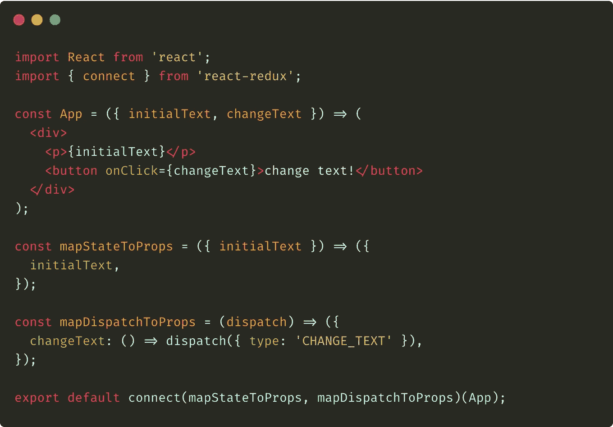
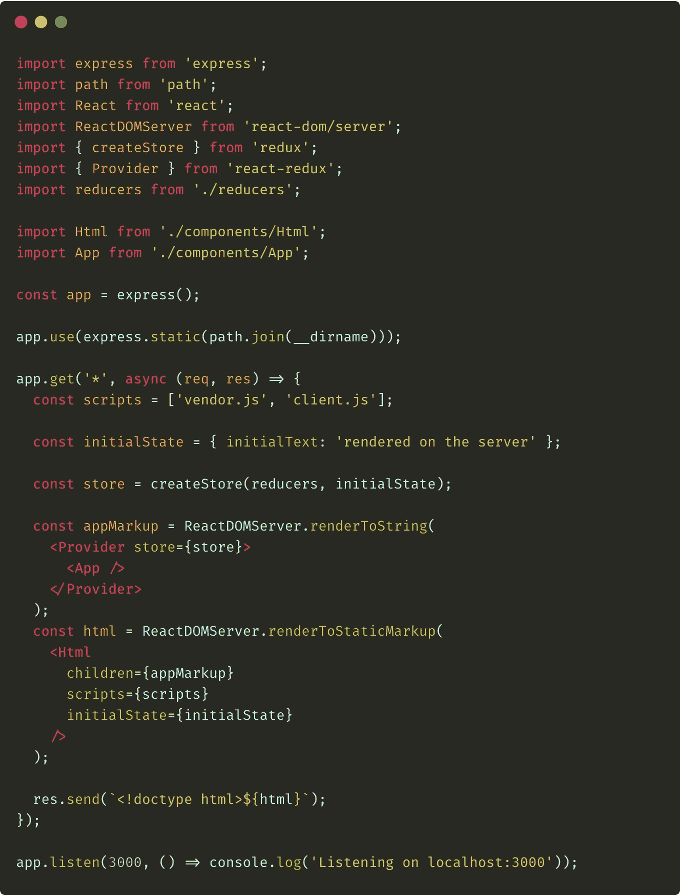

# React-Redux 中的服务器端渲染

> 原文：<https://javascript.plainenglish.io/server-side-rendering-in-react-redux-8d6209fbfed?source=collection_archive---------2----------------------->

## 如何在服务器和客户端处理 Redux 存储？

欢迎阅读我关于 React 中**服务器端渲染的系列文章的第三部分。[上一次我已经描述了](https://medium.com/javascript-in-plain-english/server-side-rendering-in-react-expressjs-8a87af0edba4)如何配置在服务器和客户端渲染的项目。今天，我们将尝试在前面的示例中添加 Redux。**

> 我假设你知道 Redux 的基本知识，所以我不会花时间描述它。如果你不熟悉 [Flux](https://facebook.github.io/flux/) 架构的概念和 [Redux](https://redux.js.org) 本身，请查阅其[官方文档](https://redux.js.org/introduction/getting-started)。

# 软件包安装

首先，在我们开始配置我们的应用程序在服务器和客户机上使用 Redux 之前，我们必须安装两个包:

Add redux and react-redux packages

`redux`包只包含 Redux 库。`react-redux`依赖将帮助我们连接 Redux 和 React 组件。

# reducer+App 组件的变化

现在我们已经安装了所有必要的包，我们可以继续向我们的项目添加 Redux。让我们从添加 reducer 开始——为此，我将`reducers`文件夹添加到了`src`目录中，并将`index.js`文件放入其中。请看看这个文件的内容:

The reducers/index.js file

以上减速器只处理一种动作类型: **CHANGE_TEXT** 。它改变了`initialText`状态属性的值。接下来要做的事情是修改`App.js`组件代码，以调度按钮点击时的动作。我们可以这样做:

The amended App.js component

如您所见，我们已经完全摆脱了组件的内部状态。这是因为从现在开始，我们将在 Redux store 中全局保存状态**。得益于从`react-redux`包导入的`connect`函数，可以将状态属性(`mapStateToProps`方法)和方法分派动作(`mapDispatchToProps`函数)注入组件的`props`对象。**

# 服务器端配置

现在是时候对我们的解决方案的服务器部分做一些改变了。请看下面修改后的`server.js`文件:

The modified server.js file

好，让我们分析一下这里发生了什么变化。首先，请看一下导入部分:我们从`redux`包中导入了`createStore`方法；来自`react-redux`库的`Provide`组件和我们几分钟前刚刚添加的`reducers`。

现在，请看看我们如何使用它们。通过调用将`reducers`和`initialState`作为参数传递的`createStore`函数，我们创建了用`initialState`对象初始化的 Redux 存储。接下来要注意的是，我们用`Provider`组件包装了`App`组件。我们还通过组件的属性将已经创建的 Redux 存储传递给这个组件。由于这个原因，我们在`App.js`文件中使用的`connect`函数可以访问商店。

还请注意，我们仍然将`initialState`对象作为`Html`组件的属性进行传递。正如您马上会看到的，我们在客户端仍然需要它。

# 客户端配置

正如您可能预期的那样，最后要做的事情是修改客户端代码。请看下面的`client.js`文件:

The modified client.js file

我们在这里导入了与在`server.js`文件中相同的三样东西。然后，我们还创建了商店，将`reducers`作为它的第一个参数。这里唯一的区别是我们传递给`createStore`函数的初始状态——它是从存储在`APP_STATE`对象中的值创建的对象。因此，我们使用相同的机制在服务器和客户端之间共享初始状态。

当然，我们在这里做的最后一件事是将已经创建的 store 对象作为包装`App`组件的`Provider`组件的属性进行传递。这样，客户端 React 组件**中使用的所有`connect`方法也可以访问**存储。

# 摘要

今天就到这里。我认为将 Redux 添加到服务器端渲染的 React 应用程序中是非常简单的。我们只需要创建存储两次，第一次是在服务器上，然后在加载客户端脚本时再次创建。我们也必须共享初始状态，但是我们可以使用**相同的机制**来实现，就像前面的例子一样，不需要使用 Redux。

> 我们今天讨论的例子是我的 GitHub 存储库中的。**我鼓励你克隆它，自己玩。**

我想，现在我们已经了解了很多关于服务器端渲染的知识，但这还不是我系列的结尾！在下一篇文章中，我将向您展示如何将 [react-router](https://reacttraining.com/react-router/web/guides/quick-start) 添加到我们的示例中。

**P.S.** 本文是关于使用 React 进行服务器端渲染的系列文章的一部分。请参阅以下系列的所有项目列表:

*   [反应中的服务器端渲染-简介](https://medium.com/@bartomiejdybowski/server-side-rendering-in-react-an-introduction-55f4c7fa274b)
*   [React-express . js 中的服务器端渲染](https://medium.com/@bartomiejdybowski/server-side-rendering-in-react-expressjs-8a87af0edba4)
*   [React-Redux 中的服务器端渲染](https://medium.com/@bartomiejdybowski/server-side-rendering-in-react-redux-8d6209fbfed)
*   [反应-反应-路由器中的服务器端渲染](https://medium.com/@bartomiejdybowski/server-side-rendering-in-react-redux-ab0af31c9c4b)
*   反应中的服务器端渲染—处理真实数据