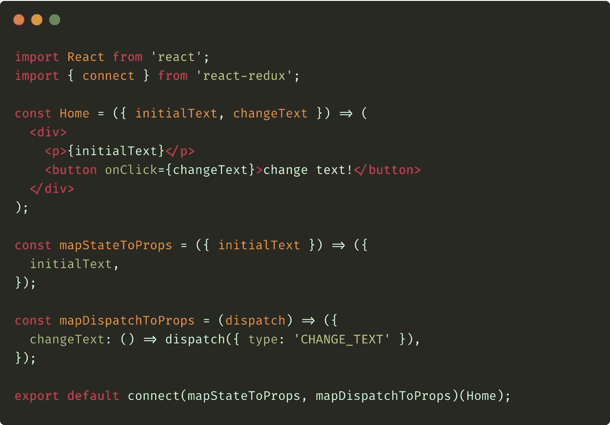
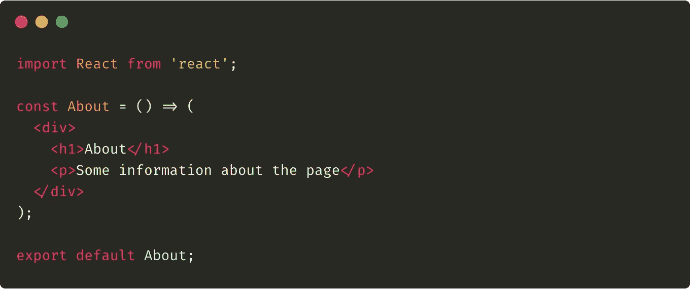
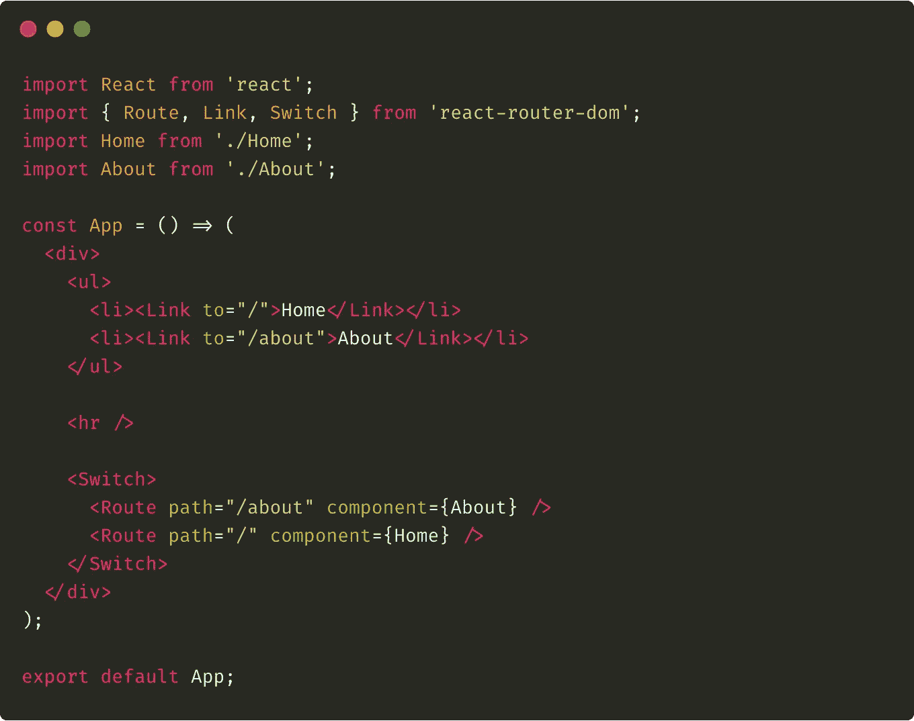
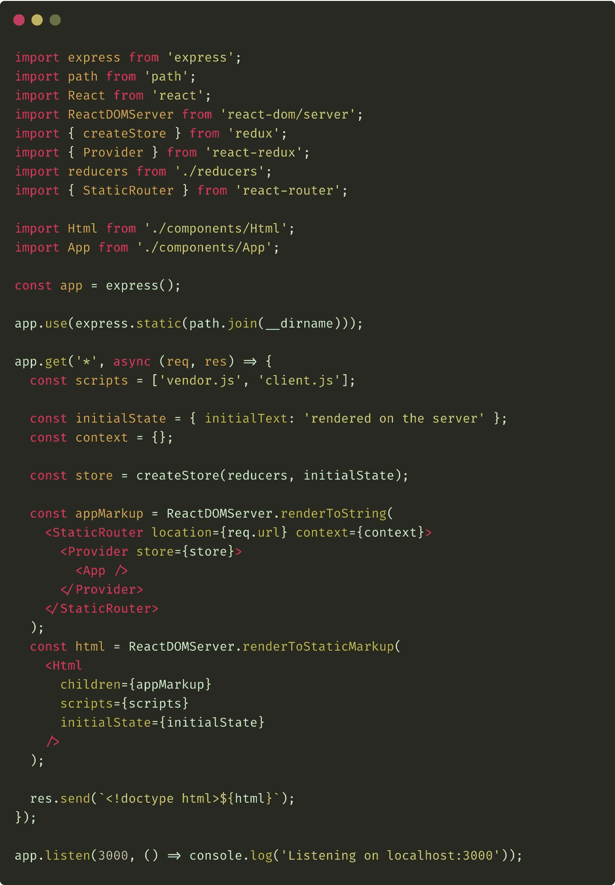
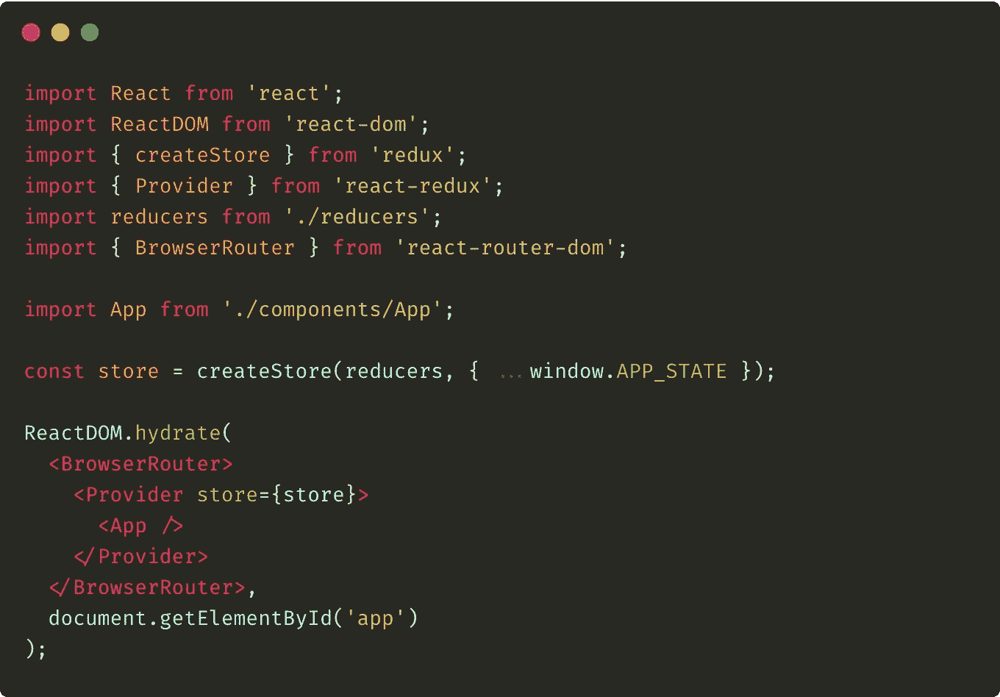

# React-React-router 中的服务器端渲染

> 原文：<https://javascript.plainenglish.io/server-side-rendering-in-react-redux-ab0af31c9c4b?source=collection_archive---------2----------------------->

## 如何将基于 react-router 库的路由添加到服务器呈现的 react 应用程序中。

在我的“React 中的服务器端呈现”系列文章中，我已经描述了如何配置一个应用程序在服务器和客户机上呈现。我还向[展示了如何将 Redux](https://medium.com/javascript-in-plain-english/server-side-rendering-in-react-redux-8d6209fbfed) 添加到服务器渲染的应用程序中。**今天，我们将通过路由丰富我们的示例。**为此，我们将使用 [react-router 库](https://reacttraining.com/react-router)，因为它是 react 生态系统中最流行的路由解决方案。

> 在我以前的 SSR 文章中，我假设您已经熟悉了 react-router 库。如果没有，请看看这个伟大图书馆的文档。

# 软件包安装

在今天的文章中，我们将继续我前两篇文章中已经创建的代码。在我们开始修改我们的例子之前，让我们安装`react-router-dom`包。我们可以使用以下命令来实现:

Add the react-router-dom package

上面的命令和`react-router-dom`一起，也安装了`react-router`库，这在我们的例子中很有用。

# 组件结构变化

现在我们已经安装了所有必要的包，我们可以继续对我们的应用程序进行修改。我们的计划是将我们的`App.js`组件重命名为`Home.js`，并在`/`路线中使用它。我们还将添加`About.js`组件，并在`/about`路径中使用它。然后我们将创建新的`App.js`组件，它将是我们应用程序的根 React 元素，也是路由配置的地方。在本文的后面，我们将对在服务器和客户机上呈现我们的应用程序的代码进行修改。

## 主页和关于组件

让我们从将`App`组件的名称改为`Html`开始——实际上，我们所要做的就是用**来重命名**组件函数和文件。请查看以下修改后的代码:

Home.js

现在，让我们创建`About.js`组件。它可以按如下方式实现:

About.js

如您所见，它是一个简单的组件，只呈现一些静态信息。出于示例目的，我不需要它更复杂，也不需要它与 Redux 连接。

## 应用程序组件和路由配置

对于`/`和`/about`路径，将分别显示`Home.js`和`About.js`组件。我们将在即将添加的`App.js`组件中配置它:

App.js

上面的代码非常简单——它只是呈现链接列表以使导航更容易。它还使用`react-router-dom`封装的`Switch`和`Route`组件来配置我们的路由。

# 对服务器端呈现代码的更改

好了，所有组件结构的必要改变都完成了。现在，让我们转到在服务器上执行渲染的`server.js`文件。

我们想在这里实现什么？当用户在浏览器中打开我们的应用程序的一个路径时(或者只是刷新页面)，我们的服务器应该呈现正确的组件树并将其发送到浏览器。

请参见下面对`server.js`文件所做的更改:

server.js

实际上，我们没有做太多的改变。在上面的代码中首先要考虑的是`StaticRouter`组件的导入。请注意，它是从`react-router`(不是`react-router-dom`)包中导入的。

现在，请看看我们是如何使用这个组件的——我们刚刚用`StaticRouter`组件包装了传递给`renderToString`方法的组件。为了让它起作用，我们必须给它的参数分配两件事。首先，也是最重要的，我们已经将`req.url`值赋给了`location`属性。得益于此，react-router **将能够将来自浏览器地址栏的路由与在`App.js`组件中分配给该路由的合适组件进行配对**。

`StaticRouter`组件需要的第二个属性是`context`。我们在其中传递了一个空对象。该对象将被添加到为匹配路线渲染的组件的`props`对象中。这样，我们可以在渲染时向该组件提供一些附加信息。

# 客户端呈现代码的更改

最后(但并非最不重要)要做的事情是改变客户端代码的呈现方式。让我们稍微修改一下`client.js`文件:

client.js

如您所见，我们在这里所做的所有更改都非常简单。我们刚刚从`react-router-dom`包中导入了`BrowserRouter`组件。接下来，我们用它包装了现有的组件树。

仅此而已——我们的路由在服务器和客户端上都有效！

> 可以通过运行这个项目来测试:`*yarn start*`；以及访问 [http://localhost:3000](http://localhost:3000) 地址。

# 摘要

将`react-router`引入到服务器端渲染 React 项目中，正如你已经看到的那样，**相当容易。在本系列的下一篇文章中，我将向您展示如何在这种类型的应用程序中处理从外部 API 获取的数据。这样，我们将涵盖 SSR 主题的所有重要方面，并完成整个系列。**

> 我们今天讨论的例子是我的 GitHub 库中的[。我鼓励你克隆它，然后自己玩。](https://github.com/burczu/react-router-server-side-rendering-example)

**附言**本帖是关于使用 React 进行服务器端渲染的系列文章的一部分。请查看以下系列所有项目的列表:

*   [React 中的服务器端渲染—简介](https://medium.com/@bartomiejdybowski/server-side-rendering-in-react-an-introduction-55f4c7fa274b)
*   [React-express . js 中的服务器端渲染](https://medium.com/@bartomiejdybowski/server-side-rendering-in-react-expressjs-8a87af0edba4)
*   [React-Redux 中的服务器端渲染](https://medium.com/@bartomiejdybowski/server-side-rendering-in-react-redux-8d6209fbfed)
*   [React-React-router 中的服务器端渲染](https://medium.com/@bartomiejdybowski/server-side-rendering-in-react-redux-ab0af31c9c4b)
*   React 中的服务器端渲染—处理真实数据

**用简单的英语写的 JavaScript 的注释:**我们总是对帮助推广高质量的内容感兴趣。如果你有一篇文章想用简单的英语提交给 JavaScript，用你的中级用户名发邮件到[submissions@javascriptinplainenglish.com](mailto:submissions@javascriptinplainenglish.com)给我们，我们会把你添加为作者。