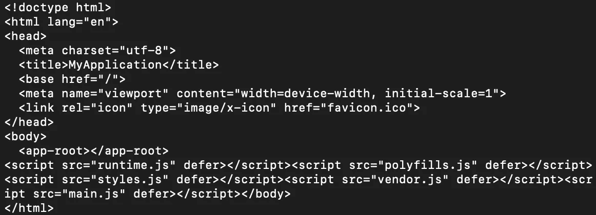
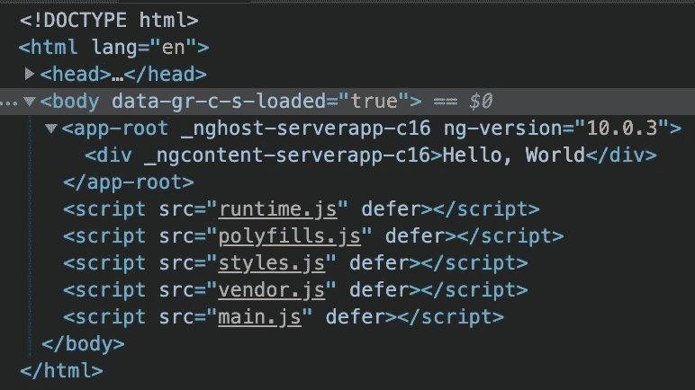
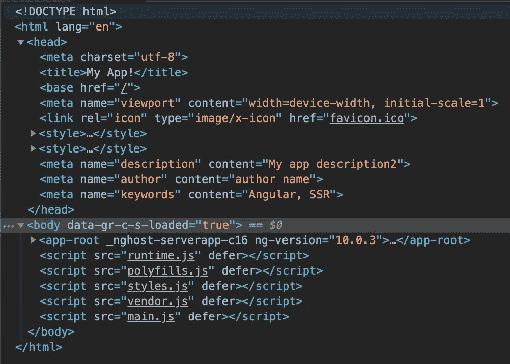
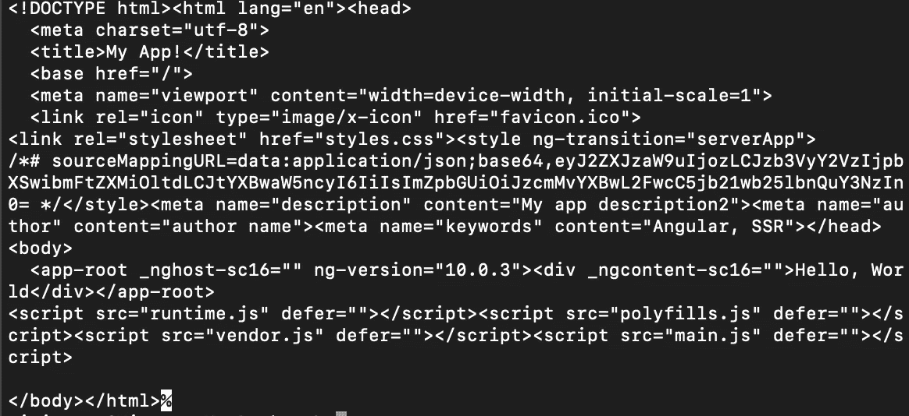

# 角度应用中的服务器端渲染(SSR)

> 原文：<https://javascript.plainenglish.io/server-side-rendering-ssr-in-angular-applications-f3f141e44ebf?source=collection_archive---------4----------------------->


Photo by [Taylor Vick](https://unsplash.com/@tvick)

## 服务器端呈现和客户端呈现

默认情况下，Angular 应用程序依赖浏览器来编译所有代码。即使这是行为，也有办法改变这一点。您可以将应用程序更改为在服务器上编译，而不是在客户端的浏览器上编译。

这个讨论归结为客户端渲染(CSR)和服务器端渲染(SSR)。在本文中，我将介绍什么是 SSR 和 CSR，它们的优缺点，以及如何将您的应用程序转换为 SSR。

简单来说，CSR 依靠客户端的浏览器来编译代码。另一方面，SSR 依赖于服务器来编译代码，然后将编译好的代码返回给客户端。

众所周知，软件开发中的任何问题都没有完美的解决方案。和其他事情一样，这两种选择各有利弊。

## 让我们从一个例子开始

首先，从创建一个角度应用程序开始。您可以通过运行下面的命令`ng init my-application`来做到这一点。

之后，通过运行`npm run start`启动您的应用程序。

如果您打开终端的一个实例并运行`curl http://localhost:4200`，您将会得到类似这样的结果。



这有什么不好？没什么。如果你看一看，你会发现里面只有`<app-root>`，什么也没有。但是你的页面确实有其他内容，对吗？其余的在哪里？

如果你用浏览器访问这个页面，你会看到完全不同的东西。正如您所看到的，您确实看到了您的`app-root`组件的内容。这是因为浏览器是编译您的应用程序的浏览器。



一些开发者也可能利用 Angular 的 API 进行 SEO 优化。例如，您可以以编程方式设置`meta`或`title`标签。在下面的例子中，您可以为这个页面设置标题和一些 meta 标签。

```
@Component({
  selector: 'app-root',
  templateUrl: './app.component.html',
  styleUrls: ['./app.component.css']
})
export class AppComponent {
  constructor(
    private readonly titleService: Title,
    private readonly meta: Meta) {
      this.meta.addTag({ name: 'description', content: 'My description' });
      this.meta.addTag({ name: 'author', content: 'author name' });
      this.meta.addTag({ name: 'keywords', content: 'Angular, SSR' });
      this.titleService.setTitle('My App!');
  }
}
```

如果您运行这个页面，您将再次检索到以下内容。


另一方面，从浏览器检查 DOM 最终会包含应用程序的所有内容。这包括您在`app-root`组件中添加的 meta 和 title 标签。



如你所见，浏览器是这个过程中能够编译你的 Angular 代码的关键角色。

## SSR 的利与弊

因为代码在服务器中编译，所以对于低性能设备来说这是一个胜利。服务器可以完成所有繁重的工作，因此您的用户设备不必做这些工作。

这种方法的另一个大赢家是搜索引擎优化(SEO)。当搜索引擎抓取你的网站时，你页面的所有内容都会在第一次加载时出现。SEO 和 SSR 配合使用效果更好。

另一方面，如果您预计服务器上会出现高流量高峰，那么您可能最终需要一个性能更高的服务器。这可能最终导致更高的成本，或者，如果您没有考虑这些峰值，在低性能的服务器上。

因为您现在必须添加代码来使您的页面进行 SSR，所以您的代码库将会更加复杂。此外，这会导致更大的代码库。

## 企业社会责任的利弊

CSR 的缺点与 SSR 的优点正好相反。它对搜索引擎优化不友好，性能差的设备不会从中受益，因为它们必须为编译你的页面做所有艰苦的工作。

关于 CSR 的好处，你的应用程序会更简单，因为你不需要更多的代码。除此之外，在使用 CSR 时，前端代码有更多的重用空间。这样做的原因是，如果您有几个跨组件共享的 JavaScript 文件，这些文件将被缓存在浏览器中。

## 将角度应用转换为 SSR

让我们来看一下将您的应用程序转换为服务器端呈现所需的步骤。这是一个非常简单的过程。从 Angular 10 开始，您只需要运行以下命令。

```
ng add @nguniversal/express-engine
```

运行该命令后，您会看到生成了一些文件。如果你去`package.json`，你会看到有新的脚本被添加。这些脚本是`dev:ssr`、`serve:ssr`、`build:ssr`和`prerender`。

如果您想构建并运行您的应用程序，运行`npm run dev:ssr`。您的应用程序将在端口 4200 上运行。

如果您在终端`curl http://localhost:4200`上运行，您将会看到您的页面内容，就好像您是从浏览器中查看一样。服务器端渲染来拯救这里！



既然您的应用程序可以进行服务器端呈现，您就可以利用它现在为您的应用程序带来的所有好处。

根据我的个人经验，我已经注意到在我换成 SSR 的应用上有更好的 SEO 结果。但是，与此同时，我经历了拥有一个高性能 web 应用程序的额外服务器成本。

希望这篇文章能帮助你清楚地了解 CSR 和 SSR 的利弊。尽情享受吧！

## 资源

 [## 有角的

### Angular 是一个构建移动和桌面 web 应用程序的平台。加入数百万开发者的社区…

angular.io](https://angular.io/guide/universal)