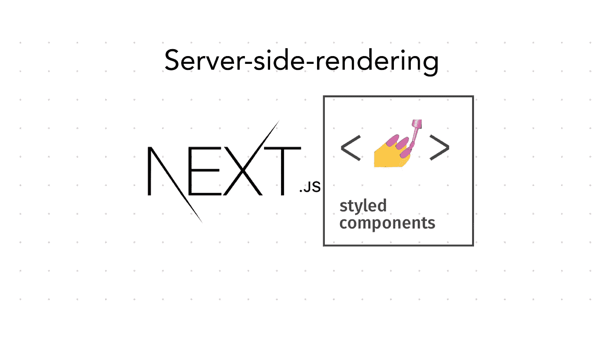
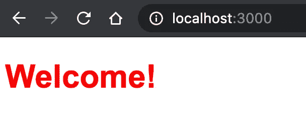
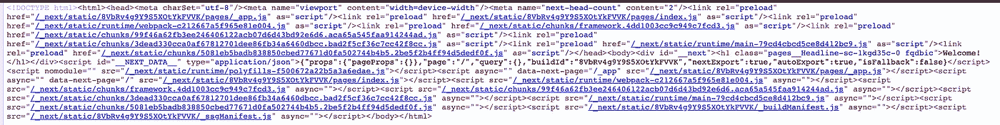
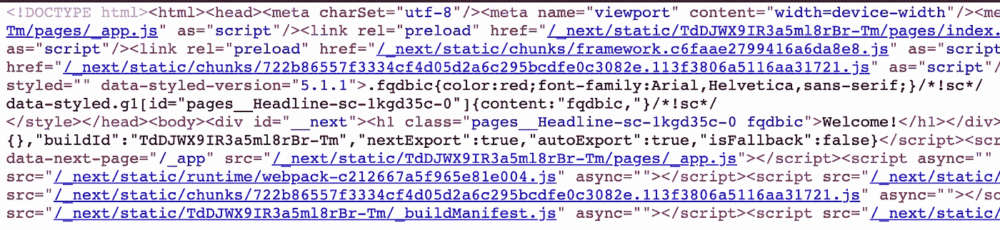

# 使用 Next.js 在服务器端呈现样式化组件

> 原文：<https://javascript.plainenglish.io/server-side-rendering-styled-components-with-next-js-3197e527763b?source=collection_archive---------3----------------------->

## 融合了两个世界的精华



Combining Next.js & styled-components

# 为什么要在服务器端呈现样式化组件呢？

因此，我们应该仔细看看样式化组件，尤其是它实际上是如何工作的。

多亏了这个库，我们可以直接用 JavaScript 编写 CSS 代码。这有很多优点，但是从性能的角度来看是有问题的。

这与传统的客户端渲染存在相同的问题。由于一切都只在 JavaScript 中可用，但浏览器只理解 CSS，而 CSS 可以通过内联样式、样式标签或外部 CSS 文件来集成和理解，因此在执行我们的 web 应用程序时，CSS 是通过执行 JavaScript 直接生成的。

只有在这个过程之后，CSS 代码对于浏览器才是可读的，但不是立即可读的，就像我们简单地在头部区域写 CSS 一样。

所以让我们记住，CSS-in-JS 解决方案总是需要多一个步骤——这当然会对性能产生不良影响，即使影响很小。

这里有一个有趣的关于风格化组件与原生 CSS 的[基准](https://blog.primehammer.com/the-performance-of-styled-react-components/)。

# 让我们首先创建一个新的 Next.js 项目

要将 Next.js 用于样式化组件，我们需要一个新的基本项目。

```
mkdir <project-name>
cd <project-name>npm init -y npm install react react-dom next styled-componentsmkdir pages 
```

确保更新 **package.json，**以便我们可以实际运行和构建我们的项目:

```
“scripts”: {
 “start”: “next start”,
 “dev”: “next dev”,
 “build”: “next build”,
 “export”: “next export”
 }
```

让我们创建 **index.js** 作为我们的开始页面。它应该放在/pages 目录中，该目录是 Next.js 中路由的默认目录。

```
*export* *default* () => (
  <React.Fragment>
    <h1>Welcome!</h1>
    <p>This is our next.js app</p>
  </React.Fragment>
)
```

如果您现在启动开发模式，使用“ **npm run dev** ”，应用程序应该工作正常。

# 让我们实现支持 SSR 的样式化组件

让我们进入有趣的部分，因为我们的基本 Next.js 应用程序已经在运行了。

1.  我们需要实现 Babel，以便能够在服务器上呈现样式化的组件:NPM install-D Babel-plugin-style-components
2.  在这个文件中，我们将 SSR 设置为 true，这意味着我们的样式组件样式将在服务器上呈现。

```
{
  “presets”: [“next/babel”],
  “plugins”: [[“styled-components”, { “ssr”: true }]]
}
```

现在我们可以开始在 Next.js 中使用样式化组件了:

```
*import* styled *from* “styled-components”const Headline = styled.h1`
  color: red;
  font-family: Arial, Helvetica, sans-serif;
`*export* *default* () => (
  <React.Fragment>
    <Headline>Welcome!</Headline>
  </React.Fragment>
)
```

同样，运行开发模式，并使用“npm run build”创建生产版本，并使用“npm start”为其提供服务，这一次，输出将使用样式化组件进行样式化。



The working Next.js app, using styled-components

**但是只有一个问题:**样式化组件的服务器端渲染还没有激活。您可以从服务器的响应和 HTML 文档中不提供 CSS 样式这一事实看出这一点。

运行“npm run build && npm run start”来创建和提供我们的应用程序的构建版本。



Sourcecode of our Next.js app, displayed in the browser

如果您现在进入页面并查看页面源代码，您将看到应用了 h1 的样式，但是它的 CSS 代码在文档中并不直接可用。服务器端呈现仍然被禁用。

为了解决这个问题，我们首先必须包含 **_document.js** 这是我们必须创建并填充 Next.js 的默认文件，以创建一个自定义文档来影响我们 web 应用程序的< html >和< head >部分。

这个文件默认位于 **/pages/_document.js** 下，只在那里工作。我们仍然需要创造它。

幸运的是，在 [GitHub](https://github.com/vercel/next.js/tree/canary/examples/with-styled-components) ，我们发现了一个 Next.js + styled-components 的官方示例，其中 **_document.js** 已经完成。

可以忽略 **_app.js** ，GitHub 上的代码示例里也有。简单地包含样式化组件，这并不重要。只要确保你的 **_document.js** 看起来像这样:

our _document.js

如果我们现在以这种方式运行项目，我们会看到样式化组件实际上是在服务器端呈现的:



CSS Code hardcoded into the HTML

就是这样。

## **简单英语的 JavaScript**

喜欢这篇文章吗？如果有，通过 [**订阅解码，我们的 YouTube 频道**](https://www.youtube.com/channel/UCtipWUghju290NWcn8jhyAw) **获取更多类似内容！**