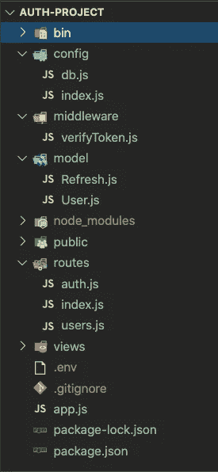
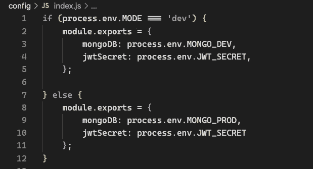
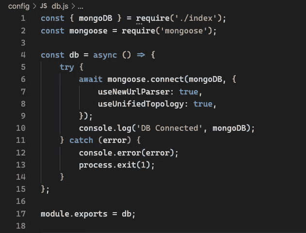
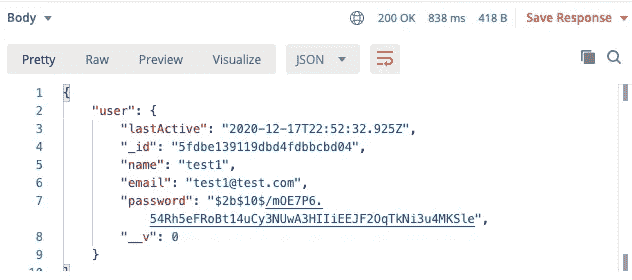
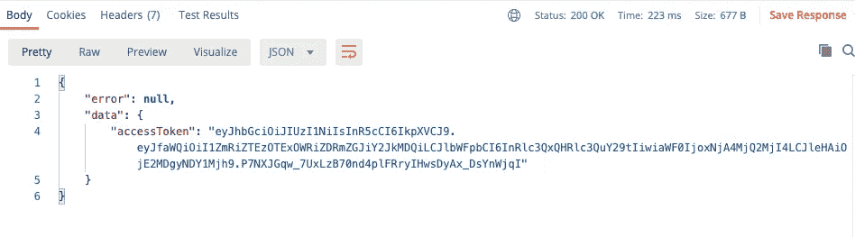
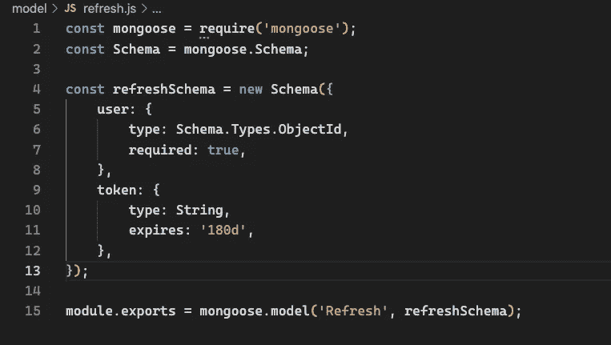
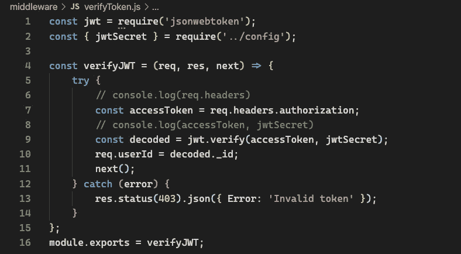
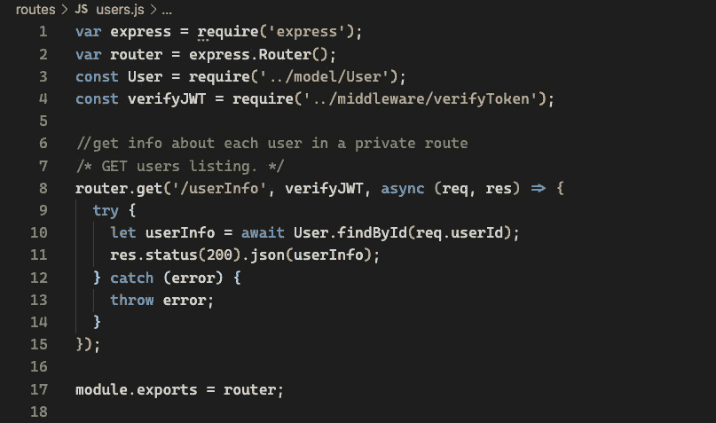
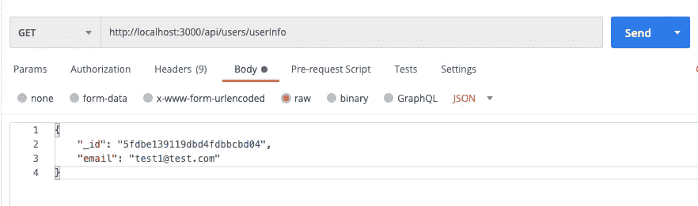
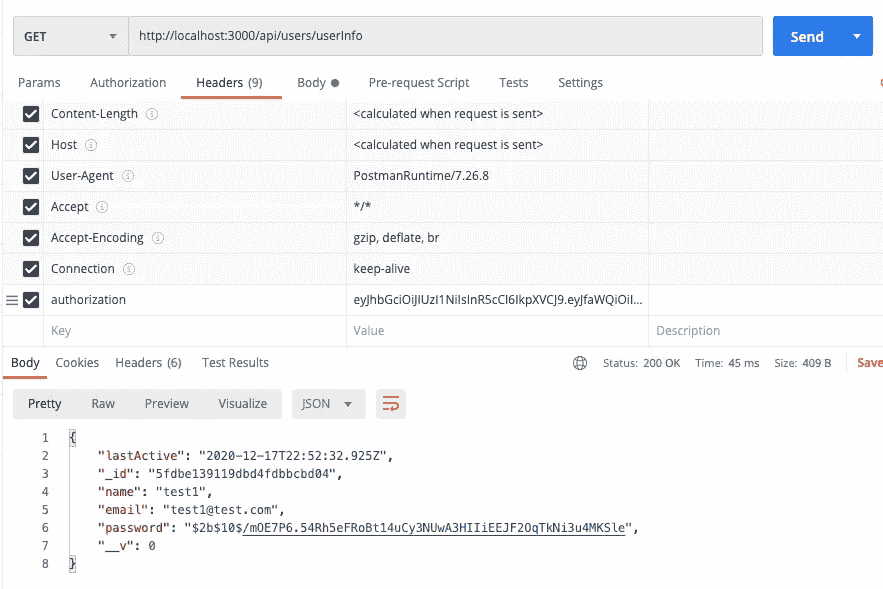

# 节点应用中的服务器端用户认证和授权

> 原文：<https://javascript.plainenglish.io/server-side-user-authentication-and-authorization-in-node-apps-733c387c7103?source=collection_archive---------6----------------------->

在 web 应用程序中，用户注册和后续登录的过程很复杂，有几种实现方式可以使您的应用程序更加健壮和安全。

每个实现都增加了一个抽象层，值得研究一下开发人员在身份验证(验证客户端身份)和授权(授予权限)方面的各种选择。

## **使用的技术**

*   **Express:** 节点 JS 框架，处理 app 路由
*   **Express-validator:** 验证用户凭证
*   Bcrypt: 在将密码保存到我们的数据库之前对其进行哈希处理
*   **Jsonwebtoken:** 生成令牌，用于授权和访问我们的应用程序路由
*   **mongose:**与我们的 MongoDB 数据库交互
*   **Nodemon:** 每次有变化时重启我们的服务器
*   **Dotenv:** 存储我们的环境变量
*   **邮递员:**测试我们的端点

```
//initialize a node project
npx express-generatornpm install bcrypt dotenv express-validator jsonwebtoken mongoosenpm install --save-dev nodemon
```

# 设置您的项目

package.json

```
"scripts": {
  "start": "node ./bin/www",
  "dev": "nodemon ./bin/www"
},
```

将这些添加到您的。gitignore 文件

```
node_modules/
.env
```

在你的。env 文件设置你的变量

```
MODE=dev
MONGO_DEV=mongodb://localhost:27017/auth-project
MONGO_PROD=mongodb://localhost:27017/auth-project-prod
JWT_SECRET=typearandomstringhere
```

# 文件夹结构



# App.js

让我们要求或导入:

*   文件顶部的 dotenv 包，
*   我们的 Mongo 数据库，我们将很快加入
*   auth.route 并在 express generator 模板中为我们的路由修改中间件。

# 设置 Mongo 数据库

创建一个 config 文件夹和两个文件 index.js 和 db.js。之前的 env 文件。



在 db.js 文件中，使用 Mongoose 设置 Mongo 数据库



运行 npm install 并注释掉身份验证路由，因为我们尚未创建它们，这将引发一个错误。

```
// Comment out for now from app.js
line 12 const authRouter = require(‘./routes/auth’);
line 24 app.use(‘/api/auth’, authRouter);
```

在您的终端中，根据您的操作系统，使用命令在新窗口中运行 mongo，并使用以下命令在另一个窗口中运行服务器。您应该在终端中看到“DB Connected MongoDB://localhost:27017/auth-project”

```
npm run dev
```

# 创建用户模型

```
const mongoose = require('mongoose');
const Schema = mongoose.Schema;const userSchema = new Schema({name: {
type: String,
required: true,
},email: {
type: String,
required: true,
},password: {
type: String,
required: true,
},createdOn: {
type: Date,
default: Date.now()
},lastActive: {
type: Date,
default: Date.now()
}module.exports = mongoose.model('User', userSchema);
```

在最后一行 module.exports 之前，我们将添加几行代码。为了散列密码，我们需要使用一个 Mongoose 中间件和使用散列算法的第三方包 Bcrypt。

# 猫鼬中间件

Mongoose 中有许多内置的中间件，其中之一就是。pre hook 允许我们调用一个函数，比如保存一个用户到我们的数据库。

```
schema.pre('save', **async** **function**() {
  **await** doStuff();
  **await** doMoreStuff();
});
```

我们可以在我们的用户模型文件中，在模式级别上使用它。这个中间件是在保存用户文档之前执行的，在我们的例子中，我们希望在将密码保存到我们的数据库之前对密码*进行哈希运算，因为以明文形式保存密码会暴露密码，使其易受黑客攻击。*

我们想调用中间件，第一个参数是“save ”,第二个参数是回调异步函数。这里很重要的一点是，我们*没有*使用箭头函数，因为我们需要访问函数中的“this”关键字。我们使用“this”来访问我们的用户。

```
userSchema.pre('save', async function () {try {
  const user = this;
  user.password = await bcrypt.hash(user.password, saltRounds);}}   catch (error) {
throw error;
}});
```

# 散列密码

为了散列我们的密码，我们使用 Bcrypt。散列函数(与双向加密相反)是一种单向数学算法，使得实际上不可能将散列密码转换为原始数据。

# 加盐密码

为什么我们需要盐？使用哈希，如果多个用户拥有相同的密码，哈希后的字符串输出将是相同的。如果其中一个密码被破解，黑客就可以访问另一个。

```
//Hashing example with no salt
//plaintext: password123$2b$10$wAnm6x2BT1cOtzRULrBueeBsXIKsoz5mEmGieeQShOPc3K3JG.xwq
```

因此，为了防止这种情况，我们在散列密码之前使用“盐”。salt 是附加在密码后面的唯一随机数据。

Bcrypt 为我们做了这件事，我们只需要定义 saltRounds 变量，例如 *const saltRounds =10* 。该数字表示明文密码经过哈希运算的次数。随着循环次数的增加，将密码处理成哈希格式的时间也会增加。在[文档](https://www.npmjs.com/package/bcrypt)中，你可以看到不同的场景，考虑到处理器的成本和用户等待的时间，10 轮是一个很好的标准。

```
rounds=8 : ~40 hashes/sec
rounds=9 : ~20 hashes/sec
rounds=10: ~10 hashes/sec
rounds=11: ~5  hashes/sec
rounds=12: 2-3 hashes/sec
rounds=13: ~1 sec/hash
rounds=14: ~1.5 sec/hash
rounds=15: ~3 sec/hash
rounds=25: ~1 hour/hash
rounds=31: 2-3 days/hash
```

# Document.prototype.isModified()

我们在第 29 行添加的一个重要代码行是。is 修改函数。如果文档被修改，该函数返回 true，我们需要检查这一点，这样我们就不会在每次用户登录时散列密码，而是只在密码被修改时散列密码。

# **验证用户数据**

在我们创建用户并将其保存到数据库中之前，我们希望确保输入的数据格式正确。 [Express validator](https://express-validator.github.io/docs/) 是一个用于服务器端数据验证的 Express 中间件。这是文档中的基本样板文件。

```
**const** express = require('express'); 
**const** app = express();
**const** { body, validationResult } = require('express-validator');

app.use(express.json());app.post('/user', [   
  // username must be an email   
  body('username').isEmail(),   
  // password must be at least 5 chars long   
  body('password').isLength({ min: 5 })
], (req, res) => {   
// Finds the validation errors in this request and wraps them in an object with handy functions   
  **const** errors = validationResult(req);   
  **if** (!errors.isEmpty()) {     
   **return** res.status(400).json({ errors: errors.array() });   
} User.create({     
  username: req.body.username,     
  password: req.body.password   
}).then(user => res.json(user)); 
});
```

# 使用自定义验证器创建注册路由

然而，当构建一个生产应用时，更好的实现是进行用户验证，包括 Regex 和[自定义验证器](https://express-validator.github.io/docs/custom-validators-sanitizers.html)。首先，让我们在 routes/auth.js 文件中创建用户注册路由。

现在，在创建用户并将其保存到数据库之前，我们已经使用了定制验证器。

# 在 Postman 中测试/注册端点并存储用户

(现在我们已经对 auth.js 文件进行了编码，请记住取消我们之前在 app.js 中注释的行的注释)

`POST request: [http://localhost:3000/api/auth/register](http://localhost:3001/api/user/register)`

```
//body-raw-json{
    "name":"test1",
    "email":"test1@test.com",
    "password": "12345abc",
    "passwordConfirmation":"12345abc"
}
```

您应该在 Postman 中得到类似的结果



# 创建用户登录路径

现在，我们的用户集合数据库中已经有了一个用户，让我们创建登录路由，这里我们需要进行与注册路由相同的自定义验证，但需要编写以下三行代码—第 5–7 行。我们添加 Bcrypt 来使用它的 compare 方法检查用户输入的密码是否与数据库中的密码匹配。在此过程中，我们还将使用 JWT 提供一个访问令牌。

在 postman `http://localhost:3000/api/auth/login`中测试这个 POST 请求

```
"name":"test1",
    "email":"test1@test.com",
    "password": "12345abc",
    "passwordConfirmation":"12345abc"
}
```

您应该在响应中获得访问令牌



# 访问令牌和刷新令牌

最后一个重要的实现要求我们在登录路径中为刷新令牌添加几行代码。

访问令牌和刷新令牌之间的区别在于，刷新令牌的生命周期比访问令牌长得多。例如，我们可以将访问令牌的有效期设置为 5 分钟，而将刷新令牌的有效期设置为 6 个月。

访问令牌授予对存储在资源服务器中的资源的访问，而刷新令牌每当到期时授予新的访问令牌。访问令牌通常具有较短的寿命，这限制了潜在黑客访问资源的时间。刷新令牌由单独的授权服务器发布。

# 创建刷新令牌模型



# 创建一个中间件来验证令牌

在我们的中间件文件夹中，让我们在 verifyToken.js 文件中编写一些代码来验证用户。我们从客户端请求头中获取 accessToken。然后我们使用 jwt.verify 方法。检查拼写是否是 headers 而不是 header，否则无法工作。



# 为经过验证的用户创建一条专用路线

在 routes 文件夹中创建一个新文件 users.js，为经过验证的用户设置一个私有路径。在这里，我们在获取用户信息之前使用 verifyJWT 作为中间件。



# 在登录路由中实现刷新令牌

这是我们最终的 auth.js 文件，我们在其中导入刷新模型和加密模块以使用它的。randomBytes()方法**。**该方法生成一个加密安全的随机数据。

让我们在邮递员那里检查这个。将这个设置为 GET，url 为[http://localhost:3000/API/users/userInfo。从上一个 post 请求中获取 _id。](http://localhost:3000/api/users/userInfo.)



现在，在 Headers 选项卡中创建一个名为 authorization 的新键，并粘贴我们之前获得的访问令牌的值。如果一切正常，您应该获得用户数据作为响应。



# 结论

实现了这一点，值得注意的是，作为开发人员，我们还有其他选择，例如使用 Passport(一种用于节点或服务的认证中间件，如 Auth0)。然而，事先了解这些过程是如何工作的是有好处的。