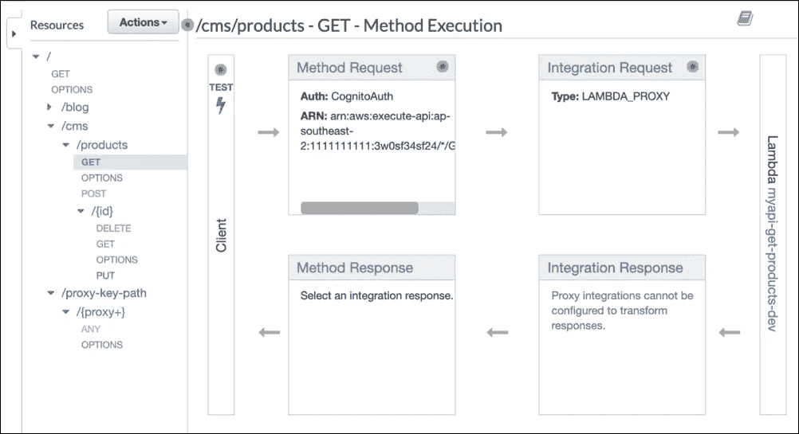
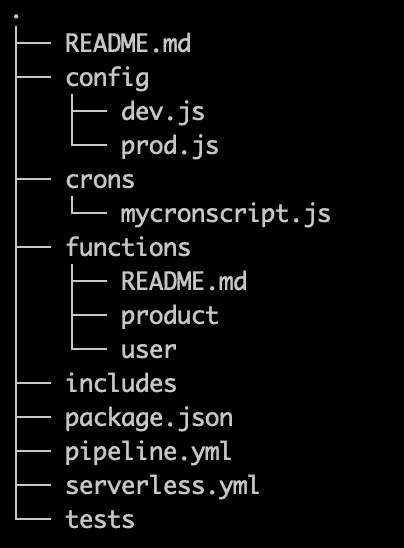

# 在您的团队中实施无服务器的 6 个技巧和诀窍

> 原文：<https://javascript.plainenglish.io/serverless-learn-how-to-get-it-into-your-team-without-making-them-aws-cloud-architect-experts-72409c64717?source=collection_archive---------5----------------------->

Image taken from Microsoft’s blog ([https://devblogs.microsoft.com/devops/cloud-hosted-mac-agents-for-ci-cd-pipelines/](https://devblogs.microsoft.com/devops/cloud-hosted-mac-agents-for-ci-cd-pipelines/))

无服务器架构已经吸引了许多公司和开发人员的注意，因为它声称，除了其他事情之外，还可以提高生产率和减少(如果不是消除的话)服务器的可维护性。然而，正如许多其他好的解决方案一样，有一个复杂因素一直阻碍着公司的发展:它仍然需要云架构和代码设计方面的大量专业知识。

不存在跳过理解云概念这一步的魔法(据我所知没有),但是，尽管仍然需要至少一名团队成员掌握这方面的知识，但有一些方法，如代码责任和聚合、工具探索、环境配置、测试和知识共享，将允许团队中的每个人在不掌握模糊的云世界的情况下进行代码更改。

*无服务器架构的概念是让应用程序在没有服务器的情况下运行。自然，应用程序需要在服务器上，但是在这种情况下，服务器不在范围内(实际上是未知的),它由云提供商管理。因此，不再需要对可扩展性或可用性进行复杂的管理。Serverless 也是一个* [*开源框架*](https://github.com/serverless/serverless) *由开发者搭建，由* [公司](https://serverless.com/) *维护，提供管理 serverless apps 的工具。*

**1。探索云提供商接口或网站以构建 API**

虽然通过提供商的接口创建应用程序违背了无服务器框架的目的(它正是为了自动化这项任务)，但它有助于可视化构建应用程序所必需的部分、组件和资源——更不用说云结构很可能从一个提供商到另一个提供商发生变化。更容易理解，例如，一个 Api 网关有一个包含一个或多个调用 lambda 的方法的路径，如果你能可视化整个应用程序的话。纵观全局有助于理解在哪里配置身份验证、缓存、方法或项目中可能需要的任何其他东西。

API Gateway resource details from AWS management console

此外，这种方法可以用于在现有项目中实现任何新的组件或资源。想象一下，有一个创建代理集成的新需求，甚至不知道它是什么，或者提供商的解决方案是什么。最好的方法是通过提供商的接口进行 POC，然后在验证其功能和局限性后，考虑编写代码模板。

因为这项任务不一定只限于一个人，所以创建一个隔离的区域(可能是一个实验室)是很重要的，在这个区域中，团队可以在不破坏或“污染”当前开发环境或不影响任何其他应用程序的情况下进行探索云工具的不同尝试。

目标是在早期阶段，通过提供商的控制台构建应用程序，并在架构转换到无服务器框架后，从他们的界面获得一个可比较的参考。换句话说，通过控制台创建，然后通过无服务器部署构建，最后比较输出。

**2。汇总责任并相应编码**

这是使项目易于与任何团队成员交互的最重要的部分。这个想法是基于第一条[坚实的](https://dev.to/annalara/solid-programming-part-1-single-responsibility-principle-1ki6)原则，尽管听起来很明显，但有时很容易被忽略。一般来说，项目可以分为两类:云结构和代码。

无服务器云结构是通过一个 [yml 文件](https://serverless.com/framework/docs/providers/aws/guide/serverless.yml/)定义的，它应该包含与应用程序云结构相关的信息。框架将使用这个文件来构建(在部署之前，有一个步骤，框架将编写的代码转换成一个更加混乱的云结构)云应用程序，然后将其推送到云，所以基本上这些信息只用于构建您的应用程序。

关于代码，因为它更广泛，所以它可以聚集在子类别中，例如函数、包含/公共、测试、crons、配置等。它不仅会引导开发团队知道信息在哪里，还会分离代码。它将作为一个路标，把他们引向正确的道路，并使他们更加意识到他们的变化的后果。每个文件夹的 readme.md 文件和代码注释也会非常有用。

Project structure example

**3。允许开发者在本地运行项目**

这听起来可能是显而易见的，但是考虑到无服务器是一个基于云的架构，这很容易让人认为有必要将应用程序放在云上，以便测试它，甚至验证新实现的功能。然而，由于将代码更改推送到云需要时间和精力，因此在推之前，允许团队在本地检查/验证他们的代码是很重要的。这实际上会给人一种非无服务器应用程序的感觉，不仅会提高生产率，还会让团队在代码发布之前发现问题。

理想情况下，要在本地启动应用程序，只需要两个命令:“npm install”和“npm start”。

有一个插件叫 [serverless-offline](https://github.com/dherault/serverless-offline) ，允许本地模拟 serverless api app。

**4。正确配置环境**

开发例程中常见的事情是切换到不同的环境(dev，stag)或更改配置文件中的信息，如果没有正确地组织，很快就会变得一团糟。为了避免这个问题，建议创建配置文件，并根据 Stage 通知的值使用它们。想象一个需要配置 URL 和授权者的代理集成端点。这两个信息可以在配置文件中设置，并在无服务器模板中引用。如果有新版本的 URL 或授权者，这将使团队更直观地进行更改。

在 yml 文件中，您可以导出配置值，并使用它们来更改云结构中的信息，如下所示:

> 自定义:${file(。/config/${opt:stage，' dev'}。js)}

在您的代码中，类似于:

> const config = require(` d../config/$ { STAGE } `)；

这不仅允许根据环境改变架构(数据库名称、lambda 超时、环境变量、本地主机端口等)，还允许在整个代码中动态注入不同的值(第三方访问键、URL、密钥等)。尽管 Serverless 使用参数“stage”，但这与在 Nodejs 中使用模块“config”的方法类似。请记住，如果项目开始变得太大，配置文件开始变得太复杂，那么可以将它分成两类:模板和代码。

即使这些是最常见的场景，配置领域还可以更进一步。考虑一个白标应用程序，其中每个客户端都有一个独特的配置。在这种情况下，每台客户机都有一个针对每个环境的配置。

如果可能的话，团队应该能够轻松地在不同的环境、配置值或客户端之间进行本地切换。

**5。使用测试来授权团队**

测试，就像在每一个产品中一样，给予团队信任:即使已经进行了更改，测试也将验证应用程序的整体行为，并在出现问题时发出通知。众所周知，测试不能保证 100%的失败，但它给团队带来了安慰。它们不仅增强了团队的能力，而且当被包含在 CI/CD 管道中时，还为团队带来了价值，考虑到如果有任何失败，它将阻止代码部署。

重要的是要理解这不是一种鼓励团队不顾后果地编写大量代码的方法，而是给他们信心，让他们能够做出改变并在本地验证他们的行为。

**6。在团队中分享知识**

虽然很少有人只将代码修订视为代码验证的一种方式，但它是团队间共享知识的一种强有力的方式。不要让一个人做代码审查，而是让团队中的每个人都验证代码，结果是，知道已经实现了什么。这不仅会促进团队发展，还会防止一些团队成员在假期接到电话，因为没有其他人能够处理一些情况。

显然，这是一个如何在项目开发过程中分享经验教训的例子，但重要的是要了解什么对团队更有效，并建立一个能给每个人带来价值的过程。有些人更喜欢代码注释、文档、结对编程或代码共享，这些都是提高团队技能的有效方式，因此团队必须选择对他们更好的方式。

**结论**

无论应用程序类型如何，大多数项目通常都包含诸如身份验证(访问验证)、控制器(业务逻辑)、模型(用于数据库访问)、脚本(用于计划执行或自动化)、测试(用于 CI/CD)等模块，除了在普通环境中实现它们已经很复杂这一事实之外，无服务器实现不仅需要这方面的知识，还需要了解如何将这些模块转换到云架构。

尽管它看起来可能太复杂而无法实现，但无服务器不仅可以添加到任何公司，而且可以由任何类型的开发人员处理，无论他们是否掌握云架构。关键是要确保项目以一种可以直观开发的方式进行组织，并且有一些设施，如测试、文档、适当的配置和隔离的环境，这将给予团队信任和鼓励，让他们做他们最擅长的事情。

**词汇**

**DB** :数据库
**CI/CD** :连续交付/连续交付(或部署)
**stage** :是在无服务器框架上用来定义应用环境的参数。例如，它可能是 dev 或 prod 之类的东西。
**POC** :概念证明。肤浅地尝试某事以理解其适用性。