# 无服务器 NestJS:用 Swagger 和 AWS API Gateway 记录您的 API

> 原文：<https://javascript.plainenglish.io/serverless-nestjs-document-your-api-with-swagger-and-aws-api-gateway-64a53962e8a2?source=collection_archive---------0----------------------->

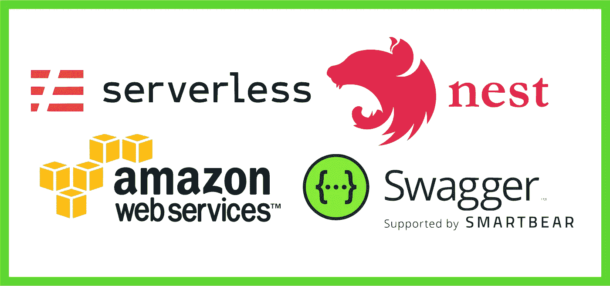

将文档添加到你的 API 中对于与你的团队或者你的客户分享它是非常重要的，有时候创建这个文档的过程需要花费很多时间，我们通常把它留到项目结束。

我强烈建议在创建端点时编写 API 文档。

怎么会？昂首阔步。

# **什么是霸气？**

> 借助 Swagger 开源和专业工具集，为用户、团队和企业简化 API 开发。了解 Swagger 如何帮助您大规模设计和记录您的 API。

[https://swagger.io](https://swagger.io)

所以 Swagger 使得编写 API 文档的过程更加容易。我们将与 Swagger 合作，在 AWS 的 API 网关中生成文档。

我强烈建议您阅读我以前的文章，创建您的 AWS 帐户并部署您的无服务器应用程序以保持工作。

[](https://medium.com/javascript-in-plain-english/nestjs-serverless-app-with-mongodb-atlas-e8dec9ae7405) [## 使用 MongoDB Atlas 的 NestJS 无服务器应用程序

### 无服务器是创建和部署应用程序的一种经济有效的方式

medium.com](https://medium.com/javascript-in-plain-english/nestjs-serverless-app-with-mongodb-atlas-e8dec9ae7405) 

我们将在 NestJS 中使用 Swagger，所以这里是创建文档的文档。有如此多的装饰器可以用来记录我们的无服务器应用程序。

这一点很重要，因为当您创建一个 NestJS 无服务器应用程序时，与纯 Javascript 无服务器应用程序不同，sls deploy 命令只创建 1 个端点/dev/{proxy+}，所以这是促使我创建这篇文章的原因，我们需要记录与我们的 NestJS 无服务器应用程序相关的所有端点。

[](https://docs.nestjs.com/openapi/introduction) [## 文档| NestJS——一个渐进的 Node.js 框架

### OpenAPI 规范是一种语言无关的定义格式，用于描述 RESTful APIs。Nest 提供了一个…

docs.nestjs.com](https://docs.nestjs.com/openapi/introduction) 

# 我们开始吧！

首先，我们需要将 swagger 添加到我们的应用程序中，命令如下:

```
npm install @nestjs/swagger
```

所以一旦你安装了 swagger(你可以在你的 package.json 中检查它),我们需要记录我们的“/hello”端点:

我们需要进行一些进口，这里有一个例子:

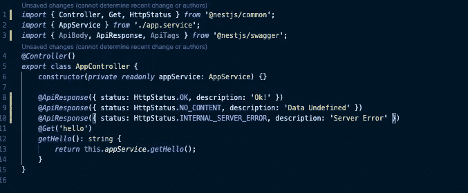

我们在这里使用了一个装饰器“@ApiResponse()”，这个装饰器指示了我们的端点将使用 GET 给我们的不同响应。

我们还需要在 main.ts 文件中进行一些更改，以生成我们的 api 端点。(我们已经在上一篇文章中生成了这个文件)。

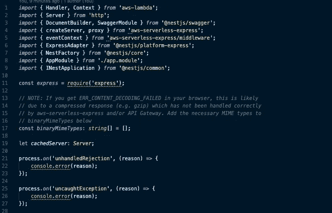

神奇的是，我们需要添加这个“setupSwagger()”函数，这个函数为我们的 API 创建实例并完成所有工作。那么我们也需要修改我们的处理程序。基本上，我们将 swagger-ui 重定向到/api。这将完成查看我们的 api 的所有工作。

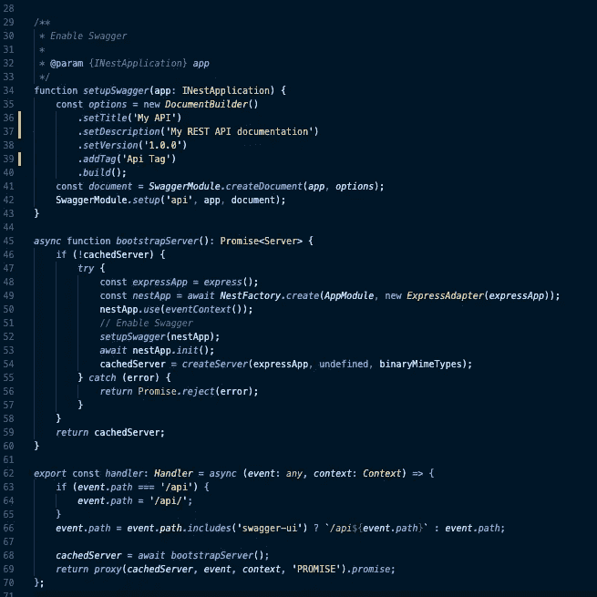

# 无服务器. yml

显然，我们还需要修改我们的 serverles.yml 文件，我们需要向我们的文件添加一个名为“custom”的新部分，通常这个部分用于添加一些环境变量名和运行我们的应用程序可能需要的其他配置。

```
custom: optimize: external: ['swagger-ui-dist']
```

小心点，缩进很重要，如果你在用 Visual Studio 编码，我强烈建议你使用更漂亮的插件。

您的文件应该如下所示:

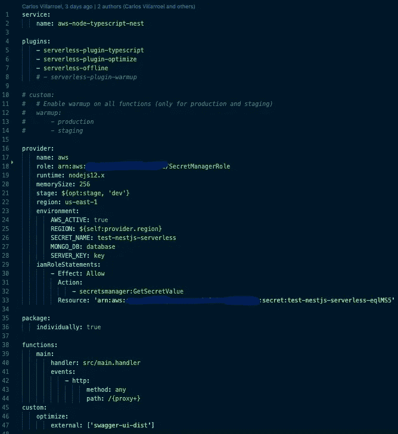

# 让我们部署并测试

现在是重新部署应用程序和启动 api 的时候了。

```
sls deploy
```

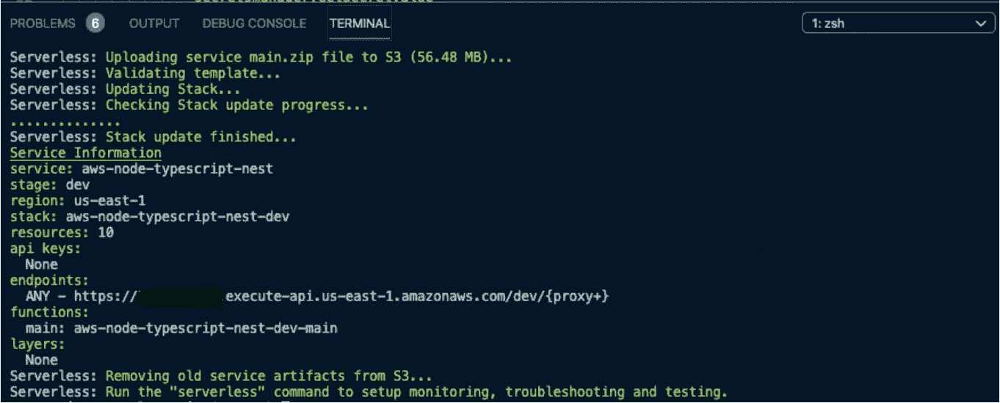

如果一切如预期进行，您应该会看到您的应用程序端点。复制端点并用/api 替换/{proxy+}。

[**https://YOUR-API . execute-API . us-east-1 . amazona ws . com/dev/API**](https://YOUR-API.execute-api.us-east-1.amazonaws.com/dev/api)

干得好！这是您的 NestJS 无服务器 API 页面，您可以单击端点，查看响应，甚至尝试端点。

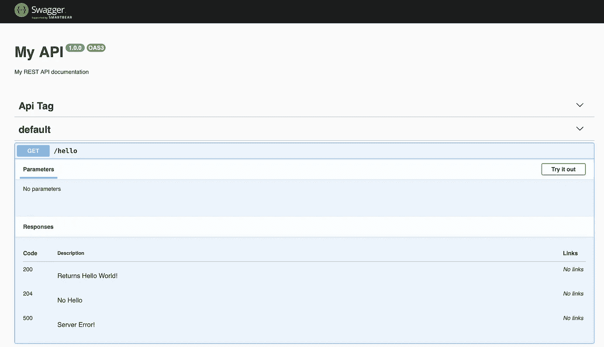

**重要:如果你点击试用是行不通的，这很重要，因为我们正在 dev 上部署我们的 api，所以端点应该是 dev/hello。如果您想在 dev 上试用，您需要修改 main.ts.** 中的 event.path

# 在 AWS API 网关中生成 API 文档

我们终于到了！现在是时候在 AWS API Gateway 中生成我们的文档并与我们的队友或客户共享了。

这里的技巧是，如果你去你的 API 端点，并在它的末尾添加“-json”，你将会收到你所有的在 json 中的 API Swagger 文档。

https://YOUR-API . execute-API . us-east-1 . amazonaws . com/dev/API-JSON

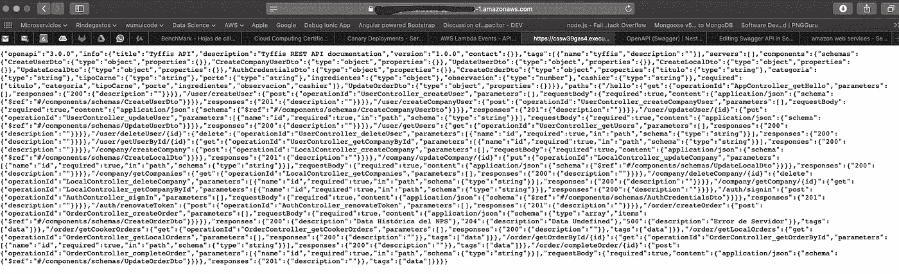

所以，如果你复制了 JSON，然后转到斯瓦格编辑器

 [## 斯瓦格编辑

### 编辑描述

editor . swag . io](https://editor.swagger.io) 

粘贴您的 JSON 您将从您的端点看到完全相同的页面，在这里您可以直接修改您的文档，但是我强烈建议在您的代码上这样做。

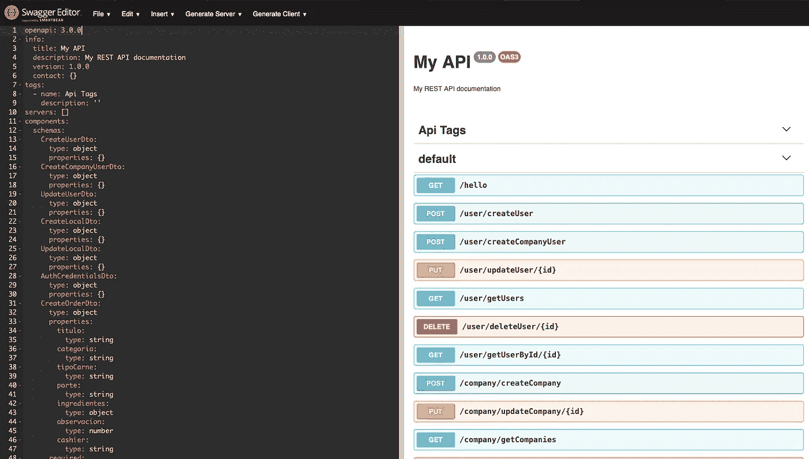

你可以在这里下载。”。yml "文件与您所有的应用编程接口文档。单击文件并下载。

# AWS 控制台

最后，转到您的 AWS 控制台并在服务中搜索 Amazon API Gateway，在这里您将看到您所有的 API 信息、端点，您可以更改配置、启用 CORS 策略，甚至为您的 API 启用一些授权者。

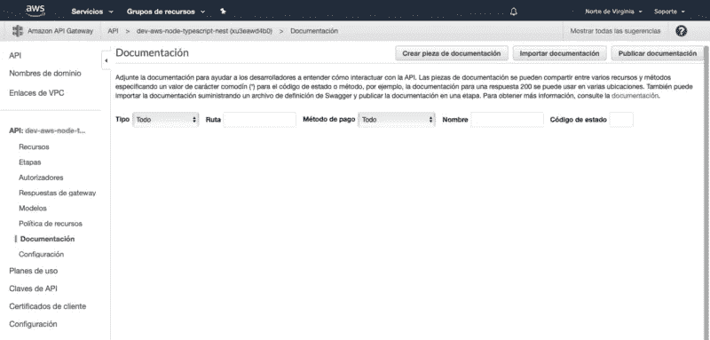

单击文档。在这里，您可以为您的应用程序手动创建所有端点及其响应和所有细节。

所以这里的窍门是，点击导入文档，选择。您从斯瓦格编辑器下载的 yml 文件，然后导入它。

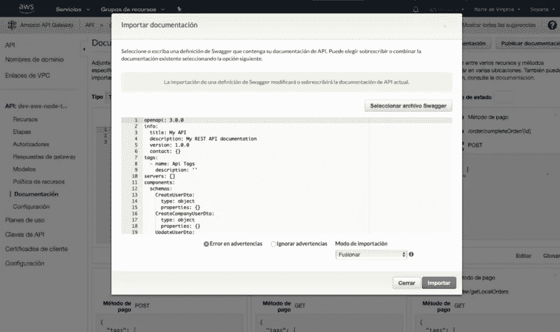

现在发布文档，您准备好共享您的 API 文档了，您可以为您的 API 创建不同的阶段。您可以与您的客户或队友分享它作为斯瓦格，API 网关，甚至邮差。

甚至可以选择用您的文档生成 SDK，所以这个 AWS 工具太棒了！

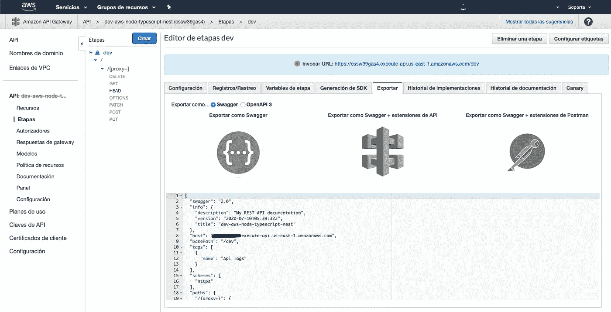

所以事情是这样的，你可以用 NestJS 和 swag 自动生成你的 API 文档，并使用你的 JSON 文件按照你的意愿编辑它，然后用 API 网关文档替换它，一旦你完成了，你可以简单地在你的 main.ts 文件中注释你的 swag 代码，并重新部署你的应用程序，或者如果你想在生产中部署你的 swag-ui。

# 结论

API 文档对于您的客户和团队成员来说非常重要，您可以测试它，甚至可以随着应用程序的增长拥有不同版本的文档。

始终花时间阅读 Swagger 文档和建议来记录您的应用程序。

我希望这篇文章能帮助你以一种简单的方式用 AWS 记录你的 API。

请随时联系我。

[](https://www.linkedin.com/in/carlos-villarroel-navarro/) [## Carlos feli PE Villarroel Navarro-IT 经理- Rindegastos | LinkedIn

### 查看 Carlos Felipe Villarroel Navarro 在世界上最大的职业社区 LinkedIn 上的个人资料。卡洛斯·费利佩…

www.linkedin.com](https://www.linkedin.com/in/carlos-villarroel-navarro/)